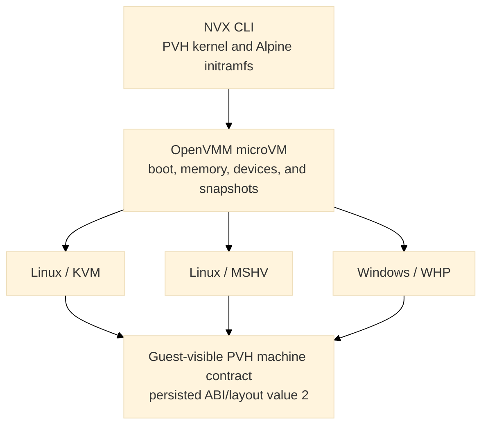
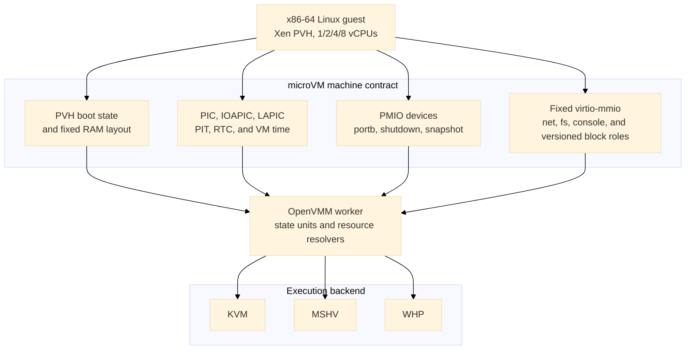
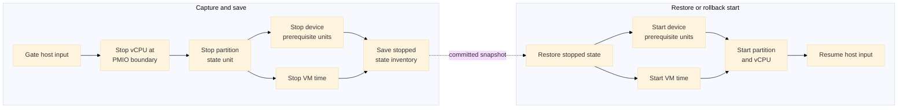
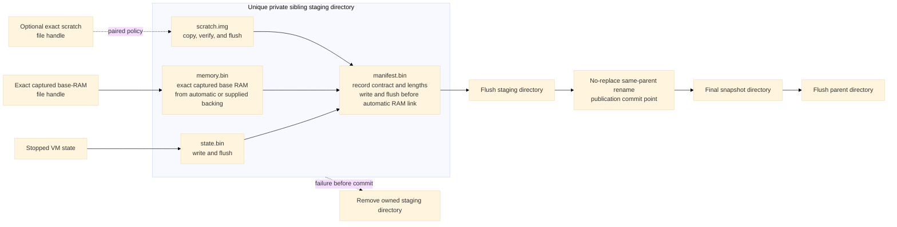
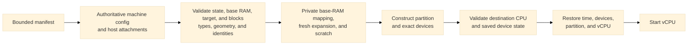

# NVX microVM design

This document describes the microVM machine profile implemented by the OpenVMM
submodule and the single-container sandbox filesystem and agent architecture
built on it. The implementation is the source of truth. Sections explicitly
marked **Proposed** retain production architecture and rationale that are not
yet implemented; they are not part of the current machine contract. The former
filesystem and snapshot proposal is consolidated here rather than maintained
as a second, conflicting description of the runtime.

The main areas are [the machine ABI](#machine-and-device-abi),
[sandbox filesystems and the agent](#sandbox-filesystem-and-agent-architecture),
[snapshot and restore](#snapshot-and-restore),
[snapshot sharing](#snapshot-sharing-and-host-storage), and
[remaining production work](#remaining-production-work).

## Goals

NVX provides a small, versioned virtual machine for running an x86-64 Linux
guest without firmware or a PC platform. Its design has four primary goals:

- boot the same uncompressed Xen PVH kernel and Alpine initramfs on Linux and
  Windows;
- keep the guest-visible machine independent of the selected hypervisor;
- expose only a fixed, allowlisted set of devices; and
- capture a running VM into immutable artifacts that can be restored in a new
  process without serializing host handles.

The implemented runtime profile is `MachineProfile::Microvm`, selected only by
`--machine microvm`. It uses fixed sandbox layer and scratch roles,
deterministic SMP topology, and shared virtio-mmio interrupt status with
edge-triggered delivery. Snapshot manifests retain microVM ABI value 2 and PVH
layout value 2, optional restore-time RAM expansion uses machine-contract
capability version 1, and TTRPC uses numeric machine-profile value 2. KVM and
MSHV are supported on Linux and WHP is supported on Windows.
Hypervisor-specific code provides partition creation, vCPU execution,
interrupt injection, and host resource integration. The machine profile owns
the boot protocol, memory map, device topology, command line, and snapshot
compatibility contract.



The public profile and ABI constants live in
[`openvmm_defs::config`](../openvmm/openvmm/openvmm_defs/src/config.rs). The
profile is selected independently from the hypervisor, for example:

```text
openvmm --machine microvm --hypervisor kvm  --kernel vmlinux --initrd initramfs.cpio
openvmm --machine microvm --hypervisor mshv --kernel vmlinux --initrd initramfs.cpio
openvmm --machine microvm --hypervisor whp  --kernel vmlinux --initrd initramfs.cpio
openvmm --machine microvm --hypervisor kvm --kernel vmlinux --initrd initramfs.cpio \
   --microvm-sandbox-block distro:file:distro.erofs,ro \
   --microvm-sandbox-block scratch:file:scratch.raw
openvmm --machine microvm --processors 8 --hypervisor kvm \
   --kernel vmlinux --initrd initramfs.cpio
```

The supported user entry point in this repository is `python scripts/nvx.py`;
see [Run](run.md) for complete commands and host-specific options.

## Configuration boundary

Machine identity is explicit rather than inferred from a kernel, device, or
hypervisor choice. OpenVMM carries it through CLI, worker, Petri, and snapshot
configuration. TTRPC exposes one microVM profile with numeric value 2; retired
value 1 is reserved and rejected. Validation
occurs before host resources are opened and again at the worker boundary.

The microVM requires:

- an x86-64 guest;
- one NUMA node;
- Xen PVH direct boot;
- KVM, MSHV, or WHP;
- no VTL2, isolation, nested virtualization, or Hyper-V enlightenments; and
- the exact chipset and device inventory described below.

It accepts exactly 1, 2, 4, or 8 vCPUs
in one socket and one die, with one core per vCPU, no SMT, xAPIC mode, and
contiguous APIC IDs starting at zero. Its PVH layout places the GDT at `0x800`
and reserves `0x30000..0x30fff` for interrupt status.

Snapshot capture may declare an immutable RAM capacity at least as large as the
active base RAM. When it does, both values must be 128-MiB aligned. A snapshot
without a declared capacity cannot select a different RAM size at restore.

Only role-bearing block devices are supported; ordinary unroled `--virtio-blk`
is rejected. Snapshot capture with blocks requires one to three
read-only lower layers followed by writable scratch, all backed by cached,
regular raw files with nonzero 512-byte-aligned geometry. Blockless
snapshots are also supported and do not use sandbox tier metadata.

It rejects UEFI, PCAT, IGVM, caller-supplied ACPI, SMBIOS, device tree,
PCI/PCIe, VPCI, VMBus, ISA DMA, IDE, floppy, VMGS, graphics, VGA firmware,
debugger resources, and devices outside the profile. The profile itself emits
the fixed MP and minimal ACPI metadata described below. This is an allowlist:
the implementation builds a microVM directly instead of constructing a
standard PC and removing unwanted devices.

Restore is stricter than cold boot. Guest-visible configuration is read from
the snapshot's machine contract. Restore-time input may select the same backend
kind recorded by the snapshot, supply required attachments, and select
processor and RAM activation targets explicitly allowed by the contract. Those
process-local targets do not change processor capacity, RAM capacity, command
line, device placement, feature masks, or filesystem and network identity.

## Cold boot

### Xen PVH loader

The dedicated loader in [`vm/loader/src/pvh.rs`](../openvmm/vm/loader/src/pvh.rs)
treats the kernel, initramfs, command line, and all guest addresses as
untrusted. It:

1. requires a little-endian ELF64 image for `EM_X86_64`;
2. validates every program-header range with checked arithmetic;
3. loads nonempty, nonoverlapping `PT_LOAD` segments at `p_paddr` and zeros
   their BSS tails;
4. finds exactly one Xen `XEN_ELFNOTE_PHYS32_ENTRY` note and verifies that its
   32-bit physical entry lies in a loaded segment;
5. places an optional initramfs, page-aligned, at the top of low RAM;
6. builds Xen version-1 `hvm_start_info`, a RAM-only memory map, and the fixed
   MP and ACPI platform metadata; and
7. enters the kernel in flat 32-bit protected mode with paging disabled and
   `RBX` pointing to the start-info structure.

The loader does not synthesize a Linux zero page, page tables, SMBIOS, a device
tree, or a firmware execution environment. The worker does build a minimal
RSDP, MADT, and DSDT for the direct-boot guest. The loader places them below the
command line and publishes the RSDP through `hvm_start_info.rsdp_paddr`. It also
writes Intel MP 1.4 tables for every advertised processor, the ISA bus, IOAPIC,
and legacy IRQ routing. Virtio IRQs are edge-triggered and therefore are not
marked as level-triggered in the MP table or MADT; fixed device discovery remains command-line
based rather than firmware-enumerated.

The fixed boot reservations are:

| Guest physical address | Contents |
| ---: | --- |
| `0x0000..0x000f` | Intel MP 1.4 floating pointer |
| `0x0400...` | MP configuration table (`180 + 20 * vCPU count` bytes) |
| `0x800..0x81f` | Four-entry bootstrap GDT |
| `0x820` | Empty IDT |
| `0x6000` | Xen `hvm_start_info` |
| `0x6040` | Optional initramfs module entry |
| `0x7000` | Xen PVH RAM map |
| `0x8000..0x8fff` | ACPI RSDP page |
| `0x9000..0x1ffff` | Bounded ACPI table region |
| `0x20000` | NUL-terminated kernel command line |
| `0x30000..0x30fff` | Shared virtio interrupt-status page |
| `0x100000` and above | Kernel load segments and ordinary RAM |

The initial state has `RIP` set to the Xen physical entry, `RBX=0x6000`,
`RSP=0`, `RFLAGS=2`, `CR0.PE=1`, and `CR3=CR4=EFER=0`. Code and data segments
are flat 32-bit segments, and the GDT, IDT, and TSS descriptors point at the
fixed bootstrap structures.

### Memory layout

Guest RAM is continuous in file offset but split in guest physical address:


Active RAM occupies `[0, min(size, 3 GiB))`. Memory displaced by the fixed
one-GiB MMIO aperture resumes at 4 GiB. There is no high-MMIO or VTL2 aperture.
The central OpenVMM layout engine owns this split; the profile does not
maintain a second allocator. The resulting active RAM ranges are also the
authoritative PVH memory map and snapshot memory-range inventory.

When capture uses `--memory-capacity`, the layout engine reserves addresses for
the full capacity before publishing only the active base-size prefix as RAM.
Consequently, selecting a larger restore target does not move the MMIO gap or
any device. The machine contract records the canonical suffix ranges that are
absent from the captured PVH map and `memory.bin`; a suffix that crosses the
three-GiB boundary is represented as separate low- and high-RAM ranges.

The fixed layout is implemented by
[`vm_manifest_builder`](../openvmm/vmm_core/vm_manifest_builder/src/lib.rs) and
[`openvmm_core::worker::memory_layout`](../openvmm/openvmm/openvmm_core/src/worker/memory_layout.rs).
Loader writes and DMA ranges must fit wholly inside a RAM range and may not
cross the MMIO gap or a reserved boot structure.

### Effective command line

The profile, not the caller, owns console and device-discovery tokens. The base
command line is:

```text
earlycon=xe9 console=hvc0 reboot=t panic=-1
```

When virtio-console is present, `console=hvc0` becomes `console=hvc1`; the raw
portb console remains the early console. User arguments are inserted after the
base tokens. Device-discovery tokens follow in fixed address order: network,
filesystem, boot console, sandbox blocks, and the control console when present
in an internally constructed configuration. Network and filesystem bootstrap
tokens follow device discovery.

Callers may not supply `earlycon=`, `console=`, `virtio_mmio.device=`,
`virtnet_ip=`, `virtnet_mask=`, `virtnet_gw=`, `virtnet_dns=`, `virtfs_dir=`,
`virtfs_tag=`, `virtfs_mode=`, or `nvx_snapshot_tier=` tokens. Embedded NULs are
rejected, and the complete NUL-terminated command line must fit in 64 KiB. The
same effective string and its SHA-256 digest become part of the snapshot
machine contract.

## Machine and device ABI

### Architectural devices

`BaseChipsetType::Microvm` builds the following allowlist:

- generic PIC and IOAPIC;
- the selected hypervisor's LAPIC;
- i8253 PIT on IRQ 0;
- generic programmable CMOS RTC anchored to UTC;
- raw bidirectional portb;
- status-carrying shutdown port; and
- guest snapshot-request port.

The RTC defaults to BCD, 24-hour fields with status B `0x02`. PIC, IOAPIC, PIT,
RTC, LAPIC, and VM time use common OpenVMM device and
state-unit machinery on every backend. IOAPIC saved state includes the
asserted level of every input line and reevaluates routing after restore, so a
level interrupt is neither lost nor treated as an edge while reconstructing
the backend. Serial UARTs, debugcon, Hyper-V power management, gameport, PCI,
firmware helpers, and standard-PC missing-port shims are absent.



### PMIO devices

| Port | Device | Behavior |
| ---: | --- | --- |
| `0xe9` | portb data | Raw byte input and output; reads consume one pending byte and zero-fill the remaining access width. |
| `0xea` | portb status | Bit 0 reports pending host input, bit 1 reports a fresh restore packet, bit 2 reports a processor target, bit 3 reports a version-3 memory target, bit 4 reports one or more memory-expansion ranges, and bit 5 reports the fixed generation-ID selector. Writing `0xa5` after restore selects the one-time restore packet. Writing `0xa6` selects the current 16-byte generation ID; it may be selected repeatedly and remains stable for the lifetime of one VM process. |
| `0x604` | shutdown | The first output byte becomes the process status carried with the VM power-off request. Reads return all ones. |
| `0x605` | snapshot request | Reads return all ones. Writes are coalesced and routed asynchronously to the capture controller. Zero requests fresh scratch and a nonzero first byte requests paired scratch. |

The portb implementation is in
[`vm/devices/chipset/src/microvm.rs`](../openvmm/vm/devices/chipset/src/microvm.rs).
Its receive and transmit buffers are each bounded at one MiB. Output overflow
drops the newest bytes and emits a rate-limited warning; input applies
backpressure by stopping host reads when its buffer is full. Pending bytes are
saved so capture does not silently lose VMM-owned I/O.

Guest-requested process exit drains the portb endpoint and, when present, its
host stdout relay before reporting completion. The combined drain has a
five-second deadline. Success preserves the guest's exit status; endpoint,
relay, or timeout failures become process-exit errors instead of silently
discarding final output. This is a portb/host-relay guarantee, not a general
drain of every virtio-console endpoint. The controller and relay implementation
are in
[`openvmm_entry/src/vm_controller.rs`](../openvmm/openvmm/openvmm_entry/src/vm_controller.rs)
and
[`openvmm_entry/src/microvm_output.rs`](../openvmm/openvmm/openvmm_entry/src/microvm_output.rs).

A snapshot-port write with no configured destination completes normally and
the guest continues. With a destination, the device permits at most one pending
transaction and defers completion long enough for the controller to establish
the exact post-`out` capture boundary. Repeated writes are coalesced. The PMIO
callback itself never pauses vCPUs, drains devices, hashes RAM, or writes files.
The scratch policy travels with the deferred boundary request.

### Fixed virtio-mmio transport

All eight fixed address slots are reserved, including the dedicated control
console at `0xd0007000..0xd0007fff` on IRQ 3 (shared status at `0x3001c`).
Snapshot-capable builds instantiate the virtio-fs transport even without a host
attachment so it is discoverable before capture. Other optional devices are
instantiated only when active; the control slot is reserved but activation is
currently rejected by the public entry points.
Every device uses virtio-mmio, is omitted from ACPI, and has packed-ring support
masked.

| Device | Stable identity | MMIO range | IRQ | Availability |
| --- | --- | ---: | ---: | --- |
| virtio-net | `net:microvm0` | `0xd0000000..0xd0000fff` | KVM/MSHV 10, WHP 5 | Optional |
| virtio-fs | `fs:microvm0` | `0xd0001000..0xd0001fff` | 6 | Reserved dormant slot; HostFs optional |
| virtio-console | `console:microvm-virtio0` | `0xd0002000..0xd0002fff` | 7 | Optional |
| `distro` virtio-blk | `blk:sandbox:distro` | `0xd0003000..0xd0003fff` | 4 | Optional read-only role |
| `runtime` virtio-blk | `blk:sandbox:runtime` | `0xd0004000..0xd0004fff` | 12 | Optional read-only role |
| `custom` virtio-blk | `blk:sandbox:custom` | `0xd0005000..0xd0005fff` | 9 | Optional read-only role |
| `scratch` virtio-blk | `blk:sandbox:scratch` | `0xd0006000..0xd0006fff` | 11 | Required writable final role when blocks are present |
| Control virtio-console | `console:microvm-control0` | `0xd0007000..0xd0007fff` | 3 | Reserved; authenticated activation not yet available |

Explicit placement metadata bypasses the standard sequential MMIO allocator.
The worker validates the complete device count, kind, bus, address, IRQ, and
feature policy before resolving devices.

`--microvm-sandbox-block ROLE:DISK` assigns each attachment by
role rather than option order:

| Role | MMIO range | IRQ | Access |
| --- | ---: | ---: | --- |
| `distro` | `0xd0003000..0xd0003fff` | 4 | Read-only |
| `runtime` | `0xd0004000..0xd0004fff` | 12 | Read-only |
| `custom` | `0xd0005000..0xd0005fff` | 9 | Read-only |
| `scratch` | `0xd0006000..0xd0006fff` | 11 | Writable |

Roles must be unique and supplied in fixed order; omitted lower-layer roles
leave their slots empty, and any nonempty topology ends with scratch. All four
block IRQs use active-high edge delivery. IRQ 12 avoids the RTC's exclusive
IRQ 8.

The microVM keeps every fixed MMIO address and IRQ number and uses active-high edge
delivery for dedicated virtio IRQs. One little-endian, naturally aligned `u32`
per fixed slot resides in the reserved shared-status page:

| Slot | Status GPA |
| --- | ---: |
| virtio-net | `0x30000` |
| virtio-fs | `0x30004` |
| virtio-console | `0x30008` |
| `distro` block | `0x3000c` |
| `runtime` block | `0x30010` |
| `custom` block | `0x30014` |
| `scratch` block | `0x30018` |
| Control virtio-console | `0x3001c` |

OpenVMM publishes config-change and used-buffer bits with a sequentially
consistent compare-exchange loop. It pulses the device IRQ only when the old
word is zero. The specialized Linux driver consumes all pending bits with a
sequentially consistent `xchg` to zero, so steady-state handling performs no
interrupt-status read or interrupt-acknowledgement MMIO access. A host OR that
races the exchange is either included in the exchanged value or observes zero,
stores the bit, and emits a new edge. Device reset and teardown clear the word.
Snapshot quiesce saves the pending value in transport state; restore writes it
back without replaying an edge, and the machine contract records the interrupt
mode, page GPA, and page size.

#### Block

Block devices are routed directly to virtio-mmio rather than VPCI. Packed rings
are unavailable. Each block has a stable role, MMIO address, IRQ, access mode, and
fixed feature mask. Its snapshot contract records the role, read-only flag,
logical length, logical and physical block sizes, and identity policy. Each
consumed external read-only layer is identified by SHA-256 and must be supplied
again on restore. Platform-tier layers are recorded as unbound because image
binding has not been consumed; restore may supply different same-geometry
layers. Writable scratch uses one of two policies:

- **paired**: capture publishes `scratch.img` with its exact length and SHA-256;
   each restore verifies it and creates a process-private writable copy;
- **fresh**: capture occurs before scratch is mounted, publishes no scratch
   artifact, and restore requires a new writable file with matching geometry.

Virtio transport and queue progress are saved with the other device state.
Stopping a queue prevents new descriptor intake and drains every accepted I/O
to one used-ring completion under the bounded snapshot quiesce timeout. The
controller flushes the exact scratch handle and copies it only after that drain.

#### Console

The optional console is the standard single-port virtio-console device with
two split queues. Host RX accepted by the device and partial guest TX progress
are device-private saved state, so a descriptor is not replayed from byte zero
after restore. Native sockets and handles are not serialized. A listener is
recreated according to its recorded policy. Client reconnects require an
explicitly approved restore-time attachment and have a five-second timeout;
inherited attachments must also be supplied again rather than serialized.

#### Control console reservation

The dedicated control console reuses the single-port virtio-console device but
has a distinct resource ID (`virtio-control-console`), stable attachment ID
(`console:microvm-control0`), MMIO slot, IRQ, shared-status word, and saved-state
inventory. The configuration and snapshot helpers support this second console
without changing the boot console's identity or placement. A control console
requires the boot virtio-console, making its guest tty `hvc2`; the profile owns
the identifying `nvx_control_tty=hvc2` token.

The internal control-console command-line builder rejects caller-supplied
control-tty and driver-probe-order tokens, including kernel-equivalent
hyphenated spellings, as well as quotes and the `--` delimiter. These rules
prevent guest tty discovery from being redirected by command-line parsing.
Boot-only command lines retain their existing behavior.

The internal control attachment helper accepts only local `listen=...`,
`connect=...`, or disconnected `none` endpoints, not TCP or inherited stdio.
Linux uses Unix sockets and Windows uses named pipes. Reconstruction checks
the exact saved identity and reconnect policy; client connections require
explicit restore-time approval. These restrictions are groundwork for the
broker, not a substitute for its authentication.

This is transport and lifecycle groundwork, not an enabled agent protocol.
The CLI has no public activation option, and CLI and TTRPC restore reject a
manifest carrying a control-console device or attachment before authenticated
broker activation exists. Reservation alone does not expose a host endpoint.
See the checks in
[`openvmm_entry/src/lib.rs`](../openvmm/openvmm/openvmm_entry/src/lib.rs) and
[`openvmm_entry/src/ttrpc/mod.rs`](../openvmm/openvmm/openvmm_entry/src/ttrpc/mod.rs).

#### Network

The optional NIC has one RX/TX queue pair and an exact feature mask:
the MAC-address feature and virtio version 1.
`--net IPv4/prefix --network-profile portable` accepts prefixes `/1` through
`/30`, derives the first usable address as the gateway, and derives
deterministic guest and gateway MAC addresses from the final three IPv4
octets. The profile is mandatory and selects the same in-process Consomme data
plane on KVM, MSHV, and WHP.

The portable profile provides gateway DNS over UDP and TCP, ICMP echo,
outbound TCP and UDP, deterministic rejection of fragmented IPv4 packets, and
bounded flow, DNS, buffer, and packet-queue state. It applies one canonical
egress policy before externally visible transmission:

- allow only listed IPv4 hosts or CIDRs;
- allow IPv4 except listed hosts or CIDRs; or
- allow only exact IPv4 TCP endpoints.

The modes are mutually exclusive and fail closed for traffic outside the
selected policy. The snapshot records the profile, network identity, and
policy digest. Restore reconstructs a fresh endpoint and requires the profile
and policy again; native sockets, DNS requests, and flow objects are never
serialized.
Capture quiesces the endpoint, drains completion ownership, and requires the
saved queues to contain no unrepresented RX or TX packets. It then saves the
queue lifecycle, negotiated features, link state, and endpoint generation.
Arbitrary in-flight packet payloads are not serialized. Pre-capture queued
packets are not replayed, old TCP/UDP/ICMP/DNS state is invalidated, and new
traffic must establish fresh post-restore flows.

#### Filesystem

The filesystem slot is a no-DAX virtio-fs device with tag `microvm`, one
high-priority queue, one request queue, direct I/O, and zero guest cache
lifetimes. Without `--mount`, it has no HostFs backend or active filesystem
policy but remains guest-discoverable. Its explicit profile rejects SectionFs,
Aggregate, alternate tags, extra queues, shared-memory windows, and PCI
transport.
Read-only mode rejects mutation in the host device before invoking host
filesystem operations; read-write mode exposes only the supported common host
contract.

The exported directory is external live state, not part of the VM snapshot.
An active capture saves its exact canonical host path, FUSE negotiation, node
and handle allocation, aliases, lookup counts, directory snapshots and cookies,
and the identities needed to reopen objects. Restore requires the same path,
target, mode, root identity, and reopenable objects. A dormant capture instead
saves explicit unattached state and may restore with no attachment or bind a
new HostFs backend. The resumed guest then mounts tag `microvm` explicitly;
the cold-boot mount hook has already run. Snapshots without this capability
cannot add an attachment. Native file descriptors and Windows handles are not
serialized.

## Sandbox filesystem and agent architecture

The sandbox specialization runs exactly one workload container per microVM.
Its lifetime, resource envelope, and network identity belong to that workload,
so it does not need pod infrastructure, a pause container, dynamic rootfs
injection, or a sequence of host RPCs to create additional containers. The
agent remains outside the workload's namespaces and supervises it from the
initramfs. This specialization is for non-confidential ACI Sandboxes, not
multi-container ACI container groups; the host is trusted with image content
and guest memory.

The implemented foundation is a cold-filesystem bootstrap and low-level
snapshot primitives. The production conversion service, replaceable launch
configuration, Rust agent, and authenticated runtime protocol described below
are **Proposed**. They must not be inferred from the presence of block devices
or snapshot-tier metadata alone.

### Implemented filesystem bootstrap

The public `nvx sandbox` command accepts one to three role-bearing EROFS lower
images, a preformatted ext4 scratch image, an absolute entrypoint, and
individual argument tokens. It supplies non-secret kernel-command-line
configuration; environment variables, secrets, arguments containing
whitespace, and sandbox snapshot orchestration are not supported by this
command. Lower-level OpenVMM capture and restore do support sandbox blocks.
See [Run](run.md#experimental-single-workload-sandbox) and
[`scripts/nvx_tools/sandbox.py`](../scripts/nvx_tools/sandbox.py).

The required kernel facilities are already enabled in
[`kernel/config-microvm`](../kernel/config-microvm): virtio-blk, EROFS with
compression and xattrs, overlayfs, cgroup v2, memory and process controllers,
namespaces, `CONFIG_BPF_SYSCALL`, and `CONFIG_CGROUP_BPF`. Kernel support for a
device filter does not mean the current agent installs one.

[`alpine/nvx-init-agent`](../alpine/nvx-init-agent) performs the assembly:

1. mount runtime tmpfs and cgroup2, create sibling `agent` and `container`
   cgroups, and move the supervisor into the agent cgroup;
2. resolve each role's MMIO address through the platform resources in
   `/proc/iomem` and the virtio block-device sysfs tree, rather than assuming
   a `/dev/vdX` name or `virtioN` enumeration order;
3. check an optional expected sector count, flush cached block-device buffers,
   mount each lower layer read-only as EROFS, and check its supplied UUID;
4. resolve and flush scratch, mount it as ext4 with `rw,nosuid,nodev`, and
   create its `upper` and `work` directories;
5. mount overlayfs with top-first lower layers and `metacopy=on,xino=on`;
6. start a child behind a FIFO barrier, place that child in the workload
   cgroup before releasing it, and retain a runtime-tmpfs machine-ID file;
7. wait for the child, unmount the overlay, layers, and scratch, and return its
   status through the guest exit helper.

The assembled view is:

```text
/run/nvx/layers/custom   (optional EROFS) --+
/run/nvx/layers/runtime  (optional EROFS) --+--> lowerdir, top first
/run/nvx/layers/distro   (optional EROFS) --+
/run/nvx/scratch/upper   (ext4) -----------> upperdir
/run/nvx/scratch/work    (same ext4) ------> workdir
                                          overlay --> /run/nvx/rootfs
```

At least one lower role is required by the bootstrap; distro plus runtime is
the intended curated-image shape, not a requirement that all three lower
slots be populated. The initramfs remains the supervisor's root and is not
another container lower layer.

[`alpine/nvx-container-launch`](../alpine/nvx-container-launch) releases the
barrier into private mount, PID, and UTS namespaces.
[`alpine/nvx-container-enter`](../alpine/nvx-container-enter) makes mounts
private, creates private proc, read-only sysfs, `/dev`, devpts, and shared-memory
mounts, binds the workload machine ID read-only, and enters the overlay with
`chroot`. It clears supplementary groups and all capability sets and enables
`no_new_privs`. It does not `pivot_root` away from the initramfs `rootfs`, and
the outer supervisor does not replace itself with the workload.

The current agent sets `memory.low` to 16 MiB by default and accepts optional
workload `memory.max` and `pids.max`. This is not the stronger production
resource-reservation contract below. FIFO-gated cgroup placement is also not
`clone3(CLONE_INTO_CGROUP)`. The shell supervisor, textual errors, fixed root
user, and capability-stripped launch are an experimental bootstrap, not a
complete OCI runtime, typed RPC service, or systemd-container profile.

### Image preparation and distribution (Proposed)

Image conversion belongs off the sandbox start path, in a Linux control-plane
service that can run `mkfs.erofs`. Registry credentials stay in that service,
not on the node's launch path or inside the guest. The host resolves image
defaults and sandbox overrides once; the agent should not implement OCI image
configuration merge semantics or read configuration from a mounted layer.

The intended artifact ownership is:

| Artifact | Contents | Delivery and lifetime |
| --- | --- | --- |
| Kernel and initramfs | Platform kernel, agent, and minimal userland | Versioned node deployment, present before sandbox creation |
| `distro` | Curated base OS | Immutable content-addressed node blob cache |
| `runtime` | Language runtime and common libraries | Immutable cache, shared across images using that runtime |
| `custom` | Customer-specific additions, replacements, and deletions | Optional immutable cache entry, scoped to its image |
| Scratch | Writable ext4 upper and work directories | Private node-local file, drawn from a prepared pool or template |

Curated bases can be recognized by exact OCI layer-digest prefix matching.
The deepest matching base determines the reusable distro/runtime split. An
unrecognized image can be flattened into one custom lower layer; it loses
curated-layer sharing but can still use a compatible image-independent
platform template. Identical file contents with different layer digests do not
establish a prefix match.

Separate blobs preserve reuse of the common distro and runtime across many
customer images. Pre-merging all combinations, or packaging every combination
as one partitioned disk, would make each combination a separate cache object.
Compressed EROFS reduces distribution size and the host's cached image bytes;
decompression is performed by the guest kernel as blocks are read. A FUSE
daemon and guest-side lazy-pull agent are not required for these rootfs layers.
The optional HostFs device remains useful for a live host export and is a
separate feature, not the container image-delivery path.

The converter must synthesize OCI deletions as overlay whiteouts and opaque
directory markers. It must apply a deny-by-default metadata policy to every
layer: never copy arbitrary `trusted.overlay.*` or `user.overlay.*` attributes,
and allow and normalize file capabilities, SELinux labels, and ACLs only under
an explicit policy. Device inodes, including whiteouts, need the same treatment.
The current bootstrap mounts supplied EROFS images; it is not this sanitizing
conversion service.

This trust requirement matters because `metacopy=on` interprets overlay
metadata from lower layers. Metadata-only changes can avoid copying file
contents, but a data write can still copy an entire lower file into scratch.
Scratch capacity must account for that amplification. `xino=on` improves inode
identity but can fall back when the underlying inode encoding overflows; the
chosen filesystem and kernel combination needs validation.

Scratch should be prepared off the launch path and acquired without `mkfs`
during startup. For the current snapshot-capable microVM it must be a regular
raw file containing ext4, not a VHD/VHDX attachment. A pool or a filesystem
clone can accelerate acquisition, but the VMM also supports independent copies;
block-clone support is not a prerequisite for running NVX. Scratch consumes
host storage rather than guest RAM and can fail with `ENOSPC` independently of
guest memory pressure. Runtime tmpfs is still appropriate for small agent
state, not the workload's general writable layer.

Blob garbage collection must retain references from both live sandboxes and
snapshots. Paired scratch, state, and RAM need snapshot-scoped retention and
placement. Kernel/agent rollout must rebuild or explicitly recertify templates:
restoring guest RAM restores the captured agent build, not the node's newly
installed initramfs. These cache, pool, and rollout services are host
orchestration responsibilities, not implemented VMM artifact management.

### Replaceable configuration region (Proposed)

The production launch contract should use one bounded, versioned,
VMM-populated memory region. Only its location and ordinary invariant kernel
parameters belong on the command line. The command line is size-limited,
readable through `/proc/cmdline`, and captured in RAM; it cannot safely carry
secrets or values that change between clones.

The configuration is fully resolved by the host and separated by consumption:

| Section | Contents | First consumed |
| --- | --- | --- |
| Invariants | Role/MMIO mapping, layer geometry, and platform-owned guest network identity such as MAC, address, prefix, and MTU | Before the platform snapshot point |
| Image binding | Expected EROFS UUID for each attached lower role | After the platform snapshot point, before workload launch |
| Sandbox | Entrypoint, arguments, environment and secrets, workdir, identity, capability policy, and tenant resolver/routing settings | After the platform snapshot point |

Only unconsumed configuration may be replaced. Platform clones may receive
new image binding and sandbox values; workload-start and instance-checkpoint
restores have already consumed them and must not pretend that rewriting a
region changes mounted filesystems or process state. Those later tiers accept
new work through a runtime protocol, not replacement OCI configuration.

The host must validate the independent launch configuration against the saved
contract before entering a vCPU, including canonical digests for consumed
sections. The agent must validate the header, version, bounds, and invariants
again before using the payload. An EROFS UUID is only an attachment mix-up
check, not a content-integrity proof. Current OpenVMM restore verifies SHA-256
for consumed read-only layers; a future cache-admission optimization needs an
explicit trusted artifact contract rather than replacing that check with UUIDs.

The region must be separate from both captured RAM and restore-time expansion
backing, omitted from the PVH usable-memory map and `memory.bin`, and populated
before every launch. Its placement must not overlap any capacity reservation
or device. Restoring RAM must never overwrite newly supplied configuration.
A header with magic, version, bounded length, and corruption detection does not
by itself provide authenticity or secrecy.

The current platform command-line validator recognizes the exact prospective
token `nvx_config=0xd0010000,65536`; that allowlist entry does not allocate a
region or implement the payload protocol. The current bootstrap still reads
non-secret command-line tokens. The former standalone `phram` mechanism is not
an alternative configuration or layer carrier in this microVM profile.

Launch metadata must remain fresh even when all configuration sections have
been consumed. A future channel epoch, entropy seed, and clock sample therefore
cannot be frozen by an OCI-section digest. Today restore detection and entropy
repair use the process generation ID and portb restore packet described below,
not an implemented configuration-region epoch. Zeroing a region after use is
defense in depth: it does not erase copies in agent buffers or workload memory.
The region and raw-memory devices must never be exposed in the workload's
mount namespace or `/dev`.

The proposed network split also needs an explicit compatibility contract.
Current portable networking saves the guest identity, bootstrap command line,
and egress policy; it does not implement per-launch tenant DNS/routing swaps or
the old HCN L2Bridge/AF_XDP endpoint translation and readiness handshake.

### Production agent and launch sequence (Proposed)

The intended production agent is a small static Rust binary running as PID 1
from the initramfs. It owns pseudo-filesystem setup, filesystem assembly,
network programming, workload construction, orphan reaping, stdio, and runtime
control. It remains alive after starting the workload; `exec` of the workload
from the supervisor would destroy those responsibilities.

The cold launch should require no configuration RPC round trip:

1. the host stages layers and private scratch, constructs all devices, prepares
   the network backend, and writes the launch configuration;
2. the VMM PVH-boots the kernel and initramfs;
3. the agent sets up pseudo-filesystems and sibling cgroups, consumes only
   invariants, and configures the platform-owned guest network;
4. a trusted platform-template build captures here, before image binding,
   tenant configuration, or scratch mounts;
5. a cold launch or restored template validates the applicable configuration,
   performs required restore repair, discards stale block buffers, and mounts
   EROFS, ext4, and the overlay;
6. the agent creates the workload directly in its cgroup and private namespaces,
   applies its resolved runtime policy, and starts it under supervision.

The platform build must attach deterministic non-tenant placeholder layers.
Linux can probe block contents before PID 1 runs, so merely avoiding mounts
does not prove a snapshot contains no image bytes. Restored layers must have
the captured geometry, and cached placeholder blocks must be invalidated
before mounting replacements. Current host validation records platform layers
as unbound but cannot prove which bytes arbitrary guest code read before capture.

A complete runtime must implement more than the current bootstrap: atomic
`clone3(CLONE_INTO_CGROUP)` placement, the required namespace and mount policy,
masked/read-only paths, user/group and supplementary-group handling, capability
sets, seccomp, rlimits, terminal allocation, signals, and reliable child/orphan
supervision. The root transition must preserve the outer agent's initramfs
view; it cannot assume `pivot_root` works directly from initramfs `rootfs`.

Production resource policy should give the agent a measured memory reserve
and CPU weight in a sibling cgroup, with workload `memory.max`,
`memory.oom.group=1`, and appropriate process limits. `memory.min` protection
and workload limits must be sized together with VM RAM; the current
`memory.low` setting alone is not a hard survival guarantee. A cgroup device
filter is needed for profiles that retain `CAP_MKNOD`. The workload must not
be able to escape the agent-owned cgroup or undo its freeze; any delegated
subtree must remain below that boundary.

### Control protocol and checkpoint handoff (Proposed)

The runtime protocol should use the dedicated control virtio-console once its
authenticated broker is implemented. Boot diagnostics and kernel `printk`
stay on the existing consoles; framed control traffic must not share an
unstructured byte stream with them. The reservation reuses a proven transport
but does not implement framing, authorization, guest RPC, or host-side broker
isolation. A VMM-owned endpoint still needs an authenticated, access-controlled
host attachment and must not be exposed to the workload.

The proposed operation families are:

| Operation | Purpose |
| --- | --- |
| `Ready`, `RestoreHello` | Establish readiness, protocol version, and the current launch identity |
| `Bootstrap` | Explicit configuration when a workflow cannot use the launch region |
| `ExecuteCommand`, `InteractiveShell` | One-shot execution or PTY-backed interactive sessions, including cancellation and resize |
| `StreamLogs` | Bounded stdout/stderr streaming with continuation semantics |
| `Signal`, `Wait`, `ContainerExited` | Lifecycle control, exit status, and OOM reporting |
| `Probe` | Execute health checks |
| `PrepareSnapshot`, `PostRestore`, `Checkpoint` | Agent-coordinated capture and restore hooks |
| `Shutdown` | Graceful workload and VM termination |

Messages need bounded framing, stream and request identifiers, stable typed
errors, backpressure, and launch-scoped identity. On restore the agent must
discard partial decoder state and requests from the old host connection,
reestablish the session with `RestoreHello`, and fail non-replayable operations
rather than silently executing them twice. Protocol versioning is tied to the
node-deployed agent; transport compatibility alone is not RPC compatibility.

The proposed workload-facing checkpoint interface is an opt-in, bind-mounted
`SOCK_SEQPACKET` socket, such as `/dev/aci/checkpoint`, with per-message
`SCM_CREDENTIALS`. The agent owns the PMIO write; the workload does not receive
`CAP_SYS_RAWIO`, `/dev/port`, or unrestricted port-I/O access. Capture requests
and retained artifacts need agent and host rate limits.

A warm shim requests capture after runtime initialization and receives its
next work item after restore. Python, Node, and Java need runtime-specific
hooks; kernel CRNG reseeding cannot reset their userspace RNGs, caches, or
external connections. Blocking the requesting thread on a socket is not a
barrier for its peers. A cloneable warm point must be single-threaded or hold
all peers behind a runtime-owned barrier until repair is complete. The current
workload-start helper requires a `runtime-post-restore` hook, but there is no
production shim or work-item handoff protocol yet.

The replay contract is explicit: do not capture live external connections or
state that cannot be safely reused, do not repeat irreversible side effects,
and repair runtime randomness before accepting work. An instance checkpoint
is a single continuation; a workload-start snapshot is a cloneable starting
point, not transparent checkpointing of arbitrary requests.

## Snapshot and restore

### Tier contract

Version-5 sandbox snapshots encode the tier, restore policy, and a consumed
configuration-section bitmask. The validator accepts only these combinations:

| Tier | Restore policy | Scratch | Consumed sections | Intended author and sharing scope |
| --- | --- | --- | --- | --- |
| `platform` | `clone` | Fresh | Invariants only | Trusted platform build; cross-tenant only with the pre-image-binding guarantees above |
| `workload-start` | `clone` | Paired | Invariants, image binding, sandbox | Warm workload or runtime shim; tenant-scoped |
| `instance-checkpoint` | `resume` | Paired | Invariants, image binding, sandbox | One live instance; one claimed continuation |

Tier metadata requires sandbox blocks; blockless snapshots do not declare it.
The saved host-owned `nvx_snapshot_tier=` token must agree with the manifest.
Platform lower layers have empty, unbound identities, whereas later tiers bind
consumed layers to their hashes. The bitmask establishes when configuration
is considered consumed; it is not an implementation of replaceable payloads
or per-section configuration-region validation.

The platform point removes kernel and agent initialization from subsequent
launches. Workload-start removes runtime initialization as well, but contains
workload memory and often cached image data and secrets. Read-only layer files
remain external attachments; bytes read from them into guest RAM can still
appear in `memory.bin`. Paired scratch is an artifact in the snapshot directory,
not just a reference to the caller's original writable file.

Sharing scope is a deployment requirement, not a tenant authorization feature
of the VMM. The snapshot controller enforces tier combinations, layer binding,
scratch pairing, and the single-use resume claim. Host artifact access control,
template provenance, and a trustworthy pre-capture guest determine whether
cross-tenant publication is permissible.

### Capture boundary

Generic host save and pulse-save/restore RPCs are deliberately unavailable for
the microVM profile. Capture is requested by the guest through PMIO `0x605` and
is coordinated as a bounded transaction. Capture with sandbox blocks requires
`--snapshot-tier platform|workload-start|instance-checkpoint`; inconsistent
tier, clone/resume, and fresh/paired scratch combinations are rejected. For
paired scratch,
`nvx-snapshot` first freezes the workload cgroup with a bounded wait, calls
`sync`, and freezes the mounted filesystem. `nvx-snapshot --fresh-scratch`
instead requires scratch to be unmounted. A rejected capture thaws every
guest-owned barrier; failure to thaw terminates the VM.

1. gate host input and defer completion of the snapshot-port write;
2. stop the vCPU at the I/O boundary while completing the write, so saved state
   starts at the instruction immediately after `out`;
3. preflight the profile, destination, backend, external attachments, and
   snapshot eligibility; a missing destination or rejected preflight releases
   the boundary and lets the guest continue;
4. quiesce the remaining device workers and VM time in dependency order,
   including bounded virtio-blk queue drain;
5. save the exact state-unit inventory, processor state, device-private state,
   and memory;
6. copy and flush state, memory, and any paired scratch into a unique sibling
   staging directory;
7. publish the directory with one no-replace rename; and
8. terminate the source worker and process after publication.


State-unit transitions follow registered dependencies rather than one global
serial list. In the current worker, the partition depends on the device
prerequisite unit and VM time. Save quiesce stops in reverse dependency order;
restore and rollback start in dependency order. Device prerequisites and VM
time may transition in parallel.



The directory rename is the commit point. Before it, capture failure exposes no
final snapshot and resumes only when rollback is known to be valid. After it,
the source never resumes. This gives the guest an observable boundary: code
after the snapshot `out` runs once in each restored process and never in the
successfully captured source process.

While the worker holds the snapshot stop guard, its central RPC dispatcher
rejects management operations that could disturb the boundary, including
memory writes, resume/reset, device changes, and state dumps. Rejections are
immediate, not queued until capture finishes; infallible RPC forms report a
channel failure. Snapshot quiesce, rollback, boundary release, and memory reads
remain available. The exclusion applies at the worker boundary shared by the
management frontends, in
[`dispatch/snapshot_rpc.rs`](../openvmm/openvmm/openvmm_core/src/worker/dispatch/snapshot_rpc.rs).

Guest and host barriers have separate jobs. The workload cgroup is frozen in
captured guest state, the VMM gates external input, and a future multithreaded
agent must park its own RPC/log workers at a capture-safe point. None of these
substitutes for the others. Device workers and guest kernel execution needed
for CPU/RAM repair must run during gated restore; the gate is not a promise
that all interrupts remain disabled. After repair, the helper acknowledges the
VMM gate before thawing scratch and then the workload. The current helper
polls cgroup freeze completion with a bounded loop; an event-driven production
agent and typed capture-failure reporting remain future work.

### Artifact format and publication

A published snapshot contains:

```text
snapshot/
|-- manifest.bin
|-- state.bin
|-- memory.bin
`-- scratch.img    # paired microVM scratch only
```



[`openvmm_helpers::snapshot`](../openvmm/openvmm/openvmm_helpers/src/snapshot.rs)
implements bounded decoding, exact-length publication, artifact length checks,
restrictive creation, flushing, unique staging paths, and same-parent
no-replace publication. Automatic OpenVMM-owned microVM base RAM is flushed,
linked from the exact handle after its shared mappings, state, and manifest are
durable, and checked for matching identity and EOF. Linux uses
`linkat(AT_EMPTY_PATH)` or a `/proc/self/fd` link plus device/inode proof;
Windows uses handle-relative `FileLinkInformation` plus `FILE_ID_INFO`.
Unsupported filesystems fall back to an independent copy. User-supplied
backing always takes that copy path: Linux uses `FICLONE` with
`SEEK_DATA`/`SEEK_HOLE` and zero-scan fallbacks, while Windows uses a dense
copy. A pre-existing final destination is never deleted or replaced.

The source VM is terminal after an automatic RAM link commits. A failure after
creating the staging alias is rollback-safe only after the complete private
staging directory has been synchronously removed and its parent flushed. If
that proof fails, OpenVMM terminates the source rather than resuming it with a
surviving writable alias to the artifact.

The manifest is authoritative for:

- profile and ABI version;
- source hypervisor and architecture;
- captured RAM ranges and file offsets, plus any immutable RAM capacity,
  128-MiB block size, and canonical expansion ranges;
- processor topology, vCPU count, and every APIC identity;
- effective command line and digest;
- exact device order, stable IDs, state-unit names, MMIO/PMIO ranges, IRQs,
  transport, feature masks, and queue limits;
- CPU, XSAVE, MSR, TSC-frequency, and clock compatibility data;
- required host attachments and their policies;
- block roles, access, geometry, layer identities, and scratch policy;
- snapshot tier, clone/resume policy, and consumed configuration sections;
- exact lengths of `state.bin` and `memory.bin`; and
- the exact length and SHA-256 of paired `scratch.img`.

Snapshot paths and repeated fields are bounded. Restore rejects truncated,
oversized, malformed, wrong-type, path-escaping, symlinked, incompatible,
missing, extra, or reordered state before guest execution. New snapshots use
version 5. It does not store or validate embedded checksums for `state.bin` or
`memory.bin`; a same-length change to either payload is therefore outside the
validation contract. Paired scratch is checked because it must match captured
filesystem state. Versions 2 through 4 remain readable; versions 2 and 3 cannot
describe sandbox blocks, and version 4 predates tier metadata. Legacy version-2
checksum fields are accepted without re-hashing either payload. Snapshot
directories rely on host access control, while
authenticated export or transport belongs outside the default local artifact
format.

Restore opens the snapshot directory once and resolves manifest, state, memory,
paired scratch, and `resume.claim` relative to that directory handle. Windows
opens restore artifacts with read sharing only, rejects reparse points, checks
`FILE_ID_INFO` and EOF around COW-section creation, and retains the directory
and artifact guards in the VM worker so writes, truncation, deletion, and rename
remain blocked until teardown. Linux retains the exact `O_NOFOLLOW` directory
and regular-file descriptors, detects observable metadata changes before
worker handoff, and is therefore immune to pathname replacement; mandatory
content immutability still depends on host access control or an explicit
stronger mode such as a lease, fs-verity, or a verified artifact broker.

### Authoritative restore

Restore proceeds in the opposite direction from capture:

1. open one exact snapshot generation, read its bounded manifest, and derive
   the authoritative machine configuration;
2. resolve console, network, filesystem, policy, and read-only layer
   attachments by stable ID or role;
3. validate state, captured memory, the selected RAM target, block geometry and
   identities, and any paired scratch artifact before worker construction;
4. create a writable private copy-on-write mapping from the exact opened
   `memory.bin` handle, add fresh private backing for selected expansion
   ranges, transfer the artifact generation guards to the worker, and use
   either a verified private scratch copy or a caller-supplied fresh scratch
   file;
5. construct the partition and exact device inventory with the selected active
   RAM and the snapshot's immutable capacity;
6. compare the destination CPU, XSAVE/MSR, TSC, topology, device, and queue
   contract with the saved contract;
7. restore VM time, chipset and virtio state, partition state, and vCPU state;
8. finish reconnecting host resources;
9. when tier policy, processor activation, or nonempty RAM expansion requires
   guest repair, start devices with external input gated and then release the
   restored vCPU; and
10. on the agent's `0x605` acknowledgment, stop at the exact post-write
   boundary, release input, and only then let the guest continue.

The partition must exist before OpenVMM can derive its effective destination
CPU contract. This does not expose a partially restored guest: contract
comparison and all saved-state validation still complete before a vCPU runs.



The captured memory artifact is mapped private and copy-on-write across
restores, while selected expansion ranges receive fresh private backing.
Paired scratch is copied into a private temporary file for each restore.
Multiple restored VMs may therefore dirty RAM and scratch without changing
reusable clone artifacts. An instance checkpoint is single-use: the first
artifact- and configuration-validated restore attempt atomically creates and
flushes `resume.claim`; duplicate and concurrent restores fail before worker
construction, and a later startup failure does not make the checkpoint
reusable. Initial compatibility is same-backend: KVM snapshots restore on
compatible KVM hosts, MSHV on compatible MSHV hosts, and WHP on compatible WHP
hosts. Cross-backend conversion and standalone NVX snapshot import are not
supported.

### Template compatibility and placement

A template represents a compatibility class, not an arbitrary fleet image.
The class includes the backend, CPU/XSAVE/MSR and TSC contract, guest kernel and
agent build, effective command line, device roles and geometry, network
identity/policy, and consumed layer identities. Deployment must rebuild or
recertify templates on relevant rollouts; the VMM's actual compatibility and
saved-state checks, not a promise about every build with the same version
string, remain authoritative.

Processor capacity and captured RAM geometry are immutable, but the opt-in
activation contracts below allow one template to serve several online CPU
counts and RAM targets. The template matrix is therefore keyed by capacities,
base state, and supported activation ranges, not necessarily by one artifact
for every final CPU/RAM size. Layer-role presence and device geometry remain
fixed regardless of these activations.

For a platform template, substituting a layer requires the same recorded
logical length and block sizes. The current contract does not promise a
uniform virtual capacity over arbitrary shorter backing files. Builders may
standardize actual raw-file geometry or maintain separate geometry classes;
larger layers need a compatible template. Guest unbind/rebind cannot bypass
the host's pre-entry geometry checks. The bootstrap's buffer invalidation and
UUID check address stale cached bytes and attachment mix-ups, not permission
to alter the saved machine topology.

### Restore-time processor activation

The microVM separates the immutable processor capacity recorded by a snapshot from
the process-local VP set needed by one restore:

- `C` is the manifest VP capacity. Processor topology, APIC identities, ACPI
   and MP tables, and saved VP inventory always contain exactly `C` entries.
- `B` is the boot-online count recorded from an opt-in template's effective
   `maxcpus=` command-line token. It must be one of 1, 2, 4, or 8 and no larger
   than `C`. A snapshot without this opt-in records zero and rejects activation.
- `N` is an explicit `--restore-processors` target. It must be supported and
   satisfy `B <= N <= C`; it is process-local and does not modify the snapshot.

The requested online set is always the contiguous prefix `0..N-1`. This is not
a topology change or a general CPU-hotplug interface: the guest still sees the
capacity-`C` machine contract, and bringing a suffix VP online after readiness
is unsupported.

Runtime VP materialization is backend-specific while the guest-visible
contract remains backend-independent:

| Restore shape | Process-local VP runners and backend binders | Saved VP state |
| --- | --- | --- |
| MSHV with explicit `N` | Instantiate and bind only `0..N-1` | Validate all `C` entries, then apply the prefix |
| MSHV without explicit `N` | Instantiate and bind all `C` | Validate and apply all `C` entries |
| KVM or WHP | Instantiate and bind all `C` | Validate and apply all `C` entries |

MSHV creates application processors lazily while binding their VP runners, so
discarding suffix binders before that boundary avoids creating processors that
this restore will not run. KVM and WHP deliberately retain their existing
full-capacity construction path, including when an explicit online target is
sent to the guest.

Saved state remains authoritative despite the narrower MSHV runtime. Before
filtering, restore requires exactly one VP state entry for every index in
`0..C-1` and rejects missing, duplicate, or out-of-range entries, including
errors in the dormant suffix. Only after that validation may an explicit MSHV
restore apply state for `0..N-1`. A reduced-prefix process cannot later produce
a complete capacity-`C` VP inventory, so any attempt to save it fails with
`SaveError::NotSupported`; dump or debug access to an uninstantiated suffix VP
also fails explicitly instead of indexing nonexistent runtime state. The
original immutable snapshot remains reusable for independent restores at
other valid targets.

After host-side state restoration, a processor-only activation uses the
version-2 private restore packet to carry `N` to the Alpine agent. Portb status
bit 2 distinguishes it from a legacy version-1 entropy packet. If the same
restore also selects a RAM target, version 3 carries both targets. While
external input remains gated, the agent onlines CPUs from `B` through `N-1`,
verifies that `/sys/devices/system/cpu/online` is exactly the requested prefix,
and acknowledges through PMIO `0x605`. OpenVMM stops at that post-write
boundary, releases host input, and then resumes the guest.

A fixed-capacity `N`-vCPU snapshot and a capacity-`C`, boot-online-`B` template
restored to `N` therefore reach the same online prefix but do not contain the
same guest state. The fixed snapshot captures all `N` CPUs online; the template
captures only `B` online CPUs and performs CPU activation during gated repair.
Performance comparisons should separate VP binding and worker construction
from guest resume-to-readiness. Matching host-side phase costs do not require
the total restore latencies or tail behavior to match.

### Restore-time memory activation

Restore-time memory activation separates the immutable RAM geometry recorded
by a snapshot from the active amount selected for one restored process:

- `M0` is the captured base RAM. `memory.bin`, the PVH usable-memory map, and
  the saved RAM-range inventory contain exactly `M0`.
- `Cmem` is the optional immutable capacity declared by `--memory-capacity` at
  capture. The contract records capability version 1, `Cmem`, the 128-MiB Linux
  memory-block size, and every canonical GPA range in `Cmem - M0`.
- `M` is an explicit `--restore-memory` target. It must be 128-MiB aligned and
  satisfy `M0 <= M <= Cmem`. Omitting it restores exactly `M0`; a snapshot
  without the capability rejects an explicit target.

TTRPC exposes the same capture capacity and per-launch target as
`memory_capacity_bytes` and `restore_memory_bytes`.

The selected expansion is always a prefix of the contract's canonical ranges
in logical RAM order. OpenVMM maps the captured ranges privately from
`memory.bin`, maps only the selected suffix with fresh private backing, and
registers all selected ranges with the hypervisor before any restored vCPU
runs. Expansion bytes are neither read from nor written back to the snapshot,
so independent restores may choose different valid targets without changing
the reusable artifact.

An explicit RAM target selects restore-packet version 3:

```text
OPENVMM_ENTROPY_V3\0
u8 optional_online_vp_count
u8 expansion_range_count
repeated { little-endian u64 gpa_start, little-endian u64 length }
64 bytes fresh entropy
```

Portb status bit 3 identifies the memory-target packet and bit 4 indicates that
the selected target contains at least one expansion range. Version 3 may carry
a processor target in the same transaction. For a nonempty expansion,
OpenVMM keeps external input gated while the Alpine agent verifies the
128-MiB block size and each range, probes missing blocks through
`/sys/devices/system/memory/probe`, writes and verifies the `online` state, and
then completes entropy and generation-ID repair before acknowledging PMIO
`0x605`. Any malformed range or add/online failure terminates the restore.

An explicit base-size target has a zero range count. For an untiered blockless
restore, the agent emits the deterministic zero-add marker without consuming
the packet or entering a restore-gate transaction; a tiered restore still uses
its existing gate. This mechanism is one-shot restore repair, not a general
post-readiness memory-hotplug interface.

### Time and entropy

Cold PVH microVM boots receive a canonical `lapic_timer_hz` kernel parameter from
the backend's reported LAPIC clock frequency. The NVX kernel uses this known rate
instead of comparing LAPIC interrupts with scheduling-sensitive emulated PIT
interrupts during boot. Without it, delayed PIT delivery can cause Linux to disable
a working LAPIC timer. Native calibration remains available when no frequency is
reported, and the TSC-deadline path is unchanged. A platform snapshot's saved
command-line parameter, when present, must agree with its APIC frequency contract.

Capture records a coherent processor and clock boundary. Restore advances TSC,
VM time, RTC, PIT/LAPIC deadlines, and the KVM paravirtual clock by nonnegative
host downtime, then reanchors them before vCPUs start. A destination that
cannot reproduce the saved CPU or clock contract is rejected rather than
silently changing guest behavior. The current restore path rejects negative
downtime and elapsed host downtime greater than 30 days. If an advanced
TSC-deadline timer would already be in the past, restore rearms it one
millisecond beyond the restored TSC; some hypervisors do not inject an
interrupt merely because a past deadline was restored. Exact deadline
read-back is consequently excluded from state comparison. Versioned MSHV CPU
contracts do not expose `IA32_TSC_ADJUST` because snapshot state cannot preserve
that register independently of `IA32_TSC`; Linux therefore does not interpret
OpenVMM's host-side TSC correction as per-vCPU firmware adjustment skew.

KVM preserves the subsecond part of the downtime when advancing TSC, rather
than rounding the correction to whole seconds. For restored SMP on MSHV and
WHP, partition time is frozen while VP counters are aligned before execution,
avoiding skew introduced by sequential host register writes. WHP additionally
uses a partition-reference-time-based TSC model for restored SMP timestamp
reads, including `RDTSC`/`RDTSCP` and TSC MSR reads. An intentional guest TSC
adjustment returns that VP to its guest-programmed hardware counter. This
backend repair is not general cross-host TSC-frequency conversion; see
[`virt_kvm`](../openvmm/vmm_core/virt_kvm) and
[`virt_whp::tsc`](../openvmm/vmm_core/virt_whp/src/tsc.rs).

Replaying a snapshot also replays the guest's in-memory random-number-generator
state. Tiered restore, processor activation, and an explicit RAM target each
cause OpenVMM to create a fresh one-time packet and expose it through the portb
status/data protocol; callers may also request that packet directly. Every
microVM process receives a fresh 16-byte generation ID before vCPU entry. The
ID is not serialized, and the VMM-owned value is not restored from device
state. When a restore packet exists, the ID is its first 16 entropy bytes;
otherwise it is generated independently. This keeps the gated repair path from
adding port reads. The Alpine agent keeps the prior ID in its captured process
state, rejects a restored ID that did not change, and exports the refreshed
value to the runtime hook before releasing the gate.

For clone policy, the Alpine restore path credits the seed, including the
generation ID, with `RNDADDENTROPY`, forces `RNDRESEEDCRNG`, refreshes wall
clock and machine identity, and requires the workload-start runtime hook to
reset runtime-owned RNG state before accepting work. RTC update-in-progress is
polled with a bounded read loop rather than a timer sleep because guest timers
are not authoritative until this wall-clock repair completes. The workload's
`/etc/machine-id` is a read-only bind of a runtime-tmpfs file, so the agent can
refresh it while scratch remains frozen; the agent also updates the workload's
UTS namespace before acknowledgement. It then acknowledges the VMM gate before
thawing scratch and the workload cgroup. Resume policy records the fresh
generation ID while preserving machine identity and RNG continuity. Fresh
post-restore entropy and the replacement generation ID are never stored in the
reusable snapshot; only the prior ID remains as the agent's comparison token.

## Snapshot sharing and host storage

Private COW restore prevents a VM's writes from modifying the reusable
artifact. It does not guarantee that clean physical pages are unshared across
VMs mapping the same file. Guest kernel, agent, and cached workload pages can
all originate in `memory.bin`; dropping the guest page cache before capture
does not by itself eliminate shared host physical pages or cache side channels.

### Trust-domain policy (Proposed)

Production artifact policy must distinguish write isolation from page-sharing
isolation. A workload-start image contains pages addressable by the workload;
sharing those pages across mutually untrusted tenants creates an avoidable
shared-page timing surface. Use tenant-scoped artifacts or independently
instantiated backing files instead of treating COW as tenant isolation.

A fleet-shared platform template requires a narrower, verified argument: it
contains no tenant image bytes, configuration, secrets, or workload state, and
the workload cannot map the captured agent/kernel memory or configuration
region. Namespace/device policy and agent handling of secrets are part of that
argument. It is not enough to assert that PID 1 had not mounted a layer, or
that a template carries the `platform` label. The current VMM does not prove
these guest provenance and addressability properties. Security review must
also consider agent secret-dependent accesses and host memory deduplication.

An instance checkpoint has one claimed continuation. Its single-use rule
prevents accidental forks but does not replace artifact confidentiality,
retention policy, or protection against host-side copying.

### Independent backing files (Proposed)

Per-tenant instantiation can separate file-backed page caches while retaining
shared disk extents on suitable filesystems:

| Reference or copy | File identity | Isolation implication |
| --- | --- | --- |
| Hard link or symlink | Same backing file | Does not separate the file-backed page cache |
| Linux reflink (`FICLONE`) | Distinct inode, initially shared extents | Distinct file page caches, subject to host deduplication policy |
| Windows ReFS block clone | Distinct file streams, initially shared extents | Physical-frame separation under COW mappings requires validation on the deployed Windows build |
| Independent full copy | Distinct backing file | Avoids same-file sharing, subject to host deduplication policy |

XFS/btrfs reflinks and ReFS block clones are optimization options, not mandatory
snapshot storage formats. NTFS and filesystems without cloning can use copies.
The current Windows snapshot fallback is a dense copy, not an implemented
ReFS per-tenant artifact service. KSM/page combining or other memory merging
must not recreate sharing where the deployment relies on separate files;
ReFS on-disk clone semantics alone are not proof of separate physical frames.

Automatic RAM hard-link publication during capture is a different optimization:
it transfers the exact stopped source backing into one immutable generation.
It must not be confused with creating separate tenant backing files. Placement,
instantiation, access control, and garbage collection remain host-service work.

Capacity planning must measure clean resident pages per backing generation,
dirty private pages per restored VM, and Windows COW commit charge separately.
A newly instantiated file may have a cold page cache even when the source
template is warm. Measure first restore and steady-state restore separately;
do not assume a near-zero on-disk clone cost means a free memory working set.

### DAX and other memory-backed layers (Proposed)

The current profile exposes neither virtio-pmem/DAX layers nor `phram` image
carriers. Retaining virtio-blk keeps read-only enforcement in the device I/O
path and avoids mapping shared image pages directly into the guest. DAX would
need host-enforced write protection, a restricted device surface, and an
explicit trust-domain sharing policy. It would also require suitable
uncompressed EROFS images, giving up the chosen compression benefits.

Directly mapping an entire image also has guest-physical-address and kernel
metadata costs even when little of it is used. A future small-image carrier
or DAX profile should be justified by measured working sets and security
analysis, not presented as an existing size-based automatic fallback.

## Host attachment model

Snapshot state contains guest-visible progress, not process-local resources.
Each external resource has a stable ID and a declarative reconstruction policy.

| Resource | Saved | Reconstructed or supplied on restore |
| --- | --- | --- |
| portb | Pending RX/TX bytes | Host serial endpoint, fresh process generation ID, and optional restore packet |
| console | Queue progress, staged RX, partial TX, policy | Listener, client connection, or supplied handle |
| Reserved control console | Distinct console attachment and transport inventory supported by internal helpers | Public launch/restore activation remains unavailable pending authenticated broker support |
| network | Static identity, queue/packet progress, profile and policy identity | Fresh in-process Consomme endpoint and matching egress policy |
| filesystem | FUSE namespace, handles, cookies, root/object identity, access mode | Fresh host-directory attachment |
| sandbox block | Queue/device state, fixed roles, access, geometry, read-only layer identities, and scratch policy | Matching read-only layers plus a verified private paired scratch copy, or a new same-geometry scratch file |

Attachment resolution happens before vCPU start. Missing privileges, endpoint
binding failures, changed egress policy, replaced filesystem objects, or a
wrong attachment kind fail restore explicitly.

## Concurrency and trust boundaries

The guest controls PMIO accesses, virtio descriptors, packet data, FUSE
requests, and the timing of a snapshot request. Kernel, initramfs, command line,
snapshot artifacts, and restore attachments are also untrusted inputs.

The implementation therefore uses checked address arithmetic, bounded buffers
and tables, typed validation errors, rate-limited guest-triggerable logs, and
fallible quiesce/restore operations. Native I/O callbacks only record bounded
state or enqueue notifications; they do not perform blocking snapshot or host
resource work. Malformed saved device state is validated before workers start,
and no vCPU runs after a partial restore failure.

## Validation

The implementation is exercised at three levels:

- loader, command-line, memory-layout, RTC, PMIO, network-policy, snapshot
  format, and device-private-state unit tests;
- self-contained OpenVMM Petri lifecycle and TTRPC tests using the
  checkout-built [`guest_test_pvh`](../openvmm/guest_test_pvh); and
- NVX-owned process tests in
  [`scripts/nvx_tools/microvm_tests.py`](../scripts/nvx_tools/microvm_tests.py)
  using this repository's Linux kernel and Alpine initramfs through the public
  OpenVMM CLI.

The NVX-owned suite boots the same PVH artifacts on the available native
backend and covers IRQ0/RTC behavior, raw portb I/O, shutdown status, exact
snapshot sequencing, repeated immutable restore, coherent downtime, fresh
generation IDs, `getrandom()` output, kernel UUIDs, temporary-file identifiers,
entropy reseed, active console RX/TX, network policy and HTTP traffic, and live
virtio-fs attachment revalidation. Sandbox coverage adds deterministic active
block-I/O drain, paired scratch publication, two private restores, fresh
scratch replacement, and pre-entry rejection of missing, corrupt, mismatched,
or wrong-geometry media. The native suite targets KVM, MSHV, and WHP; a passing
run on one backend is not a fresh result for the others. Coverage also includes
1/2/4/8-vCPU topology, APIC identity,
pinned per-vCPU execution, timer/interrupt progress, reset, cancellation,
count and topology mismatch rejection, and repeated immutable restore.
Restore-time processor coverage captures one capacity-8 template with a
boot-online count of one, restores it at 1/2/4/8 online VPs, schedules work on
every requested CPU, and verifies that the artifact is unchanged.
Restore-time memory coverage captures 512 MiB with a 2-GiB capacity, restores
the same artifact at 512 MiB, 1 GiB, and 2 GiB, validates the added-byte count
and expanded allocation, and verifies artifact immutability. Unit coverage
verifies that only an explicit MSHV processor target selects a runtime prefix,
that the complete saved VP inventory is validated before filtering, that
reduced-prefix saves are rejected, and that dormant VP access fails cleanly.
Lifecycle profiling verifies that MSHV binds exactly the requested prefix while
fixed-capacity comparisons retain equivalent per-prefix binding and
worker-construction costs.
Additional unit coverage exercises the control-console reservation and
attachment inventory, command-line spoofing rejection, management exclusion
at the snapshot boundary, output-drain completion and failures, and backend
TSC repair. Hardware-dependent clock tests still require their native backend.
Platform CI and the benchmark histories in `data/` provide the wider host
matrix.

## Current limits

The current ABI family intentionally does not provide:

- processor counts other than 1/2/4/8, SMT, multiple NUMA nodes, non-x86 guests, or nested virtualization;
- firmware boot, caller-defined ACPI, SMBIOS, PCI, VPCI, VMBus, arbitrary
   post-readiness CPU or memory hotplug, or arbitrary devices;
- cross-hypervisor snapshot restore;
- capture-and-continue, live migration, or saving a reduced-prefix MSHV
   restore;
- restore-time RAM shrinking, targets beyond the captured capacity,
   non-128-MiB targets, or expansion from snapshots without an opt-in capacity;
- ABI or PVH-layout value 1 snapshots;
- snapshot block media other than cached regular raw files;
- sandbox-block construction through TTRPC;
- public activation of the reserved control console or an authenticated guest RPC broker;
- replaceable sandbox configuration, a production OCI agent, or a public sandbox snapshot workflow;
- serialization of live network flows or native host handles;
- snapshotting of the contents of a live virtio-fs export; or
- compatibility with standalone NVX `MVMSNAP*` or `WHPSNAP*` files.

The tier contract and post-restore gate are currently low-level OpenVMM and
guest-agent primitives exercised by the native lifecycle suite. The public
`nvx sandbox` command does not yet orchestrate platform builds, warm-shim
handoff, checkpoints, or sandbox restore. That integration depends on the
replaceable configuration region, production agent, and versioned control
protocol tracked by issues #158, #159, and #160. In particular, a platform
snapshot must be produced only by a trusted pre-image-binding workflow: the
current host validation rejects tenant command-line configuration and records
layer identities as unbound, but cannot prove that arbitrary guest code did
not read an attached layer before requesting capture.

The control-console reservation, attachment serialization, and snapshot RPC
exclusion are foundations for that protocol, not completion of it. The shell
bootstrap does not implement a fleet-safe platform build point, warm-runtime
handoff, arbitrary OCI policy, or production agent resource guarantees.

Changing a guest-visible address, IRQ, command-line token, feature mask, queue
shape, time policy, or device behavior requires a new microVM ABI version. A
backend-specific difference is valid only when it is explicitly part of that
versioned contract, such as the virtio-net IRQ.

## Remaining production work

The following items are **Proposed**, beyond the low-level implementation:

| Area | Remaining design or delivery work |
| --- | --- |
| Launch configuration and control | Implement the replaceable region, consumed-section validation, authenticated broker, bounded framed protocol, reconnect/cancellation semantics, and node-version compatibility policy. |
| Production agent | Complete OCI policy, atomic workload placement, orphan supervision, typed errors, PTY/log handling, and capture-safe worker rendezvous. Measure agent CPU/memory reserves. |
| Image conversion | Build the curated-base converter, metadata allowlist, geometry classes, admission validation, and tests for crafted overlay/security attributes. |
| Snapshot orchestration | Integrate trusted placeholder-based platform builds, per-runtime warm shims, checkpoint requests, private scratch acquisition, and capture failure reporting with the public sandbox workflow. |
| Artifact lifecycle | Define tenant-aware placement, retention, refcounts, quotas, distribution, and GC for layers, RAM, state, and paired scratch; invalidate or recertify templates on rollout. |
| Sharing isolation | Validate platform-template provenance and workload memory/device restrictions, per-tenant memory budgets, host deduplication policy, and ReFS physical-frame separation. |
| Metrics and performance | Define readiness and billing metrics; measure launch-to-workload-runnable latency, conversion/cache misses, scratch copy cost, cold versus warm page caches, and activation costs independently. |
| Networking | Design any external endpoint rebinding or tenant resolver/routing extension without silently changing the current portable profile or saved policy. Live flows must reconnect. |

The sandbox proposal's roughly 10-ms restore goal is a performance target, not
a guarantee established by this document. Report the precise readiness
boundary and backend for every measurement; see [Benchmarks](benchmarks.md).

### Workload compatibility and volumes (Proposed)

Systemd-as-entrypoint images need an explicit, slower compatibility profile:
appropriate container environment, read-only system views, private devices,
mount propagation, an agent-owned parent cgroup with a delegated subtree, and
the required stop signal. Such images may need `CAP_MKNOD` together with a
cgroup device filter. They are not covered by the current drop-all-capabilities
bootstrap, and its private mount policy must not be described as that profile.

Azure Files, secret/content volumes, and other optional mounts remain undesigned.
Guest-side CIFS, a scratch-backed temporary directory, or an explicit small
content attachment are possible directions, not supported extra device slots
in the fixed ABI. Secure environment delivery through the proposed launch
region is distinct from secret-volume delivery. Scratch cannot currently grow
online; capacity exhaustion and whole-file copy-up remain workload concerns.

### Distribution extensions (Proposed)

P2P distribution can populate the same immutable node blob cache without
changing the guest's filesystem view. Demand fetching missing blob ranges
behind virtio-blk is another possible extension for large images, but it must
define bounded I/O failure, integrity, and snapshot eligibility before replacing
the current cached regular-file backend. Neither facility is implemented.
Adopt them based on measured cache misses and first-run latency, not merely
because a format permits them.

### Alternatives considered

| Alternative | Design tradeoff |
| --- | --- |
| Rootfs over virtio-fs/virtiofsd or 9p | Unnecessary per-operation filesystem transport for fixed cold-plugged layers. The existing optional HostFs export serves a different purpose. |
| Nydus/RAFS and an in-guest fetcher | Lazy distribution may be valuable, but an extra fetcher/daemon is not needed for fully staged EROFS blobs. Host-side distribution can evolve independently. |
| virtio-pmem/DAX or general-purpose phram layers | Requires a new memory/device and sharing contract; direct shared-page mappings and image-sized metadata costs need explicit justification. |
| tmpfs scratch | Competes with workload RAM and turns storage growth into memory pressure instead of an independent storage limit. |
| One merged blob or partitioned disk per image combination | Loses independent caching and reuse of distro/runtime layers; adds layout parsing without a need for arbitrary device discovery. |
| Guest device-mapper snapshots | Adds a second copy-on-write mechanism when overlayfs already supplies the writable filesystem view. |
| SquashFS or uncompressed EROFS | EROFS is the selected compressed read-only and overlay-metadata contract. Another format needs a concrete benefit; uncompressed images are primarily relevant to a future DAX path. |
| A general init system in the outer guest | Adds services and boot work that a single workload's supervisor does not need. A systemd workload inside its own namespace is a separate compatibility question. |
| Another vsock or multiport control device | The reserved single-port control console reuses existing queue and saved-state machinery; authentication and RPC still have to be built. |
| Configuration in the kernel command line | Size and secrecy limits, and no per-restore replacement of the captured effective command line. |
| Configuration baked into layers, scratch, or initramfs | Forces filesystem access or per-launch image writes and can leave stale configuration in captured RAM. The launch region keeps configuration separate from reusable artifacts. |
| Full layer hashing inside the guest | Reads whole images on the launch path. Current integrity checks belong to host restore; UUID checks in the guest detect attachment mistakes only. |
| Sharing one warm-workload memory file across tenants | COW protects artifact contents, not physical-page isolation. Tenant-scoped instantiation and its memory cost need explicit policy. |
| Replacing the agent with the workload via `exec` | Removes supervision, orphan reaping, and control service. The workload must be a child. |

## Integrated implementation status

The implementation and remaining proposals separate as follows:

| Area | Current implementation |
| --- | --- |
| Base machine | PVH, MP/minimal ACPI, allowlisted chipset/PMIO, fixed-role sandbox blocks, eight reserved virtio-mmio slots, and 1/2/4/8-vCPU SMP on KVM, MSHV, and WHP. Persisted ABI and PVH layout remain value 2. |
| Snapshot and restore | Guest-requested version-5 publication, same-backend restore, exact saved inventory, private COW RAM, optional fresh RAM expansion, fresh/paired scratch, three sandbox tiers, input gating, single-use resume claims, and management exclusion at the capture boundary. Older supported manifests remain readable subject to their recorded capabilities. |
| Resource activation | Opt-in CPU-prefix and 128-MiB-aligned RAM targets within immutable capacity. Explicit MSHV targets materialize only that VP prefix and cannot be saved again; KVM, WHP, and untargeted MSHV retain full VP capacity. |
| Console | Boot virtio-console with private RX/TX state and reconnect policies; bounded portb/host-relay drain at process exit. The separate control console has reservation and snapshot lifecycle support but no public authenticated activation. |
| Network | Static identity, fixed transport, the portable in-process Consomme endpoint, egress policy, and quiesced restore are implemented. Capture drains packet ownership instead of serializing arbitrary pending packets or host flow state. |
| Guest filesystem | Kernel features and shell bootstrap for EROFS over ext4 scratch, overlayfs, namespace/cgroup isolation, capability stripping, supervision, and low-level snapshot hooks. Not a complete OCI agent or public sandbox restore workflow. |
| Host filesystem | Fixed no-DAX HostFs and live attachment revalidation. Provider-backed immutable filesystem generations remain outside the current profile. |
| Production services | Replaceable configuration, Rust agent, authenticated RPC, image conversion/distribution, artifact lifecycle, and tenant-aware snapshot instantiation remain proposals, not completed VMM features. |

The end-to-end tests establish process-boundary behavior for the available
native host backend. They do not make every future extension a portability
guarantee; the versioned code contract and the limits above remain
authoritative.

## Code ownership map

| Area | Primary implementation |
| --- | --- |
| Public profile, ABI constants, validation, command line | [`openvmm_defs/src/config.rs`](../openvmm/openvmm/openvmm_defs/src/config.rs) |
| CLI and host attachment construction | [`openvmm_entry/src`](../openvmm/openvmm/openvmm_entry/src) |
| Worker composition and fixed virtio placement | [`openvmm_core/src/worker`](../openvmm/openvmm/openvmm_core/src/worker) |
| Restore-time VP materialization and saved-state filtering | [`openvmm_core/src/worker/dispatch.rs`](../openvmm/openvmm/openvmm_core/src/worker/dispatch.rs) and [`vmm_core/src/partition_unit/vp_set.rs`](../openvmm/vmm_core/src/partition_unit/vp_set.rs) |
| Restore-time RAM capacity, range selection, and split backing | [`openvmm_helpers/src/snapshot.rs`](../openvmm/openvmm/openvmm_helpers/src/snapshot.rs), [`openvmm_core/src/worker/memory_layout.rs`](../openvmm/openvmm/openvmm_core/src/worker/memory_layout.rs), and [`openvmm_core/src/worker/dispatch.rs`](../openvmm/openvmm/openvmm_core/src/worker/dispatch.rs) |
| Xen PVH loading | [`vm/loader/src/pvh.rs`](../openvmm/vm/loader/src/pvh.rs) |
| Minimal PVH ACPI construction | [`vmm_core/src/acpi_builder.rs`](../openvmm/vmm_core/src/acpi_builder.rs) |
| Base-chipset allowlist and memory-layout defaults | [`vmm_core/vm_manifest_builder`](../openvmm/vmm_core/vm_manifest_builder) |
| portb, shutdown, and snapshot PMIO | [`vm/devices/chipset/src/microvm.rs`](../openvmm/vm/devices/chipset/src/microvm.rs) |
| RTC normalization | [`vm/devices/chipset/src/cmos_rtc.rs`](../openvmm/vm/devices/chipset/src/cmos_rtc.rs) |
| Virtio device-private saved state | [`vm/devices/virtio`](../openvmm/vm/devices/virtio) |
| Snapshot format, machine contract, publication, validation | [`openvmm_helpers/src/snapshot.rs`](../openvmm/openvmm/openvmm_helpers/src/snapshot.rs) |
| Capture orchestration | [`openvmm_entry/src/vm_controller.rs`](../openvmm/openvmm/openvmm_entry/src/vm_controller.rs) |
| Snapshot management exclusion | [`openvmm_core/src/worker/dispatch/snapshot_rpc.rs`](../openvmm/openvmm/openvmm_core/src/worker/dispatch/snapshot_rpc.rs) |
| Portb process-exit output drain | [`openvmm_entry/src/microvm_output.rs`](../openvmm/openvmm/openvmm_entry/src/microvm_output.rs) |
| Backend snapshot clocks | [`virt_kvm`](../openvmm/vmm_core/virt_kvm), [`virt_mshv`](../openvmm/vmm_core/virt_mshv), and [`virt_whp`](../openvmm/vmm_core/virt_whp) |
| Sandbox launch and kernel features | [`scripts/nvx_tools/sandbox.py`](../scripts/nvx_tools/sandbox.py) and [`kernel/config-microvm`](../kernel/config-microvm) |
| Workload namespace and root construction | [`alpine/nvx-container-launch`](../alpine/nvx-container-launch) and [`alpine/nvx-container-enter`](../alpine/nvx-container-enter) |
| Guest workload, scratch quiesce, and post-restore CPU/RAM repair | [`alpine/nvx-snapshot`](../alpine/nvx-snapshot) and [`alpine/nvx-init-agent`](../alpine/nvx-init-agent) |
| Self-contained OpenVMM control-plane tests | [`guest_test_pvh`](../openvmm/guest_test_pvh), [`vmm_tests/tests/tests/x86_64/microvm.rs`](../openvmm/vmm_tests/vmm_tests/tests/tests/x86_64/microvm.rs), and [`vmm_tests/tests/tests/ttrpc.rs`](../openvmm/vmm_tests/vmm_tests/tests/tests/ttrpc.rs) |
| NVX Linux and device integration tests | [`scripts/nvx_tools/microvm_tests.py`](../scripts/nvx_tools/microvm_tests.py) and [`scripts/nvx_tools/microvm_test_scripts`](../scripts/nvx_tools/microvm_test_scripts) |
