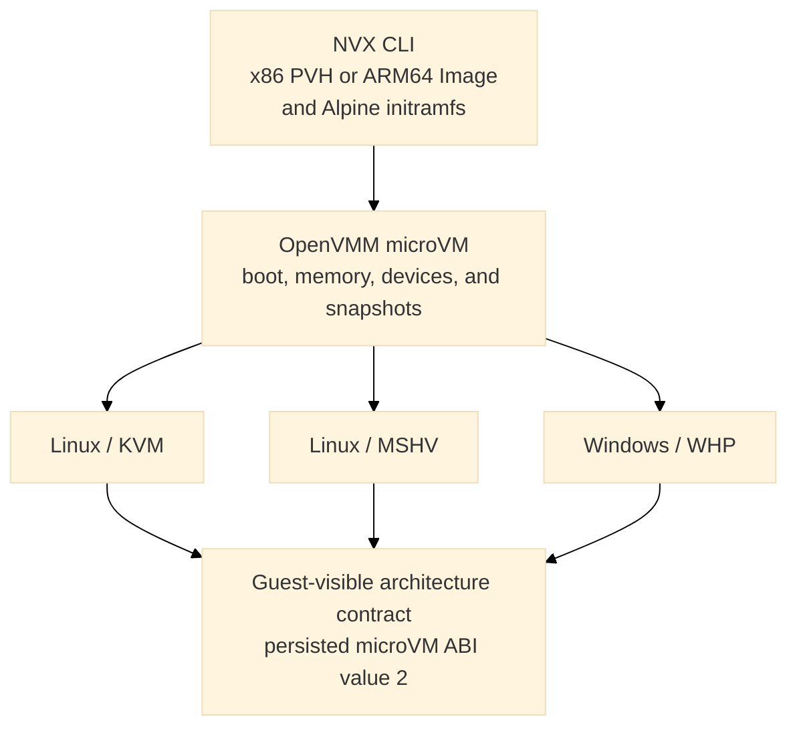
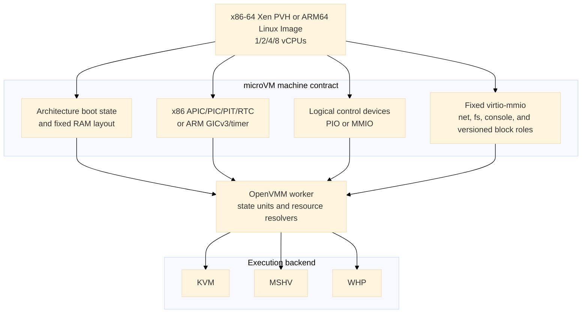
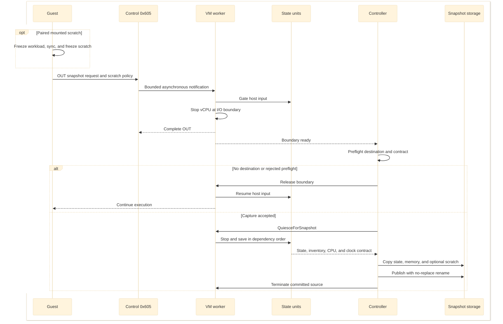
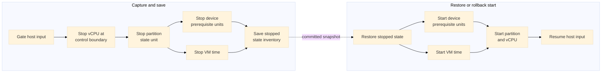
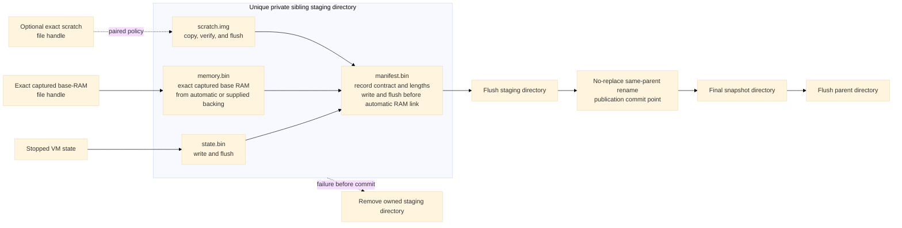
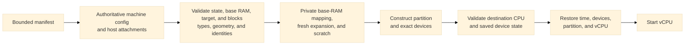

# NVX microVM design

This document describes the microVM machine profile implemented by the OpenVMM
submodule in this repository. The implementation is the source of truth. The
former phase proposal documents were removed after their deliverables were
integrated; this document describes the resulting machine rather than a
migration plan.

## Goals

NVX provides a small, versioned virtual machine for running x86-64 or ARM64
Linux without firmware or a general-purpose PC platform. Its design has four
primary goals:

- boot an x86-64 Xen PVH kernel on KVM, MSHV, and WHP or an ARM64 Linux
  `Image` on KVM with the same Alpine runtime contract;
- keep the guest-visible machine independent of the selected hypervisor;
- expose only a fixed, allowlisted set of devices; and
- capture a running VM into immutable artifacts that can be restored in a new
  process without serializing host handles.

The implemented runtime profile is `MachineProfile::Microvm`, selected only by
`--machine microvm`. It uses fixed sandbox layer and scratch roles and a
deterministic SMP topology. x86-64 uses shared virtio-mmio interrupt status
with edge-triggered delivery; ARM64 uses conventional active-high level
interrupts through GICv3. Snapshot manifests retain microVM ABI value 2,
optional restore-time RAM expansion uses machine-contract capability version
1, and TTRPC uses numeric machine-profile value 2. x86-64 supports KVM and
MSHV on Linux and WHP on Windows. ARM64 currently supports Linux/KVM.
Hypervisor-specific code provides partition creation, vCPU execution,
interrupt injection, and host resource integration. The machine profile owns
the boot protocol, memory map, device topology, command line, and snapshot
compatibility contract.



The public profile and ABI constants live in
[`openvmm_defs::config`](../openvmm/openvmm/openvmm_defs/src/config.rs). The
profile is selected independently from the hypervisor, for example:

```text
openvmm --machine microvm --hypervisor kvm  --kernel vmlinux --initrd initramfs.cpio
openvmm --machine microvm --hypervisor mshv --kernel vmlinux --initrd initramfs.cpio
openvmm --machine microvm --hypervisor whp  --kernel vmlinux --initrd initramfs.cpio
openvmm --machine microvm --hypervisor kvm --kernel vmlinux --initrd initramfs.cpio \
   --microvm-sandbox-block distro:file:distro.erofs,ro \
   --microvm-sandbox-block scratch:file:scratch.raw
openvmm --machine microvm --processors 8 --hypervisor kvm \
   --kernel vmlinux --initrd initramfs.cpio
```

The supported user entry point in this repository is `python scripts/nvx.py`;
see [Run](run.md) for complete commands and host-specific options.

## Configuration boundary

Machine identity is explicit rather than inferred from a kernel, device, or
hypervisor choice. OpenVMM carries it through CLI, worker, Petri, and snapshot
configuration. TTRPC exposes one microVM profile with numeric value 2; retired
value 1 is reserved and rejected. Validation
occurs before host resources are opened and again at the worker boundary.

The microVM requires:

- an x86-64 guest with Xen PVH direct boot on KVM, MSHV, or WHP, or an ARM64
  guest with device-tree Linux direct boot on KVM;
- one NUMA node;
- no VTL2, isolation, nested virtualization, or Hyper-V enlightenments; and
- the exact chipset and device inventory described below.

It accepts exactly 1, 2, 4, or 8 vCPUs in one socket and one die, with one
core per vCPU and no SMT. x86-64 uses xAPIC mode with contiguous APIC IDs
starting at zero; ARM64 uses contiguous MPIDR affinity values and GICv3
redistributors. The x86 PVH layout places the GDT at `0x800` and reserves
`0x30000..0x30fff` for interrupt status. ARM64 does not expose that shared
status page.

Snapshot capture may declare an immutable RAM capacity at least as large as the
active base RAM. When it does, both values must be 128-MiB aligned. A snapshot
without a declared capacity cannot select a different RAM size at restore.

Only role-bearing block devices are supported; ordinary unroled `--virtio-blk`
is rejected. Snapshot capture with blocks requires one to three
read-only lower layers followed by writable scratch, all backed by cached,
regular raw files with nonzero 512-byte-aligned geometry. Blockless
snapshots are also supported and do not use sandbox tier metadata.

It rejects UEFI, PCAT, IGVM, caller-supplied ACPI, SMBIOS, device tree,
PCI/PCIe, VPCI, VMBus, ISA DMA, IDE, floppy, VMGS, graphics, VGA firmware,
debugger resources, and devices outside the profile. The profile itself emits
the fixed MP and minimal ACPI metadata described below. This is an allowlist:
the implementation builds a microVM directly instead of constructing a
standard PC and removing unwanted devices.

Restore is stricter than cold boot. Guest-visible configuration is read from
the snapshot's machine contract. Restore-time input may select the same backend
kind recorded by the snapshot, supply required attachments, and select
processor and RAM activation targets explicitly allowed by the contract. Those
process-local targets do not change processor capacity, RAM capacity, command
line, device placement, feature masks, or filesystem and network identity.

## Cold boot

### x86-64 Xen PVH loader

The dedicated loader in [`vm/loader/src/pvh.rs`](../openvmm/vm/loader/src/pvh.rs)
treats the kernel, initramfs, command line, and all guest addresses as
untrusted. It:

1. requires a little-endian ELF64 image for `EM_X86_64`;
2. validates every program-header range with checked arithmetic;
3. loads nonempty, nonoverlapping `PT_LOAD` segments at `p_paddr` and zeros
   their BSS tails;
4. finds exactly one Xen `XEN_ELFNOTE_PHYS32_ENTRY` note and verifies that its
   32-bit physical entry lies in a loaded segment;
5. places an optional initramfs, page-aligned, at the top of low RAM;
6. builds Xen version-1 `hvm_start_info`, a RAM-only memory map, and the fixed
   MP and ACPI platform metadata; and
7. enters the kernel in flat 32-bit protected mode with paging disabled and
   `RBX` pointing to the start-info structure.

The loader does not synthesize a Linux zero page, page tables, SMBIOS, a device
tree, or a firmware execution environment. The worker does build a minimal
RSDP, MADT, and DSDT for the direct-boot guest. The loader places them below the
command line and publishes the RSDP through `hvm_start_info.rsdp_paddr`. It also
writes Intel MP 1.4 tables for every advertised processor, the ISA bus, IOAPIC,
and legacy IRQ routing. Virtio IRQs are edge-triggered and therefore are not
marked as level-triggered in the MP table or MADT; fixed device discovery remains command-line
based rather than firmware-enumerated.

The fixed boot reservations are:

| Guest physical address | Contents |
| ---: | --- |
| `0x0000..0x000f` | Intel MP 1.4 floating pointer |
| `0x0400...` | MP configuration table (`180 + 20 * vCPU count` bytes) |
| `0x800..0x81f` | Four-entry bootstrap GDT |
| `0x820` | Empty IDT |
| `0x6000` | Xen `hvm_start_info` |
| `0x6040` | Optional initramfs module entry |
| `0x7000` | Xen PVH RAM map |
| `0x8000..0x8fff` | ACPI RSDP page |
| `0x9000..0x1ffff` | Bounded ACPI table region |
| `0x20000` | NUL-terminated kernel command line |
| `0x100000` and above | Kernel load segments and ordinary RAM |

The initial state has `RIP` set to the Xen physical entry, `RBX=0x6000`,
`RSP=0`, `RFLAGS=2`, `CR0.PE=1`, and `CR3=CR4=EFER=0`. Code and data segments
are flat 32-bit segments, and the GDT, IDT, and TSS descriptors point at the
fixed bootstrap structures.

### ARM64 Linux direct loader

ARM64 uses the generic Linux `Image` loader and enters the kernel at EL1 with
`x0` pointing to a generated flattened device tree. The tree describes the
selected CPU count and MPIDRs, PSCI, GICv3 distributor and redistributors,
PL011 UARTs, RAM ranges, and only the fixed virtio-mmio and control devices
active for that launch. Optional empty slots are not emitted, so Linux never
probes absent transports.

PL011 `ttyAMA0` is the primary boot, shell, and control console. An optional
virtio-console remains `/dev/hvc0`. Fixed device interrupt numbers are GIC SPI
offsets rather than absolute INTIDs; the GIC adds the architectural SPI base.
KVM vCPU snapshot state includes the complete register list, MP state, GICv3
distributor/redistributor/ICC state, and architectural virtual-timer state.

### Memory layout

Guest RAM is continuous in file offset but split in guest physical address:


Active RAM occupies `[0, min(size, 3 GiB))`. Memory displaced by the fixed
one-GiB MMIO aperture resumes at 4 GiB. There is no high-MMIO or VTL2 aperture.
The central OpenVMM layout engine owns this split; the profile does not
maintain a second allocator. The resulting active RAM ranges are also the
authoritative x86 PVH map or ARM64 device-tree memory inventory and the
snapshot memory-range inventory.

When capture uses `--memory-capacity`, the layout engine reserves addresses for
the full capacity before publishing only the active base-size prefix as RAM.
Consequently, selecting a larger restore target does not move the MMIO gap or
any device. The machine contract records the canonical suffix ranges that are
absent from the captured guest memory description and `memory.bin`; a suffix
that crosses the three-GiB boundary is represented as separate low- and
high-RAM ranges.

The fixed layout is implemented by
[`vm_manifest_builder`](../openvmm/vmm_core/vm_manifest_builder/src/lib.rs) and
[`openvmm_core::worker::memory_layout`](../openvmm/openvmm/openvmm_core/src/worker/memory_layout.rs).
Loader writes and DMA ranges must fit wholly inside a RAM range and may not
cross the MMIO gap or a reserved boot structure.

### Effective command line

The profile, not the caller, owns console and device-discovery tokens. The
x86-64 base command line is:

```text
earlycon=xe9 console=hvc0 reboot=t panic=-1
```

When virtio-console is present, `console=hvc0` becomes `console=hvc1`; the raw
portb console remains the early console. User arguments are inserted after the
base tokens. Device and guest-bootstrap tokens are then appended in fixed
address order: network, filesystem, console, block.

The ARM64 base command line uses `console=ttyAMA0`; optional virtio-console is
`/dev/hvc0`. Device discovery comes from the generated device tree rather than
`virtio_mmio.device=` command-line tokens. User and guest-bootstrap arguments
remain part of the same hashed effective command-line contract.

Callers may not supply `earlycon=`, `console=`, `virtio_mmio.device=`,
`virtnet_ip=`, `virtnet_mask=`, `virtnet_gw=`, `virtnet_dns=`, `virtfs_dir=`,
`virtfs_tag=`, or `virtfs_mode=` tokens. Embedded NULs are rejected, and the
complete NUL-terminated command line must fit in 64 KiB. The same effective
string and its SHA-256 digest become part of the snapshot machine contract.

## Machine and device ABI

### Architectural devices

`BaseChipsetType::Microvm` builds the following allowlist:

- on x86-64, PIC, IOAPIC, LAPIC, i8253 PIT, CMOS RTC, raw portb, shutdown,
  and snapshot-request devices;
- on ARM64, GICv3, two PL011 UARTs, and MMIO control, shutdown, and
  snapshot-request devices; and
- on both architectures, the fixed virtio-mmio slots described below.

The x86 RTC defaults to BCD, 24-hour fields with status B `0x02`. Its PIC,
IOAPIC, PIT, RTC, LAPIC, and VM time use common OpenVMM device and state-unit
machinery. ARM64 uses the architectural virtual counter for guest time and
serializes GICv3 distributor, redistributor, and ICC state. Debugcon, Hyper-V
power management, gameport, PCI, firmware helpers, and standard-PC
missing-port shims are absent.



### Control devices

| Logical port | x86 transport | ARM64 transport | Behavior |
| ---: | ---: | ---: | --- |
| `0xe9` | PIO `0xe9` | control page `0xd0007000` | Raw byte input and output; reads consume one pending byte and zero-fill the remaining access width. |
| `0xea` | PIO `0xea` | control page `0xd0007000` | Bit 0 reports pending host input, bit 1 reports a fresh restore packet, bit 2 reports a processor target, bit 3 reports a version-3 memory target, bit 4 reports one or more memory-expansion ranges, and bit 5 reports the fixed generation-ID selector. Writing `0xa5` after restore selects the one-time restore packet. Writing `0xa6` selects the current 16-byte generation ID. |
| `0x604` | PIO `0x604` | MMIO `0xd0008000` | The first output byte becomes the process status carried with the VM power-off request. Reads return all ones. |
| `0x605` | PIO `0x605` | MMIO `0xd0009000` | Reads return all ones. Writes are coalesced and routed asynchronously to the capture controller. Zero requests fresh scratch and a nonzero first byte requests paired scratch. |

The architecture-neutral control-device implementation is in
[`vm/devices/chipset/src/microvm.rs`](../openvmm/vm/devices/chipset/src/microvm.rs).
Its receive and transmit buffers are each bounded at one MiB. Output overflow
drops the newest bytes and emits a rate-limited warning; input applies
backpressure by stopping host reads when its buffer is full. Pending bytes are
saved so capture does not silently lose VMM-owned I/O.

A snapshot-port write with no configured destination completes normally and
the guest continues. With a destination, the device permits at most one pending
transaction and defers completion long enough for the controller to establish
the exact post-write capture boundary. Repeated writes are coalesced. The bus
callback itself never pauses vCPUs, drains devices, hashes RAM, or writes
files. The scratch policy travels with the deferred boundary request.

### Fixed virtio-mmio transport

All seven fixed address slots are reserved. Snapshot-capable builds instantiate
the virtio-fs transport even without a host attachment so it is discoverable
before capture; the other optional devices are instantiated only when active.
Every device uses virtio-mmio, is omitted from ACPI, and has packed-ring support
masked.

| Device | Stable identity | MMIO range | x86 IRQ | ARM GIC SPI offset | Use |
| --- | --- | ---: | ---: | ---: | --- |
| virtio-net | `net:microvm0` | `0xd0000000..0xd0000fff` | KVM/MSHV 10, WHP 5 | 3 | Optional |
| virtio-fs | `fs:microvm0` | `0xd0001000..0xd0001fff` | 6 | 4 | Reserved dormant slot; HostFs optional |
| virtio-console | `console:microvm-virtio0` | `0xd0002000..0xd0002fff` | 7 | 5 | Optional |
| `distro` virtio-blk | `blk:sandbox:distro` | `0xd0003000..0xd0003fff` | 4 | 6 | Optional read-only role |
| `runtime` virtio-blk | `blk:sandbox:runtime` | `0xd0004000..0xd0004fff` | 12 | 7 | Optional read-only role |
| `custom` virtio-blk | `blk:sandbox:custom` | `0xd0005000..0xd0005fff` | 9 | 8 | Optional read-only role |
| `scratch` virtio-blk | `blk:sandbox:scratch` | `0xd0006000..0xd0006fff` | 11 | 9 | Required writable final role when blocks are present |

Explicit placement metadata bypasses the standard sequential MMIO allocator.
The worker validates the complete device count, kind, bus, address, IRQ, and
feature policy before resolving devices.

`--microvm-sandbox-block ROLE:DISK` assigns each attachment by
role rather than option order:

| Role | MMIO range | IRQ | Access |
| --- | ---: | ---: | --- |
| `distro` | `0xd0003000..0xd0003fff` | 4 | Read-only |
| `runtime` | `0xd0004000..0xd0004fff` | 12 | Read-only |
| `custom` | `0xd0005000..0xd0005fff` | 9 | Read-only |
| `scratch` | `0xd0006000..0xd0006fff` | 11 | Writable |

Roles must be unique and supplied in fixed order; omitted lower-layer roles
leave their slots empty, and any nonempty topology ends with scratch. x86 uses
active-high edge delivery and keeps IRQ 12 away from the RTC's IRQ 8. ARM64
uses active-high level delivery for every fixed virtio SPI.

On x86, one little-endian, naturally aligned `u32` per fixed slot resides in
the reserved shared-status page:

| Slot | Status GPA |
| --- | ---: |
| virtio-net | `0x30000` |
| virtio-fs | `0x30004` |
| virtio-console | `0x30008` |
| `distro` block | `0x3000c` |
| `runtime` block | `0x30010` |
| `custom` block | `0x30014` |
| `scratch` block | `0x30018` |

OpenVMM publishes config-change and used-buffer bits with a sequentially
consistent compare-exchange loop. It pulses the device IRQ only when the old
word is zero. The specialized Linux driver consumes all pending bits with a
sequentially consistent `xchg` to zero, so steady-state handling performs no
interrupt-status read or interrupt-acknowledgement MMIO access. A host OR that
races the exchange is either included in the exchanged value or observes zero,
stores the bit, and emits a new edge. Device reset and teardown clear the word.
Snapshot quiesce saves the pending value in transport state; restore writes it
back without replaying an edge, and the machine contract records the interrupt
mode, page GPA, and page size.

ARM64 uses the standard legacy virtio-mmio interrupt-status register with
level-triggered delivery. Its machine contract records `level-legacy` and no
shared-status page.

#### Block

Block devices are routed directly to virtio-mmio rather than VPCI. Packed rings
are unavailable. Each block has a stable role, MMIO address, IRQ, access mode, and
fixed feature mask. Its snapshot contract records the role, read-only flag,
logical length, logical and physical block sizes, and identity policy. Each
consumed external read-only layer is identified by SHA-256 and must be supplied
again on restore. Platform-tier layers are recorded as unbound because image
binding has not been consumed; restore may supply different same-geometry
layers. Writable scratch uses one of two policies:

- **paired**: capture publishes `scratch.img` with its exact length and SHA-256;
   each restore verifies it and creates a process-private writable copy;
- **fresh**: capture occurs before scratch is mounted, publishes no scratch
   artifact, and restore requires a new writable file with matching geometry.

Virtio transport and queue progress are saved with the other device state.
Stopping a queue prevents new descriptor intake and drains every accepted I/O
to one used-ring completion under the bounded snapshot quiesce timeout. The
controller flushes the exact scratch handle and copies it only after that drain.

#### Console

The optional console is the standard single-port virtio-console device with
two split queues. Host RX accepted by the device and partial guest TX progress
are device-private saved state, so a descriptor is not replayed from byte zero
after restore. Native sockets and handles are not serialized. A listener is
recreated, a client reconnect uses the bounded five-second timeout, or the restore
caller supplies the required attachment according to the recorded policy.

#### Network

The optional NIC has one RX/TX queue pair and an exact feature mask:
the MAC-address feature and virtio version 1.
`--net IPv4/prefix --network-profile portable` accepts prefixes `/1` through
`/30`, derives the first usable address as the gateway, and derives
deterministic guest and gateway MAC addresses from the final three IPv4
octets. The profile is mandatory and selects the same in-process Consomme data
plane on KVM, MSHV, and WHP.

The portable profile provides gateway DNS over UDP and TCP, ICMP echo,
outbound TCP and UDP, deterministic rejection of fragmented IPv4 packets, and
bounded flow, DNS, buffer, and packet-queue state. It applies one canonical
egress policy before externally visible transmission:

- allow only listed IPv4 hosts or CIDRs;
- allow IPv4 except listed hosts or CIDRs; or
- allow only exact IPv4 TCP endpoints.

The modes are mutually exclusive and fail closed for traffic outside the
selected policy. The snapshot records the profile, network identity, and
policy digest. Restore reconstructs a fresh endpoint and requires the profile
and policy again; native sockets, DNS requests, and flow objects are never
serialized.
Capture quiesces the endpoint, drains completion ownership, and requires the
saved queues to contain no unrepresented RX or TX packets. It then saves the
queue lifecycle, negotiated features, link state, and endpoint generation.
Arbitrary in-flight packet payloads are not serialized. Pre-capture queued
packets are not replayed, old TCP/UDP/ICMP/DNS state is invalidated, and new
traffic must establish fresh post-restore flows.

#### Filesystem

The filesystem slot is a no-DAX virtio-fs device with tag `microvm`, one
high-priority queue, one request queue, direct I/O, and zero guest cache
lifetimes. Without `--mount`, it has no HostFs backend or active filesystem
policy but remains guest-discoverable. Its explicit profile rejects SectionFs,
Aggregate, alternate tags, extra queues, shared-memory windows, and PCI
transport.
Read-only mode rejects mutation in the host device before invoking host
filesystem operations; read-write mode exposes only the supported common host
contract.

The exported directory is external live state, not part of the VM snapshot.
An active capture saves its exact canonical host path, FUSE negotiation, node
and handle allocation, aliases, lookup counts, directory snapshots and cookies,
and the identities needed to reopen objects. Restore requires the same path,
target, mode, root identity, and reopenable objects. A dormant capture instead
saves explicit unattached state and may restore with no attachment or bind a
new HostFs backend. The resumed guest then mounts tag `microvm` explicitly;
the cold-boot mount hook has already run. Snapshots without this capability
cannot add an attachment. Native file descriptors and Windows handles are not
serialized.

## Snapshot and restore

### Capture boundary

Generic host save and pulse-save/restore RPCs are deliberately unavailable for
the microVM profile. Capture is requested through logical control port `0x605`
(PIO on x86, MMIO on ARM64) and is coordinated as a bounded transaction.
Capture with sandbox blocks requires
`--snapshot-tier platform|workload-start|instance-checkpoint`; inconsistent
tier, clone/resume, and fresh/paired scratch combinations are rejected. For
paired scratch,
`nvx-snapshot` first freezes the workload cgroup with a bounded wait, calls
`sync`, and freezes the mounted filesystem. `nvx-snapshot --fresh-scratch`
instead requires scratch to be unmounted. A rejected capture thaws every
guest-owned barrier; failure to thaw terminates the VM.

1. gate host input and defer completion of the snapshot-port write;
2. stop the vCPU at the I/O boundary while completing the write, so saved state
   starts at the instruction immediately after the control access;
3. preflight the profile, destination, backend, external attachments, and
   snapshot eligibility; a missing destination or rejected preflight releases
   the boundary and lets the guest continue;
4. quiesce the remaining device workers and VM time in dependency order,
   including bounded virtio-blk queue drain;
5. save the exact state-unit inventory, processor state, device-private state,
   and memory;
6. copy and flush state, memory, and any paired scratch into a unique sibling
   staging directory;
7. publish the directory with one no-replace rename; and
8. terminate the source worker and process after publication.



State-unit transitions follow registered dependencies rather than one global
serial list. In the current worker, the partition depends on the device
prerequisite unit and VM time. Save quiesce stops in reverse dependency order;
restore and rollback start in dependency order. Device prerequisites and VM
time may transition in parallel.



The directory rename is the commit point. Before it, capture failure exposes no
final snapshot and resumes only when rollback is known to be valid. After it,
the source never resumes. This gives the guest an observable boundary: code
after the snapshot `out` runs once in each restored process and never in the
successfully captured source process.

### Artifact format and publication

A published snapshot contains:

```text
snapshot/
|-- manifest.bin
|-- state.bin
|-- memory.bin
`-- scratch.img    # paired microVM scratch only
```



[`openvmm_helpers::snapshot`](../openvmm/openvmm/openvmm_helpers/src/snapshot.rs)
implements bounded decoding, exact-length publication, artifact length checks,
restrictive creation, flushing, unique staging paths, and same-parent
no-replace publication. Automatic OpenVMM-owned microVM base RAM is flushed,
linked from the exact handle after its shared mappings, state, and manifest are
durable, and checked for matching identity and EOF. Linux uses
`linkat(AT_EMPTY_PATH)` or a `/proc/self/fd` link plus device/inode proof;
Windows uses handle-relative `FileLinkInformation` plus `FILE_ID_INFO`.
Unsupported filesystems fall back to an independent copy. User-supplied
backing always takes that copy path: Linux uses `FICLONE` with
`SEEK_DATA`/`SEEK_HOLE` and zero-scan fallbacks, while Windows uses a dense
copy. A pre-existing final destination is never deleted or replaced.

The source VM is terminal after an automatic RAM link commits. A failure after
creating the staging alias is rollback-safe only after the complete private
staging directory has been synchronously removed and its parent flushed. If
that proof fails, OpenVMM terminates the source rather than resuming it with a
surviving writable alias to the artifact.

The manifest is authoritative for:

- profile and ABI version;
- source hypervisor and architecture;
- captured RAM ranges and file offsets, plus any immutable RAM capacity,
  128-MiB block size, and canonical expansion ranges;
- processor topology, vCPU count, and every APIC or MPIDR identity;
- effective command line and digest;
- exact device order, stable IDs, state-unit names, MMIO/PMIO ranges, IRQs,
  transport, feature masks, and queue limits;
- architecture-specific CPU and clock compatibility data, including x86
  XSAVE/MSR/TSC state or ARM64 KVM register, GIC, and virtual-counter state;
- required host attachments and their policies;
- block roles, access, geometry, layer identities, and scratch policy;
- snapshot tier, clone/resume policy, and consumed configuration sections;
- exact lengths of `state.bin` and `memory.bin`; and
- the exact length and SHA-256 of paired `scratch.img`.

Snapshot paths and repeated fields are bounded. Restore rejects truncated,
oversized, malformed, wrong-type, path-escaping, symlinked, incompatible,
missing, extra, or reordered state before guest execution. New snapshots use
version 5. It does not store or validate embedded checksums for `state.bin` or
`memory.bin`; a same-length change to either payload is therefore outside the
validation contract. Paired scratch is checked because it must match captured
filesystem state. Versions 2 through 4 remain readable; versions 2 and 3 cannot
describe sandbox blocks, and version 4 predates tier metadata. Legacy version-2
checksum fields are accepted without re-hashing either payload. Snapshot
directories rely on host access control, while
authenticated export or transport belongs outside the default local artifact
format.

Restore opens the snapshot directory once and resolves manifest, state, memory,
paired scratch, and `resume.claim` relative to that directory handle. Windows
opens restore artifacts with read sharing only, rejects reparse points, checks
`FILE_ID_INFO` and EOF around COW-section creation, and retains the directory
and artifact guards in the VM worker so writes, truncation, deletion, and rename
remain blocked until teardown. Linux retains the exact `O_NOFOLLOW` directory
and regular-file descriptors, detects observable metadata changes before
worker handoff, and is therefore immune to pathname replacement; mandatory
content immutability still depends on host access control or an explicit
stronger mode such as a lease, fs-verity, or a verified artifact broker.

### Authoritative restore

Restore proceeds in the opposite direction from capture:

1. open one exact snapshot generation, read its bounded manifest, and derive
   the authoritative machine configuration;
2. resolve console, network, filesystem, policy, and read-only layer
   attachments by stable ID or role;
3. validate state, captured memory, the selected RAM target, block geometry and
   identities, and any paired scratch artifact before worker construction;
4. create a writable private copy-on-write mapping from the exact opened
   `memory.bin` handle, add fresh private backing for selected expansion
   ranges, transfer the artifact generation guards to the worker, and use
   either a verified private scratch copy or a caller-supplied fresh scratch
   file;
5. construct the partition and exact device inventory with the selected active
   RAM and the snapshot's immutable capacity;
6. compare the destination CPU, clock, topology, device, and queue contract
   with the saved contract;
7. restore VM time, chipset and virtio state, partition state, and vCPU state;
8. finish reconnecting host resources;
9. when tier policy, processor activation, or nonempty RAM expansion requires
   guest repair, start devices with external input gated and then release the
   restored vCPU; and
10. on the agent's `0x605` acknowledgment, stop at the exact post-write
   boundary, release input, and only then let the guest continue.

The partition must exist before OpenVMM can derive its effective destination
CPU contract. This does not expose a partially restored guest: contract
comparison and all saved-state validation still complete before a vCPU runs.



The captured memory artifact is mapped private and copy-on-write across
restores, while selected expansion ranges receive fresh private backing.
Paired scratch is copied into a private temporary file for each restore.
Multiple restored VMs may therefore dirty RAM and scratch without changing
reusable clone artifacts. An instance checkpoint is single-use: the first
artifact- and configuration-validated restore attempt atomically creates and
flushes `resume.claim`; duplicate and concurrent restores fail before worker
construction, and a later startup failure does not make the checkpoint
reusable. Initial compatibility is same-backend: KVM snapshots restore on
compatible KVM hosts, MSHV on compatible MSHV hosts, and WHP on compatible WHP
hosts. Cross-backend conversion and standalone NVX snapshot import are not
supported.

### Restore-time processor activation

The microVM separates the immutable processor capacity recorded by a snapshot from
the process-local VP set needed by one restore:

- `C` is the manifest VP capacity. Processor topology, APIC or MPIDR
   identities, architecture boot metadata, and saved VP inventory always
   contain exactly `C` entries.
- `B` is the boot-online count recorded from an opt-in template's effective
   `maxcpus=` command-line token. It must be one of 1, 2, 4, or 8 and no larger
   than `C`. A snapshot without this opt-in records zero and rejects activation.
- `N` is an explicit `--restore-processors` target. It must be supported and
   satisfy `B <= N <= C`; it is process-local and does not modify the snapshot.

The requested online set is always the contiguous prefix `0..N-1`. This is not
a topology change or a general CPU-hotplug interface: the guest still sees the
capacity-`C` machine contract, and bringing a suffix VP online after readiness
is unsupported.

Runtime VP materialization is backend-specific while the guest-visible
contract remains backend-independent:

| Restore shape | Process-local VP runners and backend binders | Saved VP state |
| --- | --- | --- |
| MSHV with explicit `N` | Instantiate and bind only `0..N-1` | Validate all `C` entries, then apply the prefix |
| MSHV without explicit `N` | Instantiate and bind all `C` | Validate and apply all `C` entries |
| KVM or WHP | Instantiate and bind all `C` | Validate and apply all `C` entries |

MSHV creates application processors lazily while binding their VP runners, so
discarding suffix binders before that boundary avoids creating processors that
this restore will not run. KVM and WHP deliberately retain their existing
full-capacity construction path, including when an explicit online target is
sent to the guest.

Saved state remains authoritative despite the narrower MSHV runtime. Before
filtering, restore requires exactly one VP state entry for every index in
`0..C-1` and rejects missing, duplicate, or out-of-range entries, including
errors in the dormant suffix. Only after that validation may an explicit MSHV
restore apply state for `0..N-1`. A reduced-prefix process cannot later produce
a complete capacity-`C` VP inventory, so any attempt to save it fails with
`SaveError::NotSupported`; dump or debug access to an uninstantiated suffix VP
also fails explicitly instead of indexing nonexistent runtime state. The
original immutable snapshot remains reusable for independent restores at
other valid targets.

After host-side state restoration, a processor-only activation uses the
version-2 private restore packet to carry `N` to the Alpine agent. Portb status
bit 2 distinguishes it from a legacy version-1 entropy packet. If the same
restore also selects a RAM target, version 3 carries both targets. While
external input remains gated, the agent onlines CPUs from `B` through `N-1`,
verifies that `/sys/devices/system/cpu/online` is exactly the requested prefix,
and acknowledges through logical control port `0x605`. OpenVMM stops at that post-write
boundary, releases host input, and then resumes the guest.

A fixed-capacity `N`-vCPU snapshot and a capacity-`C`, boot-online-`B` template
restored to `N` therefore reach the same online prefix but do not contain the
same guest state. The fixed snapshot captures all `N` CPUs online; the template
captures only `B` online CPUs and performs CPU activation during gated repair.
Performance comparisons should separate VP binding and worker construction
from guest resume-to-readiness. Matching host-side phase costs do not require
the total restore latencies or tail behavior to match.

### Restore-time memory activation

Restore-time memory activation separates the immutable RAM geometry recorded
by a snapshot from the active amount selected for one restored process:

- `M0` is the captured base RAM. `memory.bin`, the architecture boot memory
  description, and the saved RAM-range inventory contain exactly `M0`.
- `Cmem` is the optional immutable capacity declared by `--memory-capacity` at
  capture. The contract records capability version 1, `Cmem`, the 128-MiB Linux
  memory-block size, and every canonical GPA range in `Cmem - M0`.
- `M` is an explicit `--restore-memory` target. It must be 128-MiB aligned and
  satisfy `M0 <= M <= Cmem`. Omitting it restores exactly `M0`; a snapshot
  without the capability rejects an explicit target.

TTRPC exposes the same capture capacity and per-launch target as
`memory_capacity_bytes` and `restore_memory_bytes`.

The selected expansion is always a prefix of the contract's canonical ranges
in logical RAM order. OpenVMM maps the captured ranges privately from
`memory.bin`, maps only the selected suffix with fresh private backing, and
registers all selected ranges with the hypervisor before any restored vCPU
runs. Expansion bytes are neither read from nor written back to the snapshot,
so independent restores may choose different valid targets without changing
the reusable artifact.

An explicit RAM target selects restore-packet version 3:

```text
OPENVMM_ENTROPY_V3\0
u8 optional_online_vp_count
u8 expansion_range_count
repeated { little-endian u64 gpa_start, little-endian u64 length }
64 bytes fresh entropy
```

Portb status bit 3 identifies the memory-target packet and bit 4 indicates that
the selected target contains at least one expansion range. Version 3 may carry
a processor target in the same transaction. For a nonempty expansion,
OpenVMM keeps external input gated while the Alpine agent verifies the
128-MiB block size and each range, probes missing blocks through
`/sys/devices/system/memory/probe`, writes and verifies the `online` state, and
then completes entropy and generation-ID repair before acknowledging logical
control port `0x605`. Any malformed range or add/online failure terminates the
restore.

An explicit base-size target has a zero range count. For an untiered blockless
restore, the agent emits the deterministic zero-add marker without consuming
the packet or entering a restore-gate transaction; a tiered restore still uses
its existing gate. This mechanism is one-shot restore repair, not a general
post-readiness memory-hotplug interface.

### Time and entropy

Cold x86 PVH boots receive a canonical `lapic_timer_hz` kernel parameter from
the backend's reported LAPIC clock frequency. The NVX kernel uses this known
rate instead of comparing LAPIC interrupts with scheduling-sensitive emulated
PIT interrupts during boot. Native calibration remains available when no
frequency is reported, and the TSC-deadline path is unchanged.

Capture records a coherent processor and clock boundary. Restore advances TSC,
VM time, RTC, PIT/LAPIC deadlines, and the KVM paravirtual clock by nonnegative
host downtime, then reanchors them before vCPUs start. A destination that
cannot reproduce the saved CPU or clock contract is rejected rather than
silently changing guest behavior. The current restore path rejects negative
downtime and elapsed host downtime greater than 30 days. If an advanced
TSC-deadline timer would already be in the past, restore rearms it one
millisecond beyond the restored TSC; some hypervisors do not inject an
interrupt merely because a past deadline was restored. Exact deadline
read-back is consequently excluded from state comparison. Versioned MSHV CPU
contracts do not expose `IA32_TSC_ADJUST` because snapshot state cannot preserve
that register independently of `IA32_TSC`; Linux therefore does not interpret
OpenVMM's host-side TSC correction as per-vCPU firmware adjustment skew.

ARM64 records each KVM vCPU's full register list and MP state, serializes GICv3
distributor, redistributor, and ICC state, and preserves virtual timer count
and compare state. Restore advances the saved virtual count on every vCPU by
host downtime using `CNTFRQ_EL0`. KVM's historical virtual
count/compare-register ID swap is handled explicitly.

Replaying a snapshot also replays the guest's in-memory random-number-generator
state. Tiered restore, processor activation, and an explicit RAM target each
cause OpenVMM to create a fresh one-time packet and expose it through the control
status/data protocol; callers may also request that packet directly. Every
microVM process receives a fresh 16-byte generation ID before vCPU entry. The
ID is not serialized, and the VMM-owned value is not restored from device
state. When a restore packet exists, the ID is its first 16 entropy bytes;
otherwise it is generated independently. This keeps the gated repair path from
adding port reads. The Alpine agent keeps the prior ID in its captured process
state, rejects a restored ID that did not change, and exports the refreshed
value to the runtime hook before releasing the gate.

For clone policy, the Alpine restore path credits the seed, including the
generation ID, with `RNDADDENTROPY`, forces `RNDRESEEDCRNG`, refreshes wall
clock and machine identity, and requires the workload-start runtime hook to
reset runtime-owned RNG state before accepting work. RTC update-in-progress is
polled with a bounded read loop rather than a timer sleep because guest timers
are not authoritative until this wall-clock repair completes. The workload's
`/etc/machine-id` is a read-only bind of a runtime-tmpfs file, so the agent can
refresh it while scratch remains frozen; the agent also updates the workload's
UTS namespace before acknowledgement. It then acknowledges the VMM gate before
thawing scratch and the workload cgroup. Resume policy records the fresh
generation ID while preserving machine identity and RNG continuity. Fresh
post-restore entropy and the replacement generation ID are never stored in the
reusable snapshot; only the prior ID remains as the agent's comparison token.

## Host attachment model

Snapshot state contains guest-visible progress, not process-local resources.
Each external resource has a stable ID and a declarative reconstruction policy.

| Resource | Saved | Reconstructed or supplied on restore |
| --- | --- | --- |
| control console | Pending RX/TX bytes | Host serial endpoint, fresh process generation ID, and optional restore packet |
| console | Queue progress, staged RX, partial TX, policy | Listener, client connection, or supplied handle |
| network | Static identity, queue/packet progress, profile and policy identity | Fresh in-process Consomme endpoint and matching egress policy |
| filesystem | FUSE namespace, handles, cookies, root/object identity, access mode | Fresh host-directory attachment |
| sandbox block | Queue/device state, fixed roles, access, geometry, read-only layer identities, and scratch policy | Matching read-only layers plus a verified private paired scratch copy, or a new same-geometry scratch file |

Attachment resolution happens before vCPU start. Missing privileges, endpoint
binding failures, changed egress policy, replaced filesystem objects, or a
wrong attachment kind fail restore explicitly.

## Concurrency and trust boundaries

The guest controls PIO or MMIO control accesses, virtio descriptors, packet data, FUSE
requests, and the timing of a snapshot request. Kernel, initramfs, command line,
snapshot artifacts, and restore attachments are also untrusted inputs.

The implementation therefore uses checked address arithmetic, bounded buffers
and tables, typed validation errors, rate-limited guest-triggerable logs, and
fallible quiesce/restore operations. Native I/O callbacks only record bounded
state or enqueue notifications; they do not perform blocking snapshot or host
resource work. Malformed saved device state is validated before workers start,
and no vCPU runs after a partial restore failure.

## Validation

The implementation is exercised at three levels:

- loader, command-line, memory-layout, interrupt, control-device, network-policy, snapshot
  format, and device-private-state unit tests;
- self-contained OpenVMM Petri lifecycle and TTRPC tests using the
  checkout-built [`guest_test_pvh`](../openvmm/guest_test_pvh) on x86, plus
  native ARM64 MPIDR and topology tests; and
- NVX-owned process tests in
  [`scripts/nvx_tools/microvm_tests.py`](../scripts/nvx_tools/microvm_tests.py)
  using this repository's Linux kernel and Alpine initramfs through the public
  OpenVMM CLI.

The NVX-owned suite boots the architecture-matching artifacts on the available
native backend and covers x86 IRQ0/RTC or ARM architectural-timer behavior,
raw control I/O, shutdown status, exact
snapshot sequencing, repeated immutable restore, coherent downtime, fresh
generation IDs, `getrandom()` output, kernel UUIDs, temporary-file identifiers,
entropy reseed, active console RX/TX, network policy and HTTP traffic, and live
virtio-fs attachment revalidation. Sandbox coverage adds deterministic active
block-I/O drain, paired scratch publication, two private restores, fresh
scratch replacement, and pre-entry rejection of missing, corrupt, mismatched,
or wrong-geometry media. x86 coverage passes on KVM, MSHV, and WHP; ARM64
coverage passes on KVM. Coverage also includes 1/2/4/8-vCPU topology,
APIC or MPIDR identity,
pinned per-vCPU execution, timer/interrupt progress, reset, cancellation,
count and topology mismatch rejection, and repeated immutable restore.
Restore-time processor coverage captures one capacity-8 template with a
boot-online count of one, restores it at 1/2/4/8 online VPs, schedules work on
every requested CPU, and verifies that the artifact is unchanged.
Restore-time memory coverage captures 512 MiB with a 2-GiB capacity, restores
the same artifact at 512 MiB, 1 GiB, and 2 GiB, validates the added-byte count
and expanded allocation, and verifies artifact immutability. Unit coverage
verifies that only an explicit MSHV processor target selects a runtime prefix,
that the complete saved VP inventory is validated before filtering, that
reduced-prefix saves are rejected, and that dormant VP access fails cleanly.
Lifecycle profiling verifies that MSHV binds exactly the requested prefix while
fixed-capacity comparisons retain equivalent per-prefix binding and
worker-construction costs.
Platform CI and the benchmark histories in `data/` provide the wider host
matrix.

## Current limits

The current ABI family intentionally does not provide:

- processor counts other than 1/2/4/8, SMT, multiple NUMA nodes, ARM64
  backends other than KVM, or nested virtualization;
- firmware boot, caller-defined ACPI, SMBIOS, PCI, VPCI, VMBus, arbitrary
   post-readiness CPU or memory hotplug, or arbitrary devices;
- cross-hypervisor snapshot restore;
- capture-and-continue, live migration, or saving a reduced-prefix MSHV
   restore;
- restore-time RAM shrinking, targets beyond the captured capacity,
   non-128-MiB targets, or expansion from snapshots without an opt-in capacity;
- ABI or PVH-layout value 1 snapshots;
- snapshot block media other than cached regular raw files;
- sandbox-block construction through TTRPC;
- serialization of live network flows or native host handles;
- snapshotting of the contents of a live virtio-fs export; or
- compatibility with standalone NVX `MVMSNAP*` or `WHPSNAP*` files.

The tier contract and post-restore gate are currently low-level OpenVMM and
guest-agent primitives exercised by the native lifecycle suite. The public
`nvx sandbox` command does not yet orchestrate platform builds, warm-shim
handoff, checkpoints, or sandbox restore. That integration depends on the
replaceable configuration region, production agent, and versioned control
protocol tracked by issues #158, #159, and #160. In particular, a platform
snapshot must be produced only by a trusted pre-image-binding workflow: the
current host validation rejects tenant command-line configuration and records
layer identities as unbound, but cannot prove that arbitrary guest code did
not read an attached layer before requesting capture.

Changing a guest-visible address, IRQ, command-line token, feature mask, queue
shape, time policy, or device behavior requires a new microVM ABI version. A
backend-specific difference is valid only when it is explicitly part of that
versioned contract, such as the virtio-net IRQ.

## Integrated implementation status

The former phase proposal files are no longer present in the OpenVMM tree.
Their feature areas are integrated as follows:

| Area | Current implementation |
| --- | --- |
| Base machine | x86 PVH with MP/ACPI and ARM64 Linux direct boot with generated FDT are implemented, along with architecture-specific interrupt/control devices, fixed-role sandbox blocks, and 1/2/4/8-vCPU SMP. x86 supports KVM, MSHV, and WHP; ARM64 supports KVM. |
| Snapshot and restore | Guest-requested capture with staged version-5 artifacts and structurally validated new-process restore is implemented with exact multi-VP capacity plus either no block or three-tier fixed-role layers. Opt-in contracts may record a smaller boot-online VP prefix and an immutable RAM capacity, then activate a requested VP prefix and 128-MiB-aligned RAM target before restore readiness without changing topology, capacity, or saved state. Explicit MSHV processor targets instantiate only that VP prefix and cannot be saved again; non-explicit MSHV, KVM, and WHP restores instantiate full processor capacity. Captured RAM uses private COW mappings, expansion uses fresh private backing, paired scratch is privately copied, and the reusable artifact is unchanged. Paired or fresh scratch, a post-restore input gate, and single-use resume claims are supported. Versions 2 through 4 remain readable when their machine contract carries supported ABI and PVH layout value 2; historical artifacts without boot-online or RAM-capacity fields cannot request those activations. Restore is same-backend. Public sandbox orchestration remains gated on issues #158–#160. |
| Console | Fixed virtio-console, private RX/TX state, and declarative endpoint reconstruction are implemented. |
| Network | Static identity, fixed transport, the portable in-process Consomme endpoint, egress policy, and quiesced restore are implemented. Capture drains packet ownership instead of serializing arbitrary pending packets or host flow state. |
| Filesystem | Fixed no-DAX HostFs and live attachment revalidation are implemented. Provider-backed immutable filesystem generations remain outside the current profile. |

The end-to-end tests establish process-boundary behavior for the available
native host backend. They do not make every future extension a portability
guarantee; the versioned code contract and the limits above remain
authoritative.

## Code ownership map

| Area | Primary implementation |
| --- | --- |
| Public profile, ABI constants, validation, command line | [`openvmm_defs/src/config.rs`](../openvmm/openvmm/openvmm_defs/src/config.rs) |
| CLI and host attachment construction | [`openvmm_entry/src`](../openvmm/openvmm/openvmm_entry/src) |
| Worker composition and fixed virtio placement | [`openvmm_core/src/worker`](../openvmm/openvmm/openvmm_core/src/worker) |
| Restore-time VP materialization and saved-state filtering | [`openvmm_core/src/worker/dispatch.rs`](../openvmm/openvmm/openvmm_core/src/worker/dispatch.rs) and [`vmm_core/src/partition_unit/vp_set.rs`](../openvmm/vmm_core/src/partition_unit/vp_set.rs) |
| Restore-time RAM capacity, range selection, and split backing | [`openvmm_helpers/src/snapshot.rs`](../openvmm/openvmm/openvmm_helpers/src/snapshot.rs), [`openvmm_core/src/worker/memory_layout.rs`](../openvmm/openvmm/openvmm_core/src/worker/memory_layout.rs), and [`openvmm_core/src/worker/dispatch.rs`](../openvmm/openvmm/openvmm_core/src/worker/dispatch.rs) |
| x86 Xen PVH loading | [`vm/loader/src/pvh.rs`](../openvmm/vm/loader/src/pvh.rs) |
| x86 ACPI and ARM64 FDT construction | [`vmm_core/src/acpi_builder.rs`](../openvmm/vmm_core/src/acpi_builder.rs) and [`openvmm_core/src/worker/vm_loaders/linux.rs`](../openvmm/openvmm/openvmm_core/src/worker/vm_loaders/linux.rs) |
| Base-chipset allowlist and memory-layout defaults | [`vmm_core/vm_manifest_builder`](../openvmm/vmm_core/vm_manifest_builder) |
| PIO/MMIO control, shutdown, and snapshot devices | [`vm/devices/chipset/src/microvm.rs`](../openvmm/vm/devices/chipset/src/microvm.rs) |
| RTC normalization | [`vm/devices/chipset/src/cmos_rtc.rs`](../openvmm/vm/devices/chipset/src/cmos_rtc.rs) |
| Virtio device-private saved state | [`vm/devices/virtio`](../openvmm/vm/devices/virtio) |
| Snapshot format, machine contract, publication, validation | [`openvmm_helpers/src/snapshot.rs`](../openvmm/openvmm/openvmm_helpers/src/snapshot.rs) |
| Capture orchestration | [`openvmm_entry/src/vm_controller.rs`](../openvmm/openvmm/openvmm_entry/src/vm_controller.rs) |
| Guest workload, scratch quiesce, and post-restore CPU/RAM repair | [`alpine/nvx-snapshot`](../alpine/nvx-snapshot) and [`alpine/nvx-init-agent`](../alpine/nvx-init-agent) |
| Self-contained OpenVMM control-plane tests | [`guest_test_pvh`](../openvmm/guest_test_pvh), [`vmm_tests/tests/tests/x86_64/microvm.rs`](../openvmm/vmm_tests/vmm_tests/tests/tests/x86_64/microvm.rs), [`vmm_tests/tests/tests/ttrpc.rs`](../openvmm/vmm_tests/vmm_tests/tests/tests/ttrpc.rs), and [`vmm_tests/tests/tests/aarch64_exclusive.rs`](../openvmm/vmm_tests/vmm_tests/tests/tests/aarch64_exclusive.rs) |
| NVX Linux and device integration tests | [`scripts/nvx_tools/microvm_tests.py`](../scripts/nvx_tools/microvm_tests.py) and [`scripts/nvx_tools/microvm_test_scripts`](../scripts/nvx_tools/microvm_test_scripts) |
