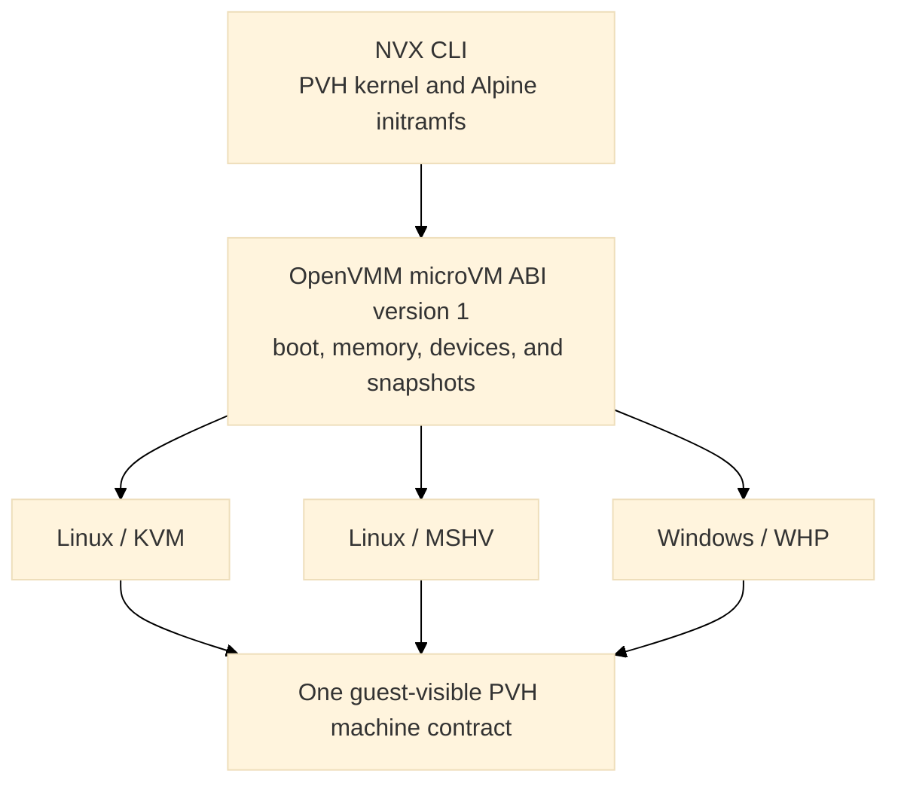
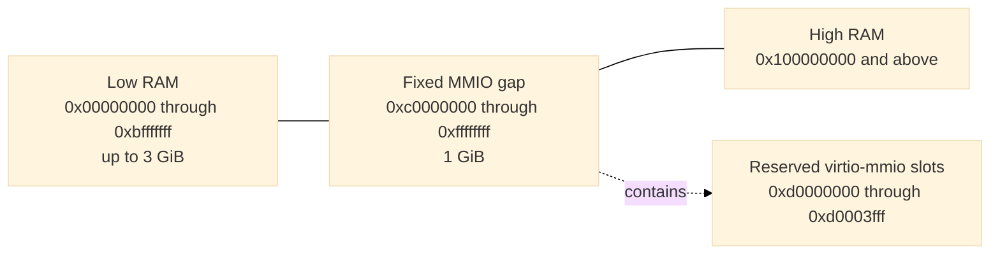
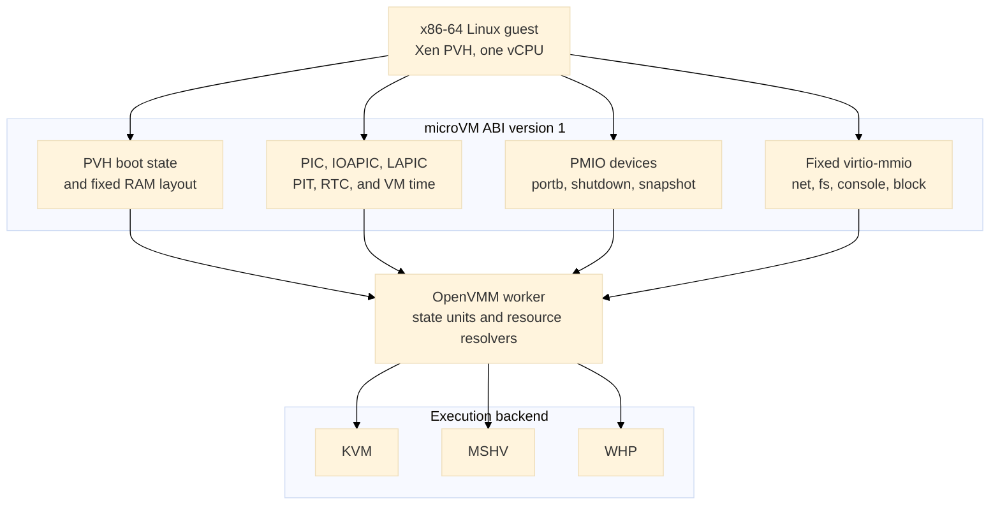
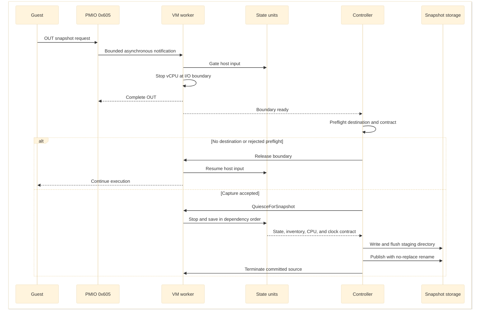
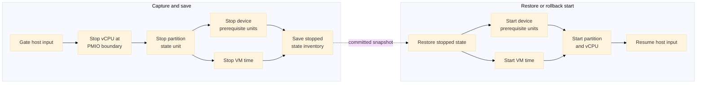
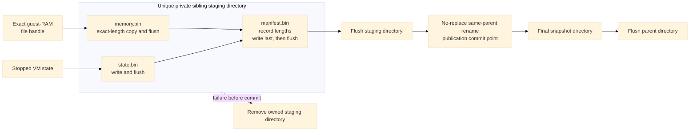

# NVX microVM design

This document describes the microVM machine profile implemented by the OpenVMM
submodule pinned in this repository. The implementation is the source of truth.
The proposal documents in `openvmm/design-overview.md` and
`openvmm/design-microvm-phase-*.md` record the migration plan and rationale, but
some of their baseline observations and deferred-work lists predate the current
code.

## Goals

NVX provides a small, versioned virtual machine for running an x86-64 Linux
guest without firmware or a PC platform. Its design has four primary goals:

- boot the same uncompressed Xen PVH kernel and Alpine initramfs on Linux and
  Windows;
- keep the guest-visible machine independent of the selected hypervisor;
- expose only a fixed, allowlisted set of devices; and
- capture a running VM into immutable artifacts that can be restored in a new
  process without serializing host handles.

The current profile is `MachineProfile::Microvm { abi_version: 1 }`. KVM and
MSHV are supported on Linux and WHP is supported on Windows. Hypervisor-specific
code provides partition creation, vCPU execution, interrupt injection, and host
resource integration. The machine profile owns the boot protocol, memory map,
device topology, command line, and snapshot compatibility contract.



The public profile and ABI constants live in
[`openvmm_defs::config`](../openvmm/openvmm/openvmm_defs/src/config.rs). The
profile is selected independently from the hypervisor, for example:

```text
openvmm --machine microvm --hypervisor kvm  --kernel vmlinux --initrd initramfs.cpio
openvmm --machine microvm --hypervisor mshv --kernel vmlinux --initrd initramfs.cpio
openvmm --machine microvm --hypervisor whp  --kernel vmlinux --initrd initramfs.cpio
```

The supported user entry point in this repository is `python scripts/nvx.py`;
see [Run](run.md) for complete commands and host-specific options.

## Configuration boundary

Machine identity is explicit rather than inferred from a kernel, device, or
hypervisor choice. OpenVMM carries it through CLI, TTRPC, worker, Petri, and
snapshot configuration. Validation occurs before host resources are opened and
again at the worker boundary.

ABI version 1 requires:

- an x86-64 guest;
- exactly one vCPU with the fixed APIC topology;
- one NUMA node;
- Xen PVH direct boot;
- KVM, MSHV, or WHP;
- no VTL2, isolation, nested virtualization, or Hyper-V enlightenments; and
- the exact chipset and device inventory described below.

It rejects UEFI, PCAT, IGVM, caller-supplied ACPI, SMBIOS, device tree,
PCI/PCIe, VPCI, VMBus, ISA DMA, IDE, floppy, VMGS, graphics, VGA firmware,
debugger resources, and devices outside the profile. The profile itself emits
the fixed MP and minimal ACPI metadata described below. This is an allowlist:
the implementation builds a microVM directly instead of constructing a
standard PC and removing unwanted devices.

Restore is stricter than cold boot. Guest-visible configuration is read from
the snapshot's machine contract. Restore-time input may choose a compatible
host backend and supply required attachments, but it cannot override memory,
CPU topology, command line, device placement, feature masks, or filesystem and
network identity.

## Cold boot

### Xen PVH loader

The dedicated loader in [`vm/loader/src/pvh.rs`](../openvmm/vm/loader/src/pvh.rs)
treats the kernel, initramfs, command line, and all guest addresses as
untrusted. It:

1. requires a little-endian ELF64 image for `EM_X86_64`;
2. validates every program-header range with checked arithmetic;
3. loads nonempty, nonoverlapping `PT_LOAD` segments at `p_paddr` and zeros
   their BSS tails;
4. finds exactly one Xen `XEN_ELFNOTE_PHYS32_ENTRY` note and verifies that its
   32-bit physical entry lies in a loaded segment;
5. places an optional initramfs, page-aligned, at the top of low RAM;
6. builds Xen version-1 `hvm_start_info`, a RAM-only memory map, and the fixed
   MP and ACPI platform metadata; and
7. enters the kernel in flat 32-bit protected mode with paging disabled and
   `RBX` pointing to the start-info structure.

The loader does not synthesize a Linux zero page, page tables, SMBIOS, a device
tree, or a firmware execution environment. The worker does build a minimal
RSDP, MADT, and DSDT for the direct-boot guest. The loader places them below the
command line and publishes the RSDP through `hvm_start_info.rsdp_paddr`. It also
writes Intel MP 1.4 tables for the single processor, ISA bus, IOAPIC, and legacy
IRQ routing. The profile's virtio IRQs are described as active-high,
level-triggered lines; fixed virtio device discovery remains command-line
based rather than firmware-enumerated.

The fixed boot reservations are:

| Guest physical address | Contents |
| ---: | --- |
| `0x0000..0x000f` | Intel MP 1.4 floating pointer |
| `0x0400..0x04c7` | Single-processor MP configuration table |
| `0x500..0x51f` | Four-entry bootstrap GDT |
| `0x520` | Empty IDT |
| `0x6000` | Xen `hvm_start_info` |
| `0x6040` | Optional initramfs module entry |
| `0x7000` | Xen PVH RAM map |
| `0x8000..0x8fff` | ACPI RSDP page |
| `0x9000..0x1ffff` | Bounded ACPI table region |
| `0x20000` | NUL-terminated kernel command line |
| `0x100000` and above | Kernel load segments and ordinary RAM |

The initial state has `RIP` set to the Xen physical entry, `RBX=0x6000`,
`RSP=0`, `RFLAGS=2`, `CR0.PE=1`, and `CR3=CR4=EFER=0`. Code and data segments
are flat 32-bit segments, and the GDT, IDT, and TSS descriptors point at the
fixed bootstrap structures.

### Memory layout

Guest RAM is continuous in file offset but split in guest physical address:



RAM occupies `[0, min(size, 3 GiB))`. Memory displaced by the fixed one-GiB
MMIO aperture resumes at 4 GiB. There is no high-MMIO or VTL2 aperture. The
central OpenVMM layout engine owns this split; the profile does not maintain a
second allocator. The resulting RAM ranges are also the authoritative PVH
memory map and snapshot memory-range inventory.

The fixed layout is implemented by
[`vm_manifest_builder`](../openvmm/vmm_core/vm_manifest_builder/src/lib.rs) and
[`openvmm_core::worker::memory_layout`](../openvmm/openvmm/openvmm_core/src/worker/memory_layout.rs).
Loader writes and DMA ranges must fit wholly inside a RAM range and may not
cross the MMIO gap or a reserved boot structure.

### Effective command line

The profile, not the caller, owns console and device-discovery tokens. The base
command line is:

```text
earlycon=xe9 console=hvc0 reboot=t panic=-1
```

When virtio-console is present, `console=hvc0` becomes `console=hvc1`; the raw
portb console remains the early console. User arguments are inserted after the
base tokens. Device and guest-bootstrap tokens are then appended in fixed
address order: network, filesystem, console, block.

Callers may not supply `earlycon=`, `console=`, `virtio_mmio.device=`,
`virtnet_ip=`, `virtnet_mask=`, `virtnet_gw=`, `virtnet_dns=`, `virtfs_dir=`,
`virtfs_tag=`, or `virtfs_mode=` tokens. Embedded NULs are rejected, and the
complete NUL-terminated command line must fit in 64 KiB. The same effective
string and its SHA-256 digest become part of the snapshot machine contract.

## Machine and device ABI

### Architectural devices

`BaseChipsetType::Microvm` builds the following allowlist:

- generic PIC and IOAPIC;
- the selected hypervisor's LAPIC;
- i8253 PIT on IRQ 0;
- generic CMOS RTC in microVM-v1 mode;
- raw bidirectional portb;
- status-carrying shutdown port; and
- guest snapshot-request port.

The RTC is anchored to UTC and exposes binary, 24-hour fields with status B
`0x06`. PIC, IOAPIC, PIT, RTC, LAPIC, and VM time use common OpenVMM device and
state-unit machinery on every backend. IOAPIC saved state includes the
asserted level of every input line and reevaluates routing after restore, so a
level interrupt is neither lost nor treated as an edge while reconstructing
the backend. Serial UARTs, debugcon, Hyper-V power management, gameport, PCI,
firmware helpers, and standard-PC missing-port shims are absent.



### PMIO devices

| Port | Device | Behavior |
| ---: | --- | --- |
| `0xe9` | portb data | Raw byte input and output; reads consume one pending byte and zero-fill the remaining access width. |
| `0xea` | portb status | Bit 0 reports pending host input. Writing `0xa5` after restore selects the one-time entropy packet. |
| `0x604` | shutdown | The first output byte becomes the process status carried with the VM power-off request. Reads return all ones. |
| `0x605` | snapshot request | Reads return all ones. Writes are coalesced and routed asynchronously to the capture controller. |

The portb implementation is in
[`vm/devices/chipset/src/microvm.rs`](../openvmm/vm/devices/chipset/src/microvm.rs).
Its receive and transmit buffers are each bounded at one MiB. Output overflow
drops the newest bytes and emits a rate-limited warning; input applies
backpressure by stopping host reads when its buffer is full. Pending bytes are
saved so capture does not silently lose VMM-owned I/O.

A snapshot-port write with no configured destination completes normally and
the guest continues. With a destination, the device permits at most one pending
transaction and defers completion long enough for the controller to establish
the exact post-`out` capture boundary. Repeated writes are coalesced. The PMIO
callback itself never pauses vCPUs, drains devices, hashes RAM, or writes files.

### Fixed virtio-mmio transport

All four ABI-v1 slots are reserved from the first version, whether or not the
device is present. A cold boot may instantiate at most one device of each type.
Every device uses virtio-mmio, is omitted from ACPI, and has packed-ring support
masked.

| Device | Stable identity | MMIO range | IRQ | Delivery |
| --- | --- | ---: | ---: | --- |
| virtio-net | `net:microvm0` | `0xd0000000..0xd0000fff` | KVM/MSHV 10, WHP 5 | Optional |
| virtio-fs | `fs:microvm0` | `0xd0001000..0xd0001fff` | 6 | Optional |
| virtio-console | `console:microvm-virtio0` | `0xd0002000..0xd0002fff` | 7 | Optional |
| virtio-blk | fixed block slot | `0xd0003000..0xd0003fff` | 4 | Optional cold-boot extension |

Explicit placement metadata bypasses the standard sequential MMIO allocator.
The worker validates the complete device count, kind, bus, address, IRQ, and
feature policy before resolving devices.

ABI v2 retains those reservations and extends the block range for the sandbox
filesystem. `--microvm-sandbox-block ROLE:DISK` assigns each attachment by
role rather than option order:

| Role | MMIO range | IRQ | Access |
| --- | ---: | ---: | --- |
| `distro` | `0xd0003000..0xd0003fff` | 4 | Read-only |
| `runtime` | `0xd0004000..0xd0004fff` | 12 | Read-only |
| `custom` | `0xd0005000..0xd0005fff` | 9 | Read-only |
| `scratch` | `0xd0006000..0xd0006fff` | 11 | Writable |

Roles must be unique and supplied in fixed order; omitted lower-layer roles
leave their slots empty, and any nonempty topology ends with scratch. All four
IRQs are level-triggered. IRQ 12 avoids the RTC's exclusive IRQ 8. ABI v1 and
its command-line/device contract are unchanged.

#### Block

The optional block device is routed directly to virtio-mmio rather than VPCI.
It retains the existing OpenVMM read-only or writable disk behavior on cold
boot. Packed rings are unavailable. Current guest-triggered microVM snapshots
reject a configured block device because immutable external-media identity and
writable point-in-time cloning are not part of the implemented snapshot
contract.

#### Console

The optional console is the standard single-port virtio-console device with
two split queues. Host RX accepted by the device and partial guest TX progress
are device-private saved state, so a descriptor is not replayed from byte zero
after restore. Native sockets and handles are not serialized. A listener is
recreated, a client reconnect uses the bounded ABI-v1 timeout, or the restore
caller supplies the required attachment according to the recorded policy.

#### Network

The optional NIC has one RX/TX queue pair and an exact ABI-v1 feature mask:
the MAC-address feature and virtio version 1. `--net IPv4/prefix` accepts
prefixes `/1` through `/30`, derives the first usable address as the gateway,
and derives deterministic guest and gateway MAC addresses from the final three
IPv4 octets.

Linux uses a managed TAP or a supplied TAP attachment. Windows uses the
in-process user-mode network backend. Both apply one canonical egress policy
before externally visible transmission:

- allow only listed IPv4 hosts or CIDRs;
- allow IPv4 except listed hosts or CIDRs; or
- allow only exact IPv4 TCP endpoints.

The modes are mutually exclusive and fail closed for traffic outside the
selected policy. The snapshot records the network identity, backend kind, and
policy digest. Restore reconstructs the endpoint and requires the policy again;
native TAP descriptors, sockets, and connection objects are never serialized.
Capture quiesces the endpoint, drains completion ownership, and requires the
saved queues to contain no unrepresented RX or TX packets. It then saves the
queue lifecycle, negotiated features, link state, and endpoint generation.
Arbitrary in-flight packet payloads are not serialized, and existing proxied
TCP/UDP flows are not promised to survive process replacement.

#### Filesystem

The optional filesystem is a no-DAX HostFs virtio-fs device with tag
`microvm`, one high-priority queue, one request queue, direct I/O, and zero
guest cache lifetimes. Its explicit profile rejects SectionFs, Aggregate,
alternate tags, extra queues, shared-memory windows, and PCI transport.
Read-only mode rejects mutation in the host device before invoking host
filesystem operations; read-write mode exposes only the supported common host
contract.

The exported directory is external live state, not part of the VM snapshot.
Capture saves FUSE negotiation, node and handle allocation, aliases, lookup
counts, directory snapshots and cookies, and the identities needed to reopen
objects. Restore requires a fresh `fs:microvm0` attachment, pins its root, and
revalidates every saved object before a vCPU runs. Host changes can therefore
be visible or can make restore fail. Native file descriptors and Windows
handles are not serialized.

## Snapshot and restore

### Capture boundary

Generic host save and pulse-save/restore RPCs are deliberately unavailable for
the microVM profile. Capture is requested by the guest through PMIO `0x605` and
is coordinated as a bounded transaction:

1. gate host input and defer completion of the snapshot-port write;
2. stop the vCPU at the I/O boundary while completing the write, so saved state
   starts at the instruction immediately after `out`;
3. preflight the profile, destination, backend, external attachments, and
   snapshot eligibility; a missing destination or rejected preflight releases
   the boundary and lets the guest continue;
4. quiesce the remaining device workers and VM time in dependency order;
5. save the exact state-unit inventory, processor state, device-private state,
   and memory;
6. write and flush all artifacts in a unique sibling staging directory;
7. publish the directory with one no-replace rename; and
8. terminate the source worker and process after publication.



State-unit transitions follow registered dependencies rather than one global
serial list. In the current worker, the partition depends on the device
prerequisite unit and VM time. Save quiesce stops in reverse dependency order;
restore and rollback start in dependency order. Device prerequisites and VM
time may transition in parallel.



The directory rename is the commit point. Before it, capture failure exposes no
final snapshot and resumes only when rollback is known to be valid. After it,
the source never resumes. This gives the guest an observable boundary: code
after the snapshot `out` runs once in each restored process and never in the
successfully captured source process.

### Artifact format and publication

A published snapshot contains:

```text
snapshot/
|-- manifest.bin
|-- state.bin
`-- memory.bin
```



[`openvmm_helpers::snapshot`](../openvmm/openvmm/openvmm_helpers/src/snapshot.rs)
implements bounded decoding, exact-length memory copying, artifact length
checks, restrictive creation, flushing, unique staging paths, and same-parent
no-replace publication. The manifest is written last within the staging
directory. A pre-existing final destination is never deleted or replaced.

The manifest is authoritative for:

- profile and ABI version;
- source hypervisor and architecture;
- RAM ranges and file offsets;
- one-vCPU topology and APIC identity;
- effective command line and digest;
- exact device order, stable IDs, state-unit names, MMIO/PMIO ranges, IRQs,
  transport, feature masks, and queue limits;
- CPU, XSAVE, MSR, TSC-frequency, and clock compatibility data;
- required host attachments and their policies; and
- exact lengths of `state.bin` and `memory.bin`.

Snapshot paths and repeated fields are bounded. Restore rejects truncated,
oversized, malformed, wrong-type, path-escaping, symlinked, incompatible,
missing, extra, or reordered state before guest execution. Version 3 does not
store or validate embedded checksums for `state.bin` or `memory.bin`; a
same-length payload change is therefore outside the validation contract.
Version 2 manifests remain readable, but their legacy checksum fields are
accepted without re-hashing either payload. Snapshot directories rely on host
access control, while authenticated export or transport belongs outside the
default local artifact format.

### Authoritative restore

Restore proceeds in the opposite direction from capture:

1. read the bounded manifest and derive the authoritative machine
   configuration;
2. resolve console, network, filesystem, and policy attachments by stable ID;
3. validate state and memory file types and exact lengths;
4. create writable private copy-on-write mappings of the opened `memory.bin`;
5. construct the partition and exact device inventory from the manifest;
6. compare the destination CPU, XSAVE/MSR, TSC, topology, device, and queue
   contract with the saved contract;
7. restore VM time, chipset and virtio state, partition state, and vCPU state;
8. finish reconnecting host resources; and
9. start the vCPU only after every preceding step succeeds.

The partition must exist before OpenVMM can derive its effective destination
CPU contract. This does not expose a partially restored guest: contract
comparison and all saved-state validation still complete before a vCPU runs.

```mermaid
%%{init: {"theme": "base", "themeVariables": {"background": "#ffffff"}}}%%
flowchart LR
   Manifest["Bounded manifest"]
   Config["Authoritative machine config<br/>and host attachments"]
   Verify["Validate state and memory<br/>types and exact lengths"]
   Cow["Private COW mapping<br/>of memory.bin"]
   Machine["Construct partition<br/>and exact devices"]
   Validate["Validate destination CPU<br/>and saved device state"]
   Restore["Restore time, devices,<br/>partition, and vCPU"]
   Run["Start vCPU"]

   Manifest --> Config --> Verify --> Cow --> Machine --> Validate --> Restore --> Run
```



The memory artifact is mapped private and copy-on-write across restores.
Multiple restored VMs may dirty all guest RAM without changing the snapshot
file. Initial compatibility is same-backend: KVM snapshots restore on
compatible KVM hosts, MSHV on compatible MSHV hosts, and WHP on compatible WHP
hosts. Cross-backend conversion and standalone NVX snapshot import are not
supported.

### Time and entropy

Capture records a coherent processor and clock boundary. Restore advances TSC,
VM time, RTC, PIT/LAPIC deadlines, and the KVM paravirtual clock by nonnegative
host downtime, then reanchors them before vCPUs start. A destination that
cannot reproduce the saved CPU or clock contract is rejected rather than
silently changing guest behavior. The current restore path rejects negative
downtime and elapsed host downtime greater than 30 days. If an advanced
TSC-deadline timer would already be in the past, restore rearms it one
millisecond beyond the restored TSC; some hypervisors do not inject an
interrupt merely because a past deadline was restored. Exact deadline
read-back is consequently excluded from state comparison.

Replaying a snapshot also replays the guest's in-memory random-number-generator
state. With restore entropy enabled, OpenVMM creates a fresh one-time packet and
exposes it through the portb status/data protocol. The Alpine restore path must
consume that packet and reseed the guest RNG before security-sensitive work.
Fresh entropy is never stored in the reusable snapshot.

## Host attachment model

Snapshot state contains guest-visible progress, not process-local resources.
Each external resource has a stable ID and a declarative reconstruction policy.

| Resource | Saved | Reconstructed or supplied on restore |
| --- | --- | --- |
| portb | Pending RX/TX bytes | Host serial endpoint |
| console | Queue progress, staged RX, partial TX, policy | Listener, client connection, or supplied handle |
| network | Static identity, queue/packet progress, backend and policy identity | TAP or user-mode endpoint and matching egress policy |
| filesystem | FUSE namespace, handles, cookies, root/object identity, access mode | Fresh host-directory attachment |
| block | Not supported by the current snapshot contract | N/A |

Attachment resolution happens before vCPU start. Missing privileges, endpoint
binding failures, changed egress policy, replaced filesystem objects, or a
wrong attachment kind fail restore explicitly.

## Concurrency and trust boundaries

The guest controls PMIO accesses, virtio descriptors, packet data, FUSE
requests, and the timing of a snapshot request. Kernel, initramfs, command line,
snapshot artifacts, and restore attachments are also untrusted inputs.

The implementation therefore uses checked address arithmetic, bounded buffers
and tables, typed validation errors, rate-limited guest-triggerable logs, and
fallible quiesce/restore operations. Native I/O callbacks only record bounded
state or enqueue notifications; they do not perform blocking snapshot or host
resource work. Malformed saved device state is validated before workers start,
and no vCPU runs after a partial restore failure.

## Validation

The implementation is exercised at three levels:

- loader, command-line, memory-layout, RTC, PMIO, network-policy, snapshot
  format, and device-private-state unit tests;
- Petri construction and lifecycle tests for the profile; and
- process-level VMM tests in
  [`vmm_tests/tests/tests/x86_64/microvm.rs`](../openvmm/vmm_tests/vmm_tests/tests/tests/x86_64/microvm.rs).

The process-level suite boots the same PVH artifacts on the available native
backend and covers IRQ0/RTC behavior, raw portb I/O, shutdown status, exact
snapshot sequencing, repeated immutable restore, coherent downtime, entropy
reseed, active console RX/TX, network policy and HTTP traffic, and live
virtio-fs attachment revalidation. Platform CI and the benchmark histories in
`data/` provide the KVM, MSHV, and WHP host matrix.

## Current limits

ABI version 1 intentionally does not provide:

- SMP, multiple NUMA nodes, non-x86 guests, or nested virtualization;
- firmware boot, caller-defined ACPI, SMBIOS, PCI, VPCI, VMBus, hotplug, or
  arbitrary devices;
- cross-hypervisor snapshot restore;
- capture-and-continue or live migration;
- snapshots with virtio-blk attached;
- serialization of live network flows or native host handles;
- snapshotting of the contents of a live virtio-fs export; or
- compatibility with standalone NVX `MVMSNAP*` or `WHPSNAP*` files.

Changing a guest-visible address, IRQ, command-line token, feature mask, queue
shape, time policy, or device behavior requires a new microVM ABI version. A
backend-specific difference is valid only when it is explicitly part of that
versioned contract, such as the virtio-net IRQ.

## Status relative to the phase proposals

The phase documents describe the intended review sequence, not five separate
runtime modes. The current tree integrates their main deliverables as follows:

| Proposal | Current implementation |
| --- | --- |
| Phase 1: base machine | PVH boot, fixed layout, MP/ACPI boot metadata, chipset/PMIO devices, and optional cold-boot virtio-blk are implemented. Linux/MSHV is supported in addition to the originally named KVM and WHP backends. |
| Phase 2: snapshot | Guest-requested capture with staged checksum-free v3 artifacts and structurally validated new-process restore is implemented for the no-block profile. Legacy v2 manifests remain readable without payload checksum validation. Restore is same-backend and RAM uses private COW mappings. |
| Phase 3: console | Fixed virtio-console, private RX/TX state, and declarative endpoint reconstruction are implemented. |
| Phase 4: network | Static identity, fixed transport, TAP/user-mode endpoints, egress policy, and quiesced restore are implemented. Capture drains packet ownership instead of serializing arbitrary pending packets or host flow state. |
| Phase 5: filesystem | Fixed no-DAX HostFs and live attachment revalidation are implemented. Provider-backed immutable filesystem generations remain outside the current profile. |

The end-to-end tests establish process-boundary behavior for the available
native host backend. They do not turn every aspirational acceptance item in the
proposal documents into a portability guarantee; the versioned code contract
and the limits above remain authoritative.

## Code ownership map

| Area | Primary implementation |
| --- | --- |
| Public profile, ABI constants, validation, command line | [`openvmm_defs/src/config.rs`](../openvmm/openvmm/openvmm_defs/src/config.rs) |
| CLI and host attachment construction | [`openvmm_entry/src`](../openvmm/openvmm/openvmm_entry/src) |
| Worker composition and fixed virtio placement | [`openvmm_core/src/worker`](../openvmm/openvmm/openvmm_core/src/worker) |
| Xen PVH loading | [`vm/loader/src/pvh.rs`](../openvmm/vm/loader/src/pvh.rs) |
| Minimal PVH ACPI construction | [`vmm_core/src/acpi_builder.rs`](../openvmm/vmm_core/src/acpi_builder.rs) |
| Base-chipset allowlist and memory-layout defaults | [`vmm_core/vm_manifest_builder`](../openvmm/vmm_core/vm_manifest_builder) |
| portb, shutdown, and snapshot PMIO | [`vm/devices/chipset/src/microvm.rs`](../openvmm/vm/devices/chipset/src/microvm.rs) |
| RTC normalization | [`vm/devices/chipset/src/cmos_rtc.rs`](../openvmm/vm/devices/chipset/src/cmos_rtc.rs) |
| Virtio device-private saved state | [`vm/devices/virtio`](../openvmm/vm/devices/virtio) |
| Snapshot format, machine contract, publication, validation | [`openvmm_helpers/src/snapshot.rs`](../openvmm/openvmm/openvmm_helpers/src/snapshot.rs) |
| Capture orchestration | [`openvmm_entry/src/vm_controller.rs`](../openvmm/openvmm/openvmm_entry/src/vm_controller.rs) |
| End-to-end profile tests | [`vmm_tests/tests/tests/x86_64/microvm.rs`](../openvmm/vmm_tests/vmm_tests/tests/tests/x86_64/microvm.rs) |

The five phase documents remain useful for design rationale and rejected
alternatives. This document supersedes them as the description of the current
integrated machine.
