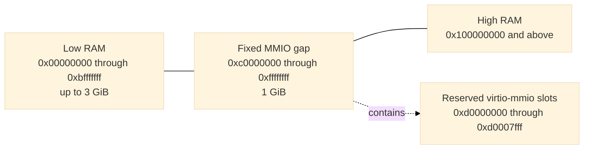

# Cold boot

[Design index](../design.md)

## Xen PVH loader

The dedicated loader in [`vm/loader/src/pvh.rs`](../../openvmm/vm/loader/src/pvh.rs)
treats the kernel, initramfs, command line, and all guest addresses as
untrusted. It:

1. requires a little-endian ELF64 image for `EM_X86_64`;
2. validates every program-header range with checked arithmetic;
3. loads nonempty, nonoverlapping `PT_LOAD` segments at `p_paddr` and zeros
   their BSS tails;
4. finds exactly one Xen `XEN_ELFNOTE_PHYS32_ENTRY` note and verifies that its
   32-bit physical entry lies in a loaded segment;
5. places an optional initramfs, page-aligned, at the top of low RAM;
6. builds Xen version-1 `hvm_start_info`, a RAM-only memory map, and the fixed
   MP and ACPI platform metadata; and
7. enters the kernel in flat 32-bit protected mode with paging disabled and
   `RBX` pointing to the start-info structure.

The loader does not synthesize a Linux zero page, page tables, SMBIOS, a device
tree, or a firmware execution environment. The worker does build a minimal
RSDP, MADT, and DSDT for the direct-boot guest. The loader places them below the
command line and publishes the RSDP through `hvm_start_info.rsdp_paddr`. It also
writes Intel MP 1.4 tables for every advertised processor, the ISA bus, IOAPIC,
and legacy IRQ routing. Virtio IRQs are edge-triggered and therefore are not
marked as level-triggered in the MP table or MADT; fixed device discovery remains command-line
based rather than firmware-enumerated.

The fixed boot reservations are:

| Guest physical address | Contents |
| ---: | --- |
| `0x0000..0x000f` | Intel MP 1.4 floating pointer |
| `0x0400...` | MP configuration table (`180 + 20 * vCPU count` bytes) |
| `0x800..0x81f` | Four-entry bootstrap GDT |
| `0x820` | Empty IDT |
| `0x6000` | Xen `hvm_start_info` |
| `0x6040` | Optional initramfs module entry |
| `0x7000` | Xen PVH RAM map |
| `0x8000..0x8fff` | ACPI RSDP page |
| `0x9000..0x1ffff` | Bounded ACPI table region |
| `0x20000` | NUL-terminated kernel command line |
| `0x30000..0x30fff` | Shared virtio interrupt-status page |
| `0x100000` and above | Kernel load segments and ordinary RAM |

The initial state has `RIP` set to the Xen physical entry, `RBX=0x6000`,
`RSP=0`, `RFLAGS=2`, `CR0.PE=1`, and `CR3=CR4=EFER=0`. Code and data segments
are flat 32-bit segments, and the GDT, IDT, and TSS descriptors point at the
fixed bootstrap structures.

## Memory layout

Guest RAM is continuous in file offset but split in guest physical address:



Active RAM occupies `[0, min(size, 3 GiB))`. Memory displaced by the fixed
one-GiB MMIO aperture resumes at 4 GiB. There is no high-MMIO or VTL2 aperture.
The central OpenVMM layout engine owns this split; the profile does not
maintain a second allocator. The resulting active RAM ranges are also the
authoritative PVH memory map and snapshot memory-range inventory.

When capture uses `--memory-capacity`, the layout engine reserves addresses for
the full capacity before publishing only the active base-size prefix as RAM.
Consequently, selecting a larger restore target does not move the MMIO gap or
any device. The machine contract records the canonical suffix ranges that are
absent from the captured PVH map and `memory.bin`; a suffix that crosses the
three-GiB boundary is represented as separate low- and high-RAM ranges.

The fixed layout is implemented by
[`vm_manifest_builder`](../../openvmm/vmm_core/vm_manifest_builder/src/lib.rs) and
[`openvmm_core::worker::memory_layout`](../../openvmm/openvmm/openvmm_core/src/worker/memory_layout.rs).
Loader writes and DMA ranges must fit wholly inside a RAM range and may not
cross the MMIO gap or a reserved boot structure.

## Effective command line

The profile, not the caller, owns console and device-discovery tokens. The base
command line is:

```text
earlycon=xe9 console=hvc0 reboot=t panic=-1
```

When virtio-console is present, `console=hvc0` becomes `console=hvc1`; the raw
portb console remains the early console. User arguments are inserted after the
base tokens. Device-discovery tokens follow in fixed address order: network,
filesystem, boot console, sandbox blocks, and the control console when present
in an internally constructed configuration. Network and filesystem bootstrap
tokens follow device discovery.

Callers may not supply `earlycon=`, `console=`, `virtio_mmio.device=`,
`virtnet_ip=`, `virtnet_mask=`, `virtnet_gw=`, `virtnet_dns=`, `virtfs_dir=`,
`virtfs_tag=`, `virtfs_mode=`, or `nvx_snapshot_tier=` tokens. Embedded NULs are
rejected, and the complete NUL-terminated command line must fit in 64 KiB. The
same effective string and its SHA-256 digest become part of the snapshot
machine contract.
