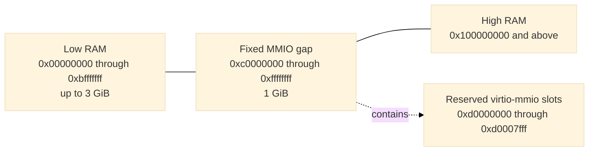

# Cold boot

[Design index](../design.md)

## Linux direct MP-table loader

The dedicated mode in
[`vm/loader/src/linux.rs`](../../openvmm/vm/loader/src/linux.rs) and the shared
builder in [`vm/loader/src/mptable.rs`](../../openvmm/vm/loader/src/mptable.rs)
treat the kernel, initramfs, command line, topology, reservations, and guest
addresses as untrusted. It:

1. requires a little-endian uncompressed ELF64 image for `EM_X86_64`;
2. loads validated `PT_LOAD` segments at their physical addresses and zeros
   BSS tails;
3. places an optional page-aligned initramfs after the kernel;
4. builds Intel MP 1.4 processor, ISA bus, IOAPIC, and legacy IRQ entries;
5. builds Linux `boot_params` with the canonical e820 RAM and reservation map;
6. imports a bootstrap GDT and 4-GiB identity page table; and
7. enters the ELF kernel in long mode with paging enabled and `RSI` pointing
   to `boot_params`.

No Xen notes, Xen start-info structures, ACPI tables, RSDP, SMBIOS data,
device tree, or firmware execution environment are parsed or imported. Fixed
virtio devices remain discoverable only through profile-owned command-line
tokens.

The fixed boot reservations are:

| Guest physical address | Contents |
| ---: | --- |
| `0x0000..0x000f` | Intel MP 1.4 floating pointer |
| `0x0400...` | MP configuration table (`180 + 20 * vCPU count` bytes) |
| `0x1000` | Linux-direct bootstrap GDT |
| `0x2000` | Linux `boot_params` zero page |
| `0x4000..0x17fff` | Linux-direct identity page tables |
| `0x20000..0x2ffff` | NUL-terminated kernel command line |
| `0x30000..0x30fff` | Shared virtio interrupt-status page |
| `0x100000` and above | Kernel load segments and ordinary RAM |

The initial state has `RIP` set to the ELF entry, `RSI=0x2000`, `CR3=0x4000`,
`CR0.PE=CR0.PG=1`, `CR4.PAE=1`, and long mode enabled in `EFER`. The zero page
leaves `acpi_rsdp_addr` zero. Its e820 map reserves the live status page and
ISA hole, splits low and high RAM around the fixed 3-to-4-GiB MMIO aperture,
and never reports that aperture as RAM.

## Memory layout

Guest RAM is continuous in file offset but split in guest physical address:



Active RAM occupies `[0, min(size, 3 GiB))`. Memory displaced by the fixed
one-GiB MMIO aperture resumes at 4 GiB. There is no high-MMIO or VTL2 aperture.
The central OpenVMM layout engine owns this split; the profile does not
maintain a second allocator. The resulting active RAM ranges are also the authoritative Linux e820 and
snapshot memory-range inventory.

When capture uses `--memory-capacity`, the layout engine reserves addresses for
the full capacity before publishing only the active base-size prefix as RAM.
Consequently, selecting a larger restore target does not move the MMIO gap or
any device. The machine contract records the canonical suffix ranges that are absent from
the captured e820 RAM map and `memory.bin`; a suffix that crosses the
three-GiB boundary is represented as separate low- and high-RAM ranges.

The fixed layout is implemented by
[`vm_manifest_builder`](../../openvmm/vmm_core/vm_manifest_builder/src/lib.rs) and
[`openvmm_core::worker::memory_layout`](../../openvmm/openvmm/openvmm_core/src/worker/memory_layout.rs).
Loader writes and DMA ranges must fit wholly inside a RAM range and may not
cross the MMIO gap or a reserved boot structure.

## Effective command line

The profile, not the caller, owns console and device-discovery tokens. The base
command line is:

```text
earlycon=xe9 console=hvc0 reboot=t panic=-1
```

OpenVMM appends the profile-owned `nr_cpus=<capacity>` token for fresh boots so
Linux sizes processor state to the validated 1, 2, 4, or 8-vCPU topology.

When virtio-console is present, `console=hvc0` becomes `console=hvc1`; the raw
portb console remains the early console. User arguments are inserted after the
base tokens. Device-discovery tokens follow in fixed address order: network,
filesystem, boot console, sandbox blocks, and the control console when present
in an internally constructed configuration. Network and filesystem bootstrap
tokens follow device discovery.

Callers may not supply `earlycon=`, `console=`, `virtio_mmio.device=`,
`virtnet_ip=`, `virtnet_mask=`, `virtnet_gw=`, `virtnet_dns=`, `virtfs_dir=`,
`virtfs_tag=`, `virtfs_mode=`, or `nvx_snapshot_tier=` tokens. Embedded NULs are
rejected, and the complete NUL-terminated command line must fit in 64 KiB. The
same effective string and its SHA-256 digest become part of the snapshot
machine contract.
