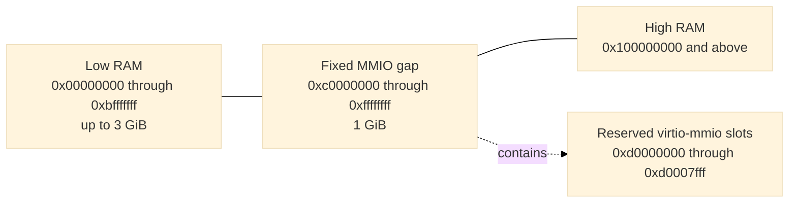

# Cold boot

[Design index](../design.md)

## Linux direct MP-table loader

The dedicated Linux direct MP-table loader and its shared MP-table builder
treat the kernel, initramfs, command line, topology, reservations, and guest
addresses as untrusted. The loader:

1. requires a little-endian uncompressed ELF64 image for `EM_X86_64` and
   rejects a bzImage;
2. loads validated `PT_LOAD` segments at their physical addresses and zeros
   BSS tails;
3. places an optional initramfs at the first 2-MiB boundary after the kernel;
4. builds Intel MP 1.4 processor, ISA bus, IOAPIC, and legacy IRQ entries;
5. builds Linux `boot_params` with the canonical e820 RAM and reservation map;
6. imports a bootstrap GDT and 4-GiB identity page table; and
7. enters the ELF kernel in long mode with paging enabled and `RSI` pointing
   to `boot_params`.

No Xen notes, Xen start-info structures, ACPI tables, RSDP, SMBIOS data,
device tree, or firmware execution environment are parsed or imported. Fixed
virtio devices remain discoverable only through profile-owned command-line
tokens.

The fixed boot reservations are:

| Guest physical address | Contents |
| ---: | --- |
| `0x0000..0x000f` | Intel MP 1.4 floating pointer |
| `0x0400...` | MP configuration table (`180 + 20 * vCPU count` bytes) |
| `0x1000` | Linux-direct bootstrap GDT |
| `0x2000` | Linux `boot_params` zero page |
| `0x4000..0x9fff` | Linux-direct 4-GiB identity page tables: one PML4, one PDPT, and four 2-MiB-page directories |
| `0x20000..0x2ffff` | NUL-terminated kernel command line |
| `0x30000..0x30fff` | Shared virtio interrupt-status page |
| `0x100000` and above | Kernel load segments and ordinary RAM |

The initial state has `RIP` set to the ELF entry, `RSI=0x2000`, `CR3=0x4000`,
`CR0.PE=CR0.PG=1`, `CR4.PAE=1`, and long mode enabled in `EFER`. The zero page
leaves `acpi_rsdp_addr` zero. Its e820 map reserves the live status page and
ISA hole, splits low and high RAM around the fixed 3-to-4-GiB MMIO aperture,
and never reports that aperture as RAM.

## Memory layout

Guest RAM is continuous in file offset but split in guest physical address:


```mermaid
%%{init: {"theme": "base", "themeVariables": {"background": "#ffffff"}}}%%
flowchart LR
   Low["Low RAM<br/>0x00000000 through 0xbfffffff<br/>up to 3 GiB"]
   Gap["Fixed MMIO gap<br/>0xc0000000 through 0xffffffff<br/>1 GiB"]
   High["High RAM<br/>0x100000000 and above"]
   Slots["Reserved virtio-mmio slots<br/>0xd0000000 through 0xd0007fff"]

   Low --- Gap
   Gap --- High
   Gap -. contains .-> Slots
```

Active RAM occupies `[0, min(size, 3 GiB))`. Memory displaced by the fixed
one-GiB MMIO aperture resumes at 4 GiB. There is no high-MMIO or VTL2 aperture.
The central OpenVMM memory-layout engine owns this split, using the base
chipset's fixed MMIO reservation; the profile does not maintain a second
allocator. The resulting active RAM ranges are also the authoritative Linux
e820 and snapshot memory-range inventory.

When capture uses `--memory-capacity`, the layout engine reserves addresses for
the full capacity before publishing only the active base-size prefix as RAM.
Consequently, selecting a larger restore target does not move the MMIO gap or
any device. The machine contract records the canonical suffix ranges that are
absent from the captured e820 RAM map and `memory.bin`; a suffix that crosses
the three-GiB boundary is represented as separate low- and high-RAM ranges.

Loader writes and DMA ranges must fit wholly inside a RAM range and may not
cross the MMIO gap or a reserved boot structure.

## Effective command line

The profile, not the caller, owns console, device-discovery, and host policy
tokens. The base command line is:

```text
earlycon=xe9 console=hvc0 reboot=t panic=-1
```

When virtio-console is present, `console=hvc0` becomes `console=hvc1`; the raw
portb console remains the early console. User arguments follow the base
tokens. A fresh boot then appends host-owned tokens in this order:

1. `nr_cpus=<capacity>`, so Linux sizes processor state to the validated 1,
   2, 4, or 8-vCPU topology;
2. the optional fixed workload identity (`nvx_workload_uid=` and
   `nvx_workload_gid=`) and workload lifecycle (`nvx_lifecycle=`);
3. `nvx_snapshot_tier=<tier>` for a capture with sandbox blocks;
4. device-discovery tokens in fixed address order: network, filesystem, boot
   console, sandbox blocks, and the control console followed by
   `nvx_control_tty=hvc2`; and
5. network bootstrap tokens, including gateway DNS only when the egress
   policy permits it, followed by filesystem bootstrap tokens for an active
   HostFs export.

The command line carries no clock parameter: the guest reads its TSC and
LAPIC rates from the [time ABI](time-abi.md#rates) MSRs, and a
`tsc_early_khz=` or `lapic_timer_hz=` token, from the caller or a snapshot,
fails with `E_CMDLINE_CLOCK_TOKEN`.

Callers may not supply `earlycon=`, `console=`, `virtio_mmio.device=`,
`virtnet_ip=`, `virtnet_mask=`, `virtnet_gw=`, `virtnet_dns=`, `virtfs_dir=`,
`virtfs_tag=`, `virtfs_mode=`, `nvx_snapshot_tier=`, `nr_cpus=`,
`nvx_workload_uid=`, `nvx_workload_gid=`, or `nvx_lifecycle=` tokens. A
machine with a control console also applies the
[control-console command-line rules](machine-and-device-abi.md#control-console).
Embedded NULs are rejected, and the complete NUL-terminated command line must
fit in 64 KiB. The same effective string and its SHA-256 digest become part of
the snapshot machine contract; a restore reuses that string verbatim and
appends no tokens.
