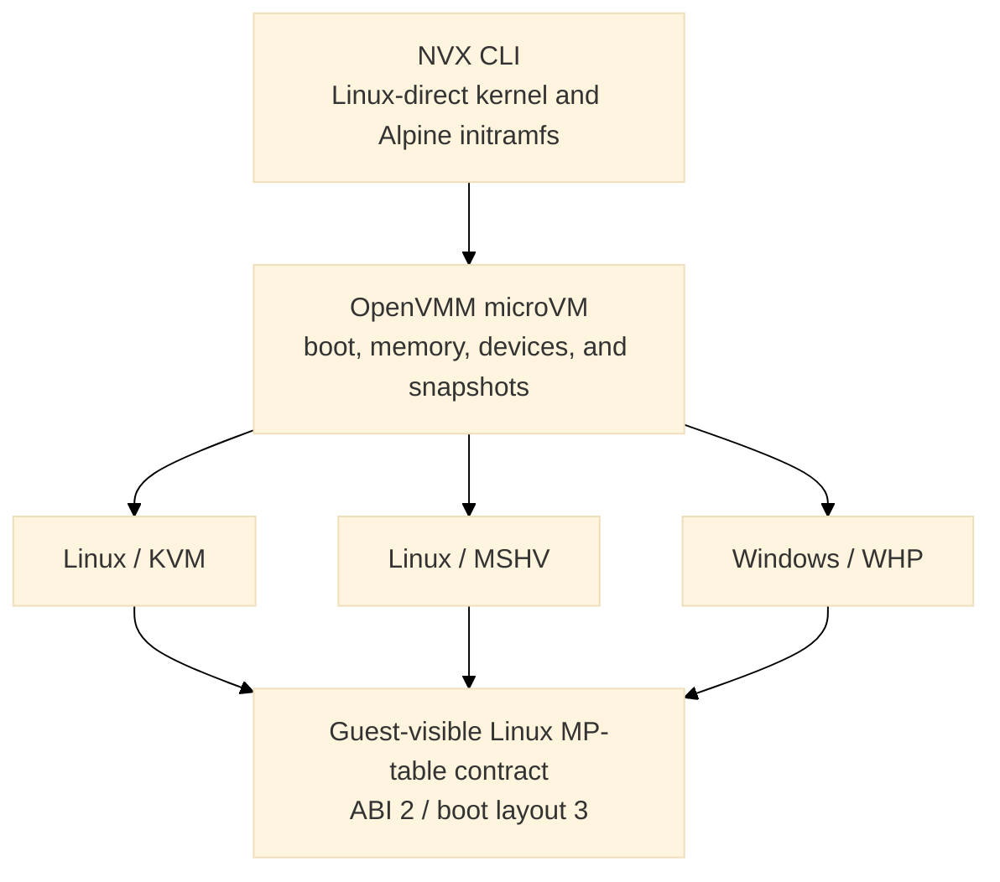

# Goals

[Design index](../design.md)

NVX provides a small, versioned virtual machine for running an x86-64 Linux
guest without firmware or a PC platform. Its design has four primary goals:

- boot the same uncompressed Linux-direct kernel and Alpine initramfs on Linux and
  Windows;
- keep the guest-visible machine independent of the selected hypervisor;
- expose only a fixed, allowlisted set of devices; and
- capture a running VM into immutable artifacts that can be restored in a new
  process without serializing host handles.

The implemented runtime profile is `MachineProfile::Microvm`, selected only by
`--machine microvm`. It uses fixed sandbox layer and scratch roles,
deterministic SMP topology, and shared virtio-mmio interrupt status with
edge-triggered delivery. Snapshot manifests retain microVM ABI value 2 and
Linux-direct boot-layout value 3, optional restore-time RAM expansion uses machine-contract
capability version 1, and TTRPC uses numeric machine-profile value 2. KVM and
MSHV are supported on Linux and WHP is supported on Windows.
Hypervisor-specific code provides partition creation, vCPU execution,
interrupt injection, and host resource integration. The machine profile owns
the boot protocol, memory map, device topology, command line, and snapshot
compatibility contract.



The public profile and ABI constants live in
[`openvmm_defs::config`](../../openvmm/openvmm/openvmm_defs/src/config.rs). The
profile is selected independently from the hypervisor, for example:

```text
openvmm --machine microvm --hypervisor kvm  --kernel vmlinux --initrd initramfs.cpio
openvmm --machine microvm --hypervisor mshv --kernel vmlinux --initrd initramfs.cpio
openvmm --machine microvm --hypervisor whp  --kernel vmlinux --initrd initramfs.cpio
openvmm --machine microvm --hypervisor kvm --kernel vmlinux --initrd initramfs.cpio \
   --microvm-sandbox-block distro:file:distro.erofs,ro \
   --microvm-sandbox-block scratch:file:scratch.raw
openvmm --machine microvm --processors 8 --hypervisor kvm \
   --kernel vmlinux --initrd initramfs.cpio
```

The supported user entry point in this repository is `python scripts/nvx.py`;
see [Run](../run.md) for complete commands and host-specific options.
