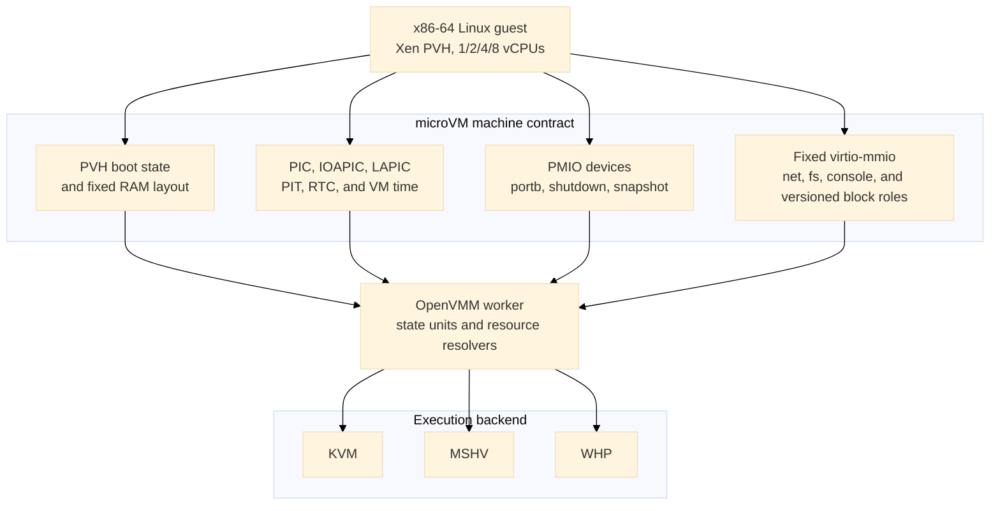

# Machine and device ABI

[Design index](../design.md)

## Architectural devices

`BaseChipsetType::Microvm` builds the following allowlist:

- generic PIC and IOAPIC;
- the selected hypervisor's LAPIC;
- i8253 PIT on IRQ 0;
- generic programmable CMOS RTC anchored to UTC;
- raw bidirectional portb;
- status-carrying shutdown port; and
- guest snapshot-request port.

The RTC defaults to BCD, 24-hour fields with status B `0x02`. PIC, IOAPIC, PIT,
RTC, LAPIC, and VM time use common OpenVMM device and
state-unit machinery on every backend. IOAPIC saved state includes the
asserted level of every input line and reevaluates routing after restore, so a
level interrupt is neither lost nor treated as an edge while reconstructing
the backend. Serial UARTs, debugcon, Hyper-V power management, gameport, PCI,
firmware helpers, and standard-PC missing-port shims are absent.

## PMIO devices

| Port | Device | Behavior |
| ---: | --- | --- |
| `0xe9` | portb data | Raw byte input and output; reads consume one pending byte and zero-fill the remaining access width. |
| `0xea` | portb status | Bit 0 reports pending host input, bit 1 reports a fresh restore packet, bit 2 reports a processor target, bit 3 reports a version-3 memory target, bit 4 reports one or more memory-expansion ranges, and bit 5 reports the fixed generation-ID selector. Writing `0xa5` after restore selects the one-time restore packet. Writing `0xa6` selects the current 16-byte generation ID; it may be selected repeatedly and remains stable for the lifetime of one VM process. |
| `0x604` | shutdown | The first output byte becomes the process status carried with the VM power-off request. Reads return all ones. |
| `0x605` | snapshot request | Reads return all ones. Writes are coalesced and routed asynchronously to the capture controller. Zero requests fresh scratch and a nonzero first byte requests paired scratch. |

The portb implementation is in
[`vm/devices/chipset/src/microvm.rs`](../../openvmm/vm/devices/chipset/src/microvm.rs).
Its receive and transmit buffers are each bounded at one MiB. Output overflow
drops the newest bytes and emits a rate-limited warning; input applies
backpressure by stopping host reads when its buffer is full. Pending bytes are
saved so capture does not silently lose VMM-owned I/O.

Guest-requested process exit drains the portb endpoint and, when present, its
host stdout relay before reporting completion. The combined drain has a
five-second deadline. Success preserves the guest's exit status; endpoint,
relay, or timeout failures become process-exit errors instead of silently
discarding final output. This is a portb/host-relay guarantee, not a general
drain of every virtio-console endpoint. The controller and relay implementation
are in
[`openvmm_entry/src/vm_controller.rs`](../../openvmm/openvmm/openvmm_entry/src/vm_controller.rs)
and
[`openvmm_entry/src/microvm_output.rs`](../../openvmm/openvmm/openvmm_entry/src/microvm_output.rs).

A snapshot-port write with no configured destination completes normally and
the guest continues. With a destination, the device permits at most one pending
transaction and defers completion long enough for the controller to establish
the exact post-`out` capture boundary. Repeated writes are coalesced. The PMIO
callback itself never pauses vCPUs, drains devices, hashes RAM, or writes files.
The scratch policy travels with the deferred boundary request.

## Fixed virtio-mmio transport

All eight fixed address slots are reserved, including the dedicated control
console at `0xd0007000..0xd0007fff` on IRQ 3 (shared status at `0x3001c`).
Snapshot-capable builds instantiate the virtio-fs transport even without a host
attachment so it is discoverable before capture. Other optional devices are
instantiated only when active. The control slot is activated by an
authenticated local endpoint on Linux or Windows.
Every device uses virtio-mmio, is omitted from ACPI, and has packed-ring support
masked.

| Device | Stable identity | MMIO range | IRQ | Availability |
| --- | --- | ---: | ---: | --- |
| virtio-net | `net:microvm0` | `0xd0000000..0xd0000fff` | KVM/MSHV 10, WHP 5 | Optional |
| virtio-fs | `fs:microvm0` | `0xd0001000..0xd0001fff` | 6 | Reserved dormant slot; HostFs optional |
| virtio-console | `console:microvm-virtio0` | `0xd0002000..0xd0002fff` | 7 | Optional |
| `distro` virtio-blk | `blk:sandbox:distro` | `0xd0003000..0xd0003fff` | 4 | Optional read-only role |
| `runtime` virtio-blk | `blk:sandbox:runtime` | `0xd0004000..0xd0004fff` | 12 | Optional read-only role |
| `custom` virtio-blk | `blk:sandbox:custom` | `0xd0005000..0xd0005fff` | 9 | Optional read-only role |
| `scratch` virtio-blk | `blk:sandbox:scratch` | `0xd0006000..0xd0006fff` | 11 | Required writable final role when blocks are present |
| Control virtio-console | `console:microvm-control0` | `0xd0007000..0xd0007fff` | 3 | Optional authenticated local endpoint |

Explicit placement metadata bypasses the standard sequential MMIO allocator.
The worker validates the complete device count, kind, bus, address, IRQ, and
feature policy before resolving devices.

`--microvm-sandbox-block ROLE:DISK` assigns each attachment by
role rather than option order:

| Role | MMIO range | IRQ | Access |
| --- | ---: | ---: | --- |
| `distro` | `0xd0003000..0xd0003fff` | 4 | Read-only |
| `runtime` | `0xd0004000..0xd0004fff` | 12 | Read-only |
| `custom` | `0xd0005000..0xd0005fff` | 9 | Read-only |
| `scratch` | `0xd0006000..0xd0006fff` | 11 | Writable |

Roles must be unique and supplied in fixed order; omitted lower-layer roles
leave their slots empty, and any nonempty topology ends with scratch. All four
block IRQs use active-high edge delivery. IRQ 12 avoids the RTC's exclusive
IRQ 8.

The microVM keeps every fixed MMIO address and IRQ number and uses active-high edge
delivery for dedicated virtio IRQs. One little-endian, naturally aligned `u32`
per fixed slot resides in the reserved shared-status page:

| Slot | Status GPA |
| --- | ---: |
| virtio-net | `0x30000` |
| virtio-fs | `0x30004` |
| virtio-console | `0x30008` |
| `distro` block | `0x3000c` |
| `runtime` block | `0x30010` |
| `custom` block | `0x30014` |
| `scratch` block | `0x30018` |
| Control virtio-console | `0x3001c` |

OpenVMM publishes config-change and used-buffer bits with a sequentially
consistent compare-exchange loop. It pulses the device IRQ only when the old
word is zero. The specialized Linux driver consumes all pending bits with a
sequentially consistent `xchg` to zero, so steady-state handling performs no
interrupt-status read or interrupt-acknowledgement MMIO access. A host OR that
races the exchange is either included in the exchanged value or observes zero,
stores the bit, and emits a new edge. Device reset and teardown clear the word.
Snapshot quiesce saves the pending value in transport state; restore writes it
back without replaying an edge, and the machine contract records the interrupt
mode, page GPA, and page size.

### Block

Block devices are routed directly to virtio-mmio rather than VPCI. Packed rings
are unavailable. Each block has a stable role, MMIO address, IRQ, access mode, and
fixed feature mask. Its snapshot contract records the role, read-only flag,
logical length, logical and physical block sizes, and identity policy. Each
consumed external read-only layer is identified by SHA-256 and must be supplied
again on restore. Platform-tier layers are recorded as unbound because image
binding has not been consumed; restore may supply different same-geometry
layers. Writable scratch uses one of two policies:

- **paired**: capture publishes `scratch.img` with its exact length and SHA-256;
   each restore verifies it and creates a process-private writable copy;
- **fresh**: capture occurs before scratch is mounted, publishes no scratch
   artifact, and restore requires a new writable file with matching geometry.

Virtio transport and queue progress are saved with the other device state.
Stopping a queue prevents new descriptor intake and drains every accepted I/O
to one used-ring completion under the bounded snapshot quiesce timeout. The
controller flushes the exact scratch handle and copies it only after that drain.

### Console

The optional console is the standard single-port virtio-console device with
two split queues. Host RX accepted by the device and partial guest TX progress
are device-private saved state, so a descriptor is not replayed from byte zero
after restore. Native sockets and handles are not serialized. A listener is
recreated according to its recorded policy. Client reconnects require an
explicitly approved restore-time attachment and have a five-second timeout;
inherited attachments must also be supplied again rather than serialized.

### Control console reservation

The dedicated control console reuses the single-port virtio-console device but
has a distinct resource ID (`virtio-control-console`), stable attachment ID
(`console:microvm-control0`), MMIO slot, IRQ, shared-status word, and saved-state
inventory. The configuration and snapshot helpers support this second console
without changing the boot console's identity or placement. A control console
requires the boot virtio-console, making its guest tty `hvc2`; the profile owns
the identifying `nvx_control_tty=hvc2` token.

The internal control-console command-line builder rejects caller-supplied
control-tty and driver-probe-order tokens, including kernel-equivalent
hyphenated spellings, as well as quotes and the `--` delimiter. These rules
prevent guest tty discovery from being redirected by command-line parsing.
Boot-only command lines retain their existing behavior.

The internal control attachment helper accepts only local `listen=...`,
`connect=...`, or disconnected `none` endpoints, not TCP or inherited stdio.
Linux uses Unix sockets and Windows uses named pipes. A saved listener may be
recreated at a fresh private restore-time path, but its stable attachment ID,
attachment kind, backend kind, reconnect policy, required flag, length, and
timeout remain exact. A saved `connect` endpoint retains its exact identity and
requires explicit restore-time approval; `none` remains disconnected. These
restrictions are groundwork for the broker, not a substitute for its
authentication.

This is transport and lifecycle groundwork, not an enabled agent protocol.
The CLI has no public activation option, and CLI and TTRPC restore reject a
manifest carrying a control-console device or attachment before authenticated
broker activation exists. Reservation alone does not expose a host endpoint.
See the checks in
[`openvmm_entry/src/lib.rs`](../../openvmm/openvmm/openvmm_entry/src/lib.rs) and
[`openvmm_entry/src/ttrpc/mod.rs`](../../openvmm/openvmm/openvmm_entry/src/ttrpc/mod.rs).

### Network

The optional NIC has one RX/TX queue pair and an exact feature mask:
the MAC-address feature and virtio version 1.
`--net IPv4/prefix --network-profile portable` accepts prefixes `/1` through
`/30`, derives the first usable address as the gateway, and derives
deterministic guest and gateway MAC addresses from the final three IPv4
octets. The profile is mandatory and selects the same in-process Consomme data
plane on KVM, MSHV, and WHP.

The portable profile provides gateway DNS over UDP and TCP, ICMP echo,
outbound TCP and UDP, deterministic rejection of fragmented IPv4 packets, and
bounded flow, DNS, buffer, and packet-queue state. It applies one canonical
egress policy before externally visible transmission:

- allow only listed IPv4 hosts or CIDRs;
- allow IPv4 except listed hosts or CIDRs; or
- allow only exact IPv4 TCP endpoints; or
- combine canonical IPv4/CIDR allow and deny rules with optional TCP or UDP
  destination ports and deny precedence.

The legacy modes are mutually exclusive. The generic rule mode requires an
explicit default action and fails closed for malformed or fragmented
port-specific traffic. The snapshot records the profile, network identity, and
policy digest. Restore reconstructs a fresh endpoint and requires the profile
and policy again; native sockets, DNS requests, and flow objects are never
serialized.
Host-loopback allow maps the guest gateway to host loopback and may bind
explicit localhost TCP/UDP forwards into the guest. Deny blocks both general
gateway socket access and all forwards. One exact gateway TCP proxy endpoint
may remain available and is bound into the policy digest; live forward sockets
are not snapshot attachments.
Capture quiesces the endpoint, drains completion ownership, and requires the
saved queues to contain no unrepresented RX or TX packets. It then saves the
queue lifecycle, negotiated features, link state, and endpoint generation.
Arbitrary in-flight packet payloads are not serialized. Pre-capture queued
packets are not replayed, old TCP/UDP/ICMP/DNS state is invalidated, and new
traffic must establish fresh post-restore flows.

### Filesystem

The filesystem slot is a no-DAX virtio-fs device with tag `microvm`, one
high-priority queue, one request queue, direct I/O, and zero guest cache
lifetimes. Without `--mount`, it has no HostFs backend or active filesystem
policy but remains guest-discoverable. Its explicit profile rejects SectionFs,
Aggregate, alternate tags, extra queues, shared-memory windows, and PCI
transport.
Read-only mode rejects mutation in the host device before invoking host
filesystem operations; read-write mode exposes only the supported common host
contract.
Denied host paths are canonicalized into a bounded, non-overlapping relative
set and enforced before HostFs operations. Prefix checks hide complete
subtrees, while denied root device/inode identities block hard-link, junction,
and bind-mount aliases. The policy is unchanged by a second guest mount.

The exported directory is external live state, not part of the VM snapshot.
An active capture saves its exact canonical host path, denied-path set, FUSE negotiation, node
and handle allocation, aliases, lookup counts, directory snapshots and cookies,
and the identities needed to reopen objects. Restore requires the same path,
target, mode, denied-path set, root identity, and reopenable objects. A dormant capture instead
saves explicit unattached state and may restore with no attachment or bind a
new HostFs backend. The resumed guest then mounts tag `microvm` explicitly;
the cold-boot mount hook has already run. Snapshots without this capability
cannot add an attachment. Native file descriptors and Windows handles are not
serialized.
