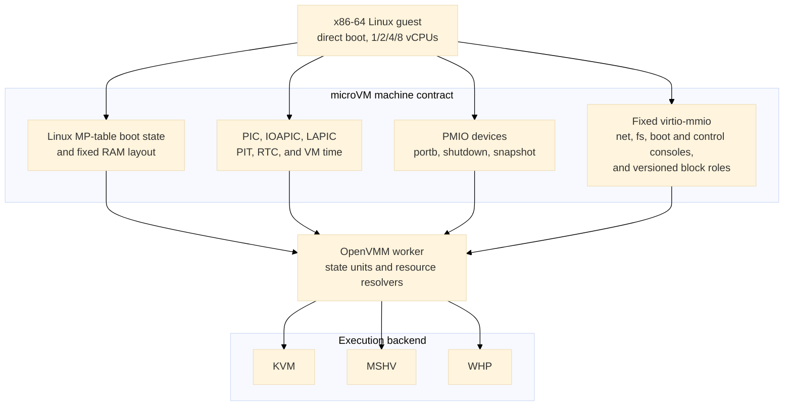

# Machine and device ABI

[Design index](../design.md)

## Architectural devices

The microVM base chipset contains exactly this allowlist:

- generic PIC and IOAPIC;
- the selected hypervisor's LAPIC;
- i8253 PIT on IRQ 0;
- generic programmable CMOS RTC anchored to UTC;
- raw bidirectional portb;
- status-carrying shutdown port; and
- guest snapshot-request port.

The RTC defaults to BCD, 24-hour fields with status B `0x02`. PIC, IOAPIC, PIT,
RTC, LAPIC, and VM time use common OpenVMM device and
state-unit machinery on every backend. IOAPIC saved state includes the
asserted level of every input line and reevaluates routing after restore, so a
level interrupt is neither lost nor treated as an edge while reconstructing
the backend. Serial UARTs, debugcon, Hyper-V power management, gameport, PCI,
firmware helpers, and standard-PC missing-port shims are absent.

The guest's clocks follow [NVX time ABI v1](time-abi.md) on every backend: a
minimal Hyper-V identity whose MSRs declare the TSC and LAPIC rates, served by
the `time-abi` state unit; the TSC as the only clocksource; the LAPIC timer in
one-shot mode at the backend's fixed rate (1 GHz on KVM, 200 MHz on MSHV and
WHP); and a PIT that the guest disables at boot. Capture rejects a periodic or
TSC-deadline LAPIC timer and a periodically counting PIT channel 0.

```mermaid
%%{init: {"theme": "base", "themeVariables": {"background": "#ffffff"}}}%%
flowchart TB
   Guest["x86-64 Linux guest<br/>direct boot, 1/2/4/8 vCPUs"]

   subgraph Abi["microVM machine contract"]
      direction LR
      Boot["Linux MP-table boot state<br/>and fixed RAM layout"]
      Interrupts["PIC, IOAPIC, LAPIC<br/>PIT, RTC, and VM time"]
      Pmio["PMIO devices<br/>portb, shutdown, snapshot"]
      Virtio["Fixed virtio-mmio<br/>net, fs, boot and control consoles,<br/>and versioned block roles"]
   end

   Common["OpenVMM worker<br/>state units and resource resolvers"]

   subgraph Backends["Execution backend"]
      direction LR
      KvmBackend["KVM"]
      MshvBackend["MSHV"]
      WhpBackend["WHP"]
   end

   Guest --> Boot
   Guest --> Interrupts
   Guest --> Pmio
   Guest --> Virtio
   Boot --> Common
   Interrupts --> Common
   Pmio --> Common
   Virtio --> Common
   Common --> KvmBackend
   Common --> MshvBackend
   Common --> WhpBackend
```

## PMIO devices

| Port | Device | Behavior |
| ---: | --- | --- |
| `0xe9` | portb data | Raw byte input and output; console reads consume one pending byte and zero-fill the remaining access width. With the restore packet or generation ID selected, a 1-, 2-, or 4-byte read returns that many bytes of the record, zero-filled past its end. |
| `0xea` | portb status | Bit 0 reports pending host input, bit 1 reports a fresh restore packet, bit 2 reports a processor target, bit 3 reports a memory target, bit 4 reports one or more memory-expansion ranges, bit 5 reports the fixed generation-ID selector, and bit 6 reports the time-sample window, which always exists. Writing `0xa5` after restore selects the one-time [restore packet](time-abi.md#restore-packet). Writing `0xa6` selects the current 16-byte generation ID; it may be selected repeatedly and remains stable for the lifetime of one VM process. Writing `0xa7` latches a fresh [time sample](time-abi.md#time-sample) into the window without changing the `0xe9` selection. |
| `0xeb` | portb time window | A 1-, 2-, or 4-byte read returns the next bytes of the latched time sample, zero-filled past its end or when none is latched. The window is not saved state. |
| `0x604` | shutdown | The first output byte becomes the process status carried with the VM power-off request. Reads return all ones. |
| `0x605` | snapshot request | Reads return all ones. Writes are coalesced and routed asynchronously to the capture controller. Zero requests fresh scratch and a nonzero first byte requests paired scratch. |

The portb receive and transmit buffers are each bounded at one MiB. Output
overflow drops the newest bytes and emits a rate-limited warning; input applies
backpressure by stopping host reads when its buffer is full. Pending bytes are
saved so capture does not silently lose VMM-owned I/O. While host input is
gated for a snapshot boundary or post-restore repair, portb stops reading its
host endpoint, returns zero for console data reads, and clears the
input-available status bit; guest output, the generation ID, any restore
packet, and the time-sample window remain available.

Guest-requested process exit drains the portb endpoint and, when present, its
host stdout relay before reporting completion. The combined drain has a
five-second deadline. Success preserves the guest's exit status; endpoint,
relay, or timeout failures become process-exit errors instead of silently
discarding final output. This is a portb/host-relay guarantee, not a general
drain of every virtio-console endpoint. Under the management RPC, a zero guest
status completes a pending wait and stops the server cleanly, while a nonzero
status or failed drain fails the pending wait and ends the server with an
error.

A snapshot-port write with no configured destination completes normally and
the guest continues. With a destination, the device permits at most one pending
transaction and defers completion long enough for the controller to establish
the exact post-`out` capture boundary. Repeated writes are coalesced. The PMIO
callback itself never pauses vCPUs, drains devices, hashes RAM, or writes files.
The scratch policy travels with the deferred boundary request. After a gated
restore, the same write acknowledges completion of guest repair.

## Fixed virtio-mmio transport

All eight fixed address slots are reserved, including the dedicated control
console at `0xd0007000..0xd0007fff` on IRQ 3 (shared status at `0x3001c`).
The window at `0xd0008000..0xd0008fff`, IRQ 13, and the shared-status word at
`0x30020` held a second virtio-fs slot in earlier releases; they are unused, and
a snapshot that recorded that slot no longer restores.
Every microVM cold-booted from the command line or the management RPC
instantiates the virtio-fs slot, so it is discoverable before capture even
without a host attachment; a restore keeps the slot only when the snapshot
recorded it. Several shares are children of one aggregate attachment on that
slot. Other optional devices are instantiated only when configured.
The control slot is instantiated for a control console, either a live
authenticated local endpoint on Linux or Windows or an explicitly disconnected
console. Every device uses virtio-mmio, is discovered only through
profile-owned command-line tokens, and has packed-ring support masked.
The MP table routes only the 16 ISA interrupts, and no device uses IRQ 13 on
KVM, MSHV, or WHP.

| Device | Stable identity | MMIO range | IRQ | Availability |
| --- | --- | ---: | ---: | --- |
| virtio-net | `net:microvm0` | `0xd0000000..0xd0000fff` | KVM/MSHV 10, WHP 5 | Optional |
| virtio-fs | `fs:microvm0` | `0xd0001000..0xd0001fff` | 6 | Reserved dormant slot; HostFs optional |
| virtio-console | `console:microvm-virtio0` | `0xd0002000..0xd0002fff` | 7 | Optional |
| `distro` virtio-blk | `blk:sandbox:distro` | `0xd0003000..0xd0003fff` | 4 | Optional read-only role |
| `runtime` virtio-blk | `blk:sandbox:runtime` | `0xd0004000..0xd0004fff` | 12 | Optional read-only role |
| `custom` virtio-blk | `blk:sandbox:custom` | `0xd0005000..0xd0005fff` | 9 | Optional read-only role |
| `scratch` virtio-blk | `blk:sandbox:scratch` | `0xd0006000..0xd0006fff` | 11 | Required writable final role when blocks are present |
| Control virtio-console | `console:microvm-control0` | `0xd0007000..0xd0007fff` | 3 | Optional authenticated local endpoint |

Explicit placement metadata bypasses the standard sequential MMIO allocator.
The worker validates the complete device count, kind, bus, address, IRQ, and
feature policy before resolving devices.

`--microvm-sandbox-block ROLE:DISK` assigns each attachment by
role rather than option order:

| Role | MMIO range | IRQ | Access |
| --- | ---: | ---: | --- |
| `distro` | `0xd0003000..0xd0003fff` | 4 | Read-only |
| `runtime` | `0xd0004000..0xd0004fff` | 12 | Read-only |
| `custom` | `0xd0005000..0xd0005fff` | 9 | Read-only |
| `scratch` | `0xd0006000..0xd0006fff` | 11 | Writable |

Roles must be unique and supplied in fixed order; omitted lower-layer roles
leave their slots empty, and any nonempty topology ends with scratch. All four
block IRQs use active-high edge delivery. IRQ 12 avoids the RTC's exclusive
IRQ 8.

The microVM keeps every fixed MMIO address and IRQ number and uses active-high edge
delivery for dedicated virtio IRQs. One little-endian, naturally aligned `u32`
per fixed slot resides in the reserved shared-status page:

| Slot | Status GPA |
| --- | ---: |
| virtio-net | `0x30000` |
| virtio-fs | `0x30004` |
| virtio-console | `0x30008` |
| `distro` block | `0x3000c` |
| `runtime` block | `0x30010` |
| `custom` block | `0x30014` |
| `scratch` block | `0x30018` |
| Control virtio-console | `0x3001c` |

OpenVMM publishes config-change and used-buffer bits with a sequentially
consistent compare-exchange loop. It pulses the device IRQ only when the old
word is zero. The specialized Linux driver consumes all pending bits with a
sequentially consistent `xchg` to zero, so steady-state handling performs no
interrupt-status read or interrupt-acknowledgement MMIO access. A host OR that
races the exchange is either included in the exchanged value or observes zero,
stores the bit, and emits a new edge. Device reset and teardown clear the word.
Snapshot quiesce saves the pending value in transport state; restore writes it
back without replaying an edge, and the machine contract records the interrupt
mode, page GPA, and page size.

### Block

Block devices are routed directly to virtio-mmio rather than VPCI. Packed rings
are unavailable. Each block has a stable role, MMIO address, IRQ, access mode, and
fixed feature mask. Its snapshot contract records the role, read-only flag,
logical length, logical and physical block sizes, and identity policy. Each
consumed block uses either whole-file SHA-256 or the caller-authenticated
immutable storage generation supplied at capture. Generation mode requires all
bound roles to carry the same nonzero generation and avoids content scans; the
storage controller remains responsible for binding that generation to the
exact immutable files. Platform-tier layers are recorded as unbound because
image binding has not been consumed; restore may supply different
same-geometry layers. Writable scratch uses one of two artifact policies:

- **paired**: capture publishes `scratch.img` with its exact length and selected
   identity. Restore uses the recorded `private-copy`, reflink-only
   `copy-on-write`, or single-use `direct-claimed` materialization policy;
- **fresh**: capture occurs before scratch is mounted, publishes no scratch
   artifact, and restore requires a new writable file with matching geometry.

Virtio transport and queue progress are saved with the other device state.
Stopping a queue prevents new descriptor intake and drains every accepted I/O
to one used-ring completion under the bounded snapshot quiesce timeout. The
controller flushes the exact scratch handle and copies it only after that drain.

### Console

The optional console is the standard single-port virtio-console device with
two split queues. Host RX accepted by the device and partial guest TX progress
are device-private saved state, so a descriptor is not replayed from byte zero
after restore. Native sockets and handles are not serialized.

The host attachment is a listener (a Unix socket, a named pipe, or loopback
TCP with a fixed nonzero port), a client connection, the inherited terminal,
or an explicitly disconnected endpoint that discards guest output. A listener
retains pending guest output until a client connects. The snapshot records the
attachment's stable ID, canonical endpoint identity, reconnect policy,
requiredness, and timeout. For a snapshot-capable machine, Unix sockets live
beside the snapshot directory and Windows pipes use OpenVMM's fixed microVM
pipe namespace. A saved listener may be recreated at a fresh private
restore-time endpoint, but its stable attachment ID, attachment kind, backend
kind, reconnect policy, required flag, length, and timeout remain exact.
Client reconnects retain their exact saved identity, require an explicitly
approved restore-time attachment, and have a five-second timeout; inherited
attachments must also be supplied again rather than serialized. Disconnected
attachments remain disconnected.

### Control console

The dedicated control console reuses the single-port virtio-console device but
has a distinct device and attachment kind, stable attachment ID
(`console:microvm-control0`), MMIO slot, IRQ, shared-status word, and
saved-state inventory. A fresh boot with a control console requires the boot
virtio-console, making the control device's guest tty `hvc2`; the profile owns
the identifying `nvx_control_tty=hvc2` token, and the boot console remains the
only kernel console.

When a control console is present, the command-line builder rejects
caller-supplied control-tty, driver-probe-order, and device-discovery tokens,
including kernel-equivalent hyphenated spellings, as well as quotes and the
`--` delimiter. These rules prevent guest tty discovery from being redirected
by command-line parsing. Boot-only command lines retain their existing
behavior.

The host endpoint is either a local listener or explicitly disconnected. A
live endpoint is protected in three layers:

- **Private endpoint.** On Linux, it is a Unix socket bound exclusively with
  mode `0600` inside an existing, non-symlink, owner-only directory of the
  OpenVMM user. On Windows, it is a named pipe whose protected DACL admits only
  LocalSystem and the OpenVMM user. TCP, client-connect, terminal, file,
  standard-stream, and inherited backends are rejected, and the boot and
  control endpoints must differ.
- **Peer identity.** The broker reserves its single host slot only for a peer
  whose operating-system identity is the OpenVMM user: the effective UID of
  the Unix-socket peer, or the token user SID of the process connected to the
  pipe. Any other peer is disconnected before its bytes are read.
- **Capability.** The launcher passes a random 32-byte capability through a
  prepared one-way standard-input pipe whose writers are closed before
  OpenVMM starts. The first host record must present it within a bounded
  authentication timeout, five seconds by default. The capability never
  appears in arguments, environment variables, logs, endpoint names,
  snapshots, or attachment identities. Because standard input carries it, the
  interactive console is disabled, the boot console cannot use the terminal,
  and the mode cannot be combined with the management RPC server, a console
  relay, or a paused start.

A disconnected control console uses a random capability that no client can
present.

OpenVMM brokers a frozen, versioned record stream between the guest and the
authenticated host. Every record has a fixed-size header with a magic value,
protocol version, record type, broker instance ID, epoch, direction-local
sequence, and payload length. Bootstrap attach records establish the guest and
host sides; acknowledgment, data, wait, ready, reset, authentication-error,
and credit records carry the session. Host data toward the guest is limited by
byte-counted receive credit that the guest grants. When credit is exhausted,
one complete host record may wait in a bounded pending slot, and each output
direction is bounded in records and bytes. Malformed lengths, wrong-state
records, wrong instance or epoch values, and duplicate or out-of-order
sequences fail closed. A wrong capability or an authentication timeout
detaches the client without advancing the epoch. An active host disconnect
advances the epoch, drops unstarted data and unused credit, finishes any
partially transmitted record to keep the stream aligned, and emits a reset;
the next session receives credit only from a fresh guest acknowledgment.

Snapshots record only the endpoint identity and a broker policy, either an
authenticated listener or a disconnected console, never the capability or the
peer UID or SID. Broker saved state omits queued records, host output, and
usable receive credit; restore keeps only the guest-side parser, any partially
transmitted guest record, and error counters. Restore validates the saved
endpoint and requires the launcher to request that same endpoint again with a
fresh capability. The restored broker receives a fresh instance ID, restarts at
the first epoch with a queued reset, and ignores guest records for the old
instance until the guest acknowledges the new one. The management RPC exposes
no control console and explicitly rejects restoring a snapshot that contains
one.

The control console carries the managed workload lifecycle: a host-owned
lifecycle token selects one-shot or managed operation, and managed operation
requires a fixed workload identity and a live, authenticated control console.
The workload protocol carried inside the brokered data stream belongs to the
guest agent; see
[Control protocol and checkpoint handoff](sandbox-filesystem-and-agent-architecture.md#control-protocol-and-checkpoint-handoff).

### Network

The optional NIC has one RX/TX queue pair and an exact feature mask:
the MAC-address feature and virtio version 1.
`--net IPv4/prefix --network-profile portable` accepts prefixes `/1` through
`/30`, derives the first usable address as the gateway, and derives
deterministic guest and gateway MAC addresses from the final three IPv4
octets. The profile is mandatory and selects the same in-process Consomme data
plane on KVM, MSHV, and WHP; TAP attachments are rejected for this profile.
The NIC is dual-stack: its static IPv6 identity embeds the guest and gateway
IPv4 addresses in `fd00::/96`, with a prefix of 96 plus the IPv4 prefix, so
`10.0.0.2/24` becomes `fd00::a00:2/120` behind `fd00::a00:1`. The gateway
shares the IPv4 gateway's MAC address, and the guest configures the identity
from the `virtnet_ip6=` and `virtnet_gw6=` tokens without router
advertisements, autoconfiguration from them, or duplicate address detection.
The guest kernel's EUI-64 link-local address is its only other IPv6 address,
and egress rules admit it only as the source of Neighbor Solicitations.
The `virtnet_dns=` token names the IPv4 gateway when the egress policy permits
DNS to it, and otherwise the IPv6 gateway when the policy permits DNS to that
one. The static identity advertises no routable IPv6 prefix. The snapshot records
the IPv6 identity; a snapshot whose network predates it restores IPv4-only.

The portable profile provides gateway DNS over UDP and TCP, ICMP and ICMPv6
echo, outbound TCP and UDP over IPv4 and IPv6, deterministic rejection of
fragmented IPv4 packets, IPv6 extension headers, and IPv4-mapped IPv6
destinations, and bounded flow, DNS, buffer, and packet-queue state. At most
128 TCP, 256 UDP, and 16 ICMP guest flows are active at once, and excess flows
are rejected before a host socket is created. It applies one canonical egress
policy before externally visible transmission:

- allow only listed IPv4 hosts or CIDRs;
- allow IPv4 except listed hosts or CIDRs; or
- allow only exact IPv4 TCP endpoints; or
- combine canonical IPv4 or IPv6 CIDR allow and deny rules with an optional
  TCP, UDP, or ICMP selector, optional TCP or UDP destination ports, and deny
  precedence.

The legacy modes deny all IPv6 traffic. In the generic rule mode, a rule
matches only destinations of its own address family, and the IPv6 gateway's
Neighbor Discovery is authorized like the IPv4 gateway's ARP. A policy bound to
an IPv6 identity uses canonical encoding version 4, while one restored from a
snapshot that predates IPv6 keeps version 3 and its recorded digest.

The legacy modes are mutually exclusive. The generic rule mode requires an
explicit default action, accepts at most 256 allow and 256 deny rules, and
fails closed for malformed or fragmented port-specific traffic. The virtio-net
device installs the bound policy on the endpoint and prefilters frame headers,
but the endpoint makes the final decision on the exact bytes it transmits, so
a guest cannot rewrite a frame after the check. The snapshot records the
profile, network identity, and policy digest. Restore reconstructs a fresh
endpoint and requires the profile and policy again; native sockets, DNS
requests, and flow objects are never serialized.

By default, and subject to the egress policy, the gateway maps guest TCP and
UDP flows onto host loopback. The portable NAT cannot offer generic
bidirectional host-loopback connectivity, so an explicit host-loopback allow is
accepted only with explicit localhost TCP or UDP port forwards into the guest,
at most 64 of them. Forwards are process-local attachments, and snapshot
capture and restore reject them. Host-loopback deny blocks gateway and
host-local destinations and every forward. One exact gateway TCP proxy endpoint
may remain available under deny and is bound into the policy digest.
Capture quiesces the endpoint, drains completion ownership, and requires the
saved queues to contain no unrepresented RX or TX packets. It then saves the
queue lifecycle, negotiated features, link state, and endpoint generation.
Arbitrary in-flight packet payloads are not serialized. Pre-capture queued
packets are not replayed, old TCP/UDP/ICMP/DNS state is invalidated, and new
traffic must establish fresh post-restore flows.

### Filesystem

The filesystem slot is a no-DAX virtio-fs device with the fixed tag `microvm`,
one high-priority queue, one request queue, direct I/O, and zero guest cache
lifetimes. It requires FUSE 7.31 or newer and caps writes at 1 MiB. Without
`--mount` or `--mount-aggregate`, the slot has no HostFs backend or active
filesystem policy but remains guest-discoverable. `--mount` may appear once and
attaches one HostFs server. `--mount-aggregate GUEST_TARGET` with a repeatable
`--mount-child NAME,HOST_PATH[,ro|rw]` instead attaches an aggregate: a
synthetic root, mode `0500` and owned by root, which lists one child per host
directory under its name and refuses every change, and below each child an
independent HostFs volume with its own access mode and denied, allowed, and
writable paths. Policy paths of an aggregate are absolute and apply to the
child whose root contains them. Child names are unique `[A-Za-z0-9._-]`
names of at most 64 bytes, at most 256 children share at most 128 KiB of
policy paths, and their host roots must not equal or contain one another, so
no child can reach the files of another under a different policy. A rename
between children fails with `EXDEV`. A hard link between children fails with
`EROFS` when its destination is read-only, which Linux also reports first, and
otherwise with `EXDEV`. The attachment adds one
`virtfs_dir=`, `virtfs_tag=`, `virtfs_mode=` token triplet, `rw` when any child
is read-write, and `virtfs_aggregate=1` for an aggregate. Its explicit profile
rejects SectionFs, alternate tags, extra queues, shared-memory windows, PCI
transport, and aggregates whose children change after boot.
The host root is pinned by its platform object identity and revalidated when
the export is opened, and every operation stays confined to the export: on
Linux, each host operation opens its parent directory without following a
symbolic link or leaving the root and never follows the final component; on
Windows, guest-created links are WSL-style reparse points that path resolution
never follows, and ancestor components that are links or reparse points are
rejected. A read-write mapping lets the guest create symbolic links with
exact targets, which only the guest resolves; a read-only mapping rejects
them. Bounded inode, alias, and handle tables fail an operation rather than
create untracked host state.
Read-only mode, of a share or of an aggregate child, rejects mutation in the
host device before invoking host filesystem operations; read-write mode exposes
only the supported common host contract.
Denied host paths are canonicalized into a bounded relative set and enforced
before HostFs operations. Prefix checks hide complete subtrees, while denied
root device/inode identities block hard-link, junction, and bind-mount
aliases. The policy is unchanged by a second guest mount.
Allowed host paths expose subtrees of denied paths again; the nearest policy
path that contains a path decides whether the guest can see it, and denied
and allowed paths alternate, so neither kind is redundant. A denied path may
name the root of a share or child when allowed paths inside it remain, which
leaves the root traverse-only. Policy path names may contain spaces, but not
begin or end with one. A hidden directory
on the way to an allowed path is traverse-only: the guest can look it up as a
directory and list only the entries that lead to allowed paths, and its object
identity is accepted only at its own path. Writable host paths, when present,
are the only parts of a read-write export that the guest can modify. Every
namespace mutation checks its directories and the entry paths that it
creates, removes, or replaces, and every object mutation checks every name
that the guest has used for the object; refused writes fail with `EROFS`, and
a hard link to a read-only object from a writable path fails with `EXDEV`.

The ownership mode selects the host identity of guest operations. By default,
HostFs performs them as the VMM. With `--mount-owner caller`, a Linux host
performs each request that can access host files as the UID and GID in its
FUSE header: the queue worker switches only its own thread's filesystem UID
and GID, clears the supplementary groups and effective capabilities, and
restores all of them before handling anything else. Session negotiation,
`FORGET`, and handle release run unchanged. Guest UID 0 and GID 0 are squashed
to the owner and group of the export root, which therefore must not be UID 0
or GID 0. A request whose identity cannot be assumed fails with `EPERM` rather
than running as the VMM. Windows hosts reject the mode.

The exported directory is external live state, not part of the VM snapshot.
An active capture saves its exact canonical host path, denied, allowed, and
writable paths, ownership mode, FUSE negotiation, node
and handle allocation, aliases (including those of symbolic links), lookup
counts, directory snapshots and cookies, and the identities needed to reopen
objects. Restore requires the same path,
target, mode, denied, allowed, and writable paths, ownership mode, root
identity, and reopenable objects for the captured attachment; for an
aggregate, the same target and the same children, names, modes, host paths,
root identities, and policies, in the same order, and the contract records a
digest of the children's identities, so a restore can neither drop, add, nor
reorder one. The guest binds each child at a target that OpenVMM does not
record, so NVX names each child after its index and a digest of its guest
target: the snapshot then pins each target, and a restore that requests
another target fails before the guest runs. An aggregate's capture also saves
each child's volume and the synthetic root's directory state in
device-private schema version 8. A caller-owned
capture records device-private schema version 6, which earlier releases reject
instead of restoring the attachment as the VMM. A capture with allowed or
writable paths records its complete access policy in device-private schema
version 7, which earlier releases reject instead of restoring the attachment
without its policy, and a restore rejects a handle open for writing outside
the writable paths. A dormant capture instead
saves explicit unattached state and may restore with no attachment or bind a
new HostFs backend. The resumed guest then mounts tag `microvm` explicitly;
the cold-boot mount hook has already run. Snapshots without this capability
cannot add an attachment. Native file descriptors and Windows handles are not
serialized.
