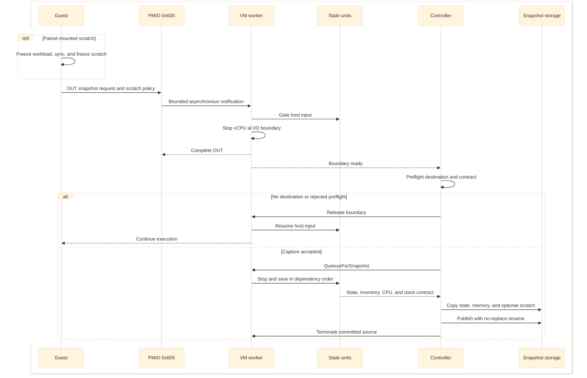
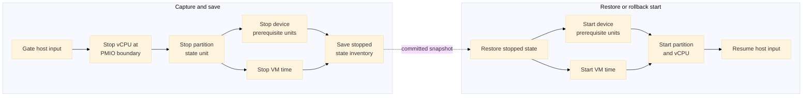
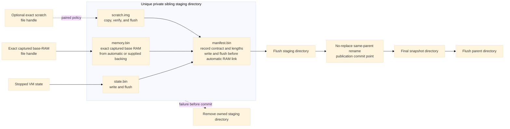
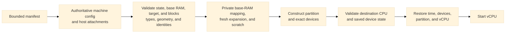

# Snapshot and restore

[Design index](../design.md)

## Tier contract

Version-5 sandbox snapshots encode the tier, restore policy, and a consumed
configuration-section bitmask. The validator accepts only these combinations:

| Tier | Restore policy | Scratch | Consumed sections | Intended author and sharing scope |
| --- | --- | --- | --- | --- |
| `platform` | `clone` | Fresh | Invariants only | Trusted platform build; cross-tenant only with the [pre-image-binding guarantees](sandbox-filesystem-and-agent-architecture.md#production-agent-and-launch-sequence-proposed) |
| `workload-start` | `clone` | Paired | Invariants, image binding, sandbox | Warm workload or runtime shim; tenant-scoped |
| `instance-checkpoint` | `resume` | Paired | Invariants, image binding, sandbox | One live instance; one claimed continuation |

Tier metadata requires sandbox blocks; blockless snapshots do not declare it.
The saved host-owned `nvx_snapshot_tier=` token must agree with the manifest.
Platform lower layers have empty, unbound identities, whereas later tiers bind
consumed layers to their hashes. The bitmask establishes when configuration
is considered consumed; it is not an implementation of replaceable payloads
or per-section configuration-region validation.

The platform point removes kernel and agent initialization from subsequent
launches. Workload-start removes runtime initialization as well, but contains
workload memory and often cached image data and secrets. Read-only layer files
remain external attachments; bytes read from them into guest RAM can still
appear in `memory.bin`. Paired scratch is an artifact in the snapshot directory,
not just a reference to the caller's original writable file.

Sharing scope is a deployment requirement, not a tenant authorization feature
of the VMM. The snapshot controller enforces tier combinations, layer binding,
scratch pairing, and the single-use resume claim. Host artifact access control,
template provenance, and a trustworthy pre-capture guest determine whether
cross-tenant publication is permissible.

## Capture boundary

Generic host save and pulse-save/restore RPCs are deliberately unavailable for
the microVM profile. Capture is requested by the guest through PMIO `0x605` and
is coordinated as a bounded transaction. Capture with sandbox blocks requires
`--snapshot-tier platform|workload-start|instance-checkpoint`; inconsistent
tier, clone/resume, and fresh/paired scratch combinations are rejected. For
paired scratch,
`nvx-snapshot` first freezes the workload cgroup with a bounded wait, calls
`sync`, and freezes the mounted filesystem. `nvx-snapshot --fresh-scratch`
instead requires scratch to be unmounted. A rejected capture thaws every
guest-owned barrier; failure to thaw terminates the VM.

1. gate host input and defer completion of the snapshot-port write;
2. stop the vCPU at the I/O boundary while completing the write, so saved state
   starts at the instruction immediately after `out`;
3. preflight the profile, destination, backend, external attachments, and
   snapshot eligibility; a missing destination or rejected preflight releases
   the boundary and lets the guest continue;
4. quiesce the remaining device workers and VM time in dependency order,
   including bounded virtio-blk queue drain;
5. save the exact state-unit inventory, processor state, device-private state,
   and memory;
6. copy and flush state, memory, and any paired scratch into a unique sibling
   staging directory;
7. publish the directory with one no-replace rename; and
8. terminate the source worker and process after publication.



State-unit transitions follow registered dependencies rather than one global
serial list. In the current worker, the partition depends on the device
prerequisite unit and VM time. Save quiesce stops in reverse dependency order;
restore and rollback start in dependency order. Device prerequisites and VM
time may transition in parallel.



The directory rename is the commit point. Before it, capture failure exposes no
final snapshot and resumes only when rollback is known to be valid. After it,
the source never resumes. This gives the guest an observable boundary: code
after the snapshot `out` runs once in each restored process and never in the
successfully captured source process.

While the worker holds the snapshot stop guard, its central RPC dispatcher
rejects management operations that could disturb the boundary, including
memory writes, resume/reset, device changes, and state dumps. Rejections are
immediate, not queued until capture finishes; infallible RPC forms report a
channel failure. Snapshot quiesce, rollback, boundary release, and memory reads
remain available. The exclusion applies at the worker boundary shared by the
management frontends, in
[`dispatch/snapshot_rpc.rs`](../../openvmm/openvmm/openvmm_core/src/worker/dispatch/snapshot_rpc.rs).

Guest and host barriers have separate jobs. The workload cgroup is frozen in
captured guest state, the VMM gates external input, and a future multithreaded
agent must park its own RPC/log workers at a capture-safe point. None of these
substitutes for the others. Device workers and guest kernel execution needed
for CPU/RAM repair must run during gated restore; the gate is not a promise
that all interrupts remain disabled. After repair, the helper acknowledges the
VMM gate before thawing scratch and then the workload. The current helper
polls cgroup freeze completion with a bounded loop; an event-driven production
agent and typed capture-failure reporting remain future work.

## Artifact format and publication

A published snapshot contains:

```text
snapshot/
|-- manifest.bin
|-- state.bin
|-- memory.bin
`-- scratch.img    # paired microVM scratch only
```



[`openvmm_helpers::snapshot`](../../openvmm/openvmm/openvmm_helpers/src/snapshot.rs)
implements bounded decoding, exact-length publication, artifact length checks,
restrictive creation, flushing, unique staging paths, and same-parent
no-replace publication. Automatic OpenVMM-owned microVM base RAM is flushed,
linked from the exact handle after its shared mappings, state, and manifest are
durable, and checked for matching identity and EOF. Linux uses
`linkat(AT_EMPTY_PATH)` or a `/proc/self/fd` link plus device/inode proof;
Windows uses handle-relative `FileLinkInformation` plus `FILE_ID_INFO`.
Unsupported filesystems fall back to an independent copy. User-supplied
backing always takes that copy path: Linux uses `FICLONE` with
`SEEK_DATA`/`SEEK_HOLE` and zero-scan fallbacks, while Windows uses a dense
copy. A pre-existing final destination is never deleted or replaced.

The source VM is terminal after an automatic RAM link commits. A failure after
creating the staging alias is rollback-safe only after the complete private
staging directory has been synchronously removed and its parent flushed. If
that proof fails, OpenVMM terminates the source rather than resuming it with a
surviving writable alias to the artifact.

The manifest is authoritative for:

- profile and ABI version;
- source hypervisor and architecture;
- captured RAM ranges and file offsets, plus any immutable RAM capacity,
  128-MiB block size, and canonical expansion ranges;
- processor topology, vCPU count, and every APIC identity;
- effective command line and digest;
- exact device order, stable IDs, state-unit names, MMIO/PMIO ranges, IRQs,
  transport, feature masks, and queue limits;
- CPU, XSAVE, MSR, TSC-frequency, and clock compatibility data;
- required host attachments and their policies;
- block roles, access, geometry, layer identities, and scratch policy;
- snapshot tier, clone/resume policy, and consumed configuration sections;
- exact lengths of `state.bin` and `memory.bin`; and
- the exact length and SHA-256 of paired `scratch.img`.

Snapshot paths and repeated fields are bounded. Restore rejects truncated,
oversized, malformed, wrong-type, path-escaping, symlinked, incompatible,
missing, extra, or reordered state before guest execution. New snapshots use
version 5. It does not store or validate embedded checksums for `state.bin` or
`memory.bin`; a same-length change to either payload is therefore outside the
validation contract. Paired scratch is checked because it must match captured
filesystem state. Versions 2 through 4 remain readable; versions 2 and 3 cannot
describe sandbox blocks, and version 4 predates tier metadata. Legacy version-2
checksum fields are accepted without re-hashing either payload. Snapshot
directories rely on host access control, while
authenticated export or transport belongs outside the default local artifact
format.

Restore opens the snapshot directory once and resolves manifest, state, memory,
paired scratch, and `resume.claim` relative to that directory handle. Windows
opens restore artifacts with read sharing only, rejects reparse points, checks
`FILE_ID_INFO` and EOF around COW-section creation, and retains the directory
and artifact guards in the VM worker so writes, truncation, deletion, and rename
remain blocked until teardown. Linux retains the exact `O_NOFOLLOW` directory
and regular-file descriptors, detects observable metadata changes before
worker handoff, and is therefore immune to pathname replacement; mandatory
content immutability still depends on host access control or an explicit
stronger mode such as a lease, fs-verity, or a verified artifact broker.

## Authoritative restore

Restore proceeds in the opposite direction from capture:

1. open one exact snapshot generation, read its bounded manifest, and derive
   the authoritative machine configuration;
2. resolve console, network, filesystem, policy, and read-only layer
   attachments by stable ID or role;
3. validate state, captured memory, the selected RAM target, block geometry and
   identities, and any paired scratch artifact before worker construction;
4. create a writable private copy-on-write mapping from the exact opened
   `memory.bin` handle, add fresh private backing for selected expansion
   ranges, transfer the artifact generation guards to the worker, and use
   either a verified private scratch copy or a caller-supplied fresh scratch
   file;
5. construct the partition and exact device inventory with the selected active
   RAM and the snapshot's immutable capacity;
6. compare the destination CPU, XSAVE/MSR, TSC, topology, device, and queue
   contract with the saved contract;
7. restore VM time, chipset and virtio state, partition state, and vCPU state;
8. finish reconnecting host resources;
9. when tier policy, processor activation, or nonempty RAM expansion requires
   guest repair, start devices with external input gated and then release the
   restored vCPU; and
10. on the agent's `0x605` acknowledgment, stop at the exact post-write
   boundary, release input, and only then let the guest continue.

Listener attachments preserve their stable device ID, attachment kind, backend
kind, reconnect policy, required flag, and timeout, but not the source listener
pathname. Each restore supplies fresh private boot-console and authenticated
control-listener paths. Treating the captured pathname as immutable would make
independent or concurrent reusable-clone restores collide with the terminated
source generation.

The partition must exist before OpenVMM can derive its effective destination
CPU contract. This does not expose a partially restored guest: contract
comparison and all saved-state validation still complete before a vCPU runs.



The captured memory artifact is mapped private and copy-on-write across
restores, while selected expansion ranges receive fresh private backing.
Paired scratch is copied into a private temporary file for each restore.
Multiple restored VMs may therefore dirty RAM and scratch without changing
reusable clone artifacts. An instance checkpoint is single-use: the first
artifact- and configuration-validated restore attempt atomically creates and
flushes `resume.claim`; duplicate and concurrent restores fail before worker
construction, and a later startup failure does not make the checkpoint
reusable. Initial compatibility is same-backend: KVM snapshots restore on
compatible KVM hosts, MSHV on compatible MSHV hosts, and WHP on compatible WHP
hosts. Cross-backend conversion and standalone NVX snapshot import are not
supported.

## Template compatibility and placement

A template represents a compatibility class, not an arbitrary fleet image.
The class includes the backend, CPU/XSAVE/MSR and TSC contract, guest kernel and
agent build, effective command line, device roles and geometry, network
identity/policy, and consumed layer identities. Deployment must rebuild or
recertify templates on relevant rollouts; the VMM's actual compatibility and
saved-state checks, not a promise about every build with the same version
string, remain authoritative.

Processor capacity and captured RAM geometry are immutable, but the opt-in
activation contracts below allow one template to serve several online CPU
counts and RAM targets. The template matrix is therefore keyed by capacities,
base state, and supported activation ranges, not necessarily by one artifact
for every final CPU/RAM size. Layer-role presence and device geometry remain
fixed regardless of these activations.

For a platform template, substituting a layer requires the same recorded
logical length and block sizes. The current contract does not promise a
uniform virtual capacity over arbitrary shorter backing files. Builders may
standardize actual raw-file geometry or maintain separate geometry classes;
larger layers need a compatible template. Guest unbind/rebind cannot bypass
the host's pre-entry geometry checks. The bootstrap's buffer invalidation and
UUID check address stale cached bytes and attachment mix-ups, not permission
to alter the saved machine topology.

## Restore-time processor activation

The microVM separates the immutable processor capacity recorded by a snapshot from
the process-local VP set needed by one restore:

- `C` is the manifest VP capacity. Processor topology, APIC identities, ACPI
   and MP tables, and saved VP inventory always contain exactly `C` entries.
- `B` is the boot-online count recorded from an opt-in template's effective
   `maxcpus=` command-line token. It must be one of 1, 2, 4, or 8 and no larger
   than `C`. A snapshot without this opt-in records zero and rejects activation.
- `N` is an explicit `--restore-processors` target. It must be supported and
   satisfy `B <= N <= C`; it is process-local and does not modify the snapshot.

The requested online set is always the contiguous prefix `0..N-1`. This is not
a topology change or a general CPU-hotplug interface: the guest still sees the
capacity-`C` machine contract, and bringing a suffix VP online after readiness
is unsupported.

Runtime VP materialization is backend-specific while the guest-visible
contract remains backend-independent:

| Restore shape | Process-local VP runners and backend binders | Saved VP state |
| --- | --- | --- |
| MSHV with explicit `N` | Instantiate and bind only `0..N-1` | Validate all `C` entries, then apply the prefix |
| MSHV without explicit `N` | Instantiate and bind all `C` | Validate and apply all `C` entries |
| KVM or WHP | Instantiate and bind all `C` | Validate and apply all `C` entries |

MSHV creates application processors lazily while binding their VP runners, so
discarding suffix binders before that boundary avoids creating processors that
this restore will not run. KVM and WHP deliberately retain their existing
full-capacity construction path, including when an explicit online target is
sent to the guest.

Saved state remains authoritative despite the narrower MSHV runtime. Before
filtering, restore requires exactly one VP state entry for every index in
`0..C-1` and rejects missing, duplicate, or out-of-range entries, including
errors in the dormant suffix. Only after that validation may an explicit MSHV
restore apply state for `0..N-1`. A reduced-prefix process cannot later produce
a complete capacity-`C` VP inventory, so any attempt to save it fails with
`SaveError::NotSupported`; dump or debug access to an uninstantiated suffix VP
also fails explicitly instead of indexing nonexistent runtime state. The
original immutable snapshot remains reusable for independent restores at
other valid targets.

After host-side state restoration, a processor-only activation uses the
version-2 private restore packet to carry `N` to the Alpine agent. Portb status
bit 2 distinguishes it from a legacy version-1 entropy packet. If the same
restore also selects a RAM target, version 3 carries both targets. While
external input remains gated, the agent onlines CPUs from `B` through `N-1`,
verifies that `/sys/devices/system/cpu/online` is exactly the requested prefix,
and acknowledges through PMIO `0x605`. OpenVMM stops at that post-write
boundary, releases host input, and then resumes the guest.

A fixed-capacity `N`-vCPU snapshot and a capacity-`C`, boot-online-`B` template
restored to `N` therefore reach the same online prefix but do not contain the
same guest state. The fixed snapshot captures all `N` CPUs online; the template
captures only `B` online CPUs and performs CPU activation during gated repair.
Performance comparisons should separate VP binding and worker construction
from guest resume-to-readiness. Matching host-side phase costs do not require
the total restore latencies or tail behavior to match.

## Restore-time memory activation

Restore-time memory activation separates the immutable RAM geometry recorded
by a snapshot from the active amount selected for one restored process:

- `M0` is the captured base RAM. `memory.bin`, the PVH usable-memory map, and
  the saved RAM-range inventory contain exactly `M0`.
- `Cmem` is the optional immutable capacity declared by `--memory-capacity` at
  capture. The contract records capability version 1, `Cmem`, the 128-MiB Linux
  memory-block size, and every canonical GPA range in `Cmem - M0`.
- `M` is an explicit `--restore-memory` target. It must be 128-MiB aligned and
  satisfy `M0 <= M <= Cmem`. Omitting it restores exactly `M0`; a snapshot
  without the capability rejects an explicit target.

TTRPC exposes the same capture capacity and per-launch target as
`memory_capacity_bytes` and `restore_memory_bytes`.

The selected expansion is always a prefix of the contract's canonical ranges
in logical RAM order. OpenVMM maps the captured ranges privately from
`memory.bin`, maps only the selected suffix with fresh private backing, and
registers all selected ranges with the hypervisor before any restored vCPU
runs. Expansion bytes are neither read from nor written back to the snapshot,
so independent restores may choose different valid targets without changing
the reusable artifact.

An explicit RAM target selects restore-packet version 3:

```text
OPENVMM_ENTROPY_V3\0
u8 optional_online_vp_count
u8 expansion_range_count
repeated { little-endian u64 gpa_start, little-endian u64 length }
64 bytes fresh entropy
```

Portb status bit 3 identifies the memory-target packet and bit 4 indicates that
the selected target contains at least one expansion range. Version 3 may carry
a processor target in the same transaction. For a nonempty expansion,
OpenVMM keeps external input gated while the Alpine agent verifies the
128-MiB block size and each range, probes missing blocks through
`/sys/devices/system/memory/probe`, writes and verifies the `online` state, and
then completes entropy and generation-ID repair before acknowledging PMIO
`0x605`. Any malformed range or add/online failure terminates the restore.

An explicit base-size target has a zero range count. For an untiered blockless
restore, the agent emits the deterministic zero-add marker without consuming
the packet or entering a restore-gate transaction; a tiered restore still uses
its existing gate. This mechanism is one-shot restore repair, not a general
post-readiness memory-hotplug interface.

## Time and entropy

Cold PVH microVM boots receive a canonical `lapic_timer_hz` kernel parameter from
the backend's reported LAPIC clock frequency. The NVX kernel uses this known rate
instead of comparing LAPIC interrupts with scheduling-sensitive emulated PIT
interrupts during boot. Without it, delayed PIT delivery can cause Linux to disable
a working LAPIC timer. Native calibration remains available when no frequency is
reported, and the TSC-deadline path is unchanged. A platform snapshot's saved
command-line parameter, when present, must agree with its APIC frequency contract.

Capture records a coherent processor and clock boundary. Restore advances TSC,
VM time, RTC, PIT/LAPIC deadlines, and the KVM paravirtual clock by nonnegative
host downtime, then reanchors them before vCPUs start. A destination that
cannot reproduce the saved CPU or clock contract is rejected rather than
silently changing guest behavior. The current restore path rejects negative
downtime and elapsed host downtime greater than 30 days. If an advanced
TSC-deadline timer would already be in the past, restore rearms it one
millisecond beyond the restored TSC; some hypervisors do not inject an
interrupt merely because a past deadline was restored. Exact deadline
read-back is consequently excluded from state comparison. Versioned MSHV CPU
contracts do not expose `IA32_TSC_ADJUST` because snapshot state cannot preserve
that register independently of `IA32_TSC`; Linux therefore does not interpret
OpenVMM's host-side TSC correction as per-vCPU firmware adjustment skew.

KVM preserves the subsecond part of the downtime when advancing TSC, rather
than rounding the correction to whole seconds. For restored SMP on MSHV and
WHP, partition time is frozen while VP counters are aligned before execution,
avoiding skew introduced by sequential host register writes. WHP additionally
uses a partition-reference-time-based TSC model for restored SMP timestamp
reads, including `RDTSC`/`RDTSCP` and TSC MSR reads. An intentional guest TSC
adjustment returns that VP to its guest-programmed hardware counter. This
backend repair is not general cross-host TSC-frequency conversion; see
[`virt_kvm`](../../openvmm/vmm_core/virt_kvm) and
[`virt_whp::tsc`](../../openvmm/vmm_core/virt_whp/src/tsc.rs).

Replaying a snapshot also replays the guest's in-memory random-number-generator
state. Tiered restore, processor activation, and an explicit RAM target each
cause OpenVMM to create a fresh one-time packet and expose it through the portb
status/data protocol; callers may also request that packet directly. Every
microVM process receives a fresh 16-byte generation ID before vCPU entry. The
ID is not serialized, and the VMM-owned value is not restored from device
state. When a restore packet exists, the ID is its first 16 entropy bytes;
otherwise it is generated independently. This keeps the gated repair path from
adding port reads. The Alpine agent keeps the prior ID in its captured process
state, rejects a restored ID that did not change, and exports the refreshed
value to the runtime hook before releasing the gate.

For clone policy, the Alpine restore path credits the seed, including the
generation ID, with `RNDADDENTROPY`, forces `RNDRESEEDCRNG`, refreshes wall
clock and machine identity, and requires the workload-start runtime hook to
reset runtime-owned RNG state before accepting work. RTC update-in-progress is
polled with a bounded read loop rather than a timer sleep because guest timers
are not authoritative until this wall-clock repair completes. The workload's
`/etc/machine-id` is a read-only bind of a runtime-tmpfs file, so the agent can
refresh it while scratch remains frozen; the agent also updates the workload's
UTS namespace before acknowledgement. It then acknowledges the VMM gate before
thawing scratch and the workload cgroup. Resume policy records the fresh
generation ID while preserving machine identity and RNG continuity. Fresh
post-restore entropy and the replacement generation ID are never stored in the
reusable snapshot; only the prior ID remains as the agent's comparison token.
