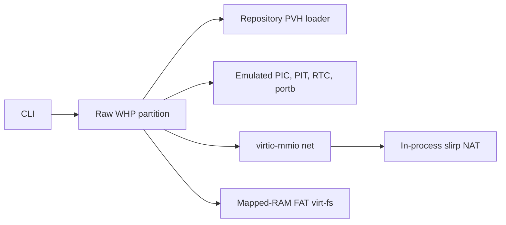
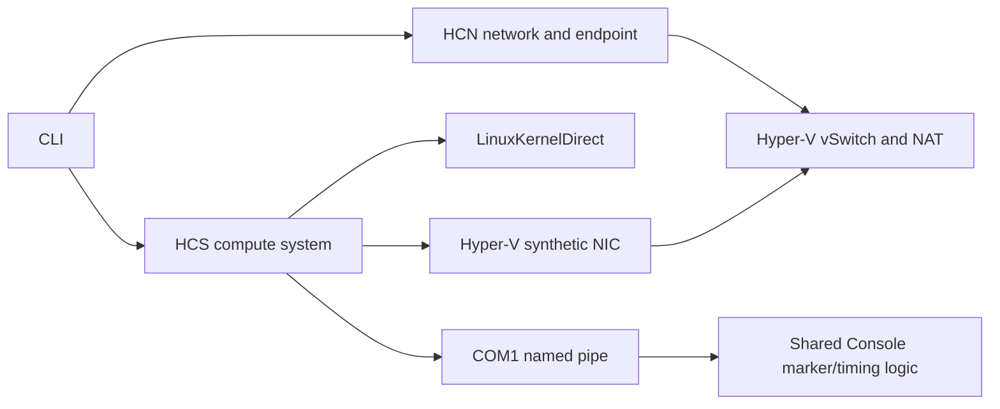

# HCS/HCN Hyper-V Backend Integration Plan

Status: in progress (Phase 0 host foundation implemented)
Last investigated: 2026-07-17

## Implementation status

The first Phase 0 implementation now includes the Windows-only backend selector (with WHP still the
default), HCS schema preflight, typed kernel-direct create documents, per-VM artifact access grants,
RAII operation/compute handles, COM1 named-pipe console I/O, marker and Ctrl-C supervision, and
forced terminate/wait/close cleanup. The common kernel config now builds ACPI, 8250 serial,
Hyper-V/VMBus, and NetVSC support into the image while retaining KVM/PVH support.

Experimental HCS-native snapshot/restore is also implemented behind the existing flags. It uses a
versioned COM2 guest handshake, `HcsPauseComputeSystem`/`HcsSaveComputeSystem`, an opaque VMRS file,
and an incompatible `NVXHCSS1` manifest that validates the exact host build and boot-artifact hashes.
The network path now consumes an externally provisioned HCN endpoint, cold-attaches it through a
stable HCS adapter GUID, and stores its identity in manifest v3. PowerShell setup/cleanup scripts own
the persistent HCN network and endpoint; NVX only opens, queries, and closes the endpoint handle.
Privileged traffic, repeated-restore, and leak soak gates remain outstanding.

The central launcher includes `bench-hcs-snapshot-shell` and `bench-hcs-snapshot-py`. They measure
guest marker latency and end-to-end process wall time separately, record one-off capture wall time and VMRS
footprint, and repeatedly restore one captured state file. Results must remain separate from WHP
baselines because the lifecycle and state formats are unrelated. The
`scripts/performance.py collect --platform windows-hcs` command parses the HCS logs into a dedicated
CSV; CI should enable it only on a privileged runner explicitly labeled for HCS.

`bench-hcs-net-snapshot-py` is the network discriminator: it performs a real HTTP round-trip to a
host helper before capture and after every restore. Its optional `hcs-network-snapshot.log` adds four
repeated-sample metrics to the separate `windows-hcs` baseline.

The privileged network snapshot benchmark and repeated cleanup soak still need to run from an
elevated or Hyper-V Administrators token before this path is declared stable.

## Decision summary

Implement HCS as a new Windows backend, validate it alongside WHP, then make it the only Windows
backend after explicit migration gates are met. Do not try to insert HCN beneath the current WHP
virtio-net device. HCS must own the VM partition and expose an HCN endpoint through a Hyper-V
synthetic network adapter.

The first useful implementation should deliberately be smaller than the current WHP backend:

- boot Linux with HCS `LinuxKernelDirect`;
- connect the guest console to COM1 through a Windows named pipe;
- create an HCN NAT network and endpoint;
- cold-attach that endpoint as an HCS `NetworkAdapter`;
- configure the resulting `hv_netvsc` interface in Alpine; and
- support clean create, start, terminate, and resource cleanup.

OpenGCS is not required for this first implementation. Omitting `VirtualMachine.GuestConnection`
allows HCS to consider the VM started once its chipset is powered on. The guest then owns IP, route,
and DNS configuration. OpenGCS should only be reconsidered if later work requires guest process
creation, guest network namespaces, HCS-coordinated hot-add, or graceful Guest Compute Service
shutdown.

This path replaces, rather than extends, the raw-WHP architecture. It trades this repository's
small, inspectable Windows device model and unprivileged user-mode NAT for Hyper-V's managed VM,
VMBus devices, vSwitch data path, HCN policy, and host-managed save state.

## Goals

1. Boot the existing Alpine workload as an HCS-managed Linux VM on supported Windows editions.
2. Give the guest a real Hyper-V synthetic NIC connected to an HCN-managed vSwitch/NAT network.
3. Preserve the CLI's basic boot, console, timing-marker, quiet-mode, and static `--net` workflows.
4. Keep the Linux/KVM backend unchanged.
5. Make every HCS and HCN resource owned by a run discoverable and reliably reclaimable.
6. Establish an upgrade path for HCS-native save/restore and managed storage without claiming
   compatibility with WHP snapshots or virt-fs.

## Non-goals for the first landing

- Running OCI containers or integrating with containerd.
- Shipping OpenGCS or implementing its host protocol.
- Network hot-add/hot-remove.
- HCN guest namespaces or multi-container network namespaces.
- WHP snapshot-format compatibility.
- Preserving the WHP FAT/phram virt-fs implementation.
- Matching existing WHP cold-start numbers; HCS has a different lifecycle and device stack.
- Supporting Windows Home. The target is a full Hyper-V installation.

## Current and target architecture

The current Windows path creates a WHP partition directly, maps guest RAM, initializes one vCPU,
loads the kernel through the repository's PVH loader, and services all device exits in-process.



The target path asks HCS to construct and run the VM. HCS and Hyper-V own CPU, memory, firmware,
interrupts, COM ports, VMBus, and synthetic devices. HCN owns the host-side network objects and
vSwitch policy.



## Feasibility findings

### Direct Linux boot

HCS schema 2.2 added `VirtualMachine.Chipset.LinuxKernelDirect` with these fields:

- `KernelFilePath`
- `InitRdPath`
- `KernelCmdLine`

The open-source `microsoft/hcsshim` LCOW implementation uses this path for utility VMs. The
effective kernel-direct floor is Windows build 18286, so the practical client floor is Windows 10
1903 even though the base HCS API exists in Windows 10 1809. This project should target Windows 11
Pro/Enterprise and Windows Server 2022 or newer, then record the exact tested builds.

It is not yet proven that HCS accepts this repository's current uncompressed, PVH-capable
`vmlinux`. The HCS loader, not `src/boot/pvh.rs`, controls entry into the kernel. Phase 0 must try the
existing artifact first and capture the HCS result document. If it is rejected or fails before
serial output, add a separate HCS-compatible `bzImage`/kernel artifact rather than changing the KVM
artifact blindly.

### Synthetic networking

HCS `Devices.NetworkAdapters` is a map from an adapter name or GUID to a `NetworkAdapter` containing
an HCN `EndpointId` and MAC address. A GUID map key becomes a stable VMBus instance identifier. The
Linux guest binds the device with `hv_netvsc`; there is no virtio-mmio transport and no userspace
packet pump in nvx.

The endpoint can be included in the create document. This cold-attach path is preferred initially
because it does not require guest cooperation. The equivalent running-VM modification is:

```json
{
  "ResourcePath": "VirtualMachine/Devices/NetworkAdapters/<adapter-guid>",
  "RequestType": "Add",
  "Settings": {
    "EndpointId": "<endpoint-guid>",
    "MacAddress": "<endpoint-mac>"
  }
}
```

That modification is useful later for hot-add, but guest-side configuration would then require a
control agent or a local hotplug policy.

### GuestConnection and OpenGCS

`VirtualMachine.GuestConnection` is optional. When absent, `HcsStartComputeSystem` completes when
the virtual chipset is powered on. COM1, normal VM execution, pause/resume, forced termination, and
host-side save operations remain available.

Without OpenGCS:

- do not set `GuestConnection`, because start would wait for a service that never connects;
- do not call `HcsCreateProcess` for workloads inside the VM;
- use `HcsTerminateComputeSystem`, not Guest Compute Service shutdown;
- configure IP addresses, routes, and DNS in `/init`; and
- use a host-observable channel for future snapshot requests instead of HCS guest requests.

This is a good fit for nvx because the initramfs already owns the workload and network setup. Adding
OpenGCS would introduce a large container-management subsystem to solve problems the first backend
does not have.

### HCN namespaces

An HCN namespace is not required for a standalone VM with one cold-attached endpoint. The HCS
adapter consumes the endpoint ID directly.

HCN namespaces become relevant when a host orchestrator groups endpoints and containers, or when
OpenGCS moves interfaces into Linux network namespaces. Do not create one in the first
implementation. This also avoids incorrectly assuming that endpoint metadata will be pushed into a
bare Linux guest.

### Privilege model

This backend will not preserve WHP's "no driver or administrator rights" property. HCN network
creation and custom Hyper-V VM management require elevated or delegated Hyper-V privileges on a
normal workstation. Initial development and CI should run elevated. A later hardening test can
determine whether membership in `Hyper-V Administrators` is sufficient for every HCN operation on
the supported host builds.

HCS also needs the VM identity to read host boot files. Call `HcsGrantVmAccess` for the kernel,
initrd, and every future state/disk file before creating the compute system. Prefer per-VM access to
broad `HcsGrantVmGroupAccess` permissions.

## Compatibility boundary

| Current Windows behavior | HCS behavior | Migration decision |
| --- | --- | --- |
| `WHvCreatePartition` and a VMM-owned run loop | HCS owns VM construction and execution | Replace the `whp::run` boundary |
| Repository PVH ELF loader | `LinuxKernelDirect` loader | KVM-only PVH code remains unchanged |
| Port `0xE9` `hvc_xe9` console | 16550-compatible COM1 and `ttyS0` | Add a named-pipe console adapter |
| Emulated PIC/PIT/RTC/LAPIC handling | Hyper-V platform devices and enlightenments | Delete from the final Windows build |
| virtio-net over virtio-mmio | NetVSC over VMBus | Enable built-in Hyper-V guest drivers |
| In-process slirp NAT | HCN NAT/vSwitch data path | Delete `src/whp/slirp*` after cutover |
| `WHvMapGpaRange` FAT/phram virt-fs | No client-owned GPA mapping | Reject initially; design a new share/storage path |
| Port `0x605` snapshot request | No I/O-exit visibility | Introduce a different guest-to-host protocol later |
| `WHPSNAP1` memory/register/device files | Opaque HCS save state | New, explicitly incompatible snapshot format |
| Protected-mode WHP `--selftest` | No direct vCPU API | Replace with HCS capability/preflight checks |

## Proposed repository structure

Keep the HCS implementation separate from `src/whp/` while both backends coexist during rollout:

```text
src/hcs/
    mod.rs          Config, orchestration, and public run entry point
    api.rs          Minimal HCS/HCN ABI, UTF-16 buffers, errors, and RAII handles
    schema.rs       Typed serde models for the JSON documents nvx emits
    compute.rs      Compute-system create/start/wait/terminate lifecycle
    hcn_endpoint.rs NetConfig parsing and borrowed HCN endpoint validation
    console.rs      COM named-pipe connection and shared Console integration
```

The split may start as fewer files during the Phase 0 spike, but the ownership boundaries should
remain explicit:

- `api.rs` must not know nvx CLI policy;
- `schema.rs` must not perform calls or cleanup;
- `hcn_endpoint.rs` must return the canonical endpoint ID and MAC queried from HCN;
- `compute.rs` must not create HCN objects; and
- `mod.rs` owns ordering and rollback across all resources.

### Reusable code

- `src/main.rs`: CLI parsing, logging, validation, and OS dispatch.
- `src/console.rs`: output buffering, boot/timing marker detection, and byte accounting.
- The endpoint parser and IPv4 prefix/gateway calculations in `src/whp/net.rs`; move the reusable
  portion out before deleting WHP.
- Windows terminal mode handling currently in `src/whp/mod.rs`; extract it into the HCS console
  adapter or a shared Windows module.
- Existing `virtnet_ip`, `virtnet_mask`, and `virtnet_gw` guest command-line contract.
- All KVM modules and the `hvc_xe9` kernel patch.

### Windows code retired after cutover

The final HCS-only Windows build should not compile these WHP implementation areas:

- partition, guest memory, vCPU, emulator, PIC, PIT, and RTC;
- virtio-mmio net and its virtqueue implementation;
- slirp ARP/ICMP/TCP/UDP implementation;
- WHP register/RAM/device snapshots; and
- direct-mapped FAT virt-fs.

Do not remove them during the first spike. Keep `--backend whp` available until the HCS boot and
network gates pass, then remove the legacy backend in one auditable change.

## Host API layer

### Binding strategy

The repository resolves `windows = 0.62` to 0.62.2. Local crate metadata and generated source were
checked during this investigation and expose the required APIs under these features:

```toml
"Win32_System_HostCompute"
"Win32_System_HostComputeNetwork"
"Win32_System_HostComputeSystem"
```

Use the generated projections directly. `HostComputeSystem` provides typed `HCS_OPERATION` and
`HCS_SYSTEM` handles and functions such as `HcsCreateComputeSystem`, `HcsGrantVmAccess`, and
`HcsWaitForOperationResult`. `HostComputeNetwork` provides the `Hcn*` calls with opaque raw HCN
handles. Add only the supporting Windows features required for named pipes, `LocalFree`, and
`CoTaskMemFree`.

Keep a small local `extern "system"` declaration as a fallback only if a future required API is
absent from the pinned projection. Runtime symbol loading is unnecessary for the intended
full-Hyper-V target; a clear preflight failure is preferable on unsupported hosts.

Do not import hcsshim or reproduce its broad schema. Add `serde` and `serde_json` and model only the
documents nvx sends or receives.

### Required HCS calls

Minimum cold-boot lifecycle:

- `HcsCreateOperation`
- `HcsCloseOperation`
- `HcsCreateComputeSystem`
- `HcsStartComputeSystem`
- `HcsWaitForOperationResult`
- `HcsWaitForComputeSystemExit` or a compute-system callback
- `HcsTerminateComputeSystem`
- `HcsCloseComputeSystem`
- `HcsGrantVmAccess`
- `HcsGetServiceProperties` for preflight/schema discovery

Later save/restore work adds pause, resume, save-state, and state-file APIs.

`HcsWaitForComputeSystemExit` requires Windows 10 version 2104 or Windows Server 2022. That is
compatible with the recommended Windows 11/Server 2022 floor. If the project deliberately supports
older Windows 10 builds for kernel-direct boot, use the older compute-system callback mechanism
instead of calling this helper unconditionally.

Every HCS action is asynchronous. An immediate `S_OK` means that the operation started, not that it
completed successfully. Use one `HCS_OPERATION` per in-flight action, wait for its result, preserve
the JSON result in errors, and close the operation on every path. HCS result strings are released
with `LocalFree`.

Wrap `HCS_OPERATION` and `HCS_SYSTEM` in non-cloneable RAII types. `ComputeSystem::drop` should be a
last-resort forced cleanup, while normal orchestration should terminate, wait for exit, and close in
that order.

### Required HCN calls

The VMM's borrowed-endpoint lifecycle is limited to open/query/close endpoint. The external
PowerShell setup scripts create the network and endpoint, optionally attach the endpoint to the
`HostDefault` namespace for AF_XDP, and explicitly reverse those operations during cleanup.

HCN calls are synchronous but return optional JSON error records. Preserve those records in the
Rust error chain. HCN property and error buffers are released with `CoTaskMemFree`. Closing an HCN
handle does not delete its persistent object, so deletion must be explicit.

### Error model

Each error should include:

- operation name;
- immediate and completion HRESULTs when both exist;
- HCS result or HCN error JSON;
- compute-system/network/endpoint IDs; and
- the cleanup errors that followed the primary failure.

Never replace a useful primary failure with a later cleanup failure. Aggregate cleanup failures and
log them after returning the original cause.

## HCS compute-system document

The Phase 0/1 document should be structurally equivalent to the following. It is illustrative; the
schema spike must record the exact accepted document on each supported Windows build.

```json
{
  "Owner": "nvx",
  "SchemaVersion": { "Major": 2, "Minor": 2 },
  "ShouldTerminateOnLastHandleClosed": true,
  "VirtualMachine": {
    "StopOnReset": true,
    "Chipset": {
      "LinuxKernelDirect": {
        "KernelFilePath": "C:\\path\\to\\vmlinux",
        "InitRdPath": "C:\\path\\to\\initramfs.cpio.gz",
        "KernelCmdLine": "console=ttyS0,115200 panic=-1 init=/init"
      }
    },
    "ComputeTopology": {
      "Memory": {
        "SizeInMB": 512,
        "AllowOvercommit": true
      },
      "Processor": { "Count": 1 }
    },
    "Devices": {
      "ComPorts": {
        "0": { "NamedPipe": "\\\\.\\pipe\\nvx-<run-guid>-com1" }
      },
      "NetworkAdapters": {
        "<adapter-guid>": {
          "EndpointId": "<endpoint-guid>",
          "MacAddress": "<endpoint-mac>"
        }
      }
    }
  }
}
```

Omit `NetworkAdapters` when `--net` is absent. Omit `GuestConnection` in the initial backend. Use
absolute canonical host paths and grant the chosen VM ID access before creation.

Use a schema 2.2 document only after `HcsGetServiceProperties` confirms support. Do not copy
hcsshim's historical behavior of placing `LinuxKernelDirect` in a nominal schema 2.1 document.

## HCN networking design

### Resource model

For the first implementation, an external setup invocation owns:

- one non-persistently named HCN NAT network for the requested prefix;
- one endpoint with the requested static guest IP;
- one HCS adapter GUID; and
- a descriptor recording the exact IDs and guest-visible identity it created.

Names should include an `nvx-` prefix and run GUID. Store the same owner/run GUID in every schema
field that permits it. Do not delete an object merely because its name starts with `nvx-`; cleanup
must match recorded IDs or an explicit stale-resource command.

Creating one network per setup invocation is simple but prevents concurrent runs on the same prefix
and adds startup cost. The VMM never silently adopts a network by name; it consumes only the exact
endpoint ID in the supplied descriptor.

### Address contract

Preserve `--net <guest-ip>/<prefix>`:

- requested address: guest endpoint IP;
- first usable subnet address: HCN gateway, matching current behavior;
- prefix: HCN static IPAM subnet and guest netmask;
- MAC: let HCN allocate it initially, then query and pass the canonical value to HCS; and
- DNS: explicit CLI/default values passed both to endpoint metadata and the guest command line.

The setup script validates before creating resources:

- guest and gateway are usable host addresses;
- guest is not the gateway;
- prefix is supported for the chosen IPv4 mode;
- no nvx-owned network already uses the same run ID; and
- the prefix does not overlap an existing HCN network. Warn that overlap with a VPN or physical
  route may still require operator intervention.

### Illustrative HCN network

```json
{
  "SchemaVersion": { "Major": 2, "Minor": 0 },
  "Owner": "nvx",
  "Name": "nvx-<run-guid>",
  "Type": "NAT",
  "Ipams": [
    {
      "Type": "Static",
      "Subnets": [
        {
          "IpAddressPrefix": "10.0.0.0/24",
          "Routes": [
            {
              "DestinationPrefix": "0.0.0.0/0",
              "NextHop": "10.0.0.1"
            }
          ]
        }
      ]
    }
  ]
}
```

The exact NAT route/gateway behavior is a Phase 2 acceptance test, not an assumption. The setup
script queries the created endpoint and records its canonical properties in the descriptor.

### Illustrative endpoint

```json
{
  "SchemaVersion": { "Major": 2, "Minor": 0 },
  "Owner": "nvx",
  "Name": "nvx-<run-guid>-ep",
  "IpConfigurations": [
    { "IpAddress": "10.0.0.2", "PrefixLength": 24 }
  ],
  "Routes": [
    { "DestinationPrefix": "0.0.0.0/0", "NextHop": "10.0.0.1" }
  ],
  "Dns": {
    "ServerList": ["1.1.1.1"],
    "Search": []
  }
}
```

Create it through an open network handle, then query it. The returned endpoint ID and MAC, not the
request object, are the source of truth for the HCS adapter.

### Creation and teardown order

External setup and launch:

1. Preflight OS build, HCS schema, Hyper-V services, privileges, and artifacts.
2. Run `setup-hcn-endpoint.ps1` to create/query the HCN network and endpoint.
3. Open/query the endpoint from NVX and validate the descriptor identity.
4. Grant the VM identity access to kernel and initrd.
5. Prepare the COM1 pipe endpoint.
6. Create the HCS compute system with the endpoint cold-attached.
7. Start console I/O and the compute system.
8. Wait for a marker, guest exit, Ctrl-C, or an error.

Teardown:

1. Terminate a running compute system and wait for its exit.
2. Close the compute-system handle.
3. Close the borrowed endpoint handle without deleting it.
4. Close pipe and console threads.
5. Let the external owner call `cleanup-hcn-endpoint.ps1` after all consumers have stopped.

Implement teardown as an idempotent state machine. Exercise setup rollback independently; a failed
HCS create must close its borrowed handle without deleting the externally owned endpoint.

## Guest changes

### Kernel configuration

The current kernel explicitly disables Hyper-V support and 8250 serial support. Build these drivers
into the kernel, not as modules, because both console and NIC are needed before a module filesystem
is available:

- Hyper-V guest support (`CONFIG_HYPERV` and its required paravirtual dependencies);
- Hyper-V synthetic network (`CONFIG_HYPERV_NET`);
- 8250/16550 serial and serial console (`CONFIG_SERIAL_8250`,
  `CONFIG_SERIAL_8250_CONSOLE`);
- ACPI and the normal Hyper-V clock/timer dependencies selected by the kernel; and
- Hyper-V storage and sockets only when their later phases begin.

Keep the existing KVM, PVH, virtio-mmio, and `hvc_xe9` options enabled at first. Measure the common
kernel before creating a second config. Add `kernel/config-hyperv` only if HCS requires an
incompatible image format/configuration or the extra drivers materially hurt the KVM target.

Do not enable Hyper-V PCI solely for NetVSC; the synthetic NIC is a VMBus device.

### Command line and console

Windows HCS should use:

```text
console=ttyS0,115200 8250_core.nr_uarts=1 8250_core.skip_txen_test=1 panic=-1
```

An early 8250 console argument may be added after the first serial probe identifies the emulated
UART details. Do not pass `earlycon=xe9` or `console=hvc0` on HCS.

Make the default command line backend-specific in `src/main.rs`; a user-provided `--cmdline` must
remain authoritative. Avoid string-replacing console tokens in arbitrary user input.

The COM1 adapter should:

- use a random, per-run named-pipe path;
- establish the server/client side in the order proven by the Phase 0 probe;
- retry only documented transient pipe errors with a bounded deadline;
- stream output bytes through the shared `Console` implementation;
- forward stdin bytes without line translation;
- preserve redirected-stdin deferral and interactive terminal restoration; and
- stop all pipe threads when HCS exits or teardown starts.

### Network initialization

HCN endpoint IP/DNS data is host metadata; it is not automatically applied by a bare Linux guest.
Extend `alpine/init` and `alpine/init.python` to:

1. wait with a bounded deadline for a non-loopback interface under `/sys/class/net`;
2. optionally match the `virtnet_mac` command-line value;
3. bring the interface up;
4. apply `virtnet_ip`, mask/prefix, and `virtnet_gw`;
5. write `virtnet_dns` to `/etc/resolv.conf`; and
6. fail visibly when the command line requested networking but NetVSC never appeared.

Keep this logic transport-neutral so the same `virtnet_*` contract works for KVM virtio-net and HCS
NetVSC. Avoid assuming the interface is named `eth0`.

## CLI and behavior migration

### Rollout selector

During migration, add a Windows-only backend selector:

```text
--backend whp|hcs
```

Use WHP as the default only while Phase 0-3 gates are incomplete. Switch the default to HCS, emit a
short deprecation warning for explicit `whp`, and remove WHP after one release/development cycle or
an agreed repository milestone. The final CLI does not need a selector when only HCS remains on
Windows.

### Initially supported options

- `--kernel`, `--initrd`, `--mem`, and `--cmdline`
- `--quiet` and logging controls
- `--exit-on-boot`, boot marker, and timing markers
- redirected stdin deferral
- experimental `--snapshot` and `--restore` without networking
- `--net <IP/PREFIX>`

### Rejected options on the current HCS implementation

- all `--mount*` options
- `--net-tap`

Reject these combinations before creating HCN or HCS resources. Do not silently fall back to WHP,
because that would change privilege, networking, and state semantics based on unrelated flags.

Map `--vcpus` to HCS `Processor.Count` only after single-vCPU boot is stable and a multi-vCPU boot
test confirms the HCS-provided firmware topology. Unlike raw WHP, HCS supplies the platform topology,
so the KVM MP-table limit does not apply.

Replace the WHP protected-mode `--selftest` with a non-destructive HCS preflight that reports:

- OS build and edition;
- HCS supported schema versions;
- `vmcompute`/HCN availability;
- caller privilege status; and
- whether a minimal create/close probe is available when explicitly requested.

## Snapshot and restore implementation

The existing WHP snapshot contains raw RAM plus registers and repository-emulated device state. HCS
save state is opaque, backend-specific, and tied to Hyper-V's device model. Never read a WHP snapshot
as HCS state or reuse the `WHPSNAP1` version tag.

The experimental implementation uses:

1. `HcsPauseComputeSystem` with a suspend level suitable for save;
2. `HcsSaveComputeSystem` with `SaveType: "ToFile"` and an access-granted runtime-state file;
3. an `NVXHCSS1` nvx manifest containing backend/version, VM ID, exact OS build, artifact hashes,
   kernel command line, memory size, and the fixed save-state filename; and
4. a new compute-system create document containing `RestoreState.SaveStateFilePath`.

There is no separate `HcsRestoreComputeSystem` call; restore is expressed when creating the new
compute system.

Before declaring this stable, prove:

- 100 repeated restores from one state file;
- endpoint and adapter identity requirements;
- traffic continuity or deterministic network rebind after restore;
- compatibility behavior across host servicing updates;
- correct console reconnection; and
- cleanup after interrupted save/restore.

Port `0x605` cannot trigger an HCS save because nvx no longer sees guest I/O exits. The shared guest
helper therefore keeps port `0x605` for KVM/WHP but uses a versioned request/restore acknowledgment
over COM2 when the HCS snapshot transport token is present. A Hyper-V socket may replace COM2 if a
broader guest agent is introduced later.

## Filesystem follow-up

The current Windows virt-fs maps a FAT image into a client-selected GPA with `WHvMapGpaRange` and
exposes it through phram. HCS does not expose equivalent client-owned GPA mapping.

Evaluate replacements independently:

1. HCS Plan9 share plus built-in Linux 9P support for a live host-directory view.
2. Synthetic SCSI plus VHDX and `storvsc` for a persistent block image.
3. A Hyper-V socket file service only if the first two cannot satisfy semantics.

These options have different consistency and security behavior. Do not call a VHDX attachment
"virt-fs" unless the CLI contract is deliberately changed and documented.

## Implementation phases and gates

### Phase 0: disposable contract spike

Build a small Windows-only path that does not alter default dispatch.

Deliverables:

- compile/link smoke test for the three generated HostCompute feature modules;
- HCS basic-service property query;
- `HcsGrantVmAccess` for a generated VM ID;
- kernel-direct VM with one vCPU, RAM, and COM1; and
- complete create/start/terminate/close error reporting.

Gate:

- the existing artifact or a clearly identified replacement reaches the Alpine boot marker through
  `ttyS0` on the minimum supported Windows build;
- stdin works;
- guest reboot produces an HCS exit; and
- no compute system or pipe remains after success or injected failure.

This phase disconfirms the two highest-risk assumptions: accepted kernel format and COM pipe
direction/connection timing.

### Phase 1: production host foundation

Deliverables:

- typed minimal schemas and golden serialization tests;
- RAII wrappers for operations, systems, HCN handles, and returned buffers;
- idempotent rollback state machine;
- console integration with markers, quiet mode, and stdin;
- backend-specific command-line defaults; and
- Windows-only `--backend hcs` dispatch.

Gate:

- 20 consecutive boot/terminate cycles pass;
- forced failures after each acquisition leave no HCS/HCN objects;
- errors include result JSON and resource IDs; and
- all KVM tests remain unchanged and passing.

### Phase 2: HCN endpoint and NetVSC

Deliverables:

- NAT network and endpoint creation/query/deletion;
- cold-attached HCS network adapter;
- built-in Hyper-V kernel and serial drivers;
- transport-neutral Alpine static network setup; and
- updated Windows network smoke tests.

Gate:

- guest sees the expected MAC on an `hv_netvsc` interface;
- guest reaches the HCN gateway;
- guest reaches a host HTTP server bound to the HCN host interface or all interfaces;
- outbound TCP and DNS work if they are part of the advertised contract;
- inbound port mapping is tested before any option claims support; and
- 50 successful and 20 deliberately failed runs leave no endpoint/network leaks.

### Phase 3: repository integration

Deliverables:

- update the central Python launcher and Windows capability reporting under `scripts/nvx_tools/`;
- update PowerShell launch, boot-test, and performance wrappers through that central layer;
- add a privileged Windows HCS CI lane with explicit host labels/capability gates;
- update README backend and privilege documentation; and
- establish a new HCS performance baseline rather than mixing data with WHP results.

Gate:

- all non-hardware unit tests pass on hosted CI;
- the self-hosted HCS lane boots, performs a real network request, and audits cleanup;
- KVM hardware tests remain green; and
- HCS failure messages tell an operator whether the issue is edition, feature enablement, service,
  privilege, schema, artifact ACL, or HCN configuration.

### Phase 4: default switch and WHP removal

Switch Windows default dispatch only after Phases 0-3 pass on every supported Windows build.

Before deleting WHP, make an explicit product decision for each missing feature:

- ship HCS with experimental snapshot support but without mounts, rejecting unsupported flags;
- complete the corresponding HCS follow-up first; or
- retain a separately named legacy binary for a bounded transition period.

Do not retain automatic per-feature fallback in the main binary.

### Phase 5: optional state, storage, and guest agent

Treat HCS save/restore, Plan9/SCSI storage, hot-add, port forwarding, and OpenGCS as independent
projects with their own compatibility matrices and tests. OpenGCS is justified only when several
guest-management features need the protocol; it is not a prerequisite for synthetic networking.

## Test strategy

### Tests that do not require Hyper-V

- IPv4/prefix/gateway validation.
- HCS and HCN JSON golden tests.
- UTF-16 and returned-buffer ownership tests.
- HRESULT plus result/error-record formatting.
- cleanup state-machine failure injection with mocked API traits.
- CLI incompatibility and backend-default tests.
- guest init tests with synthetic `/proc/cmdline` and `/sys/class/net` fixtures where practical.

### Privileged hardware tests

- schema preflight on each supported Windows build;
- serial cold boot, stdin, reboot, forced termination, and quiet mode;
- marker timings and `--exit-on-boot`;
- gateway, host, outbound TCP, DNS, and any promised port mapping;
- simultaneous VMs on distinct prefixes;
- collision behavior on the same prefix;
- Ctrl-C and controlling-process crash cleanup;
- stale-resource audit using HCN enumeration and HCS diagnostics; and
- repeated boot/leak soak tests.

Use unique prefixes allocated by the test harness. Never let a CI cleanup step enumerate and delete
arbitrary non-nvx HCN resources.

## Security and operations

- Document that HCS/HCN mode changes the host network and requires elevated/delegated rights.
- Grant the VM identity access only to files needed for that run.
- Use random pipe names and restrict access where the named-pipe API permits.
- Do not log full security descriptors, tokens, or unrelated HCN configuration at normal levels.
- Make NAT and inbound port mappings explicit; default to no inbound exposure.
- Add an explicit `network cleanup --run-id <guid>` or equivalent maintenance action before long
  soak testing. It must require an exact nvx owner/run identity.
- Set `ShouldTerminateOnLastHandleClosed: true` so loss of the controller does not leave a running
  VM. Persistent HCN objects still require startup reconciliation or explicit cleanup.

## Open questions resolved by spikes

| Question | Required proof | Decision point |
| --- | --- | --- |
| Does HCS accept the current `vmlinux`? | COM1 boot with the current artifact | Reuse it or add an HCS kernel artifact |
| Which side owns the COM named-pipe server? | Connect-before-start and connect-after-start probes | Fix console creation order and retries |
| What account can manage both HCS and custom HCN NAT? | Admin and `Hyper-V Administrators` runs | Document least required privilege |
| Does the selected HCN NAT JSON create the expected gateway? | Query objects and test ARP/IP traffic | Freeze the network schema fixture |
| Can the host be reached at the gateway address? | Guest-to-host TCP test | Set benchmark bind address/contract |
| Is the current common kernel acceptable for KVM performance? | Before/after KVM boot benchmark | Common config or separate HCS config |
| What identity must survive HCS restore? | Save/restore endpoint/adapter matrix | Snapshot manifest and cleanup rules |

## Recommended acceptance definition

The HCS networking path is ready to replace WHP when a clean supported Windows host can run:

```powershell
target\release\microvm.exe `
  --backend hcs `
  --kernel build\vmlinux `
  --initrd build\initramfs.cpio.gz `
  --net 10.0.0.2/24
```

and all of the following are true:

- the boot marker and interactive shell appear over `ttyS0`;
- the guest interface is driven by NetVSC and has the requested address;
- gateway, host, and promised outbound traffic work through HCN;
- exit and Ctrl-C tear down the compute system and close the endpoint handle without deleting it;
- external cleanup removes the endpoint and network after all consumers stop;
- a subsequent identical run succeeds without manual repair;
- unsupported snapshot/mount combinations fail before resource creation; and
- KVM behavior and artifacts remain supported.

## Primary references

- [Host Compute System overview](https://learn.microsoft.com/en-us/virtualization/api/hcs/overview)
- [HCS quick start](https://learn.microsoft.com/en-us/virtualization/api/hcs/reference/tutorial)
- [HCS JSON schema reference](https://learn.microsoft.com/en-us/virtualization/api/hcs/schemareference)
- [HcsCreateComputeSystem](https://learn.microsoft.com/en-us/virtualization/api/hcs/reference/hcscreatecomputesystem)
- [HcsStartComputeSystem](https://learn.microsoft.com/en-us/virtualization/api/hcs/reference/hcsstartcomputesystem)
- [HCN JSON schema reference](https://learn.microsoft.com/en-us/virtualization/api/hcn/hns_schema)
- [HcnCreateNetwork](https://learn.microsoft.com/en-us/virtualization/api/hcn/reference/hcncreatenetwork)
- [HcnCreateEndpoint](https://learn.microsoft.com/en-us/virtualization/api/hcn/reference/hcncreateendpoint)
- [hcsshim LCOW VM construction](https://github.com/microsoft/hcsshim/blob/main/internal/uvm/create_lcow.go)
- [hcsshim HCS NIC lifecycle](https://github.com/microsoft/hcsshim/blob/main/internal/vm/vmmanager/network.go)
- [hcsshim HCN endpoint implementation](https://github.com/microsoft/hcsshim/blob/main/hcn/hcnendpoint.go)
- [hcsshim guest network translation](https://github.com/microsoft/hcsshim/blob/main/internal/protocol/guestresource/parse.go)

The public schemas and `hcsshim` are the implementation references. Inline JSON in this plan is a
starting contract and must be replaced by fixtures captured from successful Phase 0/2 probes before
the backend is declared stable.
