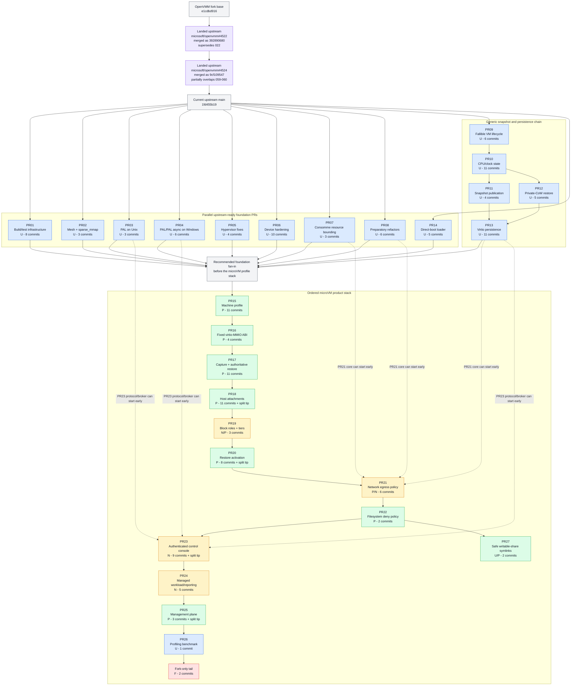

# OpenVMM Micro-VM PR Strategy

## Scope

- OpenVMM fork base: `e1cdbd916d3aacb216309c8e7779b832546759a1`.
- OpenVMM fork tip: `2728f33ea9a44d2d0fb956d9f01768ae2100fb62`.
- Upstream main: `1fd455b19e7c69c72a2d375d0ed1cb35d901c688` (2026-10-01), 18 commits past
  the fork base.

## Upstream status

Two of the 18 upstream commits since the fork base overlap work represented in the fork chain.
One supersedes a whole fork commit; the other supplies lifecycle infrastructure that parts of two
fork commits duplicate. The other 16 do not implement roadmap items.

| Fork position(s) | Fork commit(s) | Upstream PR | Upstream commit | Status |
| --- | --- | --- | --- | --- |
| 022 (PR05) | `9b3ce6760` (`46e43f8fa` on `fix-virt_mshv`) - kvm: preserve pending external interrupts across VP-state capture | microsoft/openvmm#4522 | `392890680` | Superseded; drop from the fork chain |
| 059-060 (PR10) | `b7bc2586b`, `00bced019` - MSHV/WHP restored-clock synchronization | microsoft/openvmm#4524 | `9cf109547` | Partial overlap; reuse upstream `PartitionTimeControl`, but retain the frequency and restored-TSC work |

microsoft/openvmm#4522 fixes the same lost-PIC-interrupt bug in a different way. Instead of
tracking the queued vector in `kvm::VpRunner`, it injects PIC interrupts through the vCPU's
injected-interrupt slot (`KVM_SET_VCPU_EVENTS`), which the existing activity save/restore already
covers. As a result:

- PR05 shrinks to four upstreamable commits after 022 is dropped. The published
  `origin/fix-virt_mshv` branch is still based on `e1cdbd916` and still contains 022; its current
  five-commit history runs from `f09d89a37` through `092ab9352`. Rebuild it on current upstream
  main and omit `46e43f8fa`.
- Rebasing the fork chain onto `1fd455b19` must drop 022. Of the later commits that touch the same
  `kvm` and `virt_kvm` files (055, 056, 058, 109), only 109 conflicts with microsoft/openvmm#4522,
  trivially: in
  `vmm_core/virt_kvm/src/arch/x86_64/mod.rs`, keep both its `mod cpu_contract;` and upstream's
  `mod extint;`. No other fork commit uses the extint APIs that 022 added or that
  microsoft/openvmm#4522 renamed (`inject_extint_interrupt` is now `queue_extint_interrupt`).
- Fork builds that include 022 can save a queued PIC vector as a pending `ExtInt` event.
  microsoft/openvmm#4522 never saves one and rejects restoring one with `KvmError::InvalidState`,
  so KVM snapshots captured before the rebase may fail to restore after it. Recapture them.

microsoft/openvmm#4524 adds the generic `PartitionTimeControl` contract, MSHV and WHP
implementations, and full-VM freeze/thaw lifecycle calls. That supersedes the private freeze/thaw
plumbing inside positions 059 and 060, but not their exact TSC-frequency exposure, snapshot
downtime handling, or restored-vCPU synchronization. Positions 057-061 and the position 160 fixup
therefore remain in the roadmap: rework 059-060 to use the upstream contract, then reapply 160 to
the resulting MSHV synchronization code. No remaining fork commit is patch-equivalent to current
upstream main.

## Legend

| Class | Meaning |
| --- | --- |
| U | Independently upstreamable |
| P | Upstreamable as part of an accepted microVM profile |
| N | NVX product policy; fork-only unless generalized |
| F | Fork-only |

Solid arrows in the diagram are the recommended landing/stacking order. Dashed arrows show work
that can start before the product stack reaches that PR. Purple nodes mark upstream changes that
supersede or partially overlap fork work.

## PR Dependency and Submission Graph



## Actual branch DAG

The physical branch is one first-parent chain:

```text
e1cdbd916
  -> PR01 [001-008] -> PR02 [009-011] -> PR03 [012-014]
  -> PR04 [015-020] -> PR05 [021-025] -> PR06 [026-035]
  -> PR07 [036-038] -> PR08 [039-044] -> PR09 [045-050]
  -> PR10 [051-061] -> PR11 [062-065] -> PR12 [066-070]
  -> PR13 [071-081] -> PR14 [082-086] -> PR15 [087-097]
  -> PR16 [098-101] -> PR17 [102-112] -> PR18 [113-122]
  -> PR19 [123-125] -> PR20 [126-132] -> PR21 [133-138]
  -> PR22 [139-140] -> PR23 [141-149] -> PR24 [150-154]
  -> PR25 [155-156] -> PR26 [157] -> fork tail [158-159]
  -> PR20 fixup [160] -> PR20/PR25 split [161]
  -> PR18/PR23 split [162]
  -> PR18 fixup [163] -> PR25 fixup [164] -> PR27 [165-166]
  -> 2728f33ea
```

For upstream review, PR01-PR08 and PR14 can be rebased independently onto current upstream main.
PR09-PR13 form the generic dependency chain shown above. The recommended product queue then
fans those foundations into PR15 and keeps PR15-PR26 ordered. PR21's generic enforcement commits
can be prepared after PR07, PR08, and PR13; PR23's protocol and broker commits can be prepared
after PR03, PR04, and PR13. Drop position 022, which landed upstream as microsoft/openvmm#4522
(see [Upstream status](#upstream-status)). Positions 158-159 remain outside the upstream queue.
Fold position 160 into PR20, split position 161 between PR20 and PR25, and split position 162
between PR18 and PR23 before submission. Fold position 163 into PR18's position 113 and position
164 into PR25's position 155. PR27 can be prepared once PR22 lands; its generic confinement commit
can be submitted independently if preferred.

## PR summary

`N + split` means N whole commits plus selected hunks from a physical commit. Fixup positions count
as whole physical commits here but should be folded into their target commits before submission.

| PR | Class | Topic | Actual positions | Actual commit range(s) | Count | Recommended direct dependency |
| --- | --- | --- | ---: | --- | ---: | --- |
| PR01 | U | Build and test infrastructure | 001-008 | `8b31625e9..003d56c1f` | 8 | Current upstream |
| PR02 | U | Host primitives: mesh and sparse_mmap | 009-011 | `f07aa5f3c..e6c6c0dfe` | 3 | Current upstream |
| PR03 | U | Host primitives: PAL on Unix | 012-014 | `568b2b348..0de137158` | 3 | Current upstream |
| PR04 | U | Host primitives: PAL and PAL async on Windows | 015-020 | `501d5ddbb..01b7adbf6` | 6 | Current upstream |
| PR05 | U | Hypervisor backend fixes | 021, 023-025 (022 landed upstream) | `88865bf90`; `072a7841f..a8f5a03aa` | 4 | Current upstream `1fd455b19` |
| PR06 | U | Device fixes and hardening | 026-035 | `4e396f9df..54c5c34cd` | 10 | Current upstream |
| PR07 | U | Consomme resource bounding | 036-038 | `c463c8957..99c6fec26` | 3 | Current upstream |
| PR08 | U | Preparatory refactors | 039-044 | `dd349021e..bd2158d7d` | 6 | Current upstream |
| PR09 | U | Fallible and bounded VM lifecycle | 045-050 | `ac994e467..a40676941` | 6 | Current upstream |
| PR10 | U | Portable CPU and clock state | 051-061 | `c1be51ed4..b3070731e` | 11 | PR09; reuse microsoft/openvmm#4524 time control |
| PR11 | U | Snapshot publication protocol | 062-065 | `eea6dff56..f6a4471fc` | 4 | PR10 |
| PR12 | U | Immutable private-CoW restore | 066-070 | `16a340484..91ca89d0c` | 5 | PR10 |
| PR13 | U | Generic virtio persistence | 071-081 | `6bf6fe22d..18869b05e` | 11 | PR11 + PR12 |
| PR14 | U | Firmware-less direct boot, loader half | 082-086 | `977b518d1..0ee411e5c` | 5 | Current upstream |
| PR15 | P | microVM machine profile and minimal chipset | 087-097 | `b05cc3ec1..f68f2c6ab` | 11 | Foundation fan-in |
| PR16 | P | Fixed virtio-MMIO ABI and shared interrupt status | 098-101 | `354815ec8..9686e9460` | 4 | PR15 |
| PR17 | P | microVM snapshot capture and authoritative restore | 102-112 | `2ce524409..56a2cdd15` | 11 | PR16 |
| PR18 | P | microVM host attachments and device persistence | 113-122; 162 (split); 163 (fixup) | `f802e90f2..7e8fa8d09`; `885fde30f` (split); `dc61c5189` | 11 + split | PR17 |
| PR19 | N/P | Sandbox block roles and snapshot tiers | 123-125 | `2236eb7c1..409efdd84` | 3 | PR18 |
| PR20 | P | Restore-time processor and memory activation | 126-132; 160-161 | `34ca126b5..e3a0ccfa7`; `842f5e3fd..b26d19cec` | 8 + split | PR19 |
| PR21 | P/N | Network egress policy | 133-138 | `8aac9a8d2..5865c2ec6` | 6 | PR20; core can start after PR07 + PR08 + PR13 |
| PR22 | P | Filesystem deny policy | 139-140 | `d085f44f3..dbe0903f1` | 2 | PR21 |
| PR23 | N | Authenticated control console | 141-149; 162 (split) | `4296c40af..868601037`; `885fde30f` (split) | 9 + split | PR22; protocol/broker can start after PR03 + PR04 + PR13 |
| PR24 | N | Managed workload and outcome reporting | 150-154 | `9d4ebe19d..e211e604d` | 5 | PR23 |
| PR25 | P | Management plane | 155-156; 161 (split); 164 (fixup) | `9354e0960..9a60f9f13`; `b26d19cec` (split); `cb6bf8064` | 3 + split | PR24 |
| PR26 | U | Profiling benchmark | 157 | `980a2e7e9` | 1 | PR25 in the current stack |
| PR27 | U/P | Safe symlinks for writable microVM shares | 165-166 | `8f8eca239..2728f33ea` | 2 | PR22; position 165 can land independently |
| Fork tail | F | CI guards and NVX wire compatibility | 158-159 | `40380585d..c94a280d2` | 2 | PR26; do not submit upstream |

## Exact commit-to-PR mapping

Positions 161 and 162 intentionally appear under two PRs because their commits must be split when
forming submission branches. Positions 163 and 164 are fixups that should be folded into positions
113 and 155, respectively. Tip positions 160-164 are listed under their destination PRs rather
than in numerical order. The counts distinguish whole commits from selected split hunks.
Struck-through entries have landed upstream and are excluded from the counts; partial upstream
overlap is called out without striking the remaining fork work.

<details>
<summary><strong>PR01 - Build and test infrastructure (U)</strong> - 8 commits</summary>

- 001 `8b31625e9` - build: keep Winsock eagerly imported on Windows
- 002 `607e6c6a2` - nextest: scope a longer budget to the exhaustive ring-buffer loom test
- 003 `53594392c` - flowey: distinguish native Windows and WSL nextest paths
- 004 `ff1746110` - flowey: skip reinstalling an identical, possibly running cargo-nextest binary
- 005 `fe6bd7773` - flowey: keep caller temp directories for native local VMM-test runs
- 006 `fea2e8992` - lxutil: tolerate inherited extended attributes in tests
- 007 `b74d4e6c9` - consomme: make TCP window-reopen validation deterministic
- 008 `003d56c1f` - virt_whp, petri: enable native PCIe NVMe boot on WHP

</details>

<details>
<summary><strong>PR02 - Host primitives: mesh and sparse_mmap (U)</strong> - 3 commits</summary>

- 009 `f07aa5f3c` - mesh_protobuf: clone type-erased messages and expose encoded length
- 010 `26f8f7c99` - sparse_mmap: add private copy-on-write file views
- 011 `e6c6c0dfe` - sparse_mmap: flush file-backed ranges with bounded concurrency

</details>

<details>
<summary><strong>PR03 - Host primitives: PAL on Unix (U)</strong> - 3 commits</summary>

- 012 `568b2b348` - pal: bound Linux descriptor-table pre-expansion
- 013 `7b173b653` - pal: add Unix extent cloning and sparse-extent seeking
- 014 `0de137158` - pal: query Unix socket peer credentials

</details>

<details>
<summary><strong>PR04 - Host primitives: PAL and PAL async on Windows (U)</strong> - 6 commits</summary>

- 015 `501d5ddbb` - pal: add handle-relative file access that does not follow reparse points
- 016 `b36a4755e` - pal: add sparse-file range queries, zeroing, and block cloning
- 017 `c61d77644` - pal: create files and directories with explicit security descriptors
- 018 `a3f124a59` - pal: resolve the process token user SID
- 019 `ea77a73e8` - pal: query named-pipe peers and create protected pipes
- 020 `01b7adbf6` - pal_async: fix named-pipe reconnect and already-connected listen

</details>

<details>
<summary><strong>PR05 - Hypervisor backend fixes (U)</strong> - 4 commits + 1 landed upstream</summary>

- 021 `88865bf90` - virt_mshv: describe SNP guest workarounds without ACI-specific names
- ~~022 `9b3ce6760` - kvm: preserve pending external interrupts across VP-state capture~~
  (**landed upstream**: superseded by microsoft/openvmm#4522, merged as `392890680`)
- 023 `072a7841f` - virt_mshv: make RUN_VP cancellation race-free
- 024 `752ff3ab5` - virt: add Partition::finalize_memory; create the MSHV BSP after finalization
- 025 `a8f5a03aa` - virt_mshv: persist and redeliver pending external interrupts

</details>

<details>
<summary><strong>PR06 - Device fixes and hardening (U)</strong> - 10 commits</summary>

- 026 `4e396f9df` - chipset: preserve IOAPIC line levels across restore
- 027 `e9946b279` - chipset: fast-forward periodic PIT counting over long intervals
- 028 `55e4a809f` - virtio_blk: let stop cancellation win over a ready queue and drain accepted I/O
- 029 `947ae858b` - virtio: make interrupt tests wait for queue completion
- 030 `21c2206c9` - fuse: rate-limit guest-triggerable diagnostics
- 031 `cb0b3cde1` - virtiofs: make handle and inode ID allocation fallible
- 032 `2400875db` - virtiofs: bound guest payload allocations and rate-limit diagnostics
- 033 `6d64c181d` - serial_socket: drop the connection on any write failure
- 034 `a60e1210b` - serial_socket: keep Windows named-pipe listeners reconnectable
- 035 `54c5c34cd` - virtio_console: rate-limit worker errors

</details>

<details>
<summary><strong>PR07 - Consomme resource bounding (U)</strong> - 3 commits</summary>

- 036 `c463c8957` - consomme: bound active TCP, UDP, and ICMP flows
- 037 `4f543e1de` - consomme: cover the pending DNS request limit with a test
- 038 `99c6fec26` - consomme: cover IPv4 fragment rejection with a test

</details>

<details>
<summary><strong>PR08 - Preparatory refactors (U)</strong> - 6 commits</summary>

- 039 `dd349021e` - openvmm_entry: accept `delay:<ms>:<disk>` disk wrappers
- 040 `67fda13c7` - openvmm_helpers: split the snapshot module without behavior changes
- 041 `dea3b95d3` - net_tap: move the transmit path into its own module
- 042 `57a52c8fa` - net_consomme: move queue transmit processing into a module
- 043 `e63353b3d` - virtio_console: move the direct receive loop into its own module
- 044 `bd2158d7d` - openvmm_entry: skip raw console mode when stdin is not a terminal

</details>

<details>
<summary><strong>PR09 - Fallible and bounded VM lifecycle (U)</strong> - 6 commits</summary>

- 045 `ac994e467` - state_unit: make unit start fallible and roll back partial starts
- 046 `16529618a` - vmcore: add fallible device start through chipset device workers
- 047 `d5f89e064` - openvmm: make VM resume fallible
- 048 `7d578ecb7` - state_unit: record the exact unit inventory in saved state
- 049 `dcf754250` - state_unit: add bounded quiesce transactions with rollback classification
- 050 `a40676941` - vmcore: add device input quiesce and resume

</details>

<details>
<summary><strong>PR10 - Portable CPU and clock state (U)</strong> - 11 commits</summary>

- 051 `c1be51ed4` - vmcore, state_unit: advance guest time across stopped downtime
- 052 `0831fcbdf` - chipset: persist and advance the RTC clock
- 053 `76b157b0e` - chipset: reject inconsistent RTC interrupt state on restore
- 054 `8f7e3f94f` - chipset: catch up the PIT after downtime
- 055 `9dc92d334` - virt: define a canonical x86 CPU compatibility contract
- 056 `14b985ea5` - virt: add portable TSC-deadline VP state and APIC-timer advance
- 057 `d7e676ece` - virt: add exact TSC-frequency helpers and snapshot clock hooks
- 058 `fd20fd85b` - virt_kvm: save and restore exact TSC and kvm-clock state
- 059 `b7bc2586b` - virt_mshv: synchronize restored vCPU clocks and expose the exact TSC frequency
- 060 `00bced019` - virt_whp: synchronize restored vCPU clocks and keep SMP TSC reads coherent
- 061 `b3070731e` - vmm_core: advance VP TSC and APIC timers across downtime

Positions 059-060 partially overlap microsoft/openvmm#4524. Keep their exact-frequency and
restored-TSC synchronization work, but replace their private partition freeze/thaw plumbing with
upstream's `PartitionTimeControl` implementation during rebase.

</details>

<details>
<summary><strong>PR11 - Snapshot publication protocol (U)</strong> - 4 commits</summary>

- 062 `eea6dff56` - openvmm_defs: add opt-in snapshot lifecycle profiling
- 063 `388d52800` - openvmm_helpers: version the snapshot manifest format and bound its decoding
- 064 `9f680d5b3` - openvmm_helpers: publish snapshots atomically through durable staging
- 065 `f6a4471fc` - openvmm: publish the exact file-backed RAM handle

</details>

<details>
<summary><strong>PR12 - Immutable private-CoW restore (U)</strong> - 5 commits</summary>

- 066 `16a340484` - membacking: map guest RAM privately copy-on-write with fault accounting
- 067 `6fa7e4cba` - openvmm_helpers: open snapshots once and read artifacts relative to the directory
- 068 `a8c616b10` - openvmm: restore RAM through a private CoW mapping and retain generation handles
- 069 `8765361d4` - openvmm: signal restore readiness to a local socket or pipe
- 070 `91ca89d0c` - virt_whp: resolve unmapped-GPA faults and register restored RAM lazily

</details>

<details>
<summary><strong>PR13 - Generic virtio persistence (U)</strong> - 11 commits</summary>

- 071 `6bf6fe22d` - virtio: add device-private saved state with deferred activation and serialized kicks
- 072 `415eed04b` - virtio: forward input quiesce and resume through transports
- 073 `fd4ab02c5` - virtio_console: add attachment identities and reconnect and disconnect policies
- 074 `65442cd4e` - virtio_console: persist buffered direct-console I/O
- 075 `df730819b` - net_backend: add an endpoint queue quiesce contract
- 076 `ebc1ef345` - net_tap: quiesce queues and retain pending transmit ownership
- 077 `6614bc41e` - net_consomme: quiesce endpoint queues
- 078 `bb0544114` - consomme: add an exact static IPv4 and gateway identity
- 079 `5bed17bdc` - virtio_net: persist drained queue state for static-identity NICs
- 080 `5066f52d4` - fuse: save and restore negotiated session state
- 081 `18869b05e` - virtiofs: track inode aliases through link, rename, and unlink

</details>

<details>
<summary><strong>PR14 - Firmware-less direct boot, loader half (U)</strong> - 5 commits</summary>

- 082 `977b518d1` - loader_defs: name the boot_params ACPI RSDP field
- 083 `f840a0c14` - loader: let static ELF loading reuse a caller buffer
- 084 `25326daf4` - loader: add an Intel MP 1.4 table builder
- 085 `1adbd9f87` - loader: add firmware-less Linux direct boot with MP tables
- 086 `0ee411e5c` - vmm_core: make level-triggered legacy IRQs explicit

</details>

<details>
<summary><strong>PR15 - microVM machine profile and minimal chipset (P)</strong> - 11 commits</summary>

- 087 `b05cc3ec1` - openvmm_defs: add machine-profile selection
- 088 `cf523f95b` - virt: describe the deterministic microVM topology
- 089 `d99e685c9` - chipset: add an RTC mode seam
- 090 `abd20e652` - vm_manifest_builder: add the minimal microVM base chipset without ACPI
- 091 `76ce1a5ac` - vmm_core: add status-bearing guest power-off
- 092 `a39fe4806` - chipset: add the microVM portb console
- 093 `073018af8` - chipset: add the microVM shutdown and exit-status port
- 094 `9d8f017f7` - openvmm_core: boot microVMs through MP-table direct load
- 095 `a0a3dd45f` - openvmm_core: reject host save, pulse save/restore, and worker restart for microVMs
- 096 `345a97dba` - openvmm_entry: expose `--machine microvm`
- 097 `f68f2c6ab` - petri, vmm_tests: add a microVM builder, portb harness, and cold-boot test

</details>

<details>
<summary><strong>PR16 - Fixed virtio-MMIO ABI and shared interrupt status (P)</strong> - 4 commits</summary>

- 098 `354815ec8` - virtio: allow feature masking for virtio-MMIO devices
- 099 `b298c23dc` - openvmm: place virtio devices at fixed microVM MMIO slots
- 100 `589c217c4` - virtio: add shared MMIO interrupt status and ACK doorbells
- 101 `9686e9460` - openvmm: use shared interrupt status for fixed microVM slots

</details>

<details>
<summary><strong>PR17 - microVM snapshot capture and authoritative restore (P)</strong> - 11 commits</summary>

- 102 `2ce524409` - vmm_core: stop VPs at a deferred-I/O boundary
- 103 `c8da54eec` - chipset: add the microVM snapshot-request port
- 104 `637cd1034` - openvmm_core: establish the post-OUT snapshot boundary in the worker
- 105 `3b5bb4ecd` - openvmm_core: fence management mutations during snapshot boundaries
- 106 `5221003da` - openvmm_helpers: define the authoritative microVM machine contract
- 107 `534f68886` - openvmm_core: propagate the guest TSC frequency for snapshot-capable cold boots
- 108 `5751cf356` - openvmm_entry: capture guest-requested microVM snapshots
- 109 `6f19f3fe2` - virt: build a reproducible CPU and clock contract for microVM partitions
- 110 `2c43a1865` - openvmm_core: validate restored CPU and clock contracts and apply host downtime
- 111 `12ba2a3b9` - openvmm_entry: restore microVMs authoritatively
- 112 `56a2cdd15` - vmm_tests: check that an unconfigured microVM snapshot request continues

</details>

<details>
<summary><strong>PR18 - microVM host attachments and device persistence (P)</strong> - 11 commits + split tip</summary>

- 113 `f802e90f2` - openvmm_entry: add connect= serial backends with bounded timeouts
- 114 `38177c6bf` - openvmm: persist the microVM boot console and rebuild its attachment on restore
- 115 `085961760` - openvmm: attach a portable Consomme NIC to microVMs
- 116 `fd2ac5133` - openvmm: persist the microVM NIC and restore a fresh endpoint generation
- 117 `1ba29fc49` - net_tap: support persistent TAP attachments
- 118 `a139f7cd7` - virtiofs: add the fixed microVM filesystem profile
- 119 `f716cef39` - openvmm_entry: expose `--mount` for the microVM HostFs slot
- 120 `0eb2e5b00` - virtiofs: persist microVM FUSE namespaces, handles, and directory cookies
- 121 `f68d1eae3` - openvmm: snapshot the microVM filesystem and revalidate it on restore
- 122 `7e8fa8d09` - openvmm: reserve a dormant microVM filesystem slot
- 162 `885fde30f` - Restore listener endpoint rebinding (**split with PR23**: boot-listener and shared attachment-contract portions belong in PR18; authenticated control-listener portions belong in PR23)
- 163 `dc61c5189` - openvmm_entry: compile connect_serial without the RPC features (**fold into 113**)

</details>

<details>
<summary><strong>PR19 - Sandbox block roles and snapshot tiers (N/P)</strong> - 3 commits</summary>

- 123 `2236eb7c1` - openvmm: add fixed-role microVM sandbox block slots
- 124 `b94811f13` - openvmm: snapshot sandbox blocks with paired or fresh scratch
- 125 `409efdd84` - openvmm: add clone and resume tiers with single-use resume claims

</details>

<details>
<summary><strong>PR20 - Restore-time processor and memory activation (P)</strong> - 8 commits + split tip</summary>

- 126 `34ca126b5` - chipset: expose a stable generation ID and restore entropy on portb
- 127 `782f822ca` - openvmm: gate external input until post-restore repair completes
- 128 `b80b54fc7` - vmm_core: instantiate an active VP prefix
- 129 `15313864a` - openvmm: bring a restore-time processor prefix online
- 130 `d23857033` - openvmm_core: back expandable restore RAM with fresh private memory
- 131 `e01fb70c3` - openvmm: add bounded restore-time memory expansion
- 132 `e3a0ccfa7` - openvmm_entry: pre-expand the Linux descriptor table at startup
- 160 `842f5e3fd` - virt_mshv: synchronize restored TSCs only on created VPs
- 161 `b26d19cec` - openvmm_core: instantiate only the requested VP prefix on MSHV restore (**split with PR25**: worker and backend changes belong in PR20; the gRPC reference hunk belongs in PR25)

</details>

<details>
<summary><strong>PR21 - Network egress policy (P/N)</strong> - 6 commits</summary>

- 133 `8aac9a8d2` - net_backend_resources: define a canonical bound IPv4 egress policy
- 134 `5330b0cb4` - net_backend: let endpoints accept a run-scoped egress policy
- 135 `5cb02a192` - net_consomme: enforce the egress policy on final transmitted bytes
- 136 `94b189785` - net_tap: enforce the egress policy on TAP transmit
- 137 `76d3ec0de` - virtio_net: install and prefilter the egress policy
- 138 `5865c2ec6` - openvmm: add microVM network egress policy and bind it into snapshots

</details>

<details>
<summary><strong>PR22 - Filesystem deny policy (P)</strong> - 2 commits</summary>

- 139 `d085f44f3` - virtiofs: enforce denied subtrees by object identity
- 140 `dbe0903f1` - openvmm: add --mount-deny and record denied paths in snapshots

</details>

<details>
<summary><strong>PR23 - Authenticated control console (N)</strong> - 9 commits + split tip</summary>

- 141 `4296c40af` - serial_core: expose local peer identity and active-peer eviction
- 142 `297e593a3` - serial_socket: report Unix and named-pipe peer identities
- 143 `d671447d3` - virtio_console: define the control-session record protocol
- 144 `d3c37ceb4` - virtio_console: add the control-session broker state machine
- 145 `cf99b6a67` - virtio_console: attach the broker to serial I/O with receive credits
- 146 `6dc780a9c` - virtio_console: save and restore broker state
- 147 `a9996abd1` - openvmm: reserve the dedicated microVM control-console slot
- 148 `96056b299` - openvmm_helpers: record the control console in the microVM machine contract
- 149 `868601037` - openvmm_entry: add authenticated microVM control-console endpoints
- 162 `885fde30f` - Restore listener endpoint rebinding (**split with PR18**: authenticated control-listener portions belong in PR23; boot-listener and shared attachment-contract portions belong in PR18)

</details>

<details>
<summary><strong>PR24 - Managed workload and outcome reporting (N)</strong> - 5 commits</summary>

- 150 `9d4ebe19d` - openvmm_entry: drain portb output before guest-requested exit
- 151 `7b8f2878d` - openvmm: add a fixed non-root workload identity
- 152 `921aa9caa` - openvmm: support a managed workload lifecycle
- 153 `a264cdacd` - openvmm_entry: write bounded microVM outcome reports
- 154 `e211e604d` - Guide: describe teardown after a failed snapshot boundary

</details>

<details>
<summary><strong>PR25 - Management plane (P)</strong> - 3 commits + split tip</summary>

- 155 `9354e0960` - vmservice: create, capture, and restore microVMs over the management RPC
- 156 `9a60f9f13` - ttrpc: propagate nonzero guest exit status
- 161 `b26d19cec` - openvmm_core: instantiate only the requested VP prefix on MSHV restore (**split with PR20**: the gRPC reference hunk belongs in PR25; worker and backend changes belong in PR20)
- 164 `cb6bf8064` - openvmm_entry: gate RPC-only microVM helpers behind the RPC features (**fold into 155**)

</details>

<details>
<summary><strong>PR26 - Profiling benchmark (U)</strong> - 1 commit</summary>

- 157 `980a2e7e9` - openvmm_helpers: add a publication and private-restore benchmark

</details>

<details>
<summary><strong>PR27 - Safe symlinks for writable microVM shares (U/P)</strong> - 2 commits</summary>

- 165 `8f8eca239` - lxutil: add path confinement that never follows symbolic links
- 166 `2728f33ea` - virtiofs: allow symlink creation on read-write microVM shares

</details>

<details>
<summary><strong>Fork-only tail (F)</strong> - 2 commits</summary>

- 158 `40380585d` - ci: restrict privileged, self-hosted, and publishing jobs to microsoft/openvmm
- 159 `c94a280d2` - vmservice: keep NVX wire-tag compatibility

</details>
