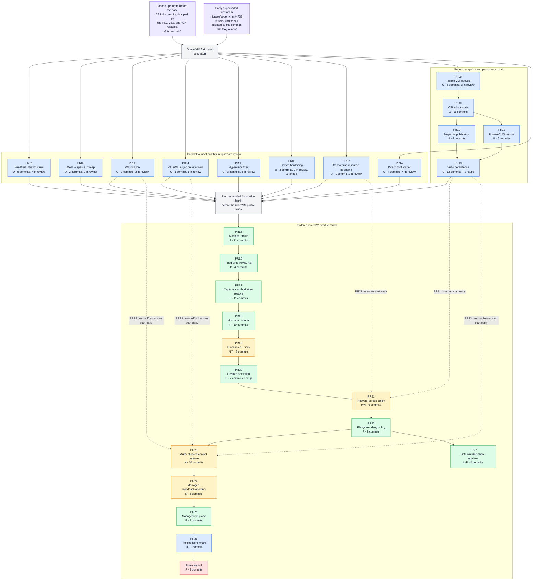

# OpenVMM Micro-VM PR Strategy

## Scope

- OpenVMM fork base: `c6d3da0ffc520d1386c314503ea07c506a3b866b`, upstream main on 2026-11-02.
  The `feature/microvm/release/v4.0` reorganization moved the chain there from
  `b2676222b383bf50c7022f6a5983920421469a47`; see [Upstream status](#upstream-status).
- Mapped fork tip: `3cdf4fe3834cfb90b9ee685875493bc9bff1b7a4`, position 135. The graph, PR
  summary, and commit mapping below cover positions 001-135, the PR20 fixup at position 152, PR06's
  read fix at position 217, and the PR13 fixups at positions 218 and 219.
- NVX's pinned OpenVMM revision: `6fb64731f03314a3c5ee634d3c85d6782a5babe0`, position 219. Positions
  217-219, which microsoft/openvmm#4952 proposes for `feature/microvm/dev`, are three commits on
  position 216, `14dc4116e`, the head of `feature/microvm/dev`. microsoft/openvmm#4921 landed
  positions 215 and 216 there by fast-forward, as microsoft/openvmm#4916 landed position 214, and
  microsoft/openvmm#4894, microsoft/openvmm#4886, and microsoft/openvmm#4887 landed positions
  211-213 on position 210, `eda13d80a`, the head of the `feature/microvm/release/v4.0` branch of
  microsoft/openvmm. The v4.0 reorganization moved the 205
  commits of `feature/microvm/release/v3.0` and the NVX pin before it, `35e76265f`, onto
  `c6d3da0ff`. It dropped the eight commits whose changes upstream had landed or superseded, retired
  the fallible device start that microsoft/nvx#1232 replaces with awaited device restoration, folded
  that restoration into the commits that it changes, and added 14 commits that give each ABI that
  the chain introduces a single version; see [The v4.0 reorganization](#the-v40-reorganization). The
  pin is 84 commits past the mapped tip on the same first-parent chain. Positions 136-216, except
  the PR20 fixup at position 152, are not yet assigned to PRs; see
  [Commits after the mapped tip](#commits-after-the-mapped-tip).
- Upstream main: `ca6b2b177da5e33ae1bcac72986b31d6b039811c` (2026-11-02), one commit past the
  fork base; see [Upstream main past the fork base](#upstream-main-past-the-fork-base).

## Upstream status

The `feature/microvm/release/v4.0` reorganization moved the 205-commit chain of
`feature/microvm/release/v3.0`, through NVX's previous pin `35e76265f`, from `b2676222b` onto
`c6d3da0ff`, 30 upstream commits later. It dropped v3.0 positions 010, 012, 017, and 022-025,
whose changes upstream had landed, and position 016, whose stop cancellation
microsoft/openvmm#4835 supersedes; [Landed upstream](#landed-upstream) lists them. Replaying the
remaining commits had conflicts at 16 positions, which
[Conflicts of the v4.0 rebase](#conflicts-of-the-v40-rebase) lists, and two fixups adapted
positions 017 and 128 to upstream changes that no textual conflict exposed. The reorganization
then retired the fallible device start of v3.0 position 027, folded microsoft/nvx#1232's awaited
device restoration into the chain, and added the ABI restart at positions 197-210; see
[The v4.0 reorganization](#the-v40-reorganization).

The `feature/microvm/release/v3.0` reorganization moved the chain of
`feature/microvm/release/v2.4` from `27fe0c64f` onto `b2676222b`, two upstream commits later.
Upstream had landed v2.4 position 016 in a revised form as microsoft/openvmm#4583, so the
reorganization dropped it. microsoft/openvmm#4829 makes cancelled `pal_async` event waits
reusable and changes no file of the chain except `Cargo.lock`, where it adds a line that the chain
does not touch. Replaying the remaining 385 commits had no conflicts. The reorganization then
regrouped them into 200 commits without changing the tree: the pin's tree, `652f88f95`, is
the tree of that replay, the rebase of `feature/microvm/release/v2.4` onto `b2676222b` without
position 016; see [The v3.0 reorganization](#the-v30-reorganization).

The `feature/microvm/release/v2.4` rebase moved the 380-commit chain of
`feature/microvm/release/v2.3` from `22c0485be` onto `27fe0c64f`, 76 upstream commits later. It
dropped the ten commits whose changes upstream had landed, v2.3 positions 003, 005, 009, 012,
015, 017, 023, 030, 031, and 036, and resolved conflicts at 45 positions, which
[Conflicts of the v2.4 rebase](#conflicts-of-the-v24-rebase) lists at their v3.0 positions. It
added sixteen fixups at its tip, v2.4 positions 371-386, which adapted the chain to upstream
changes that no textual conflict exposed; the v3.0 reorganization folded them into the commits
that they fix.

The `feature/microvm/release/v2.3` rebase moved the 334-commit chain of
`feature/microvm/release/v2.2` from `790132851` onto `22c0485be`, 23 upstream commits later. It
dropped position 074, whose change microsoft/openvmm#4661 had landed upstream, resolved seven
commits that conflicted, and added four fixups at its tip, v2.4 positions 324-327, which the
v3.0 reorganization folded too.

The `microvm/v2.2` rebase moved the 320-commit chain of `microvm/v2.1` from `e1cdbd916` onto
`790132851`, 75 upstream commits later. It dropped the eight fork commits that had landed
upstream in between and adapted the remaining 312 to upstream API changes where they needed it,
which changed the diffs of 50 of them.

### Landed upstream

| Dropped by | Former position | Fork commit | Roadmap PR | Upstream PR | Upstream commit |
| --- | ---: | --- | --- | --- | --- |
| v4.0 | 010 | `1a8bc4363` - pal: add handle-relative file access that does not follow reparse points | PR04 | microsoft/openvmm#4593 | `789d51653` |
| v4.0 | 012 | `d25e0e13f` - pal_async: fix named-pipe reconnect and already-connected listen | PR04 | microsoft/openvmm#4585 | `03e8ae741` |
| v4.0 | 016 | `47102941e` - virtio_blk: let stop cancellation win over a ready queue and drain accepted I/O | PR06 | microsoft/openvmm#4835, which supersedes it | `79e67ae36` |
| v4.0 | 017 | `41460f3f7` - virtiofs: make handle and inode ID allocation fallible | PR06 | microsoft/openvmm#4594 | `389e4e57a` |
| v4.0 | 022 | `38998a580` - openvmm_helpers: split the snapshot module without behavior changes | PR08 | microsoft/openvmm#4616 | `0812555fe` |
| v4.0 | 023 | `313b5fe0b` - net_tap: move the transmit path into its own module | PR08 | microsoft/openvmm#4617 | `c696625c6` |
| v4.0 | 024 | `238c6cc96` - net_consomme: move queue transmit processing into a module | PR08 | microsoft/openvmm#4620 | `3bb37a191` |
| v4.0 | 025 | `c1bd1e0a5` - virtio_console: move the direct receive loop into its own module | PR08 | microsoft/openvmm#4621 | `2a17dfdd5` |
| v3.0 | 016 | `f5231b2d2` - chipset: preserve IOAPIC line levels across restore | PR06 | microsoft/openvmm#4583 | `db4331e53` |
| v2.4 | 003 | `0213cf65d` - flowey: skip reinstalling an identical, possibly running cargo-nextest binary | PR01 | microsoft/openvmm#4608 | `03a2fc597` |
| v2.4 | 005 | `a91dc86fb` - lxutil: tolerate inherited extended attributes in tests | PR01 | microsoft/openvmm#4587 | `a1d71b899` |
| v2.4 | 009 | `15a895dd8` - sparse_mmap: add private copy-on-write file views | PR02 | microsoft/openvmm#4557 | `d8acf2a7c` |
| v2.4 | 012 | `4a7ab405c` - pal: add Unix extent cloning and sparse-extent seeking | PR03 | microsoft/openvmm#4590 | `c62489737` |
| v2.4 | 015 | `074de3406` - pal: add sparse-file range queries, zeroing, and block cloning | PR04 | microsoft/openvmm#4596 | `8f1c36ba5` |
| v2.4 | 017 | `50460c27a` - pal: query named-pipe peers and create protected pipes | PR04 | microsoft/openvmm#4582 | `65db52693` |
| v2.4 | 023 | `938b14343` - chipset: fast-forward periodic PIT counting over long intervals | PR06 | microsoft/openvmm#4586 | `023329997` |
| v2.4 | 030 | `135c503ba` - consomme: cover the pending DNS request limit with a test | PR07 | microsoft/openvmm#4601 | `cd93f761f` |
| v2.4 | 031 | `90734a2ff` - consomme: cover IPv4 fragment rejection with a test | PR07 | microsoft/openvmm#4602 | `3d9cb006a` |
| v2.4 | 036 | `6794f12d0` - openvmm_entry: skip raw console mode when stdin is not a terminal | PR08 | microsoft/openvmm#4606 | `769f2f61f` |
| v2.3 | 074 | `f6e6ff738` - loader_defs: name the boot_params ACPI RSDP field | PR14 | microsoft/openvmm#4661 | `8beae2961` |
| v2.2 | 002 | `607e6c6a2` - nextest: scope a longer budget to the exhaustive ring-buffer loom test | PR01 | microsoft/openvmm#4584 | `9501bb481` |
| v2.2 | 017 | `c61d77644` - pal: create files and directories with explicit security descriptors | PR04 | microsoft/openvmm#4599 | `9fbf965c5` |
| v2.2 | 021 | `88865bf90` - virt_mshv: describe SNP guest workarounds without ACI-specific names | PR05 | microsoft/openvmm#4580 | `40cff1268` |
| v2.2 | 022 | `9b3ce6760` - kvm: preserve pending external interrupts across VP-state capture | PR05 | microsoft/openvmm#4522 | `392890680` |
| v2.2 | 029 | `947ae858b` - virtio: make interrupt tests wait for queue completion | PR06 | microsoft/openvmm#4592 | `5b4656a86` |
| v2.2 | 030 | `21c2206c9` - fuse: rate-limit guest-triggerable diagnostics | PR06 | microsoft/openvmm#4581 | `926827446` |
| v2.2 | 035 | `54c5c34cd` - virtio_console: rate-limit worker errors | PR06 | microsoft/openvmm#4614 | `77ce2aeac` |
| v2.2 | 039 | `dd349021e` - openvmm_entry: accept `delay:<ms>:<disk>` disk wrappers | PR08 | microsoft/openvmm#4610 | `6e0e4fdab` |

A former position counts in the branch that the rebase started from: `microvm/v2.1` for the v2.2
rebase, `feature/microvm/release/v2.2` for the v2.3 rebase, `feature/microvm/release/v2.3` for
the v2.4 rebase, `feature/microvm/release/v2.4` for the v3.0 reorganization, and
`feature/microvm/release/v3.0` for the v4.0 reorganization.
microsoft/openvmm#4661 names the `acpi_rsdp_addr` field of `boot_params` exactly as position 074
did, so the v2.3 rebase dropped 074 as empty. microsoft/openvmm#4554 still carries it, ahead of
positions 055-057.

microsoft/openvmm#4835 makes devices answer task-control requests promptly. Its virtio-blk
tests `stop_drains_one_accepted_write_exactly_once` and `stop_preempts_continuously_ready_queue`
cover what v3.0 position 016 made virtio-blk do, so the v4.0 rebase dropped 016, although its
pull request, microsoft/openvmm#4588, remains open. No later commit of the chain changes
`virtio_blk`.

microsoft/openvmm#4583 saves each IOAPIC input's last observed level as edge-detector history, as
v2.4 position 016 did, but restores the redirection entries, routes, and input history without
evaluating the inputs, which 016 did. A restored asserted level-triggered input therefore raises
its interrupt when its producer republishes it, when the guest's EOI clears the remote IRR, or
when the guest writes its redirection entry, not during the restore itself.

Upstream merged most of the v2.4 drops after review changes, so the v2.4 rebase took upstream's
versions and adapted the later commits to them. microsoft/openvmm#4557 creates a copy-on-write
mappable without the chain's `executable` flag, and on Windows it refuses to unmap or map over
part of a written copy-on-write view. microsoft/openvmm#4582 answers a pipe's peer process
through `PipeExt::get_pipe_peer_process_id` instead of the chain's `pal::windows::pipe::peer`
module, which also had `is_pipe`. microsoft/openvmm#4586 fast-forwards more counting modes, and
microsoft/openvmm#4606 forwards console input in `repl.rs` instead of the `headless` module, which
position 121 creates for the chain's own use, and ends the run when a stdin that is not a
terminal ends, which position 121 confines to machines other than the microVM.
microsoft/openvmm#4587 is identical to v2.3 position 005.

microsoft/openvmm#4522 fixes the lost-PIC-interrupt bug of v2.1 position 022 in a different way.
Instead of tracking the queued vector in `kvm::VpRunner`, it injects PIC interrupts through the
vCPU's injected-interrupt slot (`KVM_SET_VCPU_EVENTS`), which the existing activity save/restore
already covers. Its saved state has no slot for v2.1 position 022's queued vector: KVM snapshots
from builds with position 022 persist a queued PIC vector as a pending `ExtInt` event. Current
builds reject restoring one with `KvmError::InvalidState`, so recapture KVM snapshots that those
builds captured.

Upstream also landed parts of commits that remain in the chain:

- microsoft/openvmm#4556 (`96647c331`) derives `Clone` for `ProtobufMessage` and `ProtobufAny`.
  Position 006 keeps its subject but now only adds `ProtobufAny::value_len` and checks a
  clone in the round-trip test.
- microsoft/openvmm#4524 (`9cf109547`) adds the generic `PartitionTimeControl` contract, MSHV
  and WHP implementations, and full-VM freeze/thaw lifecycle calls. Position 032 reuses the
  MSHV implementation, through fallible freeze and thaw helpers, instead of private plumbing.
  Positions 030-034 keep the exact TSC-frequency exposure, snapshot downtime handling,
  and restored-vCPU synchronization that upstream lacks, and position 101 synchronizes only
  the VPs that a restore creates.
- microsoft/openvmm#4704 (`1c093df84`) adds the architectural `TscDeadline` VP state element,
  the `tsc_deadline` partition capability, and the KVM, MSHV, WHP, and OpenHCL register
  accessors that v2.4 position 038 also added. Position 029 now uses upstream's, so it keeps
  the `tsc_deadline` field of the CPU compatibility contract, the finalized MSHV partition's
  report of no TSC-deadline support, and the LAPIC timer helpers that position 151 deletes
  in favor of those that position 143 adds for the time ABI. Upstream compares a restored
  deadline on partitions that can freeze time, as WHP can, whereas 029 never compared it, so the
  WHP state access of position 033, which reads the deadline before the APIC state,
  discards that read when it restores the deadline.
- microsoft/openvmm#4764 (`29f0adceb`) makes every lxutil volume resolve paths beneath its root
  without following a host symbolic link, as position 134 did for a confined volume, and
  microsoft/openvmm#4783 (`7c92b147e`) rejects unsafe opens. Position 134 now only adds
  `LxVolumeOptions::confine_paths`, which makes a Windows volume create LX symlinks, and runs its
  confinement tests against upstream's implementation. A share therefore needs `openat2`,
  Linux 5.6 or later, where the chain fell back to opening each component with `O_NOFOLLOW`.

### Open upstream pull requests

As of 2026-11-03, every commit of PR01-PR07, PR09, and PR14 except positions 001, 006, 018, 019,
and 023 is in an open upstream pull request; the commits that upstream has since merged are under
[Landed upstream](#landed-upstream), and PR08 has landed whole. Each pull request carries one
commit, except microsoft/openvmm#4554, which carries positions 055-057 after the `boot_params`
field that microsoft/openvmm#4661 has since landed; its ELF and initrd validation was split out
during review and landed as microsoft/openvmm#4667 (`a87971184`). One of those 21 pull requests,
microsoft/openvmm#4625, was a draft, and none had an approving review yet.
microsoft/openvmm#4451, which proposed position 001, was closed without merging, and neither the
remainder of position 006 nor position 023, which the v3.0 reorganization moved into PR09, has
been proposed. microsoft/openvmm#4619, microsoft/openvmm#4622, and microsoft/openvmm#4623, which
proposed the fallible unit start, device start, and VM resume of v3.0 positions 026-028, were
closed in favor of microsoft/nvx#1232: position 018 now only rolls back a partial start, v3.0
position 027 is retired, and position 019's resume stays fallible; see
[The v4.0 reorganization](#the-v40-reorganization). PR10-PR13 and PR15-PR27 have no upstream pull
requests yet.

On 2026-11-04, microsoft/nvx#1260 withdrew position 021 from PR09, since the deadline of the
snapshot quiesce added no safety: microsoft/openvmm#4625, which proposed position 021's bounded
quiesce transactions, was closed, and position 216 removes them, so the next reorganization drops
position 021. microsoft/openvmm#4872, opened on 2026-11-03, proposes position 018's rollback of a
partial start, with review changes that the chain lacks, and microsoft/openvmm#4626, which proposes
position 022's input gate without the deadline that position 216 removes from it, builds on it. So
does microsoft/openvmm#4937, which proposes no chain commit: it makes `StateUnits::stop` fail
instead of panicking when a unit's task has ended, so a rebase onto it adapts the chain's own
callers of `StateUnits::stop`, in the microVM worker's `dispatch/microvm.rs` and
`dispatch/restore.rs`.

On 2026-11-05, microsoft/openvmm#4605 merged as `48e0681e9`, narrowed in review to the read path: a
read error is traced, drops the socket, and is reported as EOF, while writes keep upstream's
handling, which reports a broken pipe as a successful write and keeps the socket. Review settled
disconnect detection in virtio-console instead, with microsoft/openvmm#4778, which every fork base
since v2.4 includes. Position 015, which carried the pull request's first revision and drops the
socket and returns the error on any failed write, therefore has no upstream pull request. The chain
keeps it for output rather than disconnects: a virtio-console with the `Retain` policy of PR13's
position 046 and the portb console of PR15's position 064 keep the guest output written after their
peer leaves only when that write fails, and on Linux a write to an AF_UNIX peer that has closed
fails with `EPIPE`, which upstream's backend reports as successful. Position 015 moves to PR13,
ahead of position 046, so that it goes upstream with the policy that needs it.
microsoft/openvmm#4952 proposes positions 217-219 for `feature/microvm/dev`: position 217
cherry-picks `48e0681e9` for PR06, position 218 explains and tests the write handling of position
015, and position 219 tests that a `Retain` console keeps that output for the next peer. When the
chain moves onto an upstream main that has `48e0681e9`, drop position 217 and keep position 015:
dropping 015 as microsoft/openvmm#4605's commit would make `Retain` consoles and portb lose that
output on Linux.

Position 016's microsoft/openvmm#4609 has the same split: it drops a Windows named pipe on a failed
write, flush, or close, while upstream's named-pipe backend reports a broken pipe on a write as
successful, and a `Retain` console on a named pipe needs that write handling for the same reason.
Position 016 stays whole in PR06. If the review of microsoft/openvmm#4609 narrows it as that of
microsoft/openvmm#4605 did, its write handling joins position 015 in PR13.

| Roadmap PR | Positions | Upstream pull requests, in position order |
| --- | ---: | --- |
| PR01 | 002-005 | microsoft/openvmm#4595, microsoft/openvmm#4618, microsoft/openvmm#4598, microsoft/openvmm#4615 |
| PR02 | 007 | microsoft/openvmm#4558 |
| PR03 | 008-009 | microsoft/openvmm#4589, microsoft/openvmm#4591 |
| PR04 | 010 | microsoft/openvmm#4604 |
| PR05 | 011-013 | microsoft/openvmm#4536, microsoft/openvmm#4607, microsoft/openvmm#4613 |
| PR06 | 014, 016 | microsoft/openvmm#4597, microsoft/openvmm#4609 |
| PR07 | 017 | microsoft/openvmm#4600 |
| PR09 | 018, 020, 022 | microsoft/openvmm#4872, microsoft/openvmm#4624, microsoft/openvmm#4626 |
| PR14 | 055-058 | microsoft/openvmm#4554 (055-057), microsoft/openvmm#4611 |

Stacked pull requests carry their prerequisites' commits: microsoft/openvmm#4609 builds on
microsoft/openvmm#4585, which has merged; microsoft/openvmm#4613 builds on microsoft/openvmm#4536;
and microsoft/openvmm#4626 builds on microsoft/openvmm#4872.
Most of these pull requests have gained review commits that the fork chain does not carry. When
one merges, the next rebase should drop its fork commit, as the `microvm/v2.2`,
`feature/microvm/release/v2.3`, and `feature/microvm/release/v2.4` rebases and the v3.0 and v4.0
reorganizations dropped the 28 above, and adapt later commits to the merged form. For
microsoft/openvmm#4605, which has merged, that commit is position 217, not position 015.

The v3.0 reorganization folded fixups into positions 007, 012, 013, 021, and 058, and the v4.0
reorganization changed positions 018, 021, and 022, whose pull requests lack those changes; see
[The v4.0 reorganization](#the-v40-reorganization) and
[The v3.0 reorganization](#the-v30-reorganization).

### The v4.0 reorganization

The v4.0 reorganization made three changes besides the rebase: it moved microsoft/nvx#1232's
awaited device restoration into the chain in place of the fallible-start design, it added 14
commits that give each ABI that the chain introduces a single version, and it folded three smaller
fixes into the commits that they fix. Every commit of the v4.0 chain builds:
`cargo check --locked --workspace --all-targets` passes at each one, without warnings, on x86_64
Linux and x86_64 Windows.

microsoft/nvx#1232 restores a device's private state while the VM is stopped, so that a device that
cannot restore fails the restore itself, before any VP runs, rather than a later start. Upstream's
awaited chipset restore, microsoft/openvmm#4799, which the fork base includes, carries it through
the chipset and the device workers. The chain therefore no longer needs a fallible start to report
restore errors:

- v3.0 position 026, now position 018, keeps `StateUnits::start`'s rollback of a partial start
  and its refusal to start a unit in a terminal state, but a unit's own `start` cannot fail again,
  as upstream's cannot. A unit task that does not answer leaves its unit in the terminal state
  instead of panicking.
- v3.0 position 027, which made chipset device starts fallible through the device workers, is
  retired: device workers start their devices without an acknowledgement, as upstream's do.
- v3.0 position 053, now position 044, restores device-private state into the stopped device
  task and waits for it, on the virtio-mmio transport, whose save and restore become asynchronous,
  as on PCI. It no longer stages the state for activation at start, at `DRIVER_OK`, at a device
  configuration access, or at a queue kick, and queue kicks signal the queue event directly again,
  as upstream's do. A queue that fails to start at resume stops the queues that did and marks the
  device `DEVICE_NEEDS_RESET`, notifying a driver that has set `DRIVER_OK`. Since the serialized
  kicks are gone, the virtio-blk over virtio-mmio boot test keeps upstream's unstable marking.
- Position 165, time ABI 2, measures the guest TSC offset in the VM's start path, before the state
  units start, instead of in the `time-abi` unit's start, so that a failed measurement fails the
  start; the partition unit no longer depends on the `time-abi` unit. Position 139 likewise starts
  the `time-abi` unit infallibly.
- v3.0 position 028, now position 019, keeps the VM resume fallible: the post-restore input gate,
  the restore readiness event, the TSC offset measurement, and a unit task that does not answer
  fail it. The hardware reseal unit of microsoft/openvmm#4415 keeps its infallible start.

A queue or host backend that fails to start after a successful restore still lets the resume
succeed: the device marks itself `DEVICE_NEEDS_RESET`, which a driver that has set `DRIVER_OK`
sees, and the host logs the failure. microsoft/nvx#1232 requires that a partially activated VM
never report success, which needs the queues and their host backends prepared at restore, as
microsoft/openvmm#4713 proposes, so that requirement remains open there.

The fold changed the patches of 27 commits, positions 018, 021, 022, 024, 044, 045, 047, 051,
052, 072, 093, 094, 110, 111, 118, 128, 139, 143, 151, 165, 168-170, 174, 179, 185, and 188,
which define, implement, or call state-unit and device starts, save or restore virtio-mmio
devices, or measure the TSC offset. It left the pin's tree as microsoft/nvx#1232's implementation
on the rebased chain has it, apart from the boot test's unstable marking and the three smaller
fixes. Position 051 drops an unnecessary qualification of `UdpSocket` in its static IPv4 test,
which upstream's test module now imports, instead of position 179 dropping it. Positions 052 and
094 no longer add `chipset_device` as a development dependency of `virtio_net` and `virtiofs`,
which only the virtio-mmio register tests that the fold rewrote used. And position 165's comment
says that the VM, not the `time-abi` unit, measures the offset that time samples use.

Positions 197-210 then give each ABI that the chain introduces a single version, without decoders
of earlier versions: microVM ABI 1 and boot layout 1; time ABI 1, with time sample 1 and restore
packet 1, whose single layout carries the network settings that packet 6 had and, as before, every
restore's fresh entropy, which made the `--restore-entropy` switch a no-op that position 199
removes; snapshot manifest version 2, since upstream's manifest is version 1,
with the magic `OPENVMM_SNAPSHOT_V2`; one saved-state schema each for virtio-console, virtio-fs,
and the egress policy digest; an IPv6 identity for every NIC; a required VM-time cut; a
filesystem slot that every microVM reserves; the management RPC's microVM fields after upstream's
field numbers; and snapshot fields numbered without gaps. The chain's earlier commits still
introduce and revise those ABIs in steps, so these 14 commits, rather than the commits that
introduced each version, retire the earlier versions.

#### Conflicts of the v4.0 rebase

The `feature/microvm/release/v4.0` rebase replayed the 197 remaining commits onto `c6d3da0ff`
with conflicts at 16 positions, which it resolved in place. The table lists each resolution at its
v4.0 position.

| Position | v4.0 commit | v3.0 commit | Upstream PR | Resolution |
| ---: | --- | --- | --- | --- |
| 004 | `6476a457f` | 004 `7b7d7c3b7` - consomme: make TCP window-reopen validation deterministic | microsoft/openvmm#4847 | Keeps the commit's deterministic window-reopen test in place of upstream's bounded-send-buffer flood test |
| 014 | `d58f66764` | 018 `3f6941671` - virtiofs: bound guest payload allocations and rate-limit diagnostics | microsoft/openvmm#4594, microsoft/openvmm#3440 | `read_dir` checks the reply size first, then takes upstream's lock and sandbox revalidation, then reserves fallibly; `lib.rs` takes upstream's reservation types with the commit's `guest_buffer` |
| 017 | `ea1153ef4` | 021 `6425cf88a` - consomme: bound active TCP, UDP, and ICMP flows | microsoft/openvmm#4620 | Takes upstream's `process_tx` call, which upstream moved into `egress.rs`, and adds the commit's TCP, UDP, and ICMP connection limits to its dropped-packet accounting |
| 018 | `a1a72fa96` | 026 `fa02eed4b` - state_unit: make unit start fallible and roll back partial starts | microsoft/openvmm#4845 | A start first clears upstream's `restore_allowed`, as upstream's start does, then rolls back a partial start; upstream's edge-pruning and failing-unit tests unwrap the start |
| 024 | `a6bd7a70f` | 033 `3dcf87849` - vmcore, state_unit: advance guest time across stopped downtime | microsoft/openvmm#4845 | Keeps upstream's failing-unit tests and adds the commit's time unit before `test_state_change` |
| 046 | `c72a9d0d6` | 055 `569c31998` - virtio_console: add attachment identities and reconnect and disconnect policies | microsoft/openvmm#4835 | The receive loop keeps upstream's `StopCheck` parameter before the commit's direct-mode destructuring |
| 047 | `10b776837` | 056 `a29e7173e` - virtio_console: persist buffered direct-console I/O | microsoft/openvmm#4835 | The direct receive loop checks for a stop before it delivers staged input, and the test's mock keeps upstream's write gate with the commit's controls |
| 050 | `25140a413` | 059 `0f7048709` - net_consomme: quiesce endpoint queues | microsoft/openvmm#4847 | `ConsommeQueue` keeps upstream's enabled receive offloads with the commit's input quiescing |
| 052 | `3f7c036d2` | 061 `0afebc9dd` - virtio_net: persist drained queue state for static-identity NICs | microsoft/openvmm#4847 | Petri's `with_virtio_nic` delegates to upstream's `with_virtio_nic_rx_gso`, which builds the commit's NIC with RX GSO off |
| 054 | `c10e1b7c2` | 063 `be2ec6c40` - virtiofs: track inode aliases through link, rename, and unlink | microsoft/openvmm#4594 | Upstream's dedup-key eviction of type-replaced keys makes the commit's `evict_dedup_key` unused, so it is gone; `inode.rs` keeps upstream's tests |
| 090 | `d2274f94f` | 099 `d0b79eaad` - virtiofs: add the fixed microVM filesystem profile | microsoft/openvmm#4594 | The microVM preflights run first, then upstream's ID reservations, whose inode and file reservations gain the microVM's handle limit |
| 092 | `81e72c373` | 101 `f11af4bb1` - virtiofs: persist microVM FUSE namespaces, handles, and directory cookies | microsoft/openvmm#4594 | `create` reserves IDs as upstream does, and a test-only `insert_file` reserves and inserts for the commit's tests |
| 107 | `eecd4ad25` | 116 `e0228e079` - net_consomme: enforce the egress policy on final transmitted bytes | microsoft/openvmm#4620, microsoft/openvmm#4854 | The egress check builds on upstream's moved transmit path without partial checksums, and the commit's egress tests move into `tests/egress.rs` next to upstream's test module |
| 117 | `e45d33646` | 126 `a699e9b52` - virtio_console: attach the broker to serial I/O with receive credits | microsoft/openvmm#4835 | The receive loop keeps upstream's `StopCheck` with the commit's broker dispatch; a reset test waits on a bounded timer for the host to detach, since upstream checks for a stop before work |
| 135 | `3cdf4fe38` | 144 `82686c983` - virtiofs: allow symlink creation on read-write microVM shares | microsoft/openvmm#4594 | Symlink creation validates its target and path, then reserves the inode as upstream does |
| 179 | `7d5b21c09` | 188 `ccf3a2849` - microVM: publish guest listeners to private networks and host loopback | microsoft/openvmm#4846, microsoft/openvmm#4854 | TCP listeners keep upstream's optional socket with the commit's admission check, and the commit's UDP publication tests build packets without partial checksums |

Two fixups, which the rebase folded, adapted commits that no textual conflict exposed: position
017's TCP connection-limit tests take the `test_with_tracing` test attribute that upstream's TCP
test module now uses, and upstream's graceful-shutdown tests of microsoft/openvmm#4688 build the
management RPC server with the fields that position 128 adds.

### The v3.0 reorganization

This section and
[Conflicts of the v2.4 rebase](#conflicts-of-the-v24-rebase) number positions, and name
commits, as `feature/microvm/release/v3.0` did; [Exact commit-to-PR mapping](#exact-commit-to-pr-mapping)
names the v4.0 position of each v3.0 position.

The reorganization regrouped the chain without changing what it adds to upstream. Fixups fold into
the commits that they fix, apart from the few that the list after the table names. A fixup that
fixes several commits splits by file, or by hunk or line within a file, so that each commit carries
its own part: partition scrub's resets name each field in the commit that adds it, and each microVM
option test's x86_64 gate goes with the commit that adds the test. Where the code that a fixup
changes differs in the commit that it fixes, the fold re-expresses the fixup for that code and
carries it through the later commits: v2.4 position 309's transmit loop replaces position
058's one-packet transmit path before position 117 adds the egress check to it, position
038 uses upstream's `TscDeadline` and its WHP accessors from the start, and the MSHV tests of
positions 041, 147, 157, and 164 call upstream's `partition_create_args` with
its creation options from the commits that add them. The table lists where each fix went.

| v2.4 position | Fix | v3.0 positions |
| ---: | --- | --- |
| 141 | `77394aa60` - virt_mshv: synchronize restored TSCs only on created VPs | 110 |
| 142 | `f8f122375` - openvmm_core: instantiate only the requested VP prefix on MSHV restore | 110, 137 |
| 144 | `03dbd8e8a` - openvmm_entry: compile connect_serial without the RPC features | 094 |
| 145 | `33bc51c01` - openvmm_entry: gate RPC-only microVM helpers behind the RPC features | 137 |
| 148 | `e41a95b1b` - openvmm_entry: flush portb output before a guest-requested snapshot | 132, 137, 138 |
| 213 | `f81f3c54d` - state_unit: advance time only in the units that keep their own | 033, 034 |
| 309 | `a239e34fc` - net_tap: write every packet of a transmit batch | 058, 117 |
| 310 | `edc0f89a2` - vmm_tests: poll portb when the ttrpc microVM guest has no hvc0 | 137 |
| 311 | `ec2c26920` - virt_mshv: initialize the ExtINT flag only for x86_64 guests | 015 |
| 312 | `9d332bb8c` - virt_whp: query the TSC frequency for the aarch64 hv1 emulator | 042 |
| 313 | `c8eb19272` - virt_whp: build the deferred-registration fault path for x86_64 only | 052 |
| 314 | `8d3bcb9df` - openvmm_core: gate the microVM's x86_64-only items for aarch64 guests | 075, 076, 080, 152, 172 |
| 315 | `1ca441da2` - openvmm_core: reject MP-table boot for aarch64 guests | 075 |
| 316 | `96658eb2c` - openvmm_entry: gate the microVM checks of x86_64-only options | 077, 096 |
| 317 | `9a0c10c11` - microVM: fix the macOS clippy build | 047, 077, 105, 130, 145, 180 |
| 318 | `9704505d8` - virt_hvf: name the ID register type in the policy test | 162 |
| 319 | `bd0bf48f8` - openvmm_entry: make the fatal error message test backtrace-independent | 152 |
| 320 | `97e43dc27` - openvmm_entry: run the microVM option tests only for x86_64 guests | 077, 104, 106, 112, 119, 121, 130, 133, 177, 179, 180, 181, 182, 183, 184, 187, 188 |
| 321 | `257290a47` - vmm_tests: run the ttrpc microVM test only on x86_64 hosts | 137 |
| 324 | `442f69804` - virt: adopt upstream's TscDeadline VP state element | 038, 042, 160 |
| 325 | `7d19d47f6` - virt_mshv: adapt the microVM partition to partition scrub | 014, 015, 110, 147, 156 |
| 326 | `1f856cc8c` - vmm_core: build the ACPI builder tests with level-triggered IRQs | 067 |
| 327 | `eb3b80b3a` - underhill_core: make the hardware reseal unit's start fallible | 026 |
| 328 | `1887a8370` - sparse_mmap: flush writable file views whole, in one ascending pass | 007, 089 |
| 330 | `5ebf53bdb` - virtio_console: time host authentication only while host input is read | 126, 130 |
| 334 | `6057b9e3c` - virtiofs: factor the integration test harness for input-gate tests | 186 |
| 335 | `6af3a4d49` - virtiofs: wait for request admission instead of ending a queue worker | 101, 103, 108, 186 |
| 371 | `2b10020f8` - state_unit: pass upstream's dependency sets to the chain's transactions | 030, 033 |
| 372 | `0ae3fc7c5` - virtio: await the PCI transport's save and restore in saved-state tests | 053 |
| 373 | `6a5a6f40d` - virt_mshv: adapt the chain to upstream's nested virtualization | 014, 041, 147, 157, 160, 164 |
| 374 | `0fff37663` - serial_socket, openvmm_entry: use upstream's named-pipe peer API | 123, 130 |
| 375 | `f0432967b` - openvmm: create copy-on-write mappables with upstream's signature | 048, 050, 139 |
| 376 | `f04b01d5f` - openvmm_entry: keep RX GSO off on the microVM NIC | 096 |
| 377 | `d37530633` - openvmm_entry: accept one microVM console in virtio_consoles | 137, 175 |
| 378 | `db5cbc830` - virtio_blk: import what the blocking-write test disk needs | 016 |
| 379 | `6206bb816` - net: enable no receive offloads in the chain's endpoint tests | 058, 116, 117, 188 |
| 380 | `43c45af53` - petri: adapt upstream's Incubator changes to the chain's petri | 055, 078 |
| 381 | `f0b5b7f84` - openvmm_entry: name Path through the RPC module's import in a test | 137 |
| 382 | `b2bab5bbc` - vmm_tests: give the backend contract tests the chain's partition options | 052, 145 |
| 383 | `b06fbd19f` - ci: regenerate the workflows from upstream's pipeline changes | 140 |
| 384 | `647171110` - virtio_console: attach the broker's replacement host on its own connection | 126 |
| 385 | `967da81f2` - openvmm_entry: keep a microVM running past the end of its stdin | 130 |
| 386 | `998b9f240` - vmm_tests: finalize the backend contract tests' partition memory | 014 |

Some changes stay apart from the commits that they fix, or moved:

- v2.4 position 329 fixes PR20's position 110, but it changes the platform tier check that
  position 160 rewrites for manifest version 6, so it follows that commit as position
  161. Folding it needs the fix re-expressed for 110's version of the check. Its test helper
  also clears the scratch restore mode that position 180 adds, so that statement moved into
  position 180.
- v2.4 position 143 restores listener endpoint rebinding for both the boot listener of PR18 and
  the control listener of PR23, and it builds on PR23's position 130, so it stays a commit of
  its own, position 131, at the end of PR23.
- v2.4 position 335's integration tests drive a microVM queue through the microVM share API that
  positions 183 and 184 complete, so they and the test harness of v2.4 position 334
  follow position 185 as position 186, while 335's admission wait folds into
  position 101.
- v2.4 position 137 gives upstream's power-exit test of the management RPC server the field that
  v2.4 position 136 adds, so that line moved into position 137.
- v2.4 position 301, which stops the devices before the VM worker tears down the partition and
  guest memory, changes only upstream code, so it moved into PR09 as position 032; v2.4
  position 308, which runs the check-in gates on the `feature/microvm` branches, joined the fork
  tail as position 141.

The v2.4 commits after the mapped tip, apart from the fixes that folded into earlier commits,
became the 56 commits that [Commits after the mapped tip](#commits-after-the-mapped-tip) lists, by
concept: the time ABI v1 series and its CPU profiles, the later CPU profiles, VM time, the time ABI
checks, time ABI 2, and the host filesystem, storage, network, device DMA, and command-line
features. Each combines a series of commits that revised one another. Combining a series kept
apart the commits that can go upstream on their own: positions 171, 191, and
196.

Upstream's backend contract test fixture, which microsoft/openvmm#4705 added after position
090 was written, builds a partition configuration. Position 090 adds
`versioned_cpu_contract` to that configuration and position 160 removes it, so the fixture
sets the field in the commits between them. It is the only change that the reorganization made for
its own sake, and it leaves the pin's tree unchanged.

Every commit of the v3.0 chain builds: `cargo check --locked --workspace --all-targets` passes
at each one on x86_64 Linux and x86_64 Windows. Before the reorganization, most of the chain's
intermediate commits did not build on the current upstream base, because the tip's fixups
adapted them only at the end: from v2.4 position 038 on, for example, `virt` defined
`TscDeadline` twice.

#### Conflicts of the v2.4 rebase

The `feature/microvm/release/v2.4` rebase replayed the chain onto `86427897a`, the upstream main
of 2026-10-31, with conflicts at 45 positions, which it resolved in place. It merged `Cargo.lock`
by keeping both sides' entries, checked with `cargo metadata --locked`. When upstream main gained
microsoft/openvmm#4587, a second pass moved the chain onto `a1d71b899` without its position 005.
When upstream main then gained microsoft/openvmm#4833, which fixes the build of its `net_dio` test
exactly as a fixup at the chain's tip had, a third pass moved the chain onto `27fe0c64f` without
that fixup. Neither pass had conflicts, and neither changed the tree. The table lists each
resolution at the v3.0 position that now holds it.

| Position | v3.0 commit | v2.4 commit | Upstream PR | Resolution |
| ---: | --- | --- | --- | --- |
| 008 | `d0bb3db2a` | 008 `4ef8c34b4` - pal: bound Linux descriptor-table pre-expansion | microsoft/openvmm#4590 | Declares the commit's `fd_table` module next to upstream's `fs` module |
| 010 | `1a8bc4363` | 010 `167b61f99` - pal: add handle-relative file access that does not follow reparse points | microsoft/openvmm#4596 | Declares the commit's `relative` module next to upstream's `sparse` module |
| 014 | `8a7dea926` | 014 `6557e809a` - virt: add Partition::finalize_memory; create the MSHV BSP after finalization | microsoft/openvmm#4753 | Keeps upstream's nested-virtualization check, and the capabilities that finalization builds take `nested_virt` from a new `CreationConfig` field |
| 016 | `47102941e` | 017 `c88f61b52` - virtio_blk: let stop cancellation win over a ready queue and drain accepted I/O | microsoft/openvmm#4751 | Upstream's tests take `disk_hook` instead of `disklayer_ram`, and the commit's blocking-write test keeps `parking_lot` and adds `async-channel`; fixup 378 restores the imports that its test disk needs |
| 017 | `41460f3f7` | 018 `784f589c5` - virtiofs: make handle and inode ID allocation fallible | microsoft/openvmm#4764, microsoft/openvmm#4783 | `open` takes upstream's validated open options with the fallible handle insert, and `InodeMap::insert` stays fallible after upstream's eviction of a dedup key whose file type changed |
| 018 | `3f6941671` | 019 `ddb756a73` - virtiofs: bound guest payload allocations and rate-limit diagnostics | microsoft/openvmm#4783 | `virtiofs` depends on both upstream's `thiserror` and the commit's `tracelimit` |
| 021 | `6425cf88a` | 022 `4388e26cd` - consomme: bound active TCP, UDP, and ICMP flows | microsoft/openvmm#4602 | Declares the commit's `limits` test module next to upstream's `fragments` module |
| 025 | `c1bd1e0a5` | 026 `c9f5240b5` - virtio_console: move the direct receive loop into its own module | microsoft/openvmm#4778 | The moved receive loop takes upstream's disconnect detection, which polls for a disconnect without a receive queue and while it waits for one |
| 026 | `fa02eed4b` | 027 `7fcfadd68` - state_unit: make unit start fallible and roll back partial starts | microsoft/openvmm#3846 | The rollback of a partial start waits on upstream's ordered dependency sets, and upstream's edge-pruning test unwraps the fallible start |
| 028 | `7496e02e8` | 029 `b96679a2e` - openvmm: make VM resume fallible | microsoft/openvmm#4468 | The fallible resume keeps upstream's `resume_vm` OpenTelemetry span |
| 038 | `876e1a7ca` | 038 `5c2580b5d` - virt: add portable TSC-deadline VP state and APIC-timer advance | microsoft/openvmm#4753 | The finalized capabilities set both upstream's `nested_virt` and the commit's `tsc_deadline` |
| 046 | `fd5eb056e` | 046 `223416953` - openvmm_helpers: publish snapshots atomically through durable staging | microsoft/openvmm#4732 | `Cargo.lock` lists both upstream's `pal_async` and the commit's `pal` for `openvmm_helpers` |
| 051 | `e7aaeab26` | 051 `49630526a` - openvmm: signal restore readiness to a local socket or pipe | microsoft/openvmm#4606 | Declares the commit's `launch` and `restore_ready` REPL modules without the `headless` module of v2.3 position 036, which upstream's version of that change does not have |
| 053 | `3d11ed01e` | 053 `d426451b2` - virtio: add device-private saved state with deferred activation and serialized kicks | microsoft/openvmm#4799 | The PCI transport's saved state adds the commit's `device_state` to upstream's explicit config-space save, and `save_restore.rs` keeps upstream's async adapter tests with the commit's test |
| 055 | `569c31998` | 055 `125e5a5a6` - virtio_console: add attachment identities and reconnect and disconnect policies | microsoft/openvmm#4778 | Keeps the imports of upstream's disconnect detection with the commit's task control, and the crate documentation describes both |
| 056 | `a29e7173e` | 056 `f9e0903e5` - virtio_console: persist buffered direct-console I/O | microsoft/openvmm#4778, microsoft/openvmm#4532 | The staged receive loop polls upstream's disconnect detection without a receive queue and while staged input waits for a guest buffer; the snapshot guides list upstream's virtio-rtc and the commit's virtio-console |
| 058 | `4931d8ab0` | 058 `3059fd408` - net_tap: quiesce queues and retain pending transmit ownership | microsoft/openvmm#4545 | `TapQueue` keeps upstream's receive-offload state and read buffer with the commit's transmit state and input quiescing, and both sides' tests |
| 061 | `0afebc9dd` | 061 `ebfd28f5b` - virtio_net: persist drained queue state for static-identity NICs | microsoft/openvmm#4545, microsoft/openvmm#4792 | virtio-net carries both upstream's `enable_rx_gso` and the commit's `save_restore`; petri adds NICs with RX GSO off next to upstream's private virtio devices, and the test harness gives upstream's mock endpoint its new channels |
| 063 | `be2ec6c40` | 063 `63ccb7158` - virtiofs: track inode aliases through link, rename, and unlink | microsoft/openvmm#4764, microsoft/openvmm#4783 | `InodeMap` keeps upstream's dedup-key eviction next to the commit's alias methods, and the commit's dedup-key rebuild keeps the newest inode per key so as not to undo it |
| 077 | `d386b6bfe` | 077 `a92e6d272` - openvmm_entry: expose `--machine microvm` | microsoft/openvmm#4766 | Upstream's `open_vmgs` replaces the VMGS destructuring, after the commit's microVM VMGS check |
| 078 | `310048ce1` | 078 `d83592d5d` - petri, vmm_tests: add a microVM builder, portb harness, and cold-boot test | microsoft/openvmm#4665, microsoft/openvmm#4792 | Pipette runs as init when both upstream's conditions and the machine profile allow it; the builder keeps upstream's new methods with the commit's, and the microVM command line takes upstream's `rdinit` |
| 087 | `2fccba420` | 087 `5fc3f7c3f` - openvmm_helpers: define the authoritative microVM machine contract | microsoft/openvmm#4732 | `Cargo.lock` lists both upstream's `pal_async` and the commit's `sha2` for `openvmm_helpers` |
| 097 | `619ce0e45` | 097 `adea4e3ed` - openvmm: persist the microVM NIC and restore a fresh endpoint generation | microsoft/openvmm#4532 | The snapshot format guide keeps upstream's virtio-rtc with the commit's microVM NIC example |
| 099 | `d0b79eaad` | 099 `259117fbb` - virtiofs: add the fixed microVM filesystem profile | microsoft/openvmm#4764, microsoft/openvmm#4783 | The strict-path volume builds on upstream's constructor, and inode `open` keeps the commit's confinement check but no longer adds `O_NOFOLLOW`, which upstream's `LxVolume::open` rejects and applies itself |
| 101 | `f11af4bb1` | 101 `67b3d7887` - virtiofs: persist microVM FUSE namespaces, handles, and directory cookies | microsoft/openvmm#4783 | A restored handle reopens with upstream's validated host options, without the guest-only flags that upstream's `LxVolume::open` applies itself or rejects |
| 117 | `65e32fee9` | 117 `e9e0fdeb6` - net_tap: enforce the egress policy on TAP transmit | microsoft/openvmm#4545 | TAP endpoints and queues carry upstream's receive-offload state with the commit's egress policy, and the tests run both sides' trials |
| 118 | `906bd0de9` | 118 `be3595b94` - virtio_net: install and prefilter the egress policy | microsoft/openvmm#4545, microsoft/openvmm#4746 | The adapter carries upstream's `enable_rx_gso` with the commit's egress policy, and `TxPacketError` adds the commit's variants without the one that upstream removed |
| 120 | `d6ee19e65` | 120 `8b19f06ea` - virtiofs: enforce denied subtrees by object identity | microsoft/openvmm#4764 | The strict-path constructor builds on upstream's `VirtioFsVolume::new` and sets the commit's denied-subtree fields |
| 130 | `5ec16d5ee` | 130 `d0c81d202` - openvmm_entry: add authenticated microVM control-console endpoints | microsoft/openvmm#4606 | Creates the `headless` REPL module of v2.3 position 036, which upstream's version of that change does not have, without its raw-mode helpers; the documentation sync heuristics take upstream's list with the commit's entries |
| 137 | `ddd66b91c` | 136 `1b85b7165` - vmservice: create, capture, and restore microVMs over the management RPC | microsoft/openvmm#4752, microsoft/openvmm#4753, microsoft/openvmm#4766 | `VMConfig` keeps upstream's `vmgs` and moves upstream's `nested_virt` to field 23, since the chain uses field 20; `CreateVm` prepares a microVM and rejects its VMGS before it builds upstream's VMGS, PCIe topology, and MMIO overrides |
| 138 | `8bf88a785` | 137 `1f1edd232` - ttrpc: propagate nonzero guest exit status | microsoft/openvmm#4785 | Upstream's server returns the guest's exit status at once; the commit's handler still marks the VM halted and answers a pending `WaitVM`, successfully only for status 0, and a failed output drain still ends the server with its error |
| 139 | `83f0740aa` | 138 `dbcfce404` - openvmm_helpers: add a publication and private-restore benchmark | microsoft/openvmm#4732 | Dev-dependencies keep upstream's `pal_async` with the commit's `sparse_mmap` |
| 142 | `1be1c24d3` | 140 `ba4e62fe0` - vmservice: keep NVX wire-tag compatibility | microsoft/openvmm#4696, microsoft/openvmm#4766 | `DevicesConfig` keeps upstream's repeated `virtio_consoles` at field 6, which decodes the former single field, and `VMConfig` moves upstream's `vmgs` to field 24, as `disable_hv` takes field 21 |
| 143 | `b4e47fc38` | 146 `a91864166` - lxutil: add path confinement that never follows symbolic links | microsoft/openvmm#4764, microsoft/openvmm#4783 | Upstream's lxutil never follows a host symbolic link, so the commit drops its own Unix resolver and per-component fallback, keeps `confine_paths` for Windows LX links, and runs its tests against upstream's implementation, which reports `ENOTDIR` or `ELOOP` |
| 144 | `82686c983` | 147 `f94922de6` - virtiofs: allow symlink creation on read-write microVM shares | microsoft/openvmm#4764, microsoft/openvmm#4783 | Inode `open` keeps upstream's options without `O_NOFOLLOW` and adds the commit's checks; the symlink tests accept upstream's `ENOTDIR`, and the security model says that a share needs `openat2` on Linux |
| 147 | `7047f020c` | 153 `43c78328b` - virt_mshv: implement the NVX time ABI backend | microsoft/openvmm#4753 | Partition creation runs upstream's nested-virtualization check and then the time ABI's, which never both apply, as nested virtualization requires `hv_config` and the time ABI rejects it |
| 164 | `99f06acae` | 269 `6abfbb272` - virt: serve AMD's HWCR and DE_CFG and per-VP 0x8000001E under AMD profiles | microsoft/openvmm#4753 | Keeps upstream's unimplemented-MSR action for nested virtualization before the time ABI's identity-MSR routing, which now takes the profile's vendor |
| 179 | `be760ed24` | 273 `adf000e6d` - virtiofs: add a per-subtree access policy to microVM shares | microsoft/openvmm#4764 | The strict-path volume still builds on upstream's constructor, with the policy and pinned identities that replace the denied paths, and the commit's `exchanged_path` helper precedes upstream's inode tests |
| 183 | `15f62a20d` | 283 `9b88cabd9` - microVM: share several host directories through one virtio-fs slot | microsoft/openvmm#4764 | `add_child` keeps upstream's `CreateError` and returns the commit's `EINVAL` for a microVM aggregate through it |
| 184 | `7797b12e2` | 287 `da5f32344` - microVM: export single host files as aggregate virtio-fs children | microsoft/openvmm#4764 | `VirtioFsVolume` keeps upstream's `supports_stable_file_id` next to the commit's `root_entry` |
| 184 | `7797b12e2` | 288 `c4c6e01f0` - microVM: model aggregate child kinds and exposed files explicitly | microsoft/openvmm#4764 | `VirtioFsVolume` keeps upstream's `supports_stable_file_id` next to the commit's `exposed_file` |
| 175 | `675ba0818` | 322 `7dfc57a46` - vmservice: select the microVM CPU profile over the management RPC | microsoft/openvmm#4753, microsoft/openvmm#4766 | The gRPC reference lists upstream's `nested_virt` and `vmgs` at fields 23 and 24 with the commit's `cpu_profile` at field 22 |
| 189 | `805f5d721` | 331 `b8ada6d09` - disk_zerofill: present a fixed geometry over a shorter or absent disk | microsoft/openvmm#4732 | `openvmm_resources` depends on both upstream's `disk_vmdk` and the commit's `disk_zerofill` |
| 191 | `55f9e50dd` | 340 `7601b67cf` - disk_blob: bound the time that an HTTP blob request may take | microsoft/openvmm#4732 | The storage backend table keeps upstream's `FlatVmdkDisk` row with the commit's `BlobDisk` row |
| 191 | `55f9e50dd` | 341 `fa32ac888` - disk_blob: retry HTTP blob requests that fail transiently | microsoft/openvmm#4732 | The storage backend table keeps upstream's `FlatVmdkDisk` row with the commit's `BlobDisk` row |

Replaying v2.4 position 139 also changed more than its context without a conflict: its generated
workflows merged back to the runner image and bootstrap packages that upstream had replaced,
while the pipeline sources kept upstream's. v2.4 position 383 regenerated them, and the v3.0
reorganization folded it into position 140.

microsoft/openvmm#4703 (`284127421`) resets MSHV partitions through the partition scrub ioctl
and moves partition reset into `virt_mshv`'s `lib.rs`. Positions 014, 015,
110, 147, and 156 name the fields that they add in upstream's reset, position
014 reads capabilities from the finalized partition state, and a VP reset also clears a
pending PIC ExtINT, since the PIC is reset as well.
microsoft/openvmm#4415 (`2ed16e8fc`) adds an OpenHCL hardware reseal state unit whose start
returns nothing, which position 026 makes fallible with `StateUnit::start`.

### Upstream main past the fork base

Upstream main is one commit past the fork base: `ca6b2b177` (microsoft/openvmm#4836) stops failed
directory reads from leaking lookup references. It conflicts with the chain in `virtiofs`'s
`file.rs`, which positions 014 and 092 change, so the next rebase
resolves it.

## Legend

| Class | Meaning |
| --- | --- |
| U | Independently upstreamable |
| P | Upstreamable as part of an accepted microVM profile |
| N | NVX product policy; fork-only unless generalized |
| F | Fork-only |

Solid arrows in the diagram are the recommended landing/stacking order. Dashed arrows show work
that can start before the product stack reaches that PR. Purple nodes mark upstream changes that
supersede or partially overlap fork work. "In review" counts a node's commits that are in open
upstream pull requests.

## PR Dependency and Submission Graph


```mermaid
flowchart TB
    LB["Landed upstream before the base<br/>28 fork commits, dropped by<br/>the v2.2, v2.3, and v2.4 rebases,<br/>v3.0, and v4.0"]
    LPART["Partly superseded upstream<br/>microsoft/openvmm#4703, #4704, and #4764<br/>adopted by the commits that they overlap"]
    B["OpenVMM fork base<br/>c6d3da0ff"]
    F["Recommended foundation fan-in<br/>before the microVM profile stack"]

    subgraph Independent["Parallel foundation PRs in upstream review"]
        direction LR
        P01["PR01<br/>Build/test infrastructure<br/>U - 5 commits, 4 in review"]
        P02["PR02<br/>Mesh + sparse_mmap<br/>U - 2 commits, 1 in review"]
        P03["PR03<br/>PAL on Unix<br/>U - 2 commits, 2 in review"]
        P04["PR04<br/>PAL/PAL async on Windows<br/>U - 1 commit, 1 in review"]
        P05["PR05<br/>Hypervisor fixes<br/>U - 3 commits, 3 in review"]
        P06["PR06<br/>Device hardening<br/>U - 3 commits, 2 in review, 1 landed"]
        P07["PR07<br/>Consomme resource bounding<br/>U - 1 commit, 1 in review"]
        P14["PR14<br/>Direct-boot loader<br/>U - 4 commits, 4 in review"]
    end

    subgraph Generic["Generic snapshot and persistence chain"]
        direction LR
        P09["PR09<br/>Fallible VM lifecycle<br/>U - 6 commits, 3 in review"]
        P10["PR10<br/>CPU/clock state<br/>U - 11 commits"]
        P11["PR11<br/>Snapshot publication<br/>U - 4 commits"]
        P12["PR12<br/>Private-CoW restore<br/>U - 5 commits"]
        P13["PR13<br/>Virtio persistence<br/>U - 12 commits + 2 fixups"]
    end

    subgraph Product["Ordered microVM product stack"]
        direction LR
        P15["PR15<br/>Machine profile<br/>P - 11 commits"]
        P16["PR16<br/>Fixed virtio-MMIO ABI<br/>P - 4 commits"]
        P17["PR17<br/>Capture + authoritative restore<br/>P - 11 commits"]
        P18["PR18<br/>Host attachments<br/>P - 10 commits"]
        P19["PR19<br/>Block roles + tiers<br/>N/P - 3 commits"]
        P20["PR20<br/>Restore activation<br/>P - 7 commits + fixup"]
        P21["PR21<br/>Network egress policy<br/>P/N - 6 commits"]
        P22["PR22<br/>Filesystem deny policy<br/>P - 2 commits"]
        P23["PR23<br/>Authenticated control console<br/>N - 10 commits"]
        P24["PR24<br/>Managed workload/reporting<br/>N - 5 commits"]
        P25["PR25<br/>Management plane<br/>P - 2 commits"]
        P26["PR26<br/>Profiling benchmark<br/>U - 1 commit"]
        P27["PR27<br/>Safe writable-share symlinks<br/>U/P - 2 commits"]
        Z["Fork-only tail<br/>F - 3 commits"]
    end

    LB --> B
    LPART --> B
    B --> P01
    B --> P02
    B --> P03
    B --> P04
    B --> P05
    B --> P06
    B --> P07
    B --> P09
    B --> P14

    P09 --> P10
    P10 --> P11
    P10 --> P12
    P11 --> P13
    P12 --> P13

    P01 --> F
    P02 --> F
    P03 --> F
    P04 --> F
    P05 --> F
    P06 --> F
    P07 --> F
    P13 --> F
    P14 --> F

    F --> P15
    P15 --> P16
    P16 --> P17
    P17 --> P18
    P18 --> P19
    P19 --> P20
    P20 --> P21
    P21 --> P22
    P22 --> P23
    P22 --> P27
    P23 --> P24
    P24 --> P25
    P25 --> P26
    P26 --> Z

    P07 -. "PR21 core can start early" .-> P21
    P13 -. "PR21 core can start early" .-> P21
    P03 -. "PR23 protocol/broker can start early" .-> P23
    P04 -. "PR23 protocol/broker can start early" .-> P23
    P13 -. "PR23 protocol/broker can start early" .-> P23

    classDef upstream fill:#dbeafe,stroke:#2563eb,color:#111827;
    classDef profile fill:#dcfce7,stroke:#16a34a,color:#111827;
    classDef product fill:#fef3c7,stroke:#d97706,color:#111827;
    classDef fork fill:#fee2e2,stroke:#dc2626,color:#111827;
    classDef gate fill:#f3f4f6,stroke:#4b5563,color:#111827;
    classDef landed fill:#ede9fe,stroke:#7c3aed,color:#111827;

    class B,F gate;
    class LB,LPART landed;
    class P01,P02,P03,P04,P05,P06,P07,P09,P10,P11,P12,P13,P14,P26 upstream;
    class P15,P16,P17,P18,P20,P22,P25,P27 profile;
    class P19,P21,P23,P24 product;
    class Z fork;
```

## Actual branch DAG

The physical branch is one first-parent chain:

```text
c6d3da0ff
  -> PR01 [001-005] -> PR02 [006-007] -> PR03 [008-009]
  -> PR04 [010] -> PR05 [011-013] -> PR06 [014]
  -> PR13 [015] -> PR06 [016]
  -> PR07 [017] -> PR09 [018-023]
  -> PR10 [024-034] -> PR11 [035-038] -> PR12 [039-043]
  -> PR13 [044-054] -> PR14 [055-058] -> PR15 [059-069]
  -> PR16 [070-073] -> PR17 [074-084] -> PR18 [085-094]
  -> PR19 [095-097] -> PR20 [098-104] -> PR21 [105-110]
  -> PR22 [111-112] -> PR23 [113-122] -> PR24 [123-127]
  -> PR25 [128-129] -> PR26 [130] -> fork tail [131-133]
  -> PR27 [134-135]
  -> 3cdf4fe38 (mapped tip)
  -> time ABI v1 and CPU profiles [136-151] -> PR20 fixup [152]
  -> time ABI v1 and CPU profiles [153] -> CPU profiles [154-159]
  -> VM time [160-162] -> time ABI checks [163-164]
  -> time ABI 2 [165] -> management and test profiles [166-167]
  -> host filesystem [168-170] -> storage [171-172]
  -> network [173] -> host filesystem [174-178]
  -> network [179] -> storage [180-182]
  -> network [183-184] -> host filesystem [185]
  -> network [186] -> device DMA [187-188]
  -> command lines [189] -> KVP test [190-191]
  -> sandbox block roles [192] -> virtio feature masks [193-194]
  -> IOAPIC interrupt lines [195-196] -> ABI restart [197-210]
  -> boot console exit drain [211] -> portb without host input [212-213]
  -> long Windows paths [214] -> snapshot quiesce without a deadline [215-216]
  -> PR06 read fix [217] -> PR13 fixups [218-219]
  -> 6fb64731f (NVX pin)
```

For upstream review, PR01-PR07 and PR14 can be rebased independently onto current upstream main,
and nearly all of their commits are already in upstream review; see
[Open upstream pull requests](#open-upstream-pull-requests). PR08 has landed. PR09-PR13 form the
generic dependency chain shown above. The recommended product queue then fans those foundations
into PR15 and keeps PR15-PR26 ordered. PR21's generic enforcement commits can be prepared after
PR07 and PR13; PR23's protocol and broker commits can be prepared after PR03, PR04, and PR13. The
fork tail, positions 131-133, remains outside the upstream queue. PR27 can be prepared once PR22
lands; its generic confinement commit can be submitted independently if preferred. Fold position
152 into PR20's position 101 before submission, re-expressed for 101's tier check;
see [The v3.0 reorganization](#the-v30-reorganization). Move position 015 into PR13 ahead of
position 046, fold position 218 into it and position 219 into PR13's position 047, and drop
position 217, PR06's copy of microsoft/openvmm#4605, once the chain moves onto an upstream main
that has `48e0681e9`; see [Open upstream pull requests](#open-upstream-pull-requests).

## Commits after the mapped tip

The NVX pin extends the chain past position 135 without merges. Of the 84 later commits, position
152 is a PR20 fixup, position 217 is PR06's copy of a change that upstream has landed, positions 218
and 219 are PR13 fixups, and the others are not yet classified or assigned to PRs. Each of positions
136-191 combines the v2.4 commits that the table lists, as v3.0 positions 145-200 did, which
developed one concept; "(part)" marks a v2.4 fixup that split across commits. Positions 192-196
followed the v3.0 reorganization, positions 197-210 are the ABI restart of the v4.0
reorganization, and positions 211-219 followed it, so they combine none.

| Position | Commit | v3.0 position | v2.4 positions | Topic |
| ---: | --- | ---: | --- | --- |
| 136 | `df386ac03` | 145 | 149, 150, 382 (part), 317 (part) | virt: add the NVX time ABI v1 scaffolding |
| 137 | `711ee73ff` | 146 | 151, 152 | virt_kvm: implement the NVX time ABI backend |
| 138 | `c22d49396` | 147 | 153, 325 (part), 373 (part) | virt_mshv: implement the NVX time ABI backend |
| 139 | `149bca820` | 148 | 154, 157, 159, 160 | openvmm_core: add the time ABI platform behind --x-time-abi-v1 |
| 140 | `788ae44c5` | 149 | 155, 158 | openvmm_helpers: add snapshot manifest version 6 for the time ABI |
| 141 | `0d034bea5` | 150 | 156 | chipset: serve restore packet v4 and time samples on portb |
| 142 | `ffd43376f` | 151 | 161, 162, 163, 164, 166, 167, 179 | cpu_profile: fingerprint backend CPU surfaces and pin CPU profiles |
| 143 | `63335024f` | 152 | 165, 314 (part), 168, 169, 170, 171, 173, 174, 175, 176, 180, 319 | openvmm: preflight, capture, and restore the time ABI clocks |
| 144 | `a5ce1b85b` | 153 | 172 | virt_whp: implement the NVX time ABI backend |
| 145 | `ca6fa0cd1` | 154 | 177 | openvmm_entry: add the --cpu-fingerprint tool |
| 146 | `370677b24` | 155 | 178, 181, 182, 183, 184, 185 | openvmm: carry the selected CPU profile in the time ABI configuration |
| 147 | `9bdad46fd` | 156 | 186, 187, 325 (part), 196 | virt_mshv, virt_whp: deliver LAPIC vectors written to a halted VP's IRR |
| 148 | `81aa69b4d` | 157 | 188, 189, 190, 191, 192, 193, 373 (part), 194, 195, 197, 198, 199 | openvmm: program the complete effective CPUID of time ABI CPU profiles |
| 149 | `66a14d039` | 158 | 200, 201, 202, 203, 204, 205, 206, 207, 208, 209, 210, 211, 212 | virt: make the CPUID entries that a CPU profile omits read zero |
| 150 | `058421168` | 159 | 214, 215, 216, 217, 218, 219, 220, 221, 222, 223, 224, 225, 226, 227, 228, 229, 230, 231, 232, 233, 234, 235 | virt: complete the time ABI's topology leaves and VP 0's CPUID view |
| 151 | `4273d4891` | 160 | 236, 237, 238, 373 (part), 239, 240, 241, 242, 243, 244, 324 (part) | openvmm: make the NVX time ABI the only microVM time path |
| 152 | `fc9702ec9` | 161 | 329 (part) | microVM: let platform snapshots opt into restore-time vCPU activation |
| 153 | `aec792b02` | 162 | 245, 246, 247, 248, 249, 250, 318, 251, 252, 253, 254, 255, 256, 257, 258, 259 | virt: build the time ABI effective CPUID in one place |
| 154 | `dc29c81da` | 163 | 262, 263, 264 | openvmm: pin an Alder Lake CPU profile and add opt-in host profiles |
| 155 | `e97d21d32` | 164 | 267, 268, 269, 270, 271, 373 (part), 272 | cpu_profile: pin AMD Milan, Genoa, and Turin CPU profiles |
| 156 | `dd04eb14a` | 165 | 274 | virt_whp: let WHP answer CPUID leaves 0 and 1 without exits |
| 157 | `fdd6b090e` | 166 | 278 | openvmm_core: fall back from --cpu-profile auto to a host profile |
| 158 | `80b74d14c` | 167 | 338, 339 | cpu_profile: pin amd.genoa.v2 for Genoa hosts without the TSA immunities |
| 159 | `4829d12f1` | 168 | 350, 351 | cpu_profile: verify pinned profiles, including their CPU time bits |
| 160 | `3f1221d1e` | 169 | 290 | vmm_core: preserve halt state across snapshots |
| 161 | `6391930dd` | 170 | 291, 292 | openvmm: preserve snapshot VM clock cut across save/restore |
| 162 | `c2aab3388` | 171 | 358, 359 | vmcore: map VM times beyond the host clock to its latest time |
| 163 | `322b37c0a` | 172 | 299, 314 (part) | openvmm: make the time ABI documentation standalone |
| 164 | `b41432da4` | 173 | 352, 353, 354, 355, 356, 357 | openvmm_core: name every CPUID difference in E_CPU_SURFACE errors |
| 165 | `e7c38705d` | 174 | 363, 364, 365, 366, 367, 368 | virt: publish host UTC and its clock correction in time ABI 2 |
| 166 | `3e1ea0376` | 175 | 322, 377 (part) | vmservice: select the microVM CPU profile over the management RPC |
| 167 | `c8782a075` | 176 | 323 | petri, vmm_tests: fall back to the host CPU profile where auto's is unsupported |
| 168 | `4252797f9` | 177 | 260, 261, 320 (part) | virtiofs: perform microVM share requests as the guest caller |
| 169 | `7b3218493` | 178 | 265, 266 | microVM: attach a second virtio-fs share with its own slot |
| 170 | `3969ce6d7` | 179 | 273, 320 (part) | virtiofs: add a per-subtree access policy to microVM shares |
| 171 | `65349aae4` | 180 | 275, 276, 277, 317 (part), 320 (part), 329 (part) | openvmm_entry: bind microVM snapshots to their generation and scratch |
| 172 | `f5b4680f3` | 181 | 279, 320 (part) | openvmm_entry: permit RAM-backed microVM overlays without scratch |
| 173 | `b1a5a0e82` | 182 | 280, 320 (part), 281, 282 | microVM: select egress rules by protocol and port range, and add IPv6 |
| 174 | `9a9eb68da` | 183 | 283, 320 (part), 284, 285, 286 | microVM: share several host directories through one virtio-fs slot |
| 175 | `2f6ea1d0d` | 184 | 287, 320 (part), 288, 289 | microVM: export single host files as aggregate virtio-fs children |
| 176 | `3594c5c3d` | 185 | 293 | virtiofs: test RENAME_EXCHANGE node names and snapshots |
| 177 | `fecae6eea` | 186 | 334, 335 (part) | virtiofs: test microVM queues that start or stop with host input gated |
| 178 | `986464207` | 187 | 294, 320 (part), 295 | microVM: accept host paths with commas in --mount |
| 179 | `7d5b21c09` | 188 | 296, 320 (part), 297, 379 (part), 298, 300 | microVM: publish guest listeners to private networks and host loopback |
| 180 | `5d217a983` | 189 | 331 | disk_zerofill: present a fixed geometry over a shorter or absent disk |
| 181 | `344b98ce9` | 190 | 332, 333 | microVM: let a platform restore present a shorter distro and no scratch |
| 182 | `f1676342c` | 191 | 340, 341, 342 | disk_blob: bound, retry, and inspect HTTP blob requests |
| 183 | `153109e23` | 192 | 336, 337 | microVM: let a platform restore install a new policy on a NIC template |
| 184 | `b3be8c8bb` | 193 | 360 | microVM: reject explicit host-loopback access on a /30 IPv4 network |
| 185 | `916a08c86` | 194 | 343, 344 | microVM: let a platform restore attach an aggregate to a dormant slot |
| 186 | `e3aaffb07` | 195 | 369, 370 | microVM: install a new network policy at an untiered restore |
| 187 | `135d5f7f6` | 196 | 345, 346 | guestmem, virtio: admit only a set of ranges to a device's memory |
| 188 | `a8640c029` | 197 | 347, 348, 349 | microVM: restrict virtio device DMA to the RAM ranges of the e820 map |
| 189 | `6eeaab7a0` | 198 | 302, 303, 304, 305, 306, 307 | microVM: refuse command lines that the guest kernel would truncate |
| 190 | `8c37cb153` | 199 | 361 | vmm_tests: Fix kvp test flakiness by updating windows version |
| 191 | `560a9ffa1` | 200 | 362 | ci: run the Windows Server 2025 KVP test on Linux KVM |
| 192 | `fbd1ce60f` | 201 | - | microVM: remove the runtime and custom sandbox block roles (microsoft/openvmm#4839) |
| 193 | `a1c997f25` | 202 | - | microVM: give every virtio device class an exact feature mask (microsoft/openvmm#4840) |
| 194 | `42be8d503` | 203 | - | microVM: drop access-platform and the console size in microVM ABI 3 (microsoft/openvmm#4840) |
| 195 | `5a19cd2e8` | 204 | - | microVM: route every IOAPIC input in the MP table (microsoft/openvmm#4842) |
| 196 | `4f65cb9a9` | 205 | - | microVM: give each virtio slot its own IOAPIC input in ABI 3 (microsoft/openvmm#4842) |
| 197 | `e03a05ea0` | - | - | microVM: restart the microVM ABI and boot layout at version 1 |
| 198 | `91462087f` | - | - | microVM: restart the time ABI, time sample, and restore packet at version 1 |
| 199 | `775504c18` | - | - | openvmm_entry: remove the no-op --restore-entropy switch |
| 200 | `59107d1a8` | - | - | openvmm_helpers: make the snapshot manifest version 2 |
| 201 | `f7fa9d1c1` | - | - | virtio_console: give the saved state a single schema version |
| 202 | `373ac5136` | - | - | net_backend_resources: give the egress policy digest a single encoding |
| 203 | `3e14be0dc` | - | - | microVM: give every NIC an IPv6 identity |
| 204 | `c461cbd0a` | - | - | virtiofs: restart the microVM saved-state schema at 1 |
| 205 | `b06a91dbf` | - | - | chipset: drop the retired RTC transaction state |
| 206 | `1fa325b49` | - | - | openvmm: require the snapshot's VM-time cut |
| 207 | `91298a712` | - | - | microVM: always reserve the virtio-fs slot |
| 208 | `bec51b3ac` | - | - | vmservice: give the microVM fields upstream-compatible numbers |
| 209 | `31d684ae0` | - | - | microVM: drop the history from the layout and snapshot helpers |
| 210 | `eda13d80a` | - | - | openvmm_helpers: number the snapshot's fields without gaps |
| 211 | `5aa8b0285` | - | - | microVM: drain the boot console's terminal output at guest exit (microsoft/openvmm#4894) |
| 212 | `de29849a4` | - | - | vmm_tests: drive the microVM guests without portb input (microsoft/openvmm#4886) |
| 213 | `4713c539a` | - | - | microVM: remove portb's host input (microsoft/openvmm#4887) |
| 214 | `9cec2b892` | - | - | pal: support long paths in secure file and directory creation (microsoft/openvmm#4916) |
| 215 | `1108c05c7` | - | - | state_unit: log the units that a state change waits for (microsoft/openvmm#4921) |
| 216 | `14dc4116e` | - | - | microVM: quiesce snapshots without a deadline (microsoft/openvmm#4921) |
| 217 | `62b427a38` | - | - | serial_socket: report read errors as EOF and drop the connection (microsoft/openvmm#4952; PR06's microsoft/openvmm#4605, merged as `48e0681e9`) |
| 218 | `3f5224fd2` | - | - | serial_socket: document and test why a failed write drops the connection (microsoft/openvmm#4952; fold into 015) |
| 219 | `6fb64731f` | - | - | virtio_console: test that Retain keeps output for the next peer (microsoft/openvmm#4952; fold into 047) |

The remarks that say whether commits apply to upstream main record what the v3.0 reorganization
found on its base, `b2676222b`, at the positions that the commits have now.

Some of these commits change mapped work rather than add to it. Position 151 removes the
legacy microVM clock paths, changing files that PR10 and PR17 also change, and makes manifest
version 6 the only snapshot format, changing files that PR11 and PR17 also change. Position
181 changes the sandbox block attachment of PR19's position 096 and the restore of
position 171. Position 183 changes the snapshot network policy and the forward refusal
of PR21's position 110 and the snapshot refusals of position 179. Position 185
changes the dormant-slot restore of PR18's position 094, as the aggregates of position
174 restricted it. Position 192 removes the `runtime` and `custom` sandbox block roles that PR19's
position 095 adds, with the slots and IRQs that PR16's position 071 places for them and the
shared-status words that PR16's position 073 gives them, which stay unassigned, and the role
names and layer counts of PR19's position 096's snapshot capture and restore. Positions 193 and
194 change the feature masks of the devices that PR16's position 071 places, the console's
fall-through among them, and that PR18's positions 086, 087, and 091, PR19's position 095, and
PR23's position 120 give the NIC, the filesystem, the sandbox blocks, and the consoles and record
in the snapshot contract. Position 194 also moves the microVM ABI version of PR17's position 078
to 3, which PR20's position 099 and PR25's position 128 check. Position 195 extends the MP table
builder of PR14's position 056, which microsoft/openvmm#4554 proposes upstream, and its tests and
those of PR14's positions 057 and 058, to route every IOAPIC input, and passes the microVM's 24
inputs from the loader of PR15's position 066. Position 196 moves every virtio slot from the ISA
IRQ that PR16's position 071 gives it, and the NIC from the backend-specific IRQ that PR18's
position 087 selects, to the IOAPIC input of its window, which changes the interrupts and
discovery tokens that PR17's position 078 records in the snapshot contract and that the slots of
PR18, PR19, and PR23 use. Position 211 extends the portb exit drain of PR24's position 123 to the
relay that copies the boot console of PR16's position 071 to the terminal, and gives the
management RPC's drain of PR25's position 128 no such relay. Position 212 makes the guests of the
microVM cold-boot test and portb harness of PR15's position 069, of the check of PR17's position
084 that an unconfigured snapshot request continues, and of the management RPC's microVM test of
PR25's position 128 run without portb's host input, and removes the harness's input. Position 213
then removes that input: the receive path of the portb console of PR15's position 064, which
PR20's position 098 shares with the restore records and PR20's position 099 gates, and the
console input that PR15's position 068 gives the device on the CLI. Since those reads also
noticed a departed peer of a listening endpoint, position 213 has the device poll the backend for
it instead. Position 216 removes the bounded quiesce transactions that PR09's position 021 adds,
so that the next reorganization drops position 021, and the uncertain quiesce that PR17's
positions 076 and 080 handle in the worker and the controller, whose capture now quiesces and
rolls back with the start rollback of PR09's position 018. It also removes the capture's other
bounds. The input gate of PR09's position 022, whose module it makes private, loses its timeout,
and so do the snapshot-request port of PR17's position 075, its handles in OpenVMM and petri from
PR17's position 080, the worker of PR17's position 076, and the post-restore input gate of PR20's
position 099, which passed it on; the console flush of PR24's position 123 loses its own. The CLI
option of PR17's position 080 that set both goes, and the management RPC's field of PR25's
position 128 is reserved. The dispatcher test of PR17's position 077 builds the RPCs and the port
without durations, the boot console flush test of position 211 calls the flush without one, and
the input gate's tests reuse the log of position 215's test. Assigning the later
commits therefore means revisiting those PRs, not only appending new ones.

Position 182, by contrast, changes only `disk_blob`, which upstream main and the fork base
have alike and no other commit of the chain changes, so it can go upstream on its own. Position
187 likewise changes only `guestmem` and the virtio queue's check, and can go upstream on its
own; position 188 builds on the fork's virtio-mmio shared interrupt-status transport,
MP-table loader, and microVM worker. Position 159 changes only `cpu_profile`, the fork's CPU
profile crate that the time ABI series adds, one of its test helpers in `virt_mshv`, and the
snapshot guide, so it builds on that fork-only code. Position 164 changes only the CPU checks
of the VM worker's time ABI and the snapshot guide's description of them. Position 162
changes only the VM time keeper of `vmcore`, whose `vmtime.rs` upstream main and the fork base have
alike, and applies to upstream main as it is, so it can go upstream on its own. Position 184
changes only how the microVM options bind their network policy to the NIC's identity and the CLI
and Consomme references, so it builds on the fork-only commits of positions 179 and
183. Position 190 makes the change of microsoft/openvmm#4803 unchanged, and position
191 stages the Server 2025 image for the x64 Linux KVM job, which runs the test, and
excludes the test and its image from the x64 Linux MSHV job, where Server 2025's required initial
reset fails. microsoft/openvmm#4803 was closed without merging, so the chain keeps both until
upstream fixes the test's flakiness. Position 165
moves the time ABI to version 2: it changes the time ABI backends of KVM, MSHV, and WHP, the
portb device's time sample, the restore packet, and the microVM worker's time-abi unit, all of
which the time ABI series added, so it follows that series upstream. Position 186 changes
the tier check of position 183's restore that installs a new policy and extends restore
packet 5 of position 165, so it builds on those fork-only commits. Position 192 changes only the
microVM profile, CLI, and snapshot contract that PR16 and PR19 add, and their Guide pages, so it
does not apply to upstream main and follows those PRs upstream. Positions 193 and 194 likewise
change only the microVM profile, its worker's device configuration, its snapshot contract, and
its management RPC profile, which PR16-PR20, PR23, and PR25 add, and their Guide pages: replaying
them on `b2676222b` conflicts in all nine of their files, so they follow those PRs upstream.
Positions 195 and 196 change the MP-table loader of PR14 and the microVM profile, worker, CLI, and
snapshot contract of PR15-PR19 and PR23, and their Guide pages: replaying them on `b2676222b`
conflicts in 16 of their 17 files, so they follow those PRs upstream. The 17th, the IOAPIC's
`chipset` tests, which position 195 extends with a save and restore of the inputs past the ISA
IRQs, applies to upstream main without conflicts.

Positions 197-210 change only ABIs that the chain introduces: the microVM ABI and boot layout,
the time ABI, its time samples and restore packet, the snapshot manifest and machine contract, the
saved states of virtio-console, virtio-fs, and the RTC, the egress policy digest, the NIC's
identity, the virtio-fs slot, and the management RPC's microVM fields, so they follow the PRs that
introduce those ABIs upstream.

Position 211 changes only the microVM CLI's output drain and host consoles, the anonymous serial
pair that they use, and the CLI guide: replaying it on upstream main, `ca6b2b177`, conflicts in
five of its seven files, four of which upstream main lacks, so it follows those PRs upstream.
Positions 212 and 213 change only the microVM portb device, its CLI and test harness, the VMM tests
of PR15, PR17, and PR25, and their Guide pages: replaying them on upstream main conflicts in all
nine of their files, six of which upstream main lacks, so they follow those PRs upstream.

Position 214 makes the secure file and directory creation of `pal`, which upstream main has, take
long Windows paths, and adds tests of it to `pal` and to the snapshot publication of
`openvmm_helpers`. PR04's position 010 also changes that `pal` file, and PR11's positions 036-038,
PR17's position 080, PR19's position 096, and positions 143, 151, and 171 that publication file,
but position 214 changes nothing that they add. Replaying it on upstream main conflicts only in the
publication file, whose new tests use the paired scratch of PR19's position 096 and the exact-file
RAM of PR11's position 038. Its `pal` change alone applies to upstream main without conflicts, and
`pal` builds there and passes its tests on Windows, so that change can go upstream on its own.

Position 215 changes only `state_unit`'s state change requests and its tests: replaying it on
upstream main conflicts only where its test module joins those of positions 018, 020, and 021 in
`lib.rs`. Position 216 changes the microVM capture of PR09, PR17, PR20, PR24, and PR25, its CLI
and management RPC, and their Guide pages: replaying it on upstream main conflicts in all 24 of
its files, 18 of which upstream main lacks, so it follows those PRs upstream.

Positions 217-219 change only `serial_socket`'s socket backend and its tests, and virtio-console's
direct-mode tests and their harness. Position 217 moves the Linux-only peer-identity test that
PR23's position 114 adds into upstream's unconditional test module, and position 218 explains and
tests the write path that PR13's position 015 changes. Position 219 extends the direct-mode tests
and the mock controls that PR13's position 047 adds, where PR23's position 117 added a `Default`
implementation and the write interception that position 219 extends, so its fold into 047 is
re-expressed for the harness there. Replaying the three on upstream main, `ca6b2b177`, conflicts in
all three of their files: in `net.rs`, whose write path and test module positions 015 and 114
change, and in the two test files, which upstream main lacks. They follow PR06 and PR13 upstream:
upstream main has since merged position 217's change as `48e0681e9`, and positions 218 and 219
fold into PR13. Position 218's test runs on Linux only, since on Windows the first write after an
AF_UNIX peer closes is accepted and the next fails with `ConnectionReset`.

## PR summary

Each count is of v4.0 commits, which include the fixups that the v3.0 reorganization folded into
them; see [The v3.0 reorganization](#the-v30-reorganization) and
[The v4.0 reorganization](#the-v40-reorganization).

| PR | Class | Topic | Actual positions | Actual commit range(s) | Count | Recommended direct dependency |
| --- | --- | --- | ---: | --- | ---: | --- |
| PR01 | U | Build and test infrastructure | 001-005 | `12ba4ec0b..b03523cc6` | 5 | Current upstream |
| PR02 | U | Host primitives: mesh and sparse_mmap | 006-007 | `7b9d52dbb..596f9c28e` | 2 | Current upstream |
| PR03 | U | Host primitives: PAL on Unix | 008-009 | `9ed441599..9a57be0d3` | 2 | Current upstream |
| PR04 | U | Host primitives: PAL and PAL async on Windows | 010 | `2d2cbd726` | 1 | Current upstream |
| PR05 | U | Hypervisor backend fixes | 011-013 | `4bf383cab..61fac3a9b` | 3 | Current upstream |
| PR06 | U | Device fixes and hardening | 014, 016; 217 (landed upstream) | `d58f66764`, `04c5b9465`; `62b427a38` | 3 | Current upstream |
| PR07 | U | Consomme resource bounding | 017 | `ea1153ef4` | 1 | Current upstream |
| PR08 | U | Preparatory refactors | - | all landed upstream | 0 | Current upstream |
| PR09 | U | Fallible and bounded VM lifecycle | 018-023 | `a1a72fa96..0692a461c` | 6 | Current upstream |
| PR10 | U | Portable CPU and clock state | 024-034 | `a6bd7a70f..3df7239c6` | 11 | PR09 |
| PR11 | U | Snapshot publication protocol | 035-038 | `b6c992de2..c048f33cb` | 4 | PR10 |
| PR12 | U | Immutable private-CoW restore | 039-043 | `dd194c17f..5c169565a` | 5 | PR10 |
| PR13 | U | Generic virtio persistence | 015, 044-054; 218-219 (fixups) | `92d6de98f`, `81f9f26f6..c10e1b7c2`; `3f5224fd2..6fb64731f` | 14 | PR11 + PR12 |
| PR14 | U | Firmware-less direct boot, loader half | 055-058 | `899b3be68..0955b38c4` | 4 | Current upstream |
| PR15 | P | microVM machine profile and minimal chipset | 059-069 | `ae83f20db..7a933d281` | 11 | Foundation fan-in |
| PR16 | P | Fixed virtio-MMIO ABI and shared interrupt status | 070-073 | `73c12f980..91e5ab7de` | 4 | PR15 |
| PR17 | P | microVM snapshot capture and authoritative restore | 074-084 | `427095ab1..4a352d5c1` | 11 | PR16 |
| PR18 | P | microVM host attachments and device persistence | 085-094 | `0a3b8d226..95c106abb` | 10 | PR17 |
| PR19 | N/P | Sandbox block roles and snapshot tiers | 095-097 | `30fe55445..4d1e6f39b` | 3 | PR18 |
| PR20 | P | Restore-time processor and memory activation | 098-104; 152 (fixup) | `62aea4705..b3bce9df7`; `fc9702ec9` | 8 | PR19 |
| PR21 | P/N | Network egress policy | 105-110 | `e52abb584..770b67931` | 6 | PR20; core can start after PR07 + PR13 |
| PR22 | P | Filesystem deny policy | 111-112 | `e9fa2c5bb..0f8702aad` | 2 | PR21 |
| PR23 | N | Authenticated control console | 113-122 | `78be5c1bf..36ee3a09d` | 10 | PR22; protocol/broker can start after PR03 + PR04 + PR13 |
| PR24 | N | Managed workload and outcome reporting | 123-127 | `c37b08b7d..848480a20` | 5 | PR23 |
| PR25 | P | Management plane | 128-129 | `064573568..aa21c93cd` | 2 | PR24 |
| PR26 | U | Profiling benchmark | 130 | `c765a8deb` | 1 | PR25 in the current stack |
| PR27 | U/P | Safe symlinks for writable microVM shares | 134-135 | `8ae0c0b24..3cdf4fe38` | 2 | PR22; position 134 can land independently |
| Fork tail | F | CI guards and NVX wire compatibility | 131-133 | `9e71e43ce..965a34e60` | 3 | PR26; do not submit upstream |

## Exact commit-to-PR mapping

Each entry names the v3.0 position of the commit, the v2.4 position that v3.0 recorded, and the
v2.4 fixups that it folds; "(part)" marks a fixup that split across commits. Landed entries name
the commits and positions of the branch that the rebase started from, `microvm/v2.1`,
`feature/microvm/release/v2.2`, `feature/microvm/release/v2.3`, `feature/microvm/release/v2.4`,
or `feature/microvm/release/v3.0`, and the counts exclude them. Partial upstream overlap is called
out without striking the remaining fork work, and **open upstream** names the upstream pull
request that carries a commit.

<details>
<summary><strong>PR01 - Build and test infrastructure (U)</strong> - 5 commits + 3 landed upstream</summary>

- 001 `12ba4ec0b` - build: keep Winsock eagerly imported on Windows (v3.0 001, v2.4 001; **not upstream**: microsoft/openvmm#4451 was closed without merging)
- 002 `9531da441` - flowey: distinguish native Windows and WSL nextest paths (v3.0 002, v2.4 002; **open upstream**: microsoft/openvmm#4595)
- 003 `301082446` - flowey: keep caller temp directories for native local VMM-test runs (v3.0 003, v2.4 003; **open upstream**: microsoft/openvmm#4618)
- 004 `6476a457f` - consomme: make TCP window-reopen validation deterministic (v3.0 004, v2.4 004; **open upstream**: microsoft/openvmm#4598)
- 005 `b03523cc6` - virt_whp, petri: enable native PCIe NVMe boot on WHP (v3.0 005, v2.4 005; **open upstream**: microsoft/openvmm#4615)

Landed upstream and dropped from the chain:

- ~~`607e6c6a2` - nextest: scope a longer budget to the exhaustive ring-buffer loom test~~
  (**landed upstream**: microsoft/openvmm#4584, merged as `9501bb481`; v2.1 position 002)
- ~~`0213cf65d` - flowey: skip reinstalling an identical, possibly running cargo-nextest binary~~
  (**landed upstream**: microsoft/openvmm#4608, merged as `03a2fc597`; v2.3 position 003)
- ~~`a91dc86fb` - lxutil: tolerate inherited extended attributes in tests~~
  (**landed upstream**: microsoft/openvmm#4587, merged as `a1d71b899`; v2.3 position 005)

</details>

<details>
<summary><strong>PR02 - Host primitives: mesh and sparse_mmap (U)</strong> - 2 commits + 1 landed upstream</summary>

- 006 `7b9d52dbb` - mesh_protobuf: clone type-erased messages and expose encoded length (v3.0 006, v2.4 006; **partly landed upstream**: microsoft/openvmm#4556, merged as `96647c331`, derives `Clone`; this commit now adds only `ProtobufAny::value_len` and a clone check)
- 007 `596f9c28e` - sparse_mmap: flush file-backed ranges with bounded concurrency (v3.0 007, v2.4 007; **open upstream**: microsoft/openvmm#4558; folds v2.4 328 (part))

Landed upstream and dropped from the chain:

- ~~`15a895dd8` - sparse_mmap: add private copy-on-write file views~~
  (**landed upstream**: microsoft/openvmm#4557, merged as `d8acf2a7c`; v2.3 position 009)

</details>

<details>
<summary><strong>PR03 - Host primitives: PAL on Unix (U)</strong> - 2 commits + 1 landed upstream</summary>

- 008 `9ed441599` - pal: bound Linux descriptor-table pre-expansion (v3.0 008, v2.4 008; **open upstream**: microsoft/openvmm#4589)
- 009 `9a57be0d3` - pal: query Unix socket peer credentials (v3.0 009, v2.4 009; **open upstream**: microsoft/openvmm#4591)

Landed upstream and dropped from the chain:

- ~~`4a7ab405c` - pal: add Unix extent cloning and sparse-extent seeking~~
  (**landed upstream**: microsoft/openvmm#4590, merged as `c62489737`; v2.3 position 012)

</details>

<details>
<summary><strong>PR04 - Host primitives: PAL and PAL async on Windows (U)</strong> - 1 commit + 5 landed upstream</summary>

- 010 `2d2cbd726` - pal: resolve the process token user SID (v3.0 011, v2.4 011; **open upstream**: microsoft/openvmm#4604)

Landed upstream and dropped from the chain:

- ~~`1a8bc4363` - pal: add handle-relative file access that does not follow reparse points~~
  (**landed upstream**: microsoft/openvmm#4593, merged as `789d51653`; v3.0 position 010)
- ~~`d25e0e13f` - pal_async: fix named-pipe reconnect and already-connected listen~~
  (**landed upstream**: microsoft/openvmm#4585, merged as `03e8ae741`; v3.0 position 012)
- ~~`074de3406` - pal: add sparse-file range queries, zeroing, and block cloning~~
  (**landed upstream**: microsoft/openvmm#4596, merged as `8f1c36ba5`; v2.3 position 015)
- ~~`c61d77644` - pal: create files and directories with explicit security descriptors~~
  (**landed upstream**: microsoft/openvmm#4599, merged as `9fbf965c5`; v2.1 position 017)
- ~~`50460c27a` - pal: query named-pipe peers and create protected pipes~~
  (**landed upstream**: microsoft/openvmm#4582, merged as `65db52693`; v2.3 position 017)

</details>

<details>
<summary><strong>PR05 - Hypervisor backend fixes (U)</strong> - 3 commits + 2 landed upstream</summary>

- 011 `4bf383cab` - virt_mshv: make RUN_VP cancellation race-free (v3.0 013, v2.4 013; **open upstream**: microsoft/openvmm#4536)
- 012 `9c6c0c899` - virt: add Partition::finalize_memory; create the MSHV BSP after finalization (v3.0 014, v2.4 014; **open upstream**: microsoft/openvmm#4607; folds v2.4 325 (part), 373 (part), and 386)
- 013 `61fac3a9b` - virt_mshv: persist and redeliver pending external interrupts (v3.0 015, v2.4 015; **open upstream**: microsoft/openvmm#4613, stacked on microsoft/openvmm#4536; folds v2.4 325 (part) and 311)

Landed upstream and dropped from the chain:

- ~~`88865bf90` - virt_mshv: describe SNP guest workarounds without ACI-specific names~~
  (**landed upstream**: microsoft/openvmm#4580, merged as `40cff1268`; v2.1 position 021)
- ~~`9b3ce6760` - kvm: preserve pending external interrupts across VP-state capture~~
  (**landed upstream**: superseded by microsoft/openvmm#4522, merged as `392890680`; v2.1 position 022)

</details>

<details>
<summary><strong>PR06 - Device fixes and hardening (U)</strong> - 3 commits + 7 landed upstream</summary>

- 014 `d58f66764` - virtiofs: bound guest payload allocations and rate-limit diagnostics (v3.0 018, v2.4 019; **open upstream**: microsoft/openvmm#4597)
- 016 `04c5b9465` - serial_socket: keep Windows named-pipe listeners reconnectable (v3.0 020, v2.4 021; **open upstream**: microsoft/openvmm#4609, stacked on microsoft/openvmm#4582 and microsoft/openvmm#4585; a `Retain` console on a named pipe needs its write handling, which joins position 015 in PR13 if review narrows microsoft/openvmm#4609 as it narrowed microsoft/openvmm#4605)
- 217 `62b427a38` - serial_socket: report read errors as EOF and drop the connection (**landed upstream**: microsoft/openvmm#4605, merged as `48e0681e9`, which position 217 cherry-picks with position 114's peer-identity test joined to its test module; the next rebase drops position 217 and keeps position 015)

Position 015, which carried the first revision of microsoft/openvmm#4605, moved to PR13.

Landed upstream and dropped from the chain:

- ~~`47102941e` - virtio_blk: let stop cancellation win over a ready queue and drain accepted I/O~~
  (**superseded upstream**: microsoft/openvmm#4835, merged as `79e67ae36`, answers task-control requests promptly, which covers this commit's stop cancellation and drain; microsoft/openvmm#4588 remains open; v3.0 position 016)
- ~~`41460f3f7` - virtiofs: make handle and inode ID allocation fallible~~
  (**landed upstream**: microsoft/openvmm#4594, merged as `389e4e57a`; v3.0 position 017)
- ~~`f5231b2d2` - chipset: preserve IOAPIC line levels across restore~~
  (**landed upstream**: microsoft/openvmm#4583, merged as `db4331e53`; v2.4 position 016)
- ~~`938b14343` - chipset: fast-forward periodic PIT counting over long intervals~~
  (**landed upstream**: microsoft/openvmm#4586, merged as `023329997`; v2.3 position 023)
- ~~`947ae858b` - virtio: make interrupt tests wait for queue completion~~
  (**landed upstream**: microsoft/openvmm#4592, merged as `5b4656a86`; v2.1 position 029)
- ~~`21c2206c9` - fuse: rate-limit guest-triggerable diagnostics~~
  (**landed upstream**: microsoft/openvmm#4581, merged as `926827446`; v2.1 position 030)
- ~~`54c5c34cd` - virtio_console: rate-limit worker errors~~
  (**landed upstream**: microsoft/openvmm#4614, merged as `77ce2aeac`; v2.1 position 035)

</details>

<details>
<summary><strong>PR07 - Consomme resource bounding (U)</strong> - 1 commit + 2 landed upstream</summary>

- 017 `ea1153ef4` - consomme: bound active TCP, UDP, and ICMP flows (v3.0 021, v2.4 022; **open upstream**: microsoft/openvmm#4600)

Landed upstream and dropped from the chain:

- ~~`135c503ba` - consomme: cover the pending DNS request limit with a test~~
  (**landed upstream**: microsoft/openvmm#4601, merged as `cd93f761f`; v2.3 position 030)
- ~~`90734a2ff` - consomme: cover IPv4 fragment rejection with a test~~
  (**landed upstream**: microsoft/openvmm#4602, merged as `3d9cb006a`; v2.3 position 031)

</details>

<details>
<summary><strong>PR08 - Preparatory refactors (U)</strong> - 0 commits + 6 landed upstream</summary>

No commit of PR08 remains in the chain.

Landed upstream and dropped from the chain:

- ~~`38998a580` - openvmm_helpers: split the snapshot module without behavior changes~~
  (**landed upstream**: microsoft/openvmm#4616, merged as `0812555fe`; v3.0 position 022)
- ~~`313b5fe0b` - net_tap: move the transmit path into its own module~~
  (**landed upstream**: microsoft/openvmm#4617, merged as `c696625c6`; v3.0 position 023)
- ~~`238c6cc96` - net_consomme: move queue transmit processing into a module~~
  (**landed upstream**: microsoft/openvmm#4620, merged as `3bb37a191`; v3.0 position 024)
- ~~`c1bd1e0a5` - virtio_console: move the direct receive loop into its own module~~
  (**landed upstream**: microsoft/openvmm#4621, merged as `2a17dfdd5`; v3.0 position 025)
- ~~`dd349021e` - openvmm_entry: accept `delay:<ms>:<disk>` disk wrappers~~
  (**landed upstream**: microsoft/openvmm#4610, merged as `6e0e4fdab`; v2.1 position 039)
- ~~`6794f12d0` - openvmm_entry: skip raw console mode when stdin is not a terminal~~
  (**landed upstream**: microsoft/openvmm#4606, merged as `769f2f61f`; v2.3 position 036)

</details>

<details>
<summary><strong>PR09 - Fallible and bounded VM lifecycle (U)</strong> - 6 commits + 1 retired</summary>

- 018 `a1a72fa96` - state_unit: roll back a partial start instead of panicking (v3.0 026, v2.4 027; **open upstream**: microsoft/openvmm#4872, with review changes that the chain lacks; microsoft/openvmm#4619 proposed the fallible unit start that the v4.0 reorganization retired, in favor of microsoft/nvx#1232; see [The v4.0 reorganization](#the-v40-reorganization))
- 019 `4b98c153d` - openvmm: make VM resume fallible (v3.0 028, v2.4 029; **closed upstream**: microsoft/openvmm#4623 was closed in favor of microsoft/nvx#1232, but the resume stays fallible: the post-restore input gate, the restore readiness event, and the time ABI's TSC offset measurement fail it)
- 020 `6fedcc054` - state_unit: record the exact unit inventory in saved state (v3.0 029, v2.4 030; **open upstream**: microsoft/openvmm#4624)
- 021 `03291e1ea` - state_unit: add bounded quiesce transactions with rollback classification (v3.0 030, v2.4 031; **withdrawn**: microsoft/openvmm#4625 was closed in favor of microsoft/nvx#1260, and position 216 removes these transactions, so the next reorganization drops this commit; folds v2.4 371 (part))
- 022 `cc2108a97` - vmcore: add device input quiesce and resume (v3.0 031, v2.4 032; **open upstream**: microsoft/openvmm#4626, stacked on microsoft/openvmm#4872, without the input gate's deadline, which position 216 removes here)
- 023 `0692a461c` - openvmm_core: stop the devices before tearing down the VM (v3.0 032, v2.4 301)

Retired by the v4.0 reorganization:

- ~~`d94e7b9b3` - vmcore: add fallible device start through chipset device workers~~
  (**retired** by the v4.0 reorganization: microsoft/openvmm#4622 was closed in favor of microsoft/nvx#1232, and chipset device workers start their devices without an acknowledgement, as upstream's do; v3.0 position 027)

</details>

<details>
<summary><strong>PR10 - Portable CPU and clock state (U)</strong> - 11 commits</summary>

- 024 `a6bd7a70f` - vmcore, state_unit: advance guest time across stopped downtime (v3.0 033, v2.4 033; folds v2.4 213 (part) and 371 (part))
- 025 `10d06284f` - chipset: persist and advance the RTC clock (v3.0 034, v2.4 034; folds v2.4 213 (part))
- 026 `555984bae` - chipset: reject inconsistent RTC interrupt state on restore (v3.0 035, v2.4 035)
- 027 `3a4f91cdf` - chipset: catch up the PIT after downtime (v3.0 036, v2.4 036)
- 028 `fd11daf3c` - virt: define a canonical x86 CPU compatibility contract (v3.0 037, v2.4 037)
- 029 `40e77652b` - virt: record TSC-deadline support and advance APIC timers (v3.0 038, v2.4 038; **partly superseded upstream**: microsoft/openvmm#4704, merged as `1c093df84` before the fork base, adds the same `TscDeadline` state element and backend accessors, whose chain copies this commit no longer adds; folds v2.4 324 (part))
- 030 `2b9b4efd5` - virt: add exact TSC-frequency helpers and snapshot clock hooks (v3.0 039, v2.4 039)
- 031 `19dfaf342` - virt_kvm: save and restore exact TSC and kvm-clock state (v3.0 040, v2.4 040)
- 032 `f01901d1c` - virt_mshv: synchronize restored vCPU clocks and expose the exact TSC frequency (v3.0 041, v2.4 041; folds v2.4 373 (part))
- 033 `db32635e1` - virt_whp: synchronize restored vCPU clocks and keep SMP TSC reads coherent (v3.0 042, v2.4 042; folds v2.4 312 and 324 (part))
- 034 `3df7239c6` - vmm_core: advance VP TSC and APIC timers across downtime (v3.0 043, v2.4 043)

</details>

<details>
<summary><strong>PR11 - Snapshot publication protocol (U)</strong> - 4 commits</summary>

- 035 `b6c992de2` - openvmm_defs: add opt-in snapshot lifecycle profiling (v3.0 044, v2.4 044)
- 036 `5a4ed6369` - openvmm_helpers: version the snapshot manifest format and bound its decoding (v3.0 045, v2.4 045)
- 037 `3964248ff` - openvmm_helpers: publish snapshots atomically through durable staging (v3.0 046, v2.4 046)
- 038 `c048f33cb` - openvmm: publish the exact file-backed RAM handle (v3.0 047, v2.4 047; folds v2.4 317 (part))

</details>

<details>
<summary><strong>PR12 - Immutable private-CoW restore (U)</strong> - 5 commits</summary>

- 039 `dd194c17f` - membacking: map guest RAM privately copy-on-write with fault accounting (v3.0 048, v2.4 048; folds v2.4 375 (part))
- 040 `1987c0186` - openvmm_helpers: open snapshots once and read artifacts relative to the directory (v3.0 049, v2.4 049)
- 041 `ef23b2956` - openvmm: restore RAM through a private CoW mapping and retain generation handles (v3.0 050, v2.4 050; folds v2.4 375 (part))
- 042 `10b038e7a` - openvmm: signal restore readiness to a local socket or pipe (v3.0 051, v2.4 051)
- 043 `5c169565a` - virt_whp: resolve unmapped-GPA faults and register restored RAM lazily (v3.0 052, v2.4 052; folds v2.4 313 and 382 (part))

</details>

<details>
<summary><strong>PR13 - Generic virtio persistence (U)</strong> - 14 commits</summary>

- 015 `92d6de98f` - serial_socket: drop the connection on any write failure (v3.0 019, v2.4 020; moved from PR06, where it carried the first revision of microsoft/openvmm#4605, which merged narrowed to the read path as `48e0681e9`; kept for the guest output that position 046's `Retain` policy and PR15's portb console keep for the next peer, so it goes upstream with this PR and moves ahead of position 046 at the next reorganization)
- 044 `81f9f26f6` - virtio: add device-private saved state and restore it while the device is stopped (v3.0 053, v2.4 053; folds v2.4 372; rewritten by the v4.0 reorganization to restore device-private state into the stopped device, for microsoft/nvx#1232)
- 045 `b11f00541` - virtio: forward input quiesce and resume through transports (v3.0 054, v2.4 054)
- 046 `c72a9d0d6` - virtio_console: add attachment identities and reconnect and disconnect policies (v3.0 055, v2.4 055; folds v2.4 380 (part))
- 047 `10b776837` - virtio_console: persist buffered direct-console I/O (v3.0 056, v2.4 056)
- 048 `40c38dde4` - net_backend: add an endpoint queue quiesce contract (v3.0 057, v2.4 057)
- 049 `abb2fe786` - net_tap: quiesce queues and retain pending transmit ownership (v3.0 058, v2.4 058; folds v2.4 309 (part) and 379 (part))
- 050 `25140a413` - net_consomme: quiesce endpoint queues (v3.0 059, v2.4 059)
- 051 `a3d5e9d22` - consomme: add an exact static IPv4 and gateway identity (v3.0 060, v2.4 060)
- 052 `3f7c036d2` - virtio_net: persist drained queue state for static-identity NICs (v3.0 061, v2.4 061)
- 053 `aa7426dcb` - fuse: save and restore negotiated session state (v3.0 062, v2.4 062)
- 054 `c10e1b7c2` - virtiofs: track inode aliases through link, rename, and unlink (v3.0 063, v2.4 063)
- 218 `3f5224fd2` - serial_socket: document and test why a failed write drops the connection (**fold into 015**, whose message then gives the output-retention reason instead of disconnect detection)
- 219 `6fb64731f` - virtio_console: test that Retain keeps output for the next peer (**fold into 047**, re-expressed for its harness)

</details>

<details>
<summary><strong>PR14 - Firmware-less direct boot, loader half (U)</strong> - 4 commits + 1 landed upstream</summary>

- 055 `899b3be68` - loader: let static ELF loading reuse a caller buffer (v3.0 064, v2.4 064; **open upstream**: microsoft/openvmm#4554)
- 056 `9cbc35b31` - loader: add an Intel MP 1.4 table builder (v3.0 065, v2.4 065; **open upstream**: microsoft/openvmm#4554)
- 057 `6c0d2930a` - loader: add firmware-less Linux direct boot with MP tables (v3.0 066, v2.4 066; **open upstream**: microsoft/openvmm#4554)
- 058 `0955b38c4` - vmm_core: make level-triggered legacy IRQs explicit (v3.0 067, v2.4 067; **open upstream**: microsoft/openvmm#4611; folds v2.4 326)

Landed upstream and dropped from the chain:

- ~~`f6e6ff738` - loader_defs: name the boot_params ACPI RSDP field~~
  (**landed upstream**: microsoft/openvmm#4661, merged as `8beae2961`; v2.2 position 074)

</details>

<details>
<summary><strong>PR15 - microVM machine profile and minimal chipset (P)</strong> - 11 commits</summary>

- 059 `ae83f20db` - openvmm_defs: add machine-profile selection (v3.0 068, v2.4 068)
- 060 `94641d820` - virt: describe the deterministic microVM topology (v3.0 069, v2.4 069)
- 061 `a6b0720c9` - chipset: add an RTC mode seam (v3.0 070, v2.4 070)
- 062 `bb5be2b10` - vm_manifest_builder: add the minimal microVM base chipset without ACPI (v3.0 071, v2.4 071)
- 063 `3bc6690bb` - vmm_core: add status-bearing guest power-off (v3.0 072, v2.4 072)
- 064 `b01165453` - chipset: add the microVM portb console (v3.0 073, v2.4 073)
- 065 `4fe945b8d` - chipset: add the microVM shutdown and exit-status port (v3.0 074, v2.4 074)
- 066 `4afdb2716` - openvmm_core: boot microVMs through MP-table direct load (v3.0 075, v2.4 075; folds v2.4 315 and 314 (part))
- 067 `4bb8bd81c` - openvmm_core: reject host save, pulse save/restore, and worker restart for microVMs (v3.0 076, v2.4 076; folds v2.4 314 (part))
- 068 `474b41571` - openvmm_entry: expose `--machine microvm` (v3.0 077, v2.4 077; folds v2.4 316 (part), 317 (part), and 320 (part))
- 069 `7a933d281` - petri, vmm_tests: add a microVM builder, portb harness, and cold-boot test (v3.0 078, v2.4 078; folds v2.4 380 (part))

</details>

<details>
<summary><strong>PR16 - Fixed virtio-MMIO ABI and shared interrupt status (P)</strong> - 4 commits</summary>

- 070 `73c12f980` - virtio: allow feature masking for virtio-MMIO devices (v3.0 079, v2.4 079)
- 071 `cd842902c` - openvmm: place virtio devices at fixed microVM MMIO slots (v3.0 080, v2.4 080; folds v2.4 314 (part))
- 072 `4f7383ce4` - virtio: add shared MMIO interrupt status and ACK doorbells (v3.0 081, v2.4 081)
- 073 `91e5ab7de` - openvmm: use shared interrupt status for fixed microVM slots (v3.0 082, v2.4 082)

</details>

<details>
<summary><strong>PR17 - microVM snapshot capture and authoritative restore (P)</strong> - 11 commits</summary>

- 074 `427095ab1` - vmm_core: stop VPs at a deferred-I/O boundary (v3.0 083, v2.4 083)
- 075 `734420376` - chipset: add the microVM snapshot-request port (v3.0 084, v2.4 084)
- 076 `43ca4535e` - openvmm_core: establish the post-OUT snapshot boundary in the worker (v3.0 085, v2.4 085)
- 077 `401676126` - openvmm_core: fence management mutations during snapshot boundaries (v3.0 086, v2.4 086)
- 078 `6ce9a1691` - openvmm_helpers: define the authoritative microVM machine contract (v3.0 087, v2.4 087)
- 079 `04fe59433` - openvmm_core: propagate the guest TSC frequency for snapshot-capable cold boots (v3.0 088, v2.4 088)
- 080 `6de5a79e3` - openvmm_entry: capture guest-requested microVM snapshots (v3.0 089, v2.4 089; folds v2.4 328 (part))
- 081 `5ef0f9768` - virt: build a reproducible CPU and clock contract for microVM partitions (v3.0 090, v2.4 090)
- 082 `8bf1c4069` - openvmm_core: validate restored CPU and clock contracts and apply host downtime (v3.0 091, v2.4 091)
- 083 `b09ea1b9d` - openvmm_entry: restore microVMs authoritatively (v3.0 092, v2.4 092)
- 084 `4a352d5c1` - vmm_tests: check that an unconfigured microVM snapshot request continues (v3.0 093, v2.4 093)

</details>

<details>
<summary><strong>PR18 - microVM host attachments and device persistence (P)</strong> - 10 commits</summary>

- 085 `0a3b8d226` - openvmm_entry: add connect= serial backends with bounded timeouts (v3.0 094, v2.4 094; folds v2.4 144)
- 086 `41990e58a` - openvmm: persist the microVM boot console and rebuild its attachment on restore (v3.0 095, v2.4 095)
- 087 `0fd958133` - openvmm: attach a portable Consomme NIC to microVMs (v3.0 096, v2.4 096; folds v2.4 376 and 316 (part))
- 088 `c432d819d` - openvmm: persist the microVM NIC and restore a fresh endpoint generation (v3.0 097, v2.4 097)
- 089 `07f8097be` - net_tap: support persistent TAP attachments (v3.0 098, v2.4 098)
- 090 `d2274f94f` - virtiofs: add the fixed microVM filesystem profile (v3.0 099, v2.4 099)
- 091 `4c02a5dc7` - openvmm_entry: expose `--mount` for the microVM HostFs slot (v3.0 100, v2.4 100)
- 092 `81e72c373` - virtiofs: persist microVM FUSE namespaces, handles, and directory cookies (v3.0 101, v2.4 101; folds v2.4 335 (part))
- 093 `f6a1c2c26` - openvmm: snapshot the microVM filesystem and revalidate it on restore (v3.0 102, v2.4 102)
- 094 `95c106abb` - openvmm: reserve a dormant microVM filesystem slot (v3.0 103, v2.4 103; folds v2.4 335 (part))

</details>

<details>
<summary><strong>PR19 - Sandbox block roles and snapshot tiers (N/P)</strong> - 3 commits</summary>

- 095 `30fe55445` - openvmm: add fixed-role microVM sandbox block slots (v3.0 104, v2.4 104; folds v2.4 320 (part))
- 096 `7233e3ef3` - openvmm: snapshot sandbox blocks with paired or fresh scratch (v3.0 105, v2.4 105; folds v2.4 317 (part))
- 097 `4d1e6f39b` - openvmm: add clone and resume tiers with single-use resume claims (v3.0 106, v2.4 106; folds v2.4 320 (part))

</details>

<details>
<summary><strong>PR20 - Restore-time processor and memory activation (P)</strong> - 8 commits</summary>

- 098 `62aea4705` - chipset: expose a stable generation ID and restore entropy on portb (v3.0 107, v2.4 107)
- 099 `cc78e4691` - openvmm: gate external input until post-restore repair completes (v3.0 108, v2.4 108; folds v2.4 335 (part))
- 100 `4015a5f6d` - vmm_core: instantiate an active VP prefix (v3.0 109, v2.4 109)
- 101 `7bb386d4e` - openvmm: bring a restore-time processor prefix online (v3.0 110, v2.4 110; folds v2.4 141, 142 (part), and 325 (part))
- 102 `cd9eac5d5` - openvmm_core: back expandable restore RAM with fresh private memory (v3.0 111, v2.4 111)
- 103 `8a4eeb675` - openvmm: add bounded restore-time memory expansion (v3.0 112, v2.4 112; folds v2.4 320 (part))
- 104 `b3bce9df7` - openvmm_entry: pre-expand the Linux descriptor table at startup (v3.0 113, v2.4 113)
- 152 `fc9702ec9` - microVM: let platform snapshots opt into restore-time vCPU activation (v3.0 161, v2.4 329; **fold into 101**, re-expressed for its tier check)

</details>

<details>
<summary><strong>PR21 - Network egress policy (P/N)</strong> - 6 commits</summary>

- 105 `e52abb584` - net_backend_resources: define a canonical bound IPv4 egress policy (v3.0 114, v2.4 114)
- 106 `82d4cf7af` - net_backend: let endpoints accept a run-scoped egress policy (v3.0 115, v2.4 115)
- 107 `eecd4ad25` - net_consomme: enforce the egress policy on final transmitted bytes (v3.0 116, v2.4 116; folds v2.4 379 (part))
- 108 `bc5a9d880` - net_tap: enforce the egress policy on TAP transmit (v3.0 117, v2.4 117; folds v2.4 309 (part) and 379 (part))
- 109 `c75757e59` - virtio_net: install and prefilter the egress policy (v3.0 118, v2.4 118)
- 110 `770b67931` - openvmm: add microVM network egress policy and bind it into snapshots (v3.0 119, v2.4 119; folds v2.4 320 (part))

</details>

<details>
<summary><strong>PR22 - Filesystem deny policy (P)</strong> - 2 commits</summary>

- 111 `e9fa2c5bb` - virtiofs: enforce denied subtrees by object identity (v3.0 120, v2.4 120)
- 112 `0f8702aad` - openvmm: add --mount-deny and record denied paths in snapshots (v3.0 121, v2.4 121; folds v2.4 320 (part))

</details>

<details>
<summary><strong>PR23 - Authenticated control console (N)</strong> - 10 commits</summary>

- 113 `78be5c1bf` - serial_core: expose local peer identity and active-peer eviction (v3.0 122, v2.4 122)
- 114 `f2dbfa315` - serial_socket: report Unix and named-pipe peer identities (v3.0 123, v2.4 123; folds v2.4 374 (part))
- 115 `17ff3d726` - virtio_console: define the control-session record protocol (v3.0 124, v2.4 124)
- 116 `e75f54f7e` - virtio_console: add the control-session broker state machine (v3.0 125, v2.4 125)
- 117 `e45d33646` - virtio_console: attach the broker to serial I/O with receive credits (v3.0 126, v2.4 126; folds v2.4 330 (part) and 384)
- 118 `91e7817a3` - virtio_console: save and restore broker state (v3.0 127, v2.4 127)
- 119 `4a365c4fe` - openvmm: reserve the dedicated microVM control-console slot (v3.0 128, v2.4 128)
- 120 `29092801e` - openvmm_helpers: record the control console in the microVM machine contract (v3.0 129, v2.4 129)
- 121 `8254c78a0` - openvmm_entry: add authenticated microVM control-console endpoints (v3.0 130, v2.4 130; folds v2.4 330 (part), 374 (part), 385, 317 (part), and 320 (part))
- 122 `36ee3a09d` - openvmm_entry: restore listener endpoint rebinding (v3.0 131, v2.4 143)

</details>

<details>
<summary><strong>PR24 - Managed workload and outcome reporting (N)</strong> - 5 commits</summary>

- 123 `c37b08b7d` - openvmm_entry: drain portb output before guest-requested exit (v3.0 132, v2.4 131; folds v2.4 148 (part))
- 124 `4e175db72` - openvmm: add a fixed non-root workload identity (v3.0 133, v2.4 132; folds v2.4 320 (part))
- 125 `7f0fb9920` - openvmm: support a managed workload lifecycle (v3.0 134, v2.4 133)
- 126 `a53b4b8e9` - openvmm_entry: write bounded microVM outcome reports (v3.0 135, v2.4 134)
- 127 `848480a20` - Guide: describe teardown after a failed snapshot boundary (v3.0 136, v2.4 135)

</details>

<details>
<summary><strong>PR25 - Management plane (P)</strong> - 2 commits</summary>

- 128 `064573568` - vmservice: create, capture, and restore microVMs over the management RPC (v3.0 137, v2.4 136; folds v2.4 137 (part), 142 (part), 145, 148 (part), 310, 321, 377 (part), and 381)
- 129 `aa21c93cd` - ttrpc: propagate nonzero guest exit status (v3.0 138, v2.4 137; folds v2.4 148 (part))

</details>

<details>
<summary><strong>PR26 - Profiling benchmark (U)</strong> - 1 commit</summary>

- 130 `c765a8deb` - openvmm_helpers: add a publication and private-restore benchmark (v3.0 139, v2.4 138; folds v2.4 375 (part))

</details>

<details>
<summary><strong>PR27 - Safe symlinks for writable microVM shares (U/P)</strong> - 2 commits</summary>

- 134 `8ae0c0b24` - lxutil: add path confinement that never follows symbolic links (v3.0 143, v2.4 146)
- 135 `3cdf4fe38` - virtiofs: allow symlink creation on read-write microVM shares (v3.0 144, v2.4 147)

</details>

<details>
<summary><strong>Fork-only tail (F)</strong> - 3 commits</summary>

- 131 `9e71e43ce` - ci: restrict privileged, self-hosted, and publishing jobs to microsoft/openvmm (v3.0 140, v2.4 139; folds v2.4 383)
- 132 `caf65a036` - ci: run the checkin gates on the feature/microvm branches (v3.0 141, v2.4 308)
- 133 `965a34e60` - vmservice: keep NVX wire-tag compatibility (v3.0 142, v2.4 140)

</details>
